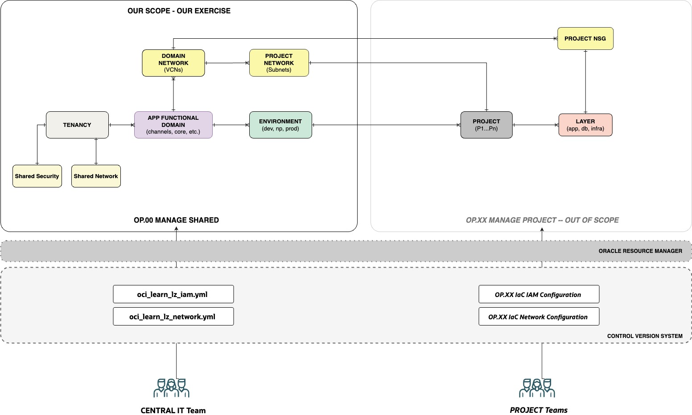

# OCI Learn LZ

## **Table of Contents**

[1. Objective](#1-objective) 
[2. Functional View](#2-functional-view) 
[3. Exercises](#3-exercises) 

&nbsp; 

## 1. Objectives

Welcome to the **Open Learn LZ**, a set of **exercises** to learn and configure landing zones. Its main objectives are: 
1. Provide elementary landing zone **design** capabilities with draw.io.
2. Create skills in **IaC configurations**, by configuring the OCI Learn LZ resources.
3. Demostrate a **cloud-native operating model** with versioned configurations and an automation engine - such as ORM.

&nbsp; 

## 2. Functional View 

The OCI Learn LZ has the following characteristics:

1. **Resource Organization:** OCI Landing Zone resources are organized by Application Functional Domains, Environments, Projects, and Project Layers. This model is suitable to **aggregate workloads by domain**, enterprise-wide. Examples of application domains can be Channels, Integrations, Core Systems, etc.
2. **Scalability**: This Landing Zone **scales by Domains and Projects**. The Environments and Project layers have always the same structural elements.
3. **Cloud Ops - Central Team:** There is a **Central IT Team** that controls the common elements of the landing zone. **You are part of this team**.
4. **Cloud Ops - Project Teams:** There are several **Project Teams**, that control their resources. Projects in this exercise are **out of scope**.
5. **Projects**: Projects will share domain-specific network elements (VCNs) and have dedicated elements, such as Subnets and NSGs. NSGs are handled by Project Teams. Project elements are currently out of the scope of this exercise.
6. **Operating Model**: The operating model used to provision and change resources is through **versioned IaC configurations** in **git repositories**. **ORM** will be used to create stacks that aggregate those configurations and run Terraform plan/apply commands, maintaining the state on each stack.

&nbsp; 

The diagram below presents the key functional elements of the landing zone, in an Entity **Relationship Diagram (ERD)** format. It also presents the operating model with ORM and Git to version the IaC configurations, used by each of the responsible operations teams. For the exercise scope, Remember that **you are part of the Central IT Team**.

&nbsp; 

&nbsp; 

If we can compare Landing Zones to airports: The OCI Learn LZ is an airport with different types of terminals (domains) that can be - but don't have to be - operated independently at any time by different teams. Each terminal can have a different security posture (domestic, international, etc.), teams, and resources.

&nbsp; 

## 3. Exercises 

There are two exercises in the OCI Learn LZ, one for security elements, where you will create the tenancy structure, and one for the network elements, where you will create the shared and domain-related elements, that will be used by projects.

&nbsp; 

| EXERCISE | OBJECTIVE  | RUN IT |  
|---|---|---|
| #1 - Security | Create the OCI Learn LZ **tenancy structure**. | [Here](/examples/oci-learn-lz/exercise1/readme.md)|
| #2 - Network | Create the OCI Learn LZ **network structure** on top of the tenancy structure.| [Here](/examples/oci-learn-lz/exercise2/readme.md)||