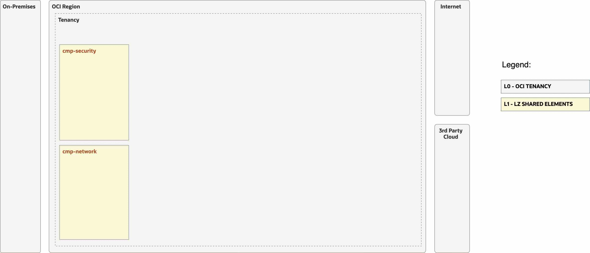
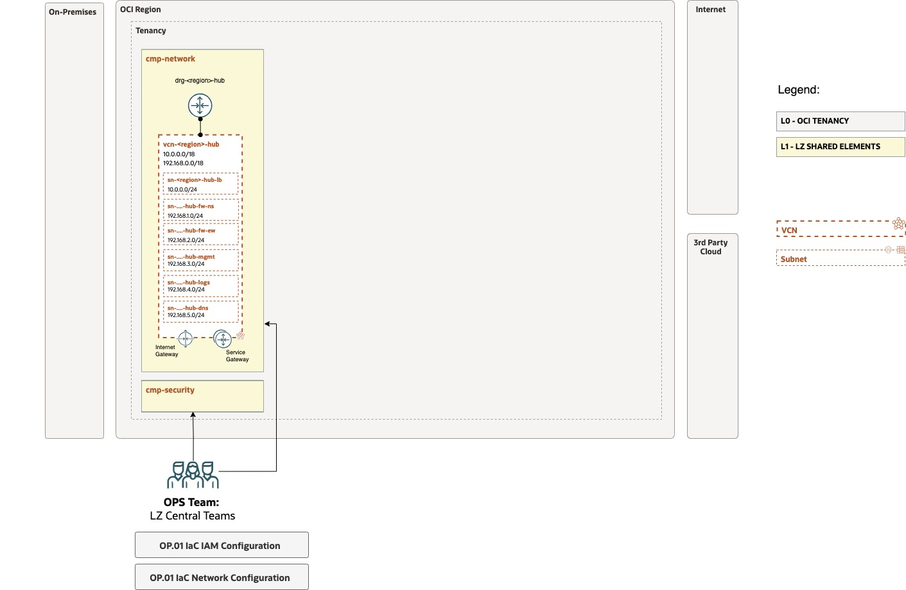

# OP.01 – Manage Shared Services

## **Table of Contents**

[1. Summary](#1-summary)</br>
[2. Setup IAM Configuration](#2-setup-iam-configuration)</br>
[3. Setup Network Configuration](#3-setup-network-configuration)</br>
[4. Run with ORM](#4-run-with-orm) </br>
[5. Run with TF CLI](#5-run-with-terraform-cli)


&nbsp; 


## **1. Summary**

| |  |
|---|---| 
| **OP. ID** | OP.01 |
| **OP. NAME** | Manage Shared Services | 
| **OBJECTIVE** | Creates or changes the shared elements of the landing zone and applies posture management. |
| **TARGET RESOURCES** | - **Security**: Compartments, Groups, Policies</br>- **Network**: DRG, VCN, Subnets, SL, RT, DRG Attach., Network Firewall, DNS, Load Balancers. |
| **IAM CONFIG**| [open_lz_shared_identity.auto.tfvars.json](open_lz_shared_identity.auto.tfvars.json)|
| **NETWORK CONFIG** |[open_lz_shared_network.auto.tfvars.json](open_lz_shared_network.auto.tfvars.json) |
| **TERRAFORM MODULES**| [CIS IAM](https://github.com/oracle-quickstart/terraform-oci-cis-landing-zone-iam), [CIS Network](https://github.com/oracle-quickstart/terraform-oci-cis-landing-zone-networking)  |
| **DETAILS** |  For more details refer to the [OCI Open LZ Design document](../../../design/OCI_Open_LZ.pdf). |
| **PRE-ACTIVITIES** | Tenancy created. Review configuration files. |
| **POST-ACTIVITIES** | After each OP.02, add DRG Attachments and RT from the Hub to each OE connected VCN (sandoxes excluded). |
| **RUN OPERATION** | Use [ORM](#4-run-with-orm) or use [Terraform CLI](#5-run-with-terraform-cli). |


&nbsp; 


&nbsp; 

## **2. Setup IAM Configuration**

For configuring and running the OCI Open LZ Shared IAM layer use the following JSON file: [open_lz_shared_identity.auto.tfvars.json](open_lz_shared_identity.auto.tfvars.json). You can customize this  configuration to fit your exact OCI IAM topology.

This configuration file will cover the following four categories of resources described in the next sections.

&nbsp; 

###  **2.1. Compartments**

The diagram below identifies the compartments in the scope of this operation.

&nbsp; 



&nbsp; 

The corresponding JSON configuration for the compartments topology described above is: 

```
...
    "compartments_configuration": {
        "enable_delete": "true",
        "default_parent_ocid": "ocid1.tenancy.oc1..aaaaaaaaxzexampleocid",
        "compartments": {
            "CMP-SECURITY-KEY": {
                "name": "cmp-security",
                "description": "oci-open-lz-customer Shared Security Compartment",
                "parent_id": "ocid1.tenancy.oc1..aaaaaaaaxzexampleocid",
                "defined_tags": null,
                "freeform_tags": {
                    "oci-open-lz": "openlz-shared",
                    "oci-open-lz-customer": "oci-open-lz-customer",
                    "oci-open-lz-cmp": "security"
                }
            },
            "CMP-NETWORK-KEY": {
                "name": "cmp-network",
                "description": "oci-open-lz-customer Shared Network Compartment",
                "parent_id": "ocid1.tenancy.oc1..aaaaaaaaxzexampleocid",
                "defined_tags": null,
                "freeform_tags": {
                    "oci-open-lz": "openlz-shared",
                    "oci-open-lz-customer": "oci-open-lz-customer",
                    "oci-open-lz-cmp": "network"
                }
            }
        }
    }
...
```

For extended documentation please refer to the [Identity & Access Management CIS Terraform module compartments example](https://github.com/oracle-quickstart/terraform-oci-cis-landing-zone-iam/blob/main/compartments/examples/vision/input.auto.tfvars.template).

&nbsp; 

### **2.2 Groups**

Here we have an example of the shared infrastructure OCI IAM Groups topology configuration as seen in the [OCI Open LZ design document](../../../design/OCI_Open_LZ.pdf).

```
...
    "groups_configuration": {
        "default_defined_tags": null,
        "default_freeform_tags": null,
        "groups": {
            "GRP-IAM-ADMINS": {
                "name": "grp-iam-admins",  
                "description": "GRP.01 Tenancy global Identity and access management administrator."
            },
            "GRP-CREDENTIAL-ADMINS": { 
                "name": "grp-credential-admins",  
                "description": "GRP.02 Tenancy global credential administrator."
            },
            "GRP-ANNOUNCEMENT-READERS": { 
                "name": "grp-announcement-readers",  
                "description": "GRP.03 Tenancy global readers of OCI monitoring information."
            },
            "GRP-BUDGET-ADMINS": { 
                "name": "grp-budget-admins",  
                "description": "GRP.04 Tenancy global budget control."
            }, 
            "GRP-AUDITORS": { 
                "name": "grp-auditors",  
                "description": "GRP.05 Tenancy global read access (for security auditing or health checks)."
            }, 
            "GRP-NETWORK-ADMINS": { 
                "name": "grp-network-admins",  
                "description": "GRP.06 Tenancy global and shared network administration group, including common OE network elements."
            }, 
            "GRP-SECURITY-ADMINS": { 
                "name": "grp-security-admins",  
                "description": "GRP.07 Tenancy global and shared security administration group."
            }
        }
    },
...
```

This automation provides fully supports any kind of OCI IAM Groups topology to be specified in the JSON format.

For an example of such a configuration and for extended documentation please refer to the [Identity & Access Management CIS Terraform module groups example](https://github.com/oracle-quickstart/terraform-oci-cis-landing-zone-iam/blob/main/groups/examples/vision/input.auto.tfvars.template).

&nbsp; 

### **2.3 Dynamic Groups**

Here we have an example of the shared infrastructure OCI IAM Groups topology configuration as seen in the [OCI Open LZ design document](../../../design/OCI_Open_LZ.pdf).


```
...
   "dynamic_groups_configuration": {
        "default_defined_tags": null,
        "default_freeform_tags": null,
        "dynamic_groups": {
            "DGP-SEC-FUN": {
                "name": "dgp-security-functions",
                "description": "DGP.01 Allows all resources of type fnfunc in the Security compartment, cmp-security..",
                "matching_rule": "ALL {resource.type = 'fnfun', resource.compartment.id = 'cmp-security'}"
            }
        }
    }
...
```

Note: in matching_rule you must include resource.compartment.id, this has to be uddated to de proper value.

This automation fully supports any kind of OCI IAM Dynamic Groups to be specified in the JSON format.

For an example of such configuration and for extended documentation please refer to the [Identity & Access Management CIS Terraform module dynamic groups example](https://github.com/oracle-quickstart/terraform-oci-cis-landing-zone-iam/blob/main/dynamic-groups/examples/vision/input.auto.tfvars.template).

&nbsp; 

### **2.4 Policies**

We provide here an example on how to setup the IAM policies for the design discused in the [OCI Open LZ design document](../../../design/OCI_Open_LZ.pdf). Notice that these policies must be considered as an example on how to deploy the blueprint based on CIS separation of duties, but not as a prescribed configuration. We encourage you to review and adapt to your design.

For this example, replace the compartment_ocid to your tenancy OCID.

```
...
   "policies_configuration": {
        "enable_cis_benchmark_checks": "false",
        "supplied_policies": {
            "PCY-SERVICES": {
                "name": "pcy-services",
                "description": "POL.00 Open LZ policy for all supported resources in the tenancy.",
                "compartment_ocid": "ocid1.tenancy.oc1..example",
                "statements": [
                    "allow service cloudguard to read all-resources in tenancy",
                    "allow service cloudguard to use network-security-groups in tenancy",
                    "allow service vulnerability-scanning-service to manage instances in tenancy",
                    "allow service vulnerability-scanning-service to read compartments in tenancy",
                    "allow service vulnerability-scanning-service to read repos in tenancy",
                    "allow service vulnerability-scanning-service to read vnics in tenancy",
                    "allow service vulnerability-scanning-service to read vnic-attachments in tenancy",
                    "allow service osms to read instances in tenancy",
                    "allow service blockstorage, oke, streaming, Fssoc1Prod, objectstorage-eu-amsterdam-1,objectstorage-eu-frankfurt-1 to use keys in tenancy"
                ]
            },
            "PCY-IAM-ADMINISTRATION": {
                "name": "pcy-iam-administration",
                "description": "POL.01 Open LZ allows grp-iam-admins group users to manage IAM resoures in the tenancy.",
                "compartment_ocid": "ocid1.tenancy.oc1..example",
                "statements": [
                    "allow group grp-iam-admins to inspect users in tenancy",
                    "allow group grp-iam-admins to manage users in tenancy where all {request.operation != 'ListApiKeys',request.operation != 'ListAuthTokens',request.operation != 'ListCustomerSecretKeys',request.operation != 'UploadApiKey',request.operation != 'DeleteApiKey',request.operation != 'UpdateAuthToken',request.operation != 'CreateAuthToken',request.operation != 'DeleteAuthToken',request.operation != 'CreateSecretKey',request.operation != 'UpdateCustomerSecretKey',request.operation != 'DeleteCustomerSecretKey'}",
                    "allow group grp-iam-admins to inspect groups in tenancy",
                    "allow group grp-iam-admins to read policies in tenancy",
                    "allow group grp-iam-admins to manage groups in tenancy where all {target.group.name != 'Administrators',target.group.name != 'grp-credential-admins'}",
                    "allow group grp-iam-admins to inspect identity-providers in tenancy",
                    "allow group grp-iam-admins to manage identity-providers in tenancy where any {request.operation = 'AddIdpGroupMapping', request.operation = 'DeleteIdpGroupMapping'}",
                    "allow group grp-iam-admins to manage dynamic-groups in tenancy",
                    "allow group grp-iam-admins to manage authentication-policies in tenancy",
                    "allow group grp-iam-admins to manage network-sources in tenancy",
                    "allow group grp-iam-admins to manage quota in tenancy",
                    "allow group grp-iam-admins to use cloud-shell in tenancy",
                    "allow group grp-iam-admins to manage tag-defaults in tenancy",
                    "allow group grp-iam-admins to manage tag-namespaces in tenancy",
                    "allow group grp-iam-admins to manage orm-jobs in tenancy",
                    "allow group grp-iam-admins to manage orm-config-source-providers in tenancy"
                ]
            },
            "PCY-CREDENTIAL-ADMINISTRATION": {
                "name": "pcy-credential-administration",
                "description": "POL.02 Open LZ policy which allows grp-credential-admins group users to manage user credentials of local users in the tenancy .",
                "compartment_ocid": "ocid1.tenancy.oc1..example",
                "statements": [
                    "allow group grp-credential-admins to inspect users in tenancy",
                    "allow group grp-credential-admins to inspect groups in tenancy",
                    "allow group grp-credential-admins to manage users in tenancy where any {request.operation = 'ListApiKeys',request.operation = 'ListAuthTokens',request.operation = 'ListCustomerSecretKeys',request.operation = 'UploadApiKey',request.operation = 'DeleteApiKey',request.operation = 'UpdateAuthToken',request.operation = 'CreateAuthToken',request.operation = 'DeleteAuthToken',request.operation = 'CreateSecretKey',request.operation = 'UpdateCustomerSecretKey',request.operation = 'DeleteCustomerSecretKey',request.operation = 'UpdateUserCapabilities'}",
                    "allow group grp-credential-admins to use cloud-shell in tenancy"
                ]
            },
            "PCY-ANNOUNCEMENT-READERS": {
                "name": "pcy-announcement-readers",
                "description": "POL.03 Open LZ policy which allows grp-announcement-readers group users to read OCI announcements in the tenancy.",
                "compartment_ocid": "ocid1.tenancy.oc1..example",
                "statements": [
                    "allow group grp-announcement-readers to read announcements in tenancy",
                    "allow group grp-announcement-readers to use cloud-shell in tenancy"
                ]
            },
            "PCY-BUDGET-ADMINISTRATION": {
                "name": "pcy-budget-administration",
                "description": "POL.04 Open LZ policy which allows grp-budget-admins group users to manage all budget resources in the tenancy.",
                "compartment_ocid": "ocid1.tenancy.oc1..example",
                "statements": [
                    "define tenancy usage-report as ocid1.tenancy.oc1..example",
                    "endorse group grp-budget-admins to read objects in tenancy usage-report",
                    "allow group grp-budget-admins to manage usage-report in tenancy",
                    "allow group grp-budget-admins to manage usage-budgets in tenancy"
                ]
            },
            "PCY-AUDITING": {
                "name": "pcy-auditing",
                "description": "POL.05 Open LZ policy which allows grp-auditors group users to read all the resources in the tenancy.",
                "compartment_ocid": "ocid1.tenancy.oc1..example",
                "statements": [
                    "allow group grp-auditors to inspect all-resources in tenancy",
                    "allow group grp-auditors to read instances in tenancy",
                    "allow group grp-auditors to read load-balancers in tenancy",
                    "allow group grp-auditors to read buckets in tenancy",
                    "allow group grp-auditors to read nat-gateways in tenancy",
                    "allow group grp-auditors to read public-ips in tenancy",
                    "allow group grp-auditors to read file-family in tenancy",
                    "allow group grp-auditors to read instance-configurations in tenancy",
                    "allow group grp-auditors to read network-security-groups in tenancy",
                    "allow group grp-auditors to read resource-availability in tenancy",
                    "allow group grp-auditors to read audit-events in tenancy",
                    "allow group grp-auditors to read users in tenancy",
                    "allow group grp-auditors to use cloud-shell in tenancy",
                    "allow group grp-auditors to read vss-family in tenancy",
                    "allow group grp-auditors to read usage-budgets in tenancy",
                    "allow group grp-auditors to read usage-reports in tenancy",
                    "allow group grp-auditors to read data-safe-family in tenancy"
                ]
            },
            "PCY-NETWORK-ADMINISTRATION": {
                "name": "pcy-network-administration",
                "description": "POL.06 Open LZ policy which allows grp-network-admins group users to manage all network resources in the compartment.",
                "compartment_ocid": "ocid1.tenancy.oc1..example",
                "statements": [
                    "allow group grp-network-admins to use cloud-shell in tenancy",
                    "allow group grp-network-admins to read usage-budgets in tenancy",
                    "allow group grp-network-admins to read usage-reports in tenancy",
                    "allow group grp-network-admins to read objectstorage-namespaces in tenancy",
                    "allow group grp-network-admins to read all-resources in compartment cmp-network",
                    "allow group grp-network-admins to manage virtual-network-family in compartment cmp-network",
                    "allow group grp-network-admins to manage dns in compartment paalonso-openlz-tfcli:cmp-network",
                    "allow group grp-network-admins to manage load-balancers in compartment cmp-network",
                    "allow group grp-network-admins to manage alarms in compartment cmp-network",
                    "allow group grp-network-admins to manage metrics in compartment cmp-network",
                    "allow group grp-network-admins to manage ons-family in compartment cmp-network",
                    "allow group grp-network-admins to manage orm-stacks in compartment cmp-network",
                    "allow group grp-network-admins to manage orm-jobs in compartment cmp-network",
                    "allow group grp-network-admins to manage orm-config-source-providers in compartment cmp-network"
                ]
            },
            "PCY-SECURITY-ADMINISTRATION": {
                "name": "pcy-security-administration",
                "description": "POL.07 Open LZ policy which allows grp-security-admins group users to manage all security resources in the security compartment.",
                "compartment_ocid": "ocid1.tenancy.oc1..example",
                "statements": [
                    "allow group grp-security-admins to use cloud-shell in tenancy",
                    "allow group grp-security-admins to read usage-budgets in tenancy",
                    "allow group grp-security-admins to read usage-reports in tenancy",
                    "allow group grp-security-admins to read objectstorage-namespaces in tenancy",
                    "allow group grp-security-admins to manage cloudevents-rules in tenancy",
                    "allow group grp-security-admins to manage cloud-guard-family in tenancy",
                    "allow group grp-security-admins to read tenancies in tenancy",
                    "allow group grp-security-admins to manage tag-namespaces in tenancy",
                    "allow group grp-security-admins to manage tag-defaults in tenancy",
                    "allow group grp-security-admins to manage repos in tenancy",
                    "allow group grp-security-admins to read audit-events in tenancy",
                    "allow group grp-security-admins to read app-catalog-listing in tenancy",
                    "allow group grp-security-admins to read instance-images in tenancy",
                    "allow group grp-security-admins to inspect buckets in tenancy",
                    "allow group grp-security-admins to read all-resources in compartment cmp-security",
                    "allow group grp-security-admins to manage instance-family in compartment cmp-security",
                    "allow group grp-security-admins to manage volume-family in compartment cmp-security where all{request.permission != 'VOLUME_BACKUP_DELETE', request.permission != 'VOLUME_DELETE', request.permission != 'BOOT_VOLUME_BACKUP_DELETE'}",
                    "allow group grp-security-admins to manage object-family in compartment cmp-security where all{request.permission != 'OBJECT_DELETE', request.permission != 'BUCKET_DELETE'}",
                    "allow group grp-security-admins to manage file-family in compartment cmp-security where all{request.permission != 'FILE_SYSTEM_DELETE', request.permission != 'MOUNT_TARGET_DELETE', request.permission != 'EXPORT_SET_DELETE', request.permission != 'FILE_SYSTEM_DELETE_SNAPSHOT', request.permission != 'FILE_SYSTEM_NFSv3_UNEXPORT'}",
                    "allow group grp-security-admins to manage vaults in compartment cmp-security",
                    "allow group grp-security-admins to manage keys in compartment cmp-security",
                    "allow group grp-security-admins to manage secret-family in compartment cmp-security",
                    "allow group grp-security-admins to manage logging-family in compartment cmp-security",
                    "allow group grp-security-admins to manage serviceconnectors in compartment cmp-security",
                    "allow group grp-security-admins to manage streams in compartment cmp-security",
                    "allow group grp-security-admins to manage ons-family in compartment cmp-security",
                    "allow group grp-security-admins to manage functions-family in compartment cmp-security",
                    "allow group grp-security-admins to manage waas-family in compartment cmp-security",
                    "allow group grp-security-admins to manage security-zone in compartment cmp-security",
                    "allow group grp-security-admins to manage orm-stacks in compartment cmp-security",
                    "allow group grp-security-admins to manage orm-jobs in compartment cmp-security",
                    "allow group grp-security-admins to manage orm-config-source-providers in compartment cmp-security",
                    "allow group grp-security-admins to manage vss-family in compartment cmp-security",
                    "allow group grp-security-admins to read work-requests in compartment cmp-security",
                    "allow group grp-security-admins to manage bastion-family in compartment cmp-security",
                    "allow group grp-security-admins to read instance-agent-plugins in compartment cmp-security",
                    "allow group grp-security-admins to manage cloudevents-rules in compartment cmp-security",
                    "allow group grp-security-admins to manage alarms in compartment cmp-security",
                    "allow group grp-security-admins to manage metrics in compartment cmp-security",
                    "allow group grp-security-admins to use key-delegate in compartment cmp-security",
                    "allow group grp-security-admins to read virtual-network-family in compartment cmp-security",
                    "allow group grp-security-admins to use subnets in compartment cmp-security",
                    "allow group grp-security-admins to use network-security-groups in compartment cmp-security",
                    "allow group grp-security-admins to use vnics in compartment cmp-security",
                    "allow group grp-security-admins to manage private-ips in compartment cmp-security",
                    "allow group grp-security-admins to read keys in compartment cmp-security"
                ]
            }
        }
    }
...
```

This automation fully supports any type of OCI IAM Policy  to be specified in the JSON format. 

For an example of such configuration and for extended documentation please refer to the [Identity & Access Management CIS Terraform module policies examples](https://github.com/oracle-quickstart/terraform-oci-cis-landing-zone-iam/tree/main/policies/examples).


&nbsp; 

## **3. Setup Network Configuration**

For configuring the OCI Open LZ Shared Infrastructure Network layer open and edit the following JSON configuration file: [open_lz_shared_network.auto.tfvars.json](open_lz_shared_network.auto.tfvars.json). This configuration covers the following networking diagram.

&nbsp; 




You can customize this JSON configuration to fit your exact OCI Networking topology. This Terraform automation is extremely versatible and can support any type of network topology. 

For complete documentation and a larger set of examples on configuring an OCI networking topology using this JSON terraform automation approach please refer to the [OCI CIS Terraform Networking Module](https://github.com/oracle-quickstart/terraform-oci-cis-landing-zone-networking) documentation and examples.

The example given with this code, expects to find valid certificates in your home directory to import into the Load Balancers to be created for SSL connections. If you don't have any valid certificates signed by a trusted CA, you can create self-signed certificates to run the examples following the instructions in [LBaaS self-signed certificates creation example](../common_lbaas_self-signed_certificates_howto.md).

&nbsp; 

## **4. Run with ORM**

| STEP |  ACTION |
|---|---| 
| **1** | [](https://cloud.oracle.com/resourcemanager/stacks/create?zipUrl=https://github.com/oracle-quickstart/terraform-oci-open-lz/archive/refs/heads/master.zip&zipUrlVariables={"input_config_files_urls":"https://raw.githubusercontent.com/oracle-quickstart/terraform-oci-open-lz/master/examples/oci-open-lz/op01_manage_shared_services/open_lz_shared_identity.auto.tfvars.json,https://raw.githubusercontent.com/oracle-quickstart/terraform-oci-open-lz/master/examples/oci-open-lz/op01_manage_shared_services/open_lz_shared_network.auto.tfvars.json"}) |
| **2** | Accept terms,  wait for the configuration to load. |
| **3** | Set the working directory to “orm-facade”. | 
| **4** | Set the stack name you prefer. | 
| **5** |  Set the terraform version to 1.2.x. Click Next. | 
| **6** | Accept the defaul configurations. Click Next. Optionally,replace with your json/yaml config files. |
| **7** | Un-check run apply. Click Create. 

&nbsp; 

## **5. Run with Terraform CLI**
&nbsp; 

### **5.1. Setup Terraform Authentication**

For authenticating against the OCI tenancy terraform execute the following [instructions](/examples/oci-open-lz/common_terraform_authentication.md).

&nbsp; 

### **5.2 Clone this Git repo to your Machine**

```
git clone git@github.com:oracle-quickstart/terraform-oci-open-lz.git?ref=v1.0.0
```

For referring to a specific module version, append *ref=\<version\>* to the *source* attribute value.

&nbsp; 

###  **5.3 Change the Directory to the Terraform Orchestrator Module**

 Change the directory to the [```terraform-oci-open-lz/orchestrator```](../../../../orchestrator/) Terraform orchestrator module.

&nbsp; 

 ### **5.4 Run ```terraform init```**

Run ```terraform init`````` to download all the required external terraform providers and Terraform modules. See [command example](./tf_init_output_example.out) for more details on the expected output.

&nbsp; 

 ### **5.5 Run ```terraform plan```**

Run ```terraform plan`````` with the IAM and Network configuration.

```
terraform plan \
-var-file ../examples/oci-open-lz/op01_manage_shared_services/oci-credentials.tfvars.json \
-var-file ../examples/oci-open-lz/op01_manage_shared_services/open_lz_shared_identity.auto.tfvars.json \
-var-file ../examples/oci-open-lz/op01_manage_shared_services/open_lz_shared_network.auto.tfvars.json \
-state ../examples/oci-open-lz/op01_manage_shared_services/terraform.tfstate
```

After the execution please analyze the output of the command above and check if it corresponds to your desired configuration.

Note that the ```terraform.tfstate``` file is generated in the configuration location and not in the Terraform code location. This is the expected configuration as the Terraform automation can support any number of configurations and the **state file** will belong to the configuration and not to the code.
  
The ideal scenario regarding the **state file** will be for each configuration to have a corresponding OCI Object Storage location for the state file. For more details on the Terraform state file recommended configuration please refer to the following [documentation](https://docs.oracle.com/iaas/Content/API/SDKDocs/terraformUsingObjectStore.htm).

&nbsp; 

### **5.6 Run ```terraform apply```**

Run ```terraform apply``` with the IAM and Network configuration. After its execution the configured resources will be provisioned or updated on OCI.

```
terraform apply \
-var-file ../examples/oci-open-lz/op01_manage_shared_services/oci-credentials.tfvars.json \
-var-file ../examples/oci-open-lz/op01_manage_shared_services/open_lz_shared_identity.auto.tfvars.json \
-var-file ../examples/oci-open-lz/op01_manage_shared_services/open_lz_shared_network.auto.tfvars.json \
-state ../examples/oci-open-lz/op01_manage_shared_services/terraform.tfstate
```

Depending on your JSON configuration configurations the output of the ```terraform apply``` should be identical or similar to this [example](./tf_apply_output_example.out).

&nbsp; 

# License

Copyright (c) 2023 Oracle and/or its affiliates.

Licensed under the Universal Permissive License (UPL), Version 1.0.

See [LICENSE](LICENSE) for more details.
