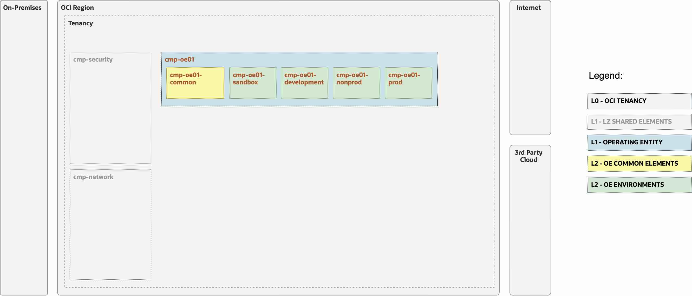
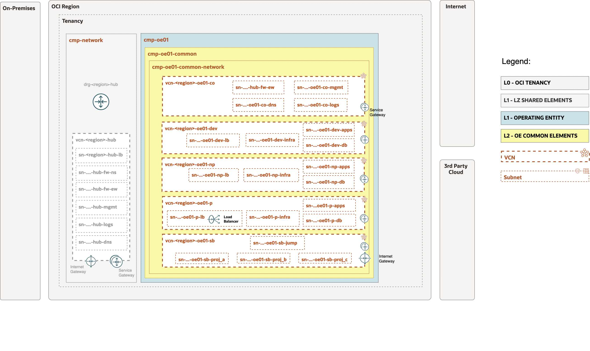

# OP.02 – Manage Operating Entity (OE)


## **Table of Contents**

[1. Summary](#1-summary)</br>
[2. Setup IAM Configuration](#2-setup-iam-configuration)</br>
[3. Setup Network Configuration](#3-setup-network-configuration)</br>
[4. Run with ORM](#4-run-with-orm) </br>
[5. Run with TF CLI](#5-run-with-terraform-cli)


&nbsp; 

## **1. Summary**

| |  |
|---|---| 
| **OP. ID** | OP.02 |
| **OP. NAME** | Manage Operating Entity | 
| **OBJECTIVE** | Onboards or changes an OE, creating the OE structures that will be used by the OE to create resources. |
| **TARGET RESOURCES** | - **Security**: Compartments, Groups, Policies</br>- **Network**: VCN, Subnets, SL, RT, DRG Attachments, Service/Internet Gateways. |
| **IAM CONFIG**| [open_lz_oe_01_identity.auto.tfvars.json](open_lz_oe_01_identity.auto.tfvars.json)|
| **NETWORK CONFIG** |[open_lz_oe_01_network.auto.tfvars.json](open_lz_oe_01_network.auto.tfvars.json) |
| **TERRAFORM MODULES**| [CIS IAM](https://github.com/oracle-quickstart/terraform-oci-cis-landing-zone-iam), [CIS Network](https://github.com/oracle-quickstart/terraform-oci-cis-landing-zone-networking)  |
| **DETAILS** |  For more details refer to the [OCI Open LZ Design document](../../../../design/OCI_Open_LZ.pdf).|
| **PRE-ACTIVITIES** | [OP.01 Shared Services](../../shared/readme.md) executed. Update network config with OCID of the hub. |
| **POST-ACTIVITIES** | The first execution of this operation by the Central IT team requires the hand-over to the target OE Operations team the OCIDs for their OE core resources. |
| **RUN OPERATION** | Use [ORM](#4-run-with-orm) or use [Terraform CLI](#5-run-with-terraform-cli). |


&nbsp; 

## **2. Setup IAM Configuration**

For configuring and running the OCI Open LZ Manage OE IAM layer use the following JSON file: [open_lz_oe_01_identity.auto.tfvars.json](./open_lz_oe_01_identity.auto.tfvars.json). You can customize this  configuration to fit your exact OCI IAM topology.

This configuration file will cover the following four categories of resources described in the next sections.

&nbsp; 

###  **2.1. Compartments**

The diagram below identifies the compartments in the scope of this operation.

&nbsp; 



&nbsp; 

The corresponding JSON configuration for the compartments topology described above is: 

```
...
    "compartments_configuration": {
        "enable_delete": "true",
        "default_parent_ocid": "ocid1.tenancy.oc1..aaaaaaaaexampleocid",
        "compartments": {
            "CMP-OE01-KEY": {
                "name": "cmp-oe1",
                "description": "oci-open-lz-customer OE-01 top compartment",
                "defined_tags": null,
                "freeform_tags": {
                    "oci-open-lz": "oci-open-lz-oe01",
                    "oci-open-lz-customer": "oci-open-lz-customer",
                    "oci-open-lz-cmp": "oe-top"
                },
                "children": {
                    "CMP-OE01-COMMON-KEY": {
                        "name": "cmp-oe01-common",
                        "description": "oci-open-lz-customer OE01 common Compartment",
                        "defined_tags": null,
                        "freeform_tags": {
                            "oci-open-lz": "oci-open-lz-oe01-common",
                            "oci-open-lz-customer": "oci-open-lz-customer",
                            "oci-open-lz-cmp": "oe-common"
                        },
                        "children": {
                            "CMP-OE01-COMMON-INFRA-KEY": {
                                "name": "cmp-oe01-common-infra",
                                "description": "oci-open-lz-customer OE01 common infra Compartment",
                                "defined_tags": null,
                                "freeform_tags": {
                                    "oci-open-lz": "oci-open-lz-oe01-common-infra",
                                    "oci-open-lz-customer": "oci-open-lz-customer",
                                    "oci-open-lz-cmp": "oe-common-infra"
                                }
                            },
                            "CMP-OE01-COMMON-NETWORK-KEY": {
                                "name": "cmp-oe01-common-network",
                                "description": "oci-open-lz-customer OE01 common network Compartment",
                                "defined_tags": null,
                                "freeform_tags": {
                                    "oci-open-lz": "oci-open-lz-oe01-common-network",
                                    "oci-open-lz-customer": "oci-open-lz-customer",
                                    "oci-open-lz-cmp": "oe-common-network"
                                }
                            }
                        }
                    },
                    "CMP-OE01-SANDBOX-KEY": {
                        "name": "cmp-oe01-sandbox",
                        "description": "oci-open-lz-customer OE01 sandbox Compartment",
                        "defined_tags": null,
                        "freeform_tags": {
                            "oci-open-lz": "oci-open-lz-oe01-sandbox",
                            "oci-open-lz-customer": "oci-open-lz-customer",
                            "oci-open-lz-cmp": "oe-sandbox"
                        }
                    },
                    "CMP-OE01-DEVELOPMENT-KEY": {
                        "name": "cmp-oe01-development",
                        "description": "oci-open-lz-customer OE01 development Compartment",
                        "defined_tags": null,
                        "freeform_tags": {
                            "oci-open-lz": "oci-open-lz-oe01-development",
                            "oci-open-lz-customer": "oci-open-lz-development",
                            "oci-open-lz-cmp": "oe-development"
                        }
                    },
                    "CMP-OE01-NONPROD-KEY": {
                        "name": "cmp-oe01-nonprod",
                        "description": "oci-open-lz-customer OE01 nonprod Compartment",
                        "defined_tags": null,
                        "freeform_tags": {
                            "oci-open-lz": "oci-open-lz-oe01-nonprod",
                            "oci-open-lz-customer": "oci-open-lz-nonprod",
                            "oci-open-lz-cmp": "oe-nonprod"
                        }
                    },
                    "CMP-OE01-PROD-KEY": {
                        "name": "cmp-oe01-prod",
                        "description": "oci-open-lz-customer OE01 prod Compartment",
                        "defined_tags": null,
                        "freeform_tags": {
                            "oci-open-lz": "oci-open-lz-oe01-prod",
                            "oci-open-lz-customer": "oci-open-lz-prod",
                            "oci-open-lz-cmp": "oe-prod"
                        }
                    }
                }
            }
        }
    }
...
```


For extended documentation please refer to the [Identity & Access Management CIS Terraform module compartments example](https://github.com/oracle-quickstart/terraform-oci-cis-landing-zone-iam/blob/main/compartments/examples/vision/input.auto.tfvars.template).

&nbsp; 

### **2.2 Groups**

Here we have an example of the shared infrastructure OCI IAM Groups topology configuration as seen in the [OCI Open LZ design document](../../../design/OCI_Open_LZ.pdf).

```
...
    "groups_configuration": {
        "groups": {            
            "GRP-OE01-ADMINS": {
            "name": "grp-oe01-admins",  
            "description": "GRP.OE.01 OE specific administrator group responsible for creating compartments."
            },
            "GRP-OE01-NETWORK-ADMINS": {
                "name": "grp-oe01-network-admins",  
                "description": "GRP.OE.02 use the OE common networking and manages project NSGs."
            }
        }
    }
...
```

This automation provides fully supports any kind of OCI IAM Groups topology to be specified in the JSON format. 
For an example of such configuration and for extended documentation please refer to the [Identity & Access Management CIS Terraform module groups example](https://github.com/oracle-quickstart/terraform-oci-cis-landing-zone-iam/blob/main/groups/examples/vision/input.auto.tfvars.template).

&nbsp; 

### **2.3 Dynamic Groups**


Here we have an example of the shared infrastructure OCI IAM Groups topology configuration as seen in the  [OCI Open LZ design document](../../../design/OCI_Open_LZ.pdf).

```
...
    "dynamic_groups_configuration": {
        "dynamic_groups": {
            "DGP-OS-MANAGEMENT": {
                "name": "dgp-os-management",
                "description": "DGP.01 Holds the compartments which contain the VM images to be automatically patched by the OS Management Service.",
                "matching_rule": "ALL {instance.compartment.id = 'cmp-oe01-common-infra'}"
            }
        }
    }
...
```

This automation provides fully supports any kind of OCI IAM Dynamic Groups to be specified in the JSON format. 
For an example of such configuration and for extended documentation please refer to the [Identity & Access Management CIS Terraform module dynamic groups example](https://github.com/oracle-quickstart/terraform-oci-cis-landing-zone-iam/blob/main/dynamic-groups/examples/vision/input.auto.tfvars.template).

&nbsp; 

### **2.4 Policies**

We provide here an example on how to setup the IAM policies for the design discused in the [OCI Open LZ design document](../../../design/OCI_Open_LZ.pdf). Notice that these policies must be considered as an example on how to deploy the blueprint based on CIS separation of duties, but not as a prescribed configuration. We encourage you to review and adapt to your design.

For this example, replace the compartment_ocid to your tenancy OCID.

```
...
    "policies_configuration": {
        "enable_cis_benchmark_checks": "false",
        "supplied_policies": {
            "PCY-OE01-ADMINISTRATION": {
                "name": "pcy-oe01-administration",
                "description": "POL.0E.01 Open LZ policy which allows the grp-oe01-admins group users to manage the compartment structure of the OE.",
                "compartment_ocid": "ocid1.tenancy.oc1..example",
                "statements": [
                    "allow group grp-oe01-admins to use cloud-shell in compartment cmp-oe1",
                    "allow group grp-oe01-admins to manage policies in compartment cmp-oe1",
                    "allow group grp-oe01-admins to manage policies in compartment cmp-oe1"
                ]
            },
            "PCY-OE01-NETWORK-ADMINISTRATION": {
                "name": "pcy-oe01-network-administration",
                "description": "POL.0E.02 Open LZ policy which allows the grp-oe01-network-admins group users to manage NSGs in the OE network.",
                "compartment_ocid": "ocid1.tenancy.oc1..example",
                "statements": [
                    "allow group grp-oe01-network-admins to use cloud-shell in compartment cmp-oe1:cmp-oe01-common:cmp-oe01-common-network",
                    "allow group grp-oe01-network-admins to read all-resources in compartment cmp-oe1:cmp-oe01-common:cmp-oe01-common-network",
                    "allow group grp-oe01-network-admins to manage network-security-groups in compartment cmp-oe1:cmp-oe01-common:cmp-oe01-common-network"
                ]
            }
        }
    }
...
```

This automation provides fully supports any type of OCI IAM Policy  to be specified in the JSON format. 
For an example of such configuration and for extended documentation please refer to the [Identity & Access Management CIS Terraform module policies examples](https://github.com/oracle-quickstart/terraform-oci-cis-landing-zone-iam/tree/main/policies/examples).


&nbsp; 

## **3. Setup Network Configuration**

For configuring the OCI Open LZ Shared Infrastructure Network layer open and edit the following JSON configuration file: [open_lz_oe_01_network.auto.tfvars.json](./open_lz_oe_01_network.auto.tfvars.json). This configuration covers the following networking diagram.

&nbsp; 




You can customize this JSON configuration to fit your exact OCI Networking topology. This terraform automation is extremely versatible and can support any type of network topology. 

For complete documentation and a larger set of examples on configuring an OCI networking topology using this JSON terraform automation approach please refer to the [OCI CIS Terraform Networking Module](https://github.com/oracle-quickstart/terraform-oci-cis-landing-zone-networking) documentation and examples.

The examples given with this code, expects to find valid certificates in your home directory to import into the Load Balancers to be created for SSL connections. If you don't have any valid certificates signed by a trusted CA, you can create self-signed certificates to run the examples following the instructions in [LBaaS self-signed certificates creation example](../../common_lbaas_self-signed_certificates_howto.md).

&nbsp; 

## **4. Run with ORM**

| STEP |  ACTION |
|---|---| 
| **1** |  [](https://cloud.oracle.com/resourcemanager/stacks/create?zipUrl=https://github.com/oracle-quickstart/terraform-oci-open-lz/archive/refs/heads/master.zip&zipUrlVariables={"input_config_files_urls":"https://raw.githubusercontent.com/oracle-quickstart/terraform-oci-open-lz/master/examples/oci-open-lz/op02_manage_oes/oe01/open_lz_oe_01_identity.auto.tfvars.json,https://raw.githubusercontent.com/oracle-quickstart/terraform-oci-open-lz/master/examples/oci-open-lz/op02_manage_oes/oe01/open_lz_oe_01_network.auto.tfvars.json"})  |
| **2** | Accept terms,  wait for the configuration to load. |
| **3** | Set the working directory to “orm-facade”. | 
| **4** | Set the stack name you prefer. | 
| **5** |  Set the terraform version to 1.2.x. Click Next. | 
| **6** | Accept the defaul configurations. Click Next. Optionally,replace with your json/yaml config files. |
| **7** | Un-check run apply. Click Create. 

&nbsp; 

## **5. Run with Terraform CLI**
&nbsp; 

### **5.1. Setup Terraform Authentication**

For authenticating against the OCI tenancy terraform execute the following [instructions](/examples/oci-open-lz/common_terraform_authentication.md).

&nbsp; 

### **5.2 Clone this Git repo to your Machine**

```
git clone git@github.com:oracle-quickstart/terraform-oci-open-lz.git?ref=v1.0.0
```

For referring to a specific module version, append *ref=\<version\>* to the *source* attribute value.

&nbsp; 

###  **5.2 Change the Directory to the Terraform Orchestrator Module**

 Change the directory to the [```terraform-oci-open-lz/orchestrator```](../../../../orchestrator/) terraform orchestrator module.

&nbsp; 

 ### **5.3 Run ```terraform init```**

Run terraform init to download all the required external terraform providers and terraform modules. See [command example](./tf_init_output_example.out) for more details on the expected output.

&nbsp; 

 ### **5.4 Run ```terraform plan```**

Run ```terraform plan``` with the IAM and Network configuration.

```
terraform plan \
-var-file ../examples/oci-open-lz/op02_manage_oes/oe01/oci-credentials.tfvars.json \
-var-file ../examples/oci-open-lz/op02_manage_oes/oe01/open_lz_oe_01_identity.auto.tfvars.json \
-var-file ../examples/oci-open-lz/op02_manage_oes/oe01/open_lz_oe_01_network.auto.tfvars.json \
-state ../examples/oci-open-lz/op02_manage_oes/oe01/terraform.tfstate
```

After the execution please analyze the output of the command above and check if it corresponds to your desired configuration.

Note that the ```terraform.tfstate``` file is generated in the configuration location and not in the terraform code location. This is the expected configuration as the terraform automation can support any number of configurations and the **state file** will belong to the configuration and not to the code.
  
The ideal scenario regarding the **state file** will be for each configuration to have a corresponding OCI Object Storage location for the state file. For more details on the Terraform state file recommended configuration please refer to the following [documentation](https://docs.oracle.com/en-us/iaas/Content/API/SDKDocs/terraformUsingObjectStore.htm).

&nbsp; 

### **5.5 Run ```terraform apply```**

Run ```terraform apply``` with the IAM and Network configuration. After its execution the configured resources will be provisioned or updated on OCI.

```
terraform apply \
-var-file ../examples/oci-open-lz/op02_manage_oes/oe01/oci-credentials.tfvars.json \
-var-file ../examples/oci-open-lz/op02_manage_oes/oe01/open_lz_oe_01_identity.auto.tfvars.json \
-var-file ../examples/oci-open-lz/op02_manage_oes/oe01/open_lz_oe_01_network.auto.tfvars.json \
-state ../examples/oci-open-lz/op02_manage_oes/oe01/terraform.tfstate
```

Depending on your JSON configuration configurations the output of the ```terraform apply``` should be identical or similar to this [example](./tf_apply_output_example.out).

&nbsp; 

# License

Copyright (c) 2023 Oracle and/or its affiliates.

Licensed under the Universal Permissive License (UPL), Version 1.0.

See [LICENSE](LICENSE) for more details.
