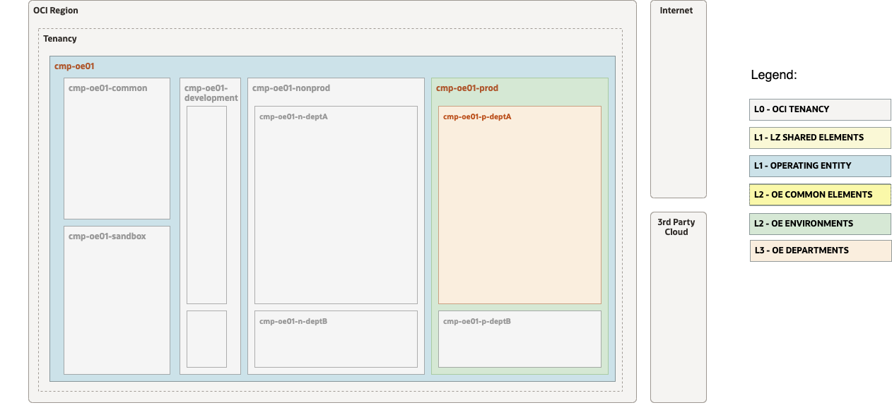

# OP.03 – Manage Department

## **Table of Contents**

[1. Summary](#1-summary)</br>
[2. Setup Terraform Authentication](#2-setup-terraform-authentication)</br>
[3. Setup IAM Configuration](#3-setup-iam-configuration)</br>
[4. Run the Configurations (Terraform Plan and Apply)](#4-run-the-configurations)</br>


&nbsp; 

## **1. Summary**

| |  |
|---|---| 
| **OP. ID** | OP.03 |
| **OP. NAME** | Manage Department | 
| **OBJECTIVE** | Creates and changes a department structure within an OE environment. |
| **TARGET RESOURCES** | - **Security**: Compartments, Groups, Policies</br> |
| **IAM CONFIG**| [open_lz_oe_01_prod_DEP_A_identity.auto.tfvars.json](open_lz_oe_01_prod_dep_a_identity.auto.tfvars.json)|
| **TERRAFORM MODULES**| [CIS IAM](https://github.com/oracle-quickstart/terraform-oci-cis-landing-zone-iam) |
| **DETAILS** |  For more details refer to the [OCI Open LZ Design document](../../../../design/OCI_Open_LZ.pdf).|
| **PRE-ACTIVITIES** | [OP.02 Manage Operating Entity (OE)](../op02_manage_oes/readme.md) executed. |
| **POST-ACTIVITIES** | The execution of this operation by the OE Ops Team creates the department in an specific OE environment. Replicate for other existing OE environments where the department should belong to. |
| **RUN WITH ORM** | 1. [](https://cloud.oracle.com/resourcemanager/stacks/create?zipUrl=https://github.com/oracle-quickstart/terraform-oci-open-lz/archive/refs/heads/master.zip&zipUrlVariables={"input_config_files_urls":"https://raw.githubusercontent.com/oracle-quickstart/terraform-oci-open-lz/master/examples/oci-open-lz/op03_manage_department/open_lz_oe_01_prod_deptA_identity.auto.tfvars.json,https://raw.githubusercontent.com/oracle-quickstart/terraform-oci-open-lz/master/examples/oci-open-lz/op03_manage_department/open_lz_oe_01_prod_deptA_network.auto.tfvars.json"}) </br>2. Accept terms,  wait for the configuration to load. </br>3. Set the working directory to “orm-facade”. </br>4. Set the stack name you prefer.</br>5. Set the terraform version to 1.2.x. Click Next. </br>6. Accept the defaul configurations. Click Next. Optionally, replace with your json/yaml config files. </br>8. Un-check run apply. Click Create. |
| **CONFIG & RUN - TERRAFORM CLI** | Follow the steps below. |

&nbsp; 

## **2. Setup Terraform Authentication**

For authenticating against the OCI tenancy terraform execute the following [instructions](/examples/oci-open-lz/common_terraform_authentication.md).


&nbsp; 

## **3. Setup IAM Configuration**

For configuring and running the OCI Open LZ Manage Dept IAM layer use the following JSON file: [open_lz_oe_01_prod_dep_a_identity.auto.tfvars.json](./open_lz_oe_01_prod_dept_a_identity.auto.tfvars.json). You can customize this  configuration to fit your exact OCI IAM topology.

This configuration file will cover the following four categories of resources described in the next sections.

&nbsp; 

###  **3.1. Compartments**

The diagram below identifies the compartments in the scope of this operation.

&nbsp; 



&nbsp; 

The corresponding JSON configuration for the compartments topology described above is: 

```
...
    {
    "compartments_configuration": {
        "enable_delete": "true",
        "default_parent_ocid": "ocid1.compartment.oc1..aaaaaaaaxzexampleocid",
        "compartments": {
            "CMP-OE01-PROD-DEPT-A-KEY": {
                "name": "cmp-oe1-p-deptA",
                "description": "oci-open-lz-customer OE-01 Production environment, Department A compartment",
                "defined_tags": null,
                "freeform_tags": {
                    "oci-open-lz": "oci-open-lz-oe01",
                    "oci-open-lz-customer": "oci-open-lz-customer",
                    "oci-open-lz-cmp": "oe-top"
                }
            }
        }
    },
    "groups_configuration": {
        "groups": {}
    },
    "dynamic_groups_configuration": {
        "dynamic_groups": {}
    },
    "policies_configuration": {
        "supplied_policies": {}
    }
}
...
```


For extended documentation please refer to the [Identity & Access Management CIS Terraform module compartments example](https://github.com/oracle-quickstart/terraform-oci-cis-landing-zone-iam/blob/main/compartments/examples/vision/input.auto.tfvars.template).

&nbsp; 

### **3.2 Groups**

The [OCI Open LZ design document](../../../design/OCI_Open_LZ.pdf) provides full explanation of the possible separation of duties with the different tenancy structure levels. The department structure is optional. We take it into consideration just in case you have department's level security.

Meanwhile, you can proceed by updating with the desired groups, or use the empty groups configuration looks like in the example below:

```
...
    "groups_configuration": {
        "groups": {}
    }
...
```

This automation provides fully supports any kind of OCI IAM Groups topology to be specified in the JSON format. 
For an example of such configuration and for extended documentation please refer to the [Identity & Access Management CIS Terraform module groups example](https://github.com/oracle-quickstart/terraform-oci-cis-landing-zone-iam/blob/main/groups/examples/vision/input.auto.tfvars.template).

&nbsp; 

### **3.3 Dynamic Groups**

The [OCI Open LZ design document](../../../design/OCI_Open_LZ.pdf) provides full explanation of the possible separation of duties with the different tenancy structure levels. It is not specified for the departments any configuration.

Meanwhile, you can proceed by updating with the desired dynamic groups, or use the empty groups configuration looks like in the example below:

```
...
    "dynamic_groups_configuration": {
        "dynamic_groups": {}
    }
...
```

This automation provides fully supports any kind of OCI IAM Dynamic Groups to be specified in the JSON format. 
For an example of such configuration and for extended documentation please refer to the [Identity & Access Management CIS Terraform module dynamic groups example](https://github.com/oracle-quickstart/terraform-oci-cis-landing-zone-iam/blob/main/dynamic-groups/examples/vision/input.auto.tfvars.template).

&nbsp; 

### **3.4 Policies**

The [OCI Open LZ design document](../../../design/OCI_Open_LZ.pdf) provides full explanation of the possible separation of duties with the different tenancy structure levels. It is not specified for the departments any configuration.

Meanwhile, you can proceed by updating with the desired policies, or use the following example:

```
...
    "policies_configuration": {
        "enable_compartment_level_template_policies": "false",
        "enable_tenancy_level_template_policies": "false",
        "enable_cis_benchmark_checks": "false",
        "groups_with_tenancy_level_roles": []
    }
...
```

This automation provides fully supports any type of OCI IAM Policy to be specified in the JSON format. 
For an example of such configuration and for extended documentation please refer to the [Identity & Access Management CIS Terraform module policies examples](https://github.com/oracle-quickstart/terraform-oci-cis-landing-zone-iam/tree/main/policies/examples).


&nbsp; 


## **4. Run the Configurations**
&nbsp; 

### **4.1 Clone this Git repo to your Machine**

```
git clone git@github.com:oracle-quickstart/terraform-oci-open-lz.git?ref=v1.0.0
```

For referring to a specific module version, append *ref=\<version\>* to the *source* attribute value.

&nbsp; 

###  **4.2 Change the Directory to the Terraform Orchestrator Module**

 Change the directory to the [```terraform-oci-open-lz/orchestrator```](../../../orchestrator/) terraform orchestrator module.

&nbsp; 

 ### **4.3 Run ```terraform init```**

Run terraform init to download all the required external terraform providers and terraform modules. See [command example](./tf_init_output_example.out) for more details on the expected output.

&nbsp; 

 ### **4.4 Run ```terraform plan```**

Run ```terraform plan``` with the IAM and Network configuration.

```
terraform plan \
-var-file ../examples/oci-open-lz/op03_manage_department/oci-credentials.tfvars.json \
-var-file ../examples/oci-open-lz/op03_manage_department/oe01/open_lz_oe_01_identity.auto.tfvars.json \
-state ../examples/oci-open-lz/op03_manage_department/terraform.tfstate
```

After the execution please analyze the output of the command above and check if it corresponds to your desired configuration.

Note that the ```terraform.tfstate``` file is generated in the configuration location and not in the terraform code location. This is the expected configuration as the terraform automation can support any number of configurations and the **state file** will belong to the configuration and not to the code.
  
The ideal scenario regarding the **state file** will be for each configuration to have a corresponding OCI Object Storage location for the state file. For more details on the Terraform state file recommended configuration please refer to the following [documentation](https://docs.oracle.com/en-us/iaas/Content/API/SDKDocs/terraformUsingObjectStore.htm).

&nbsp; 

### **4.5 Run ```terraform apply```**

Run ```terraform apply``` with the IAM and Network configuration. After its execution the configured resources will be provisioned or updated on OCI.

```
terraform apply \
-var-file ../examples/oci-open-lz/op03_manage_department/oci-credentials.tfvars.json \
-var-file ../examples/oci-open-lz/op03_manage_department/open_lz_oe_01_identity.auto.tfvars.json \
-state ../examples/oci-open-lz/op03_manage_department/terraform.tfstate
```

Depending on your JSON configuration configurations the output of the ```terraform apply``` should be identical or similar to this [example](./tf_apply_output_example.out).

&nbsp; 

# License

Copyright (c) 2023 Oracle and/or its affiliates.

Licensed under the Universal Permissive License (UPL), Version 1.0.

See [LICENSE](LICENSE) for more details.
