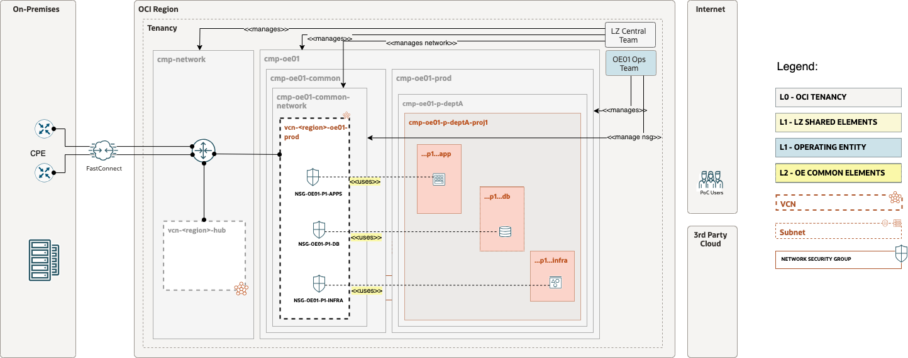

# OP.04 – Manage Project Environment

## **Table of Contents**

[1. Summary](#1-summary)</br>
[2. Setup Terraform Authentication](#2-setup-terraform-authentication)</br>
[3. Setup IAM Configuration](#3-setup-iam-configuration)</br>
[4. Setup Network Configuration](#4-setup-network-configuration)</br>
[5. Run the Configurations (TF Plan & Apply)](#5-run-the-configurations)</br>


&nbsp; 

## **1. Summary**


| |  |
|---|---| 
| **OP. ID** | OP.04 |
| **OP. NAME** | Manage Project Environment | 
| **OBJECTIVE** | Creates or changes a project with the related environments and application layers |
| **TARGET RESOURCES** | - **Security**: Compartments, Groups, Policies</br>- **Network**: NSG  |
| **IAM CONFIGURATION**| [open_lz_oe_01_prod_deptA_proj1_prd_identity.auto.tfvars.json](open_lz_oe_01_prod_deptA_proj1_prd_identity.auto.tfvars.json)|
| **NETWORK CONFIGURATION** |[open_lz_oe_01_prod_deptA_proj1_prd_network.auto.tfvars.json](open_lz_oe_01_prod_deptA_proj1_prd_network.auto.tfvars.json) |
| **DETAILS** |  For more details refer to the [OCI Open LZ Design document](../../../design/OCI_Open_LZ.pdf) |
| **PRE-ACTIVITIES** | - OP.02 (Network updates) </br>- OP.03 (Create Department) |
| **POST-ACTIVITIES** | N/A |
| | |

&nbsp; 

## **2. Setup Terraform Authentication**

For authenticating against the OCI tenancy terraform execute the following [instructions](../common_terraform_authentication.md).


&nbsp; 

## **3. Setup IAM Configuration**

For configuring and running the OCI Open LZ Project environment IAM layer use the following JSON file: [open_lz_oe_01_prod_deptA_proj1_prd_identity.auto.tfvars.json](open_lz_oe_01_prod_deptA_proj1_prd_identity.auto.tfvars.json). You can customize this  configuration to fit your exact OCI IAM topology.

This configuration file will cover the following four categories of resources described in the next sections.

&nbsp; 

###  **3.1. Compartments**

The diagram below identifies the compartments in the scope of this operation.

&nbsp; 


&nbsp; 

The corresponding json configuration for the compartments topology described above is: 

```
...
    "compartments_configuration": {
        "enable_delete": "true",
        "default_parent_ocid": "ocid1.compartment.oc1..aaaaaaaaxzexampleocid",
        "compartments": {
            "CMP-OE01-PROD-DEPT-A-PROJ1-PRD-KEY": {
                "name": "cmp-oe01-p-deptA-proj1-prd",
                "description": "oci-open-lz-customer OE-01 Production environment, Department A compartment, Project 1, Production env",
                "parent_id": "ocid1.compartment.oc1..aaaaaaaaxzexampleocid",
                "defined_tags": null,
                "freeform_tags": {
                    "oci-open-lz": "openlz-shared",
                    "oci-open-lz-customer": "oci-open-lz-customer",
                    "oci-open-lz-cmp": "security"
                },
                "children": {
                    "CMP-OE01-PROD-DEPT-A-PROJ1-PRD-APP-KEY": {
                        "name": "cmp-oe01-p-deptA-proj1-prd-app",
                        "description": "oci-open-lz-customer OE-01 Production environment, Department A compartment, Project 1, Production env, Application layer",
                        "defined_tags": null,
                        "freeform_tags": {
                            "oci-open-lz": "cmp-oe01-p-deptA-proj1-prd-app",
                            "oci-open-lz-customer": "oci-open-lz-customer",
                            "oci-open-lz-cmp": "oe01-prod-deptA-proj1-prd-app"
                        },
                        "CMP-OE01-PROD-DEPT-A-PROJ1-PRD-DB-KEY": {
                            "name": "cmp-oe01-p-deptA-proj1-prd-db",
                            "description": "oci-open-lz-customer OE-01 Production environment, Department A compartment, Project 1, Production env, Database layer",
                            "defined_tags": null,
                            "freeform_tags": {
                                "oci-open-lz": "cmp-oe01-p-deptA-proj1-prd-db",
                                "oci-open-lz-customer": "oci-open-lz-customer",
                                "oci-open-lz-cmp": "oe01-prod-deptA-proj1-prd-db"
                            }
                        },
                        "CMP-OE01-COMMON-NETWORK-KEY": {
                            "name": "cmp-oe01-p-deptA-proj1-prd-infra",
                            "description": "oci-open-lz-customer OE-01 Production environment, Department A compartment, Project 1, Production env, Infrastructure layer",
                            "defined_tags": null,
                            "freeform_tags": {
                                "oci-open-lz": "cmp-oe01-p-deptA-proj1-prd-infra",
                                "oci-open-lz-customer": "oci-open-lz-customer",
                                "oci-open-lz-cmp": "oe01-prod-deptA-proj1-prd-infra"
                            }
                        }
                    }
                }
            }
        }
    },
...
```

For extended documentation please refer to the [Identity & Access Management CIS Terraform module compartments example](https://github.com/oracle-quickstart/terraform-oci-cis-landing-zone-iam/blob/main/compartments/examples/vision/input.auto.tfvars.template).

&nbsp; 

### **3.2 Groups**

Although the [OCI Open LZ design document](../../../design/OCI_Open_LZ.pdf) provides full coverage for shared infrastructure OCI IAM Groups topology, from the shared infrastructure configuration example this is not yet covered.

Meanwhile, you can proceed by updating with the desired groups, or use the empty groups configuration looks like in the example below:

```
...
    "groups_configuration": {
            "default_defined_tags": null,
            "default_freeform_tags": null,
            "groups": {
                "GRP-OE01-PROD-DEPTA-PROJ1-PRD-APP-ADMINS": {
                    "name": "grp-pa-oe01-prod-deptA-proj1-prd-app-admins",  
                    "description": "GRP.OE.03 Group responsible for administrating OE01/PROD/DEPT_A/PROJ1/APP related applications."
                },
                "GRP-OE01-PROD-DEPTA-PROJ1-PRD-DB-ADMINS": { 
                    "name": "grp-pa-oe01-prod-deptA-proj1-prd-db-admins",  
                    "description": "GRP.OE.04 Group responsible for administrating OE01/PROD/DEPT_A/PROJ1/APP related databases."
                }
            }
        },
...
```

This automation provides fully supports any kind of OCI IAM Groups topology to be specified in the json format. 
For an example of such configuration and for extended documentation please refer to the [Identity & Access Management CIS Terraform module groups example](https://github.com/oracle-quickstart/terraform-oci-cis-landing-zone-iam/blob/main/groups/examples/vision/input.auto.tfvars.template).

&nbsp; 

### **3.3 Dynamic Groups**


Although the [OCI Open LZ design document](../../../design/OCI_Open_LZ.pdf) provides full coverage for shared infrastructure OCI IAM Dynamic Groups topology, from the shared infrastructure configuration example this is not yet covered.

Meanwhile, you can proceed by updating with the desired dynamic groups, or use the empty groups configuration looks like in the example below:

```
...
    "dynamic_groups_configuration": {
        "dynamic_groups": {}
    }
...
```

This automation provides fully supports any kind of OCI IAM Dynamic Groups to be specified in the json format. 
For an example of such configuration and for extended documentation please refer to the [Identity & Access Management CIS Terraform module dynamic groups example](https://github.com/oracle-quickstart/terraform-oci-cis-landing-zone-iam/blob/main/dynamic-groups/examples/vision/input.auto.tfvars.template).

&nbsp; 

### **3.4 Policies**

Although the [OCI Open LZ design document](../../../design/OCI_Open_LZ.pdf) provides full coverage for shared infrastructure OCI IAM Policies topology, from the shared infrastructure configuration example this is not yet covered.

Meanwhile, you can proceed by updating with the desired policies, or use the following example:

```
...
    "policies_configuration": {
        "enable_compartment_level_template_policies": "false",
        "enable_tenancy_level_template_policies": "false",
        "enable_cis_benchmark_checks": "false",
        "groups_with_tenancy_level_roles": []
    }
...
```

This automation provides fully supports any type of OCI IAM Policy  to be specified in the json format. 
For an example of such configuration and for extended documentation please refer to the [Identity & Access Management CIS Terraform module policies examples](https://github.com/oracle-quickstart/terraform-oci-cis-landing-zone-iam/tree/main/policies/examples).


&nbsp; 

## **4. Setup Network Configuration**

For configuring the OCI Open LZ OE01 Project environment Network layer open and edit the following JSON configuration file: [open_lz_oe_01_prod_deptA_proj1_prd_network.auto.tfvars.json](open_lz_oe_01_prod_deptA_proj1_prd_network.auto.tfvars.json). This configuration covers the following networking diagram.

&nbsp; 




You can customize this json configuration to fit your exact OCI Networking topology. This terraform automation is extremely versatible and can support any type of network topology. 

For complete documentation and a larger set of examples on configuring an OCI networking topology using this json terraform automation approach please refer to the [OCI CIS Terraform Networking Module](https://github.com/oracle-quickstart/terraform-oci-cis-landing-zone-networking) documentation and examples.

&nbsp; 

## **5. Run the Configurations**
&nbsp; 

### **5.1 Clone this Git repo to your Machine**

```
git clone git@github.com:oracle-quickstart/terraform-oci-open-lz.git?ref=v1.0.0
```

For referring to a specific module version, append *ref=\<version\>* to the *source* attribute value.

&nbsp; 

###  **5.2 Change the Directory to the Terraform Orchestrator Module**

 Change the directory to the [```terraform-oci-open-lz/orchestrator```](../../../../orchestrator/) terraform orchestrator module.

&nbsp; 

 ### **5.3 Run ```terraform init```**

Run terraform init to download all the required external terraform providers and terraform modules. See [command example](./tf_init_output_example.out) for more details on the expected output.

&nbsp; 

 ### **5.4 Run ```terraform plan```**

Run terraform plan with the IAM and Network configuration.

```
terraform plan \
-var-file ../examples/oci-open-lz/op04_manage_projects/oci-credentials.tfvars.json \
-var-file ../examples/oci-open-lz/op04_manage_projects/open_lz_oe_01_prod_deptA_proj1_prd_identity.auto.tfvars.json \
-var-file ../examples/oci-open-lz/op04_manage_projects/open_lz_oe_01_prod_deptA_proj1_prd_network.auto.tfvars.json \
-state ../examples/oci-open-lz/op04_manage_projects/terraform.tfstate
```

After the execution please analyze the output of the command above and check if it corresponds to your desired configuration.

Note that the ```terraform.tfstate``` file is generated in the configuration location and not in the terraform code location. This is the expected configuration as the terraform automation can support any number of configurations and the **state file** will belong to the configuration and not to the code.
  
The ideal scenario regarding the **state file** will be for each configuration to have a corresponding OCI Object Storage location for the state file. For more details on the Terraform state file recommended configuration please refer to the following [documentation](https://docs.oracle.com/en-us/iaas/Content/API/SDKDocs/terraformUsingObjectStore.htm).

&nbsp; 

### **5.5 Run ```terraform apply```**

Run terraform plan with the IAM and Network configuration. After  its execution the configured resources will be provisioned or updated on OCI.

```
terraform apply \
-var-file ../examples/oci-open-lz/op04_manage_projects/oci-credentials.tfvars.json \
-var-file ../examples/oci-open-lz/op04_manage_projects/open_lz_oe_01_prod_deptA_proj1_prd_identity.auto.tfvars.json \
-var-file ../examples/oci-open-lz/op04_manage_projects/open_lz_oe_01_prod_deptA_proj1_prd_network.auto.tfvars.json \
-state ../examples/oci-open-lz/op04_manage_projects/terraform.tfstate
```

Depending on your json configuration configurations the output of the ```terraform apply``` should be identical or similar to this [example](./tf_apply_output_example.out).
