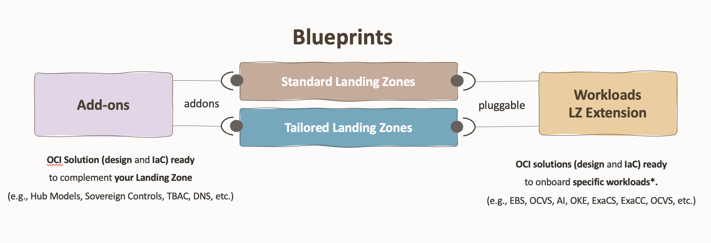

# FAQ - Design 

### D1. What's the difference between blueprints, add-ons, and workload extensions?

* [**Blueprints**](https://github.com/oci-landing-zones/oci-landing-zone-operating-entities/tree/master/blueprints): Core landing zone architectures ([One-OE](https://github.com/oci-landing-zones/oci-landing-zone-operating-entities/tree/master/blueprints/one-oe), [Multi-OE](https://github.com/oci-landing-zones/oci-landing-zone-operating-entities/tree/master/blueprints/multi-oe), [Multi-Tenancy](https://github.com/oci-landing-zones/oci-landing-zone-operating-entities/tree/master/blueprints/multi-tenancy)) providing the foundational OCI structure.
* [**Add-ons**](https://github.com/oci-landing-zones/oci-landing-zone-operating-entities/tree/master/addons): Complementary components like network hub models, subnetting, DNS, TBAC, etc that enhance the base blueprint.
* [**Workload Extensions**](https://github.com/oci-landing-zones/oci-landing-zone-operating-entities/tree/master/workload-extensions): Specific application workloads (EBS, OCVS, AI services) that can be deployed on top of the landing zone.

---

### D2. Which LZ blueprint Model should I choose?

* **Size S-M** ([One-OE](https://github.com/oci-landing-zones/oci-landing-zone-operating-entities/tree/master/blueprints/one-oe)): Choose this for a single Operating Entity with its environments, platforms, and projects within one OCI tenancy. Ideal for single business units or smaller organizations.

* **Size M-L** ([Multi-OE](https://github.com/oci-landing-zones/oci-landing-zone-operating-entities/tree/master/blueprints/multi-oe)): Select this when you have multiple Operating Entities sharing common services while maintaining OE-dedicated resources in a single tenancy. Best for organizations with multiple business units requiring some level of isolation.

* **Size L-XL** ([Multi-Tenancy](https://github.com/oci-landing-zones/oci-landing-zone-operating-entities/tree/master/blueprints/multi-tenancy)): Use this for enterprise-scale deployments spanning multiple OCI tenancies. Suitable for large organizations requiring complete isolation between Operating Entities.

---

### D3. What LZ blueprint fits better for 3-layer apps?

The One-OE template is designed for a single Operating Entity (OE) and includes two pre-configured environments: Production and Pre-Production. Within each environment, the architecture enforces network isolation between the web, application, and database tiers, ensuring secure segmentation and controlled access across your infrastructure layers.

To easy deploy the One-OE we offer the one-stack asset.(check question D4)

---

### D4.What offers the one-stack asset?

The **one-stack** asset offers a consolidated deployment method for the One-OE blueprint, combining all infrastructure components into a single Terraform stack. This approach reduces deployment complexity and time-to-value compared to multi-stack deployments.

**Key benefits:**
- **Simplified deployment**: Single configuration file and execution
- **Faster provisioning**: All resources deployed in one operation
- **Easier management**: Unified state management for the entire landing zone

The one-stack is available in two security configurations (v1 with CISv1 controls and v2 with CISv2 controls). Choose the version that aligns with your organization's security compliance requirements. Go [here](https://github.com/oci-landing-zones/oci-landing-zone-operating-entities/tree/master/blueprints/one-oe/runtime/one-stack) to cover the implementation.

---
### D5. Which HUB models are included in the Operating Entities LZ blueprints?

The OCI Hub Models are network add-ons that provide pre-configured hub-and-spoke network architectures for the OCI Operating Entities Landing Zone. These add-ons complement your landing zone blueprint with different network topologies designed to meet various security, cost, and complexity requirements.

The [hub models add-on](https://github.com/oci-landing-zones/oci-landing-zone-operating-entities/tree/master/addons/oci-hub-models) includes:

**Hub A**: Advanced hub model with comprehensive security features including multiple network firewalls and load balancers. Used as the default in the One-OE blueprint. Best for production environments requiring maximum security and traffic visibility

**Hub B**: Cost-efficient hub with a single OCI Network Firewall handling North-South and East-West traffic. 

**Hub C & D**: 3rd Party Firewalls

**Hub E**: Lightweight hub without network firewall, designed for PoC and environments where deep packet inspection isn't required

Each hub model can be deployed independently and reused across different Operating Entity blueprints (One-OE, Multi-OE, or Multi-Tenancy).

Check out our library series and watch the [Network Hubs episode](https://www.youtube.com/watch?v=TACPxxg8Obg). (8':19'')

---

### D6. Can I migrate from one blueprint model to another?

Yes, migration between blueprints is possible. All blueprints are built on the same CIS best practices, share a common structure, and use the same modular building blocks, which facilitates transitions between them.

However, migration still requires careful planning and execution. Depending on the complexity and the direction of migration (One-OE to Multi-OE, One-OE to Multi-Tenancy, Multi-OE to Multi-Tenancy...), you may need to:

* Restructure compartment hierarchies
* Reconfigure network topologies
* Adjust IAM policies and governance controls
* Migrate resources between compartments or tenancies

For these reasons, it's recommended to choose the appropriate model from the start based on your organization's current and projected needs. Consider factors like governance requirements, isolation needs, growth projections, and whether you anticipate adding new Operating Entities in the near future.

---

### D7. Can I customize the blueprints for my specific requirements?

Yes! The blueprints are designed to be customizable. You can modify the declarative configuration files to adjust compartment structures, network topologies, security policies, and other elements to match your organization's specific needs.

See the [Implementation FAQ](./faq_implementation.md) , I3 question,  for guidance on how to customize and deploy your changes.
