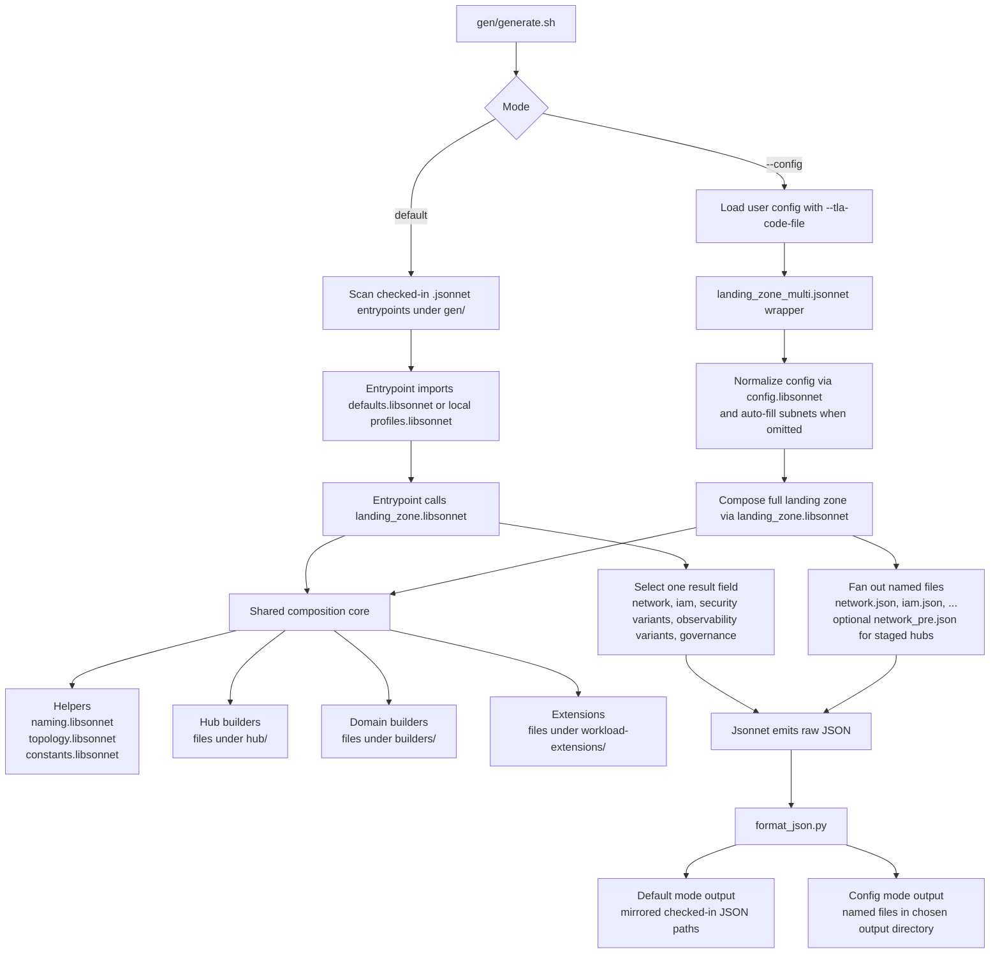

# OCI Landing Zone Jsonnet -- Architecture & Conventions

## 1. File Organization

```
gen/
├── landing_zone.libsonnet       # Main orchestrator: config -> all outputs
├── landing_zone_multi.jsonnet   # --multi wrapper for config mode
├── config.libsonnet             # Config normalization & auto-subnet calculation
├── render_context.libsonnet     # Shared normalized render context for orchestration/adapters
├── constants.libsonnet          # Realm-specific constants (service labels, etc.)
├── defaults.libsonnet           # Generic default configs per hub type (for default mode)
├── naming.libsonnet             # Single naming template for all resources
├── topology.libsonnet           # Shared topology semantics (env labels, platform scope, targeting)
├── generate.sh                  # Entry point: default mode or --config mode
│
├── hub/                         # Hub builders (one per hub type)
│   ├── hub_common.libsonnet     # Shared building blocks (subnets, gateways, ICMP, NSGs)
│   ├── hub_lb.libsonnet         # Load balancer components (SL, NSG, L7 LB)
│   ├── hub_nfw.libsonnet        # OCI Network Firewall policy builder
│   ├── hub_a.libsonnet          # Dual-firewall hub (DMZ + Internal NFW)
│   ├── hub_b.libsonnet          # Single-firewall hub (one NFW)
│   ├── hub_c.libsonnet          # Third-party firewall hub (NLB-fronted)
│   └── hub_e.libsonnet          # No-firewall hub (DRG-only routing)
│
├── builders/                    # Domain and network-assembly builders
│   ├── hub_integration.libsonnet
│   ├── network_spokes.libsonnet
│   ├── iam.libsonnet
│   ├── security.libsonnet
│   ├── observability.libsonnet
│   └── governance.libsonnet
│
├── workload-extensions/         # Pluggable extensions (extension-specific docs may have AGENTS.md)
│   ├── exadb/                   # Shared ExaDB helpers used by ExaDB extensions
│   ├── exacc/                   # ExaDB-C@C extension; see its local guide
│   ├── exacs/                   # ExaDB-D / ExaCS extension; see workload-extensions/exacs/AGENTS.md
│   └── oke/simple/
│       ├── oke_builder.libsonnet # Shared OKE builder internals
│       ├── oke_simple.libsonnet # Generic extension wrapper
│       ├── single-stack/
│       │   ├── profiles.libsonnet
│       │   └── *.jsonnet
│       └── multi-stack/
│           ├── profiles.libsonnet
│           ├── published.libsonnet # Published-entrypoint adapter
│           └── *.jsonnet
│
├── addons/oci-hub-models/         # Published addon hub-model entrypoints
│   ├── profiles.libsonnet
│   ├── published.libsonnet
│   ├── hub_a/
│   ├── hub_b/
│   ├── hub_c/
│   └── hub_e/
│
└── blueprints/one-oe/runtime/one-stack/  # Entry-point .jsonnet files (default mode)
    ├── profiles.libsonnet
    └── *.jsonnet
```

## 2. Generation Mental Model

Two entry modes feed the same composition engine: default mode starts from many checked-in `.jsonnet` entrypoints, while config mode starts from one config object.



### How To Read The Flow

- Default mode starts from many checked-in entrypoints.
- Config mode starts from one user-supplied config object.
- Both paths reuse `landing_zone.libsonnet` as the shared composition engine.

### Core Patterns

- `generate.sh` handles mode selection, file discovery, Jsonnet invocation, and formatting orchestration (it invokes `format_json.py`).
- `config.libsonnet` handles normalization and auto-subnet calculation.
- `render_context.libsonnet` centralizes normalized config, topology, spoke ordering, VCN lists, shared-only config, and example LB backend derivation for render-time consumers.
- `landing_zone.libsonnet` is the shared composition engine, merge owner, and output assembler.
- Detailed spoke rendering is delegated to `gen/builders/network_spokes.libsonnet`.
- DRG and hub integration overlays are delegated to `gen/builders/hub_integration.libsonnet`.
- `landing_zone_multi.jsonnet` is the config-mode wrapper that maps result fields to filenames.
- `format_json.py` is the final presentation formatting step invoked after Jsonnet evaluation.

### Maintenance Rule

Update this diagram when any of these change:

- the generator entry modes
- the responsibility split between normalization, orchestration, and output fan-out
- the output emission pattern

## Published Profiles

- `config` means a canonical input object passed into `landing_zone.libsonnet`.
- `profile` means a repo-owned canonical published configuration for a committed JSON family.
- `defaults` are reusable baselines only. Published products must not be owned by `defaults`.
- Committed JSON files are approved generated snapshots. They are not hand-maintained source objects.
- `jsonnet --multi` is reserved for `bash gen/generate.sh --config ...`. It must not be used to generate the committed snapshot files under `blueprints/` or `workload-extensions/`.
- Each published family owns its local profiles file:
  - `gen/blueprints/one-oe/runtime/one-stack/profiles.libsonnet`
  - `gen/workload-extensions/oke/simple/single-stack/profiles.libsonnet`
  - `gen/workload-extensions/oke/simple/multi-stack/profiles.libsonnet`
  - `gen/workload-extensions/exacc/single-stack/profiles.libsonnet`
  - `gen/workload-extensions/exacc/multi-stack/profiles.libsonnet`
  - `gen/workload-extensions/exacs/single-stack/profiles.libsonnet`
  - `gen/workload-extensions/exacs/multi-stack/profiles.libsonnet`
  - `gen/addons/oci-hub-models/profiles.libsonnet`
- Published entrypoints must stay thin:
  - import the local `profiles.libsonnet`
  - call either `landing_zone.libsonnet` or a local `published.libsonnet` adapter with one profile config
  - select exactly one result field
- Published entrypoints must not rewrite outputs, compose checked-in JSONs together, import another published entrypoint as a wrapper, or push publication flags down into generic extension params.

### Published Adapter Pattern (`published.libsonnet`)

A `published.libsonnet` is a publication-only adapter that lives next to the published entrypoints it serves. It exists when a published JSON family needs a projection of the composition that the generic `landing_zone.libsonnet` does not (and should not) emit by itself.

Rules:

- A `published.libsonnet` is an internal adapter to one published family. It is not a public API; nothing outside the family that owns it should import it.
- It encapsulates publication-shaped projections so that generic extension contracts and `landing_zone.libsonnet` outputs remain unchanged by repo publication concerns.
- A new `published.libsonnet` is justified only when a published family genuinely needs a shape that the generic core does not produce. Prefer adding fields to `landing_zone.libsonnet` when the projection is useful to all consumers.
- Published entrypoints in the same family import this adapter directly (e.g., `local published = import './published.libsonnet';`) and call its renderer with one profile config.

Current adapters:

- `gen/addons/oci-hub-models/published.libsonnet` — owns the hub-only addon network publication adapter used by the committed hub model JSON artifacts under `addons/oci-hub-models/`. It reuses `gen/render_context.libsonnet` for normalization/topology-derived inputs while preserving the hub-only network contract and shared-only IAM/governance projections.
- `gen/workload-extensions/oke/simple/multi-stack/published.libsonnet` — owns the multi-stack publication-only OKE network and identity projections used by the multi-stack OKE entrypoints.
- `gen/workload-extensions/exacc/{single-stack,multi-stack}/published.libsonnet` — own ExaDB-C@C stack-local publication projections.
- `gen/workload-extensions/exacs/multi-stack/published.libsonnet` — owns ExaDB-D / ExaCS multi-stack publication projections.

Extension-specific adapters are documented in the owning extension directory when an extension has its own `AGENTS.md`.

## 3. Config Schema

A landing zone config is a Jsonnet object passed to `landing_zone.libsonnet`:

```jsonnet
{
  region: 'eu-frankfurt-1',            // optional, but must be paired with region_short_name when set
  region_short_name: 'fra',            // optional, but must be paired with region when set
  realm: 'oc1',                         // optional, defaults to 'oc1'
  security_targets: ['prod'],          // optional, defaults to all environments in config mode
  hub: {
    kind: 'hub_a' | 'hub_b' | 'hub_c' | 'hub_e',
    network: {
      vcn: '10.0.0.0/21',
      subnets: { ... },                  // optional: auto-calculated as /24s if omitted
    },
  },
  environments: {
    prod: {
      shared_project_network: { network: { vcn: '10.0.64.0/21' } },
      projects: { proj1: {} },
      platforms: {                        // optional
        oke: {
          network: { vcn: '10.0.96.0/22' },
          extension: {
            type: 'oke_simple',
            params: { kubernetes_version: 'v1.35.2', services_cidr: '...', api_endpoint_allowed_cidrs: ['...'] },
          },
        },
      },
    },
  },
}
```

Config normalization (`config.libsonnet`) treats `region` and `region_short_name` as a pair: either provide both or omit both. When both are omitted (or both are explicitly `null`), they default to `eu-frankfurt-1` and `fra`. `realm` defaults to `oc1` (including when explicitly set to `null`). `security_targets` is optional; if omitted, topology defaults it to all defined environments in semantic order. Repo-owned published profiles pin `security_targets` explicitly when they need behavior narrower than the config-mode default. Missing subnets are still auto-calculated from VCN CIDRs using `auto_subnets()`.

Plain platforms still require `platform.network`. Extension-backed platforms follow the registered extension's `metadata.network_mode`: `required` means `platform.network` must exist, `forbidden` means it must be omitted, and `optional` means the same extension can emit network when `platform.network` exists or non-network domains when it is absent. Legacy `metadata.requires_network: true|false` remains supported and maps to `required` or `forbidden`.

When debugging how generated JSON is applied at deploy time, inspect the downstream deployer contract in `terraform-oci-modules-orchestrator` in addition to this repo. `gen/` defines what this repository emits; the orchestrator defines how those generated configs are consumed. For published OKE investigations, use the exact orchestrator tag referenced by the published OKE docs rather than `HEAD`.

## 4. Naming Convention

All resource names go through `naming.libsonnet`. It provides six functions:

| Function | Pattern | Example |
|---|---|---|
| `n.key(type, segments)` | `{TYPE}-{REGION}-LZ-{...}-KEY` | `VCN-FRA-LZ-HUB-KEY` |
| `n.key_global(type, segments)` | `{TYPE}-LZ-{...}-KEY` | `CMP-LZ-PROD-KEY` |
| `n.key_tenancy(type, segments)` | `{TYPE}-{...}-KEY` | `GRP-AUDITORS-ADMIN-KEY` |
| `n.display(type, segments)` | `{type}-{region}-lz-{...}` | `vcn-fra-lz-hub` |
| `n.display_global(type, segments)` | `{type}-lz-{...}` | `cmp-lz-prod` |
| `n.display_tenancy(type, segments)` | `{type}-{...}` | `grp-auditors-admin` |

DNS labels use `n.dns_label(parts)` (max 15 chars). Environment DNS short codes come from `topology.libsonnet`, not from `naming.libsonnet`.

Groups and policies follow a scope rule:

- Tenancy-scoped groups and policies that apply at tenancy scope and are not limited to Landing Zone compartments do not include `LZ`.
- Landing-zone-scoped groups and policies do include `LZ`.

Examples:

- tenancy-scoped: `GRP-AUDITORS-ADMIN-KEY`, `PCY-SECURITY-ADMIN-KEY`, `grp-auditors-admin`, `pcy-security-admin`
- landing-zone-scoped: `GRP-LZ-NETWORK-ADMIN-KEY`, `PCY-LZ-SECURITY-ADMIN-KEY`, `grp-lz-network-admin`, `pcy-lz-security-admin`

## 5. Hub Builder Pattern

Each hub builder in `hub/` is a function with this signature:

```
function(hub_ctx) -> {
  pre:                 object,      // network_configuration for pre-deploy
  post:                object|null, // network_configuration for post-deploy (null if no firewall)
  spoke_route_tables:  [string],    // RT keys that need spoke CIDR routes via DRG
  post_route_tables:   [string],    // RT keys that need spoke CIDR routes via firewall IP
  fw_nsg_key:          string|null, // NSG key for firewall ingress rules (null if no FW)
  has_spoke_natgw:     bool,        // whether spokes get NAT GW + direct peer routes
  post_route_entity_id:   string,   // (if firewall) OCID placeholder for post-deploy routes
  post_route_entity_desc: string,   // human description of the post-deploy route target
}
```

- `hub_ctx.naming`: naming object from `naming(region_short_name)`
- `hub_ctx.hub_config`: `{ kind, network: { vcn, subnets } }`
- `hub_ctx.vcn_list`: `[{name, cidr}]` -- spoke/platform VCN CIDRs for NFW policies
- `hub_ctx.lb_backends`: `{ backend1_ip, backend2_ip }` -- example LB backend IPs supplied by the orchestrator
- `hub_ctx.lb_env_name`: first ordered workload spoke name used for example LB naming

The orchestrator (`landing_zone.libsonnet`) dispatches to the correct hub builder, delegates spoke category rendering to `gen/builders/network_spokes.libsonnet`, and delegates DRG and hub overlays to `gen/builders/hub_integration.libsonnet`.

LB example backend term definitions:

- Ordered environment/spoke order: environments are ordered as `prod`, `preprod`, `staging`, `uat`, `dev`, `test`, then any remaining environment names in their existing config order.
- Workload spoke: an environment entry that has `shared_project_network` and therefore produces a spoke VCN category.
- First ordered workload spoke: the first environment in that ordered list that qualifies as a workload spoke.

LB example backends are derived centrally from the first ordered workload spoke's `shared_project_network.network.subnets.web` CIDR (`.10` and `.20` host IPs). This keeps generated examples deterministic and aligned with the canonical prod-first topology; if no workload spoke exists, the orchestrator passes explicit `0.0.0.0` placeholders rather than relying on silent defaults inside hub components.

## 6. Extension Contract

Extensions live in `workload-extensions/` and are registered in `landing_zone.libsonnet`'s `extension_registry`. Each extension exports an explicit contract object:

```
{
  metadata(params):: {
    network_mode: 'required'|'forbidden'|'optional', // optional, defaults to legacy requires_network or required
    requires_network: true|false, // legacy optional alias for required/forbidden
    default_subnets,              // required when network is used
    subnet_order,                 // optional when network is used
  }
  render(params):: {
    network_pre,        // required when network is used
    iam,                // optional standard contribution
    security_cis1,      // optional standard contribution
    security_cis2,      // optional standard contribution
    observability_cis1, // optional standard contribution
    observability_cis2, // optional standard contribution
    extra_key,          // optional generic extra output
  }
}

params.config_params  -- extension-specific parameters (e.g. kubernetes_version)
params.network        -- { vcn: 'cidr', subnets: { name: cidr } }, or null when network is not used
params.naming         -- naming object
params.topology       -- shared scope semantics from `topology.libsonnet`
params.scope_config   -- scope-local context, such as projects in the same environment
params.routing        -- routing context for extension route rules:
                        -- { hub: object|null, peers: object }, or null when network is not used
```

Contract phases:
- `metadata(params)`: returns extension requirements. Extensions should prefer `network_mode`:
  - `required`: platform must include `network`; the resolver validates or auto-allocates extension subnets and requires a `network_pre` contribution.
  - `forbidden`: platform must omit `network`; the extension contributes non-network domains only.
  - `optional`: platform may include or omit `network`; when included, the resolver validates or auto-allocates subnets and requires `network_pre`; when omitted, the extension can still emit IAM, observability, or other non-network contributions.
  Legacy `requires_network: true|false` remains supported and maps to `required` or `forbidden`.
- `render(params)`: returns contributions keyed by domain:
  - `network_pre`: merged into `network_configuration_categories` for networked extensions
  - `iam`: merged into IAM output
  - `security_cis1`, `security_cis2`: merged into security outputs
  - `observability_cis1`, `observability_cis2`: merged into observability outputs
  - Any other generic key (e.g. `oke_clusters`, `oke_workers`): collected into `result.extra`

Generic extension contracts must not change emitted artifact sets based on repo publication mode. If a published family needs additional projections, create a dedicated adapter next to the published entrypoints and keep profile-local configs free of publication flags.

Extension guides for networked extensions: any extension with `network_mode: required` or `network_mode: optional` must document the sizing inputs and CIDR-relevant ranges that customer guidance needs before customer guidance proposes concrete CIDRs. Keep those extension-specific placement, scale, and address-range questions in the extension's local `AGENTS.md`; root `AGENTS.md` owns the customer discovery ordering.

Current extension ownership:

- `gen/workload-extensions/oke/simple/oke_builder.libsonnet` owns the reusable OKE rendering logic.
- `gen/workload-extensions/oke/simple/oke_simple.libsonnet` is the active generic extension wrapper for config mode and integrated landing-zone assembly.
- `gen/workload-extensions/oke/simple/multi-stack/published.libsonnet` owns the multi-stack publication-only OKE network and identity projections used by repo entrypoints.
- The local ExaDB-C@C guide owns extension-specific contracts, notification email semantics, publication layout, and tests.
- `gen/workload-extensions/exacs/AGENTS.md` owns ExaDB-D / ExaCS placement mapping, component inference, network rules, and discovery addenda.

## 7. How to Add a New Hub Type

1. Create `hub/hub_x.libsonnet` following the builder signature above.
2. Add subnet order to `config.libsonnet`'s `hub_subnet_order` map.
3. Register in `landing_zone.libsonnet`'s `hub_builders` dispatch table.
4. Update `config.libsonnet`'s `normalize()` assertion to include the new kind.
5. Add a generic hub default config entry in `defaults.libsonnet`.
6. Create entry-point `.jsonnet` files in `blueprints/.../one-stack/`.
7. Run `generate.sh` and diff output against expected.

## 8. How to Add a New Extension

1. Create `workload-extensions/<name>/<name>.libsonnet` following the extension contract above.
2. Register in `landing_zone.libsonnet`'s `extension_registry`.
3. Set `metadata.network_mode` to `required`, `forbidden`, or `optional`. Define `metadata.default_subnets` for auto-subnet calculation when the extension can create a platform VCN.
4. Return `contributions` with the relevant domain keys.
5. Create entry-point `.jsonnet` files if needed for multi-stack mode.
6. Run `generate.sh` and diff output.

Keep `gen/defaults.libsonnet` limited to generic reusable hub defaults. If an extension needs published committed snapshots, keep those canonical published configs in local `profiles.libsonnet` files owned by the published family.

Keep extension-specific placement and parameter semantics in the extension's own local guide; for example, ExaDB-C@C lives under `gen/workload-extensions/exacc/` and ExaDB-D / ExaCS lives under `gen/workload-extensions/exacs/`.

## 9. Generation Modes

**Default mode** (`bash gen/generate.sh`):
Walks all `.jsonnet` entry points under `gen/`, evaluates each one, and writes formatted JSON output to the repo root (mirroring the directory structure). Generic entry points may import `defaults.libsonnet` for reusable baselines, while published entry points import their local `profiles.libsonnet`. Both patterns call `landing_zone.libsonnet` and select a single result field.

**Config mode** (`bash gen/generate.sh --config my_config.libsonnet [output_dir]`):
Evaluates `landing_zone_multi.jsonnet` with a user-supplied config file. Produces `network.json`, `iam.json`, `security_*.json`, `observability_*.json`, and `governance.json` for every config. Staged hubs also emit `network_pre.json`, Hub C may also emit `network_backends.json`, and extensions may emit additional extra-derived outputs.

For customer-use artifact placement and deployment defaults, follow root `AGENTS.md`. This generator guide defines emitted files and generator behavior only.

Config mode validates required fields during normalization. `config.environments` must be present and non-empty; omitted environments are a hard error rather than an implicit default.

## 10. Network Artifact Phases

- **Final network artifact** (`network` -> `network.json`): canonical deployable network configuration.
- **Pre-deployment artifact** (`network_pre` -> `network_pre.json`): only for staged hubs.
- **Staged completion**: final `network` layers post-deploy hub fragment and hub integration post overlay onto `network_pre`.
- **Hub E** emits only final `network`.

## 11. Platform Topology Rules

- `topology.libsonnet` is the single source of truth for environment labels, DNS short codes, platform placement, and security-target eligibility.
- `topology.libsonnet` owns both raw environment metadata and semantic ordering helpers such as preferred environment precedence.
- `landing_zone.libsonnet` and builder modules may consume topology ordering helpers, but they must not define their own `preferred_env_names` list.
- Environment platform compartments live under `CMP-LZ-<ENV>-PLATFORM-KEY`, but their child keys omit the redundant parent segment: `CMP-LZ-<ENV>-<NAME>-KEY`.
- Shared platform compartments live under `CMP-LZ-PLATFORM-KEY`, but their child keys omit the redundant parent segment: `CMP-LZ-SHARED-<NAME>-KEY`.
- Shared platform OCI compartment names include the shared scope without repeating the parent platform segment. Example: shared OKE uses `cmp-lz-shared-oke` and `cmp-landingzone:cmp-lz-platform:cmp-lz-shared-oke`.
- Platform identity/resources use platform compartments, while platform network categories use the scope's network compartment references.
- Integrated IAM owns platform child compartments for config-driven outputs.
- Standalone multi-stack OKE may overlay the same platform child compartment only to stay self-contained.
- Extensions receive scope semantics via `params.topology`; naming remains formatting-only.
- Security-target environment selection is centralized in `topology.libsonnet`. Current behavior targets all defined environments when `security_targets` is omitted; set `security_targets` explicitly when a published profile needs narrower targeting.

## 12. Code Style Rules

- **Object merging**: Always use `+` operator. Never use `A { key: val }` -- write `A + { key: val }`.
- **Optional parameters**: Use `null` as default, not empty array/object. Test with `!= null`.
- **Named parameters**: Always use named parameters when calling functions with optional args.
- **Comments**: Use `//` style. Include function signature and parameter docs in header comment.
