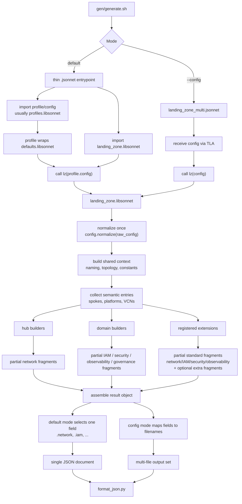

# Jsonnet Composition Guide

This guide complements `AGENTS.md`. Read it when you want to understand how the generator composes files and functions in practice; switch to `AGENTS.md` when you need the broader architecture, schema, naming rules, or builder contracts.

## Why This File Exists

`AGENTS.md` explains what lives in `gen/` and what each major part is responsible for. This file answers a narrower onboarding question: when you follow a real generation path, which files compose into which functions and objects?

The important mental model is:

- most `.jsonnet` entrypoints are thin selectors
- `landing_zone.libsonnet` is the assembler
- helpers build shared context once
- builders and extensions contribute fragments
- wrappers choose which fragments become output files

## Read The System In This Order

1. `generate.sh`
2. a thin default-mode entrypoint in `blueprints/.../*.jsonnet` or `landing_zone_multi.jsonnet`
3. `landing_zone.libsonnet`
4. `config.libsonnet`, `topology.libsonnet`, `naming.libsonnet`, `constants.libsonnet`
5. `hub/*.libsonnet`, `builders/*.libsonnet`, `workload-extensions/*`

That order reflects composition ownership, not importance. Read the small selector files first so you know what they hand into `landing_zone.libsonnet`, then read the orchestrator, then read the helpers and contributors it depends on.

## Composition Graph



Read the graph from the middle out, not just from top to bottom. The stable center is `landing_zone.libsonnet`; the entrypoints and wrappers around it are mostly ways to feed config in and choose outputs out.

## The Main Jsonnet Patterns In This Repo

### Thin Selector Entrypoints

Most entrypoints under `blueprints/` are intentionally tiny:

```jsonnet
local profiles = import './profiles.libsonnet';
local lz = import '../../../../landing_zone.libsonnet';
lz(profiles.hub_a.config).network
```

This file does not own hub logic, subnet logic, or output assembly. It picks a config object, calls the shared orchestrator, and projects one field from the result.

That is the first pattern to look for in this repository: many `.jsonnet` files are selectors, not the place where the real composition happens.

### Normalize Once, Then Compose

`landing_zone.libsonnet` starts by stabilizing the input shape:

```jsonnet
local config = cfg_lib.normalize(raw_config);
```

After that line, the rest of the file can assume required fields exist, defaults are filled in, and auto-subnet behavior has already been resolved where normalization owns it.

If you are changing what the config is allowed to look like, start in `config.libsonnet` before touching builders.

### Build Shared Semantic Context Once

The orchestrator creates helper objects once near the top and reuses them everywhere:

```jsonnet
local n = naming(config.region_short_name);
local topo = topology(config, n);
local realm = constants[config.realm];
```

Read these as semantic context, not as incidental locals:

- `n` owns key, display-name, DNS-label, and compartment-path patterns
- `topo` owns environment and platform semantics
- `realm` owns realm-specific constants

When several later expressions look dense, check whether they are really just using `n` or `topo` rather than inventing new behavior locally.

That shared setup now lives behind `render_context.libsonnet`, which exposes one stable entrypoint:

```jsonnet
local render_context = import 'render_context.libsonnet';
local ctx = render_context.from_raw_config(raw_config);
```

Use that helper when a renderer or publication adapter needs normalized config plus derived semantic lists such as ordered spoke environments, platform entries, VCN metadata, example LB backends, or the shared-only config view. Keep final document assembly in the caller. `render_context.libsonnet` is the input-preparation layer, not the merge owner.

### Collect Semantic Entries Before Building Objects

`landing_zone.libsonnet` often builds arrays of semantic entries first, then turns them into objects later:

```jsonnet
local extension_entries = [
  pe for pe in all_platform_entries
  if std.objectHas(pe.platform_config, 'extension')
];
```

The same pattern shows up for spoke environments, VCN entries, route entries, and extension results. The file does not jump straight to one giant object literal. It first decides what the meaningful units are, then uses comprehensions, `std.mapWithIndex`, and `std.foldl` to turn those units into merged objects.

That is a useful reading rule for this codebase:

- first find the semantic lists
- then find the comprehensions or folds that turn them into output fragments

### Builders Return Fragments; The Orchestrator Decides The Merge Site

This repository relies heavily on object composition with `+` and `+:`.

For example, `assembled_network_pre` is assembled from hub output, hub integration, extension network fragments, and generated spoke/platform categories:

```jsonnet
local assembled_network_pre = hub.pre + hub_integration_pre + extension_network_pre {
  network_configuration+: {
    network_configuration_categories+: spoke_categories + network_only_categories,
  },
};
```

The canonical final `assembled_network` is then built by layering staged post overlays when present:

```jsonnet
local assembled_network =
  if hub.post != null then assembled_network_pre + hub.post + hub_integration_post
  else assembled_network_pre;

{
  network: assembled_network,
  network_pre: if hub.post != null then assembled_network_pre else null,
}
```

The pattern is consistent:

- a builder contributes a partial structure (for example, `gen/builders/network_spokes.libsonnet` and `gen/builders/hub_integration.libsonnet`)
- `landing_zone.libsonnet` decides where that structure plugs into the final result

Read `landing_zone.libsonnet` as the merge owner.

### Standard Outputs And Extension `extra` Outputs Are Different Channels

Standard result fields have fixed names such as `network`, `network_pre`, `iam`, `security_cis1`, `security_cis2`, `observability_cis1`, `observability_cis2`, and `governance`.
Config-mode filename fan-out still maps from those standard fields, but `landing_zone_multi.jsonnet` emits only the `security_cis*` and `observability_cis*` files selected by normalized `config.cis_level`.

Extensions can contribute standard fragments into those same domains. Extensions declare network behavior with `metadata.network_mode`:

- `required`: `platform.network` must exist; the resolver validates or auto-allocates extension subnets and requires a `network_pre` contribution.
- `forbidden`: `platform.network` must be omitted; the extension skips network routing/subnet inputs while still contributing domains such as IAM or observability.
- `optional`: `platform.network` may exist or be omitted; when present it behaves like `required`, and when absent it behaves like `forbidden`.

Legacy `metadata.requires_network: true|false` remains supported and maps to `required` or `forbidden`.

Generic extension outputs that belong in config mode stay under `result.extra`, then `landing_zone_multi.jsonnet` turns them into files dynamically:

```jsonnet
+ (if std.objectHas(result, 'extra') then {
  [key + '.json']: result.extra[key]
  for key in std.objectFields(result.extra)
} else {})
```

Published family entrypoints are a separate concern. If a published snapshot needs a projection that is not part of the generic config result contract, build it in a dedicated published adapter near the entrypoints instead of leaking publication mode through extension params.

That separation matters. It keeps the main result contract stable, keeps config mode predictable, and makes publication-only behavior explicit in repo-owned selector code instead of extension configuration.

## Traced Example: From Entrypoint To `network`

Start with `gen/blueprints/one-oe/runtime/one-stack/oneoe_network_hub_a.jsonnet`:

```jsonnet
local profiles = import './profiles.libsonnet';
local lz = import '../../../../landing_zone.libsonnet';
lz(profiles.hub_a.config).network
```

Read it in five moves:

1. `profiles.libsonnet` wraps `defaults.libsonnet`, so `profiles.hub_a.config` is one complete config object.
2. `lz(...)` hands that config to `landing_zone.libsonnet`.
3. `landing_zone.libsonnet` normalizes the config and creates shared helper context with naming, topology, and realm constants.
4. The orchestrator builds the selected hub, derives spoke/platform integration overlays, and merges builder and extension contributions into one result object.
5. The entrypoint projects only `.network`, so this file emits one view of the shared result object instead of assembling its own network JSON.

The key assembly lines inside `landing_zone.libsonnet` build `assembled_network_pre`, then `assembled_network`, then publish canonical/optional network outputs:

```jsonnet
local assembled_network_pre = ...;
local assembled_network =
  if hub.post != null then assembled_network_pre + hub.post + hub_integration_post
  else assembled_network_pre;

{
  network: assembled_network,
  network_pre: if hub.post != null then assembled_network_pre else null,
}
```

That is the recurring pattern in this repository. Entry points do not build outputs directly; they select a field that the orchestrator already assembled from reusable fragments.

## Where To Edit

If you know the kind of change you need, start here:

- Change config defaults, required fields, or auto-subnet behavior: `gen/config.libsonnet`
- Change naming templates, key formats, display names, or DNS-label composition: `gen/naming.libsonnet`
- Change environment labels, platform scope semantics, or security-target rules: `gen/topology.libsonnet`
- Change how fragments are collected and merged into final result fields: `gen/landing_zone.libsonnet`
- Change hub-specific network behavior: `gen/hub/*.libsonnet`
- Change IAM, security, observability, or governance outputs: `gen/builders/*.libsonnet`
- Change extension-specific generated outputs or platform contracts: `gen/workload-extensions/*`
- Change config-mode filename fan-out: `gen/landing_zone_multi.jsonnet`
- Change which field a default-mode entrypoint emits: `gen/blueprints/.../*.jsonnet`

If you are unsure, start with `landing_zone.libsonnet` and read outward. In this repository, it is usually easier to understand the contributors after you know where their fragments are merged.
