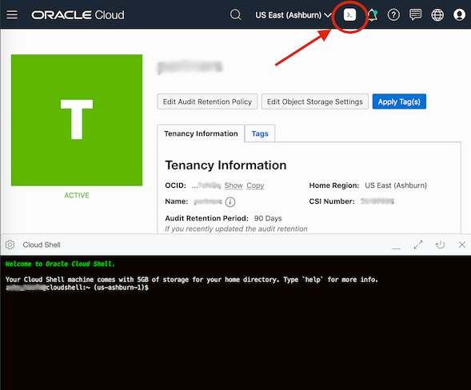
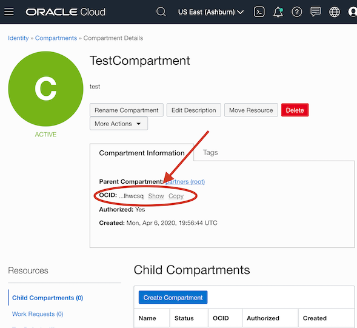
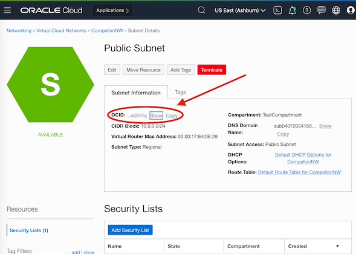

# oci-quickstart-template
Packer is a tool provided by Hashicorp that allows you to automate creation of your machine images.
## Specifications
 * oci CLI v2.9.7 ([download](https://docs.cloud.oracle.com/en-us/iaas/Content/API/SDKDocs/cliinstall.htm#InstallingtheCLI))
 * packer v1.5.4  ([download](https://packer.io/intro/getting-started/install.html))
 
Click [here](https://docs.oracle.com/en-us/iaas/Content/API/SDKDocs/cliinstall.htm) to learn more about how to configure your OCI CLI.
 
## Instructions
1. Clone the oci-quickstart-template repository:
```
$> git clone https://github.com/oracle-quickstart/oci-quickstart-template.git
$> cd oci-quickstart-template/packer
```
2. Before we can build the image, we must create network components in our tenancy for the image to connect to. Log in to your tenancy and go to *Menu -> Networking -> Virtual Cloud Network -> Start VCN Wizard*. Default values should be fine. [Follow the Networking Quickstart to create a network](https://docs.cloud.oracle.com/en-us/iaas/Content/Network/Tasks/quickstartnetworking.htm)

3. Create a file called ```env_vars.sh``` and fill it with appriopriate values from your tenanacy. [See below](#how-to-determine-environment-variables) for instructions on ways to obtain these values:
```
# Required for the OCI Provider
export PACKER_availibilty_domain=""
export PACKER_compartment_ocid=""
export PACKER_base_image_ocid="ocid1.image.oc1.iad.aaaaaaaa6tp7...."
export PACKER_image_name="Partner_Image"
export PACKER_shape="VM.Standard2.1"
export PACKER_ssh_username="opc"
export PACKER_subnet_ocid=""
export PACKER_type="oracle-oci"
```
4. Source the ```env_vars.sh``` file modified above, and then create the image:
```
$> source env_vars.sh
```

5. Validate the packer file:
```
$> packer validate template.json
Template validated successfully.
```

6. Create the image:
```
$> packer build template.json
[...]
==> Builds finished. The artifacts of successful builds are:
--> oracle-oci: An image was created: 'Partner_Image' (OCID: ocid1.image.oc1.iad.aaaaaaaak2howsh3wlwwlug4ut3erplh3b26i63ejpw2wxehd7gp5jod7xna) in region 'us-ashburn-1'
```

7. Done! Check you tenancy for the resulting image. Menu -> Compute -> Custom Images.

---

## How to Determine Environment Variables



Users will need to log into their tenancy to find the required information for setting the environment variables. One helpful tool is the Cloud Shell feature that can be accessed from the users tenancy homepage. By typing the commands below into the cloudshell terminal, users can get the required key/value pairs. The following direct link will open will the users tenency and open a Cloud Shell embedded terminal:

  https://console.us-ashburn-1.oraclecloud.com/a/tenancy?cloudshell=true

<details><summary>PACKER_availibilty_domain</summary><p>
 
The list of Availibility Domains available to a tenancy can be obtained using the following command:
```
$> oci iam availability-domain list | jq -r '.data[].name'
IYfK:US-ASHBURN-AD-1
IYfK:US-ASHBURN-AD-2
IYfK:US-ASHBURN-AD-3
```
</p></details>


<details><summary>PACKER_compartment_ocid</summary><p>
 
The list of Compartment names and corresponding ocids available to a tenancy can be listed using the following command:
```
$> oci iam compartment list |  jq -r '.data[] | .name + " = " + .id'
TestCompartment = ocid1.compartment.oc1..aaaaaaaay6xopmxqb6oz52m3hdcinhknyagicj6764xx2cotffzpvolhwcsq
```
See the [Tenancy Compartments](https://console.us-ashburn-1.oraclecloud.com/identity/compartments) page for a list of compartments in this tenancy. Click "Create Compartment" or click an existing Compartment to get the ocid.



</p></details>


<details><summary>PACKER_base_image_ocid</summary>
<p>
 
The list of Base Image names and corresponding ocids available to a tenancy can be listed using the following command:
```
$> oci compute image list -c <insert_compartment_ocid_here> | jq -r '.data[] | ."display-name" + " = " + ."id"'
Windows-Server-2016-Standard-Edition-VM-Gen2-2020.03.16-0 = ocid1.image.oc1.iad.aaaaaaaaafrffa5esbcbcmkqappz37wjkrwh4uzpcmuixx4bcnyi4ljqmeya
Oracle-Linux-7.7-2020.03.23-0 = ocid1.image.oc1.iad.aaaaaaaa6tp7lhyrcokdtf7vrbmxyp2pctgg4uxvt4jz4vc47qoc2ec4anha
Canonical-Ubuntu-18.04-2020.03.17-0 = ocid1.image.oc1.iad.aaaaaaaa7bcrfylytqnbsqcd6jwhp2o4m6wj4lxufo3bmijnkdbfr37wu6oa
[...]
```
A complete list of Base Images available within OCI can be seen on the [OCI All Image Families](https://docs.cloud.oracle.com/en-us/iaas/images/) page. (Click under "Read More" to get the Image ocid for a particular Image and Region.)
</p>
</details>


<details><summary>PACKER_shape</summary><p>
 
The list of Compute Shapes available to a tenancy can be listed using the following command:
```
$> oci compute shape list -c <insert_compartment_ocid_here> | jq -r '.data[].shape'
VM.Standard2.1 
VM.Standard2.2
[...]
```
The list of available Compute Shapes is determined by the Service Limits of the tenancy. See the Tenancy Details page under *Service Limits -> + Compute* for the list of Compute Shapes available to your tenancy. Additional Compute Shapes can be requested by clicking the "Request a service limit increase" link on the *Tenanacy Details* page.

The complete list of Compute Shapes available within OCI can also be seen on the [OCI Compute Shapes](https://docs.cloud.oracle.com/en-us/iaas/Content/Compute/References/computeshapes.htm) listings page.
</p></details>


<details><summary>PACKER_ssh_username</summary><p>

Oracle Linux ssh user is ```opc```
 
CentOS ssh user is ```opc```

Ubuntu ssh user is ```ubuntu```
</p></details>


<details><summary>PACKER_subnet_ocid</summary><p> 

See the Virtual Cloud Networks page for a list of networks in this tenancy. Click "Networking Quickstart" or click an existing network to get the ocid. 
 
*IMPORTANT: The ocid MUST be for the Public Subnet*
 


</p></details>
