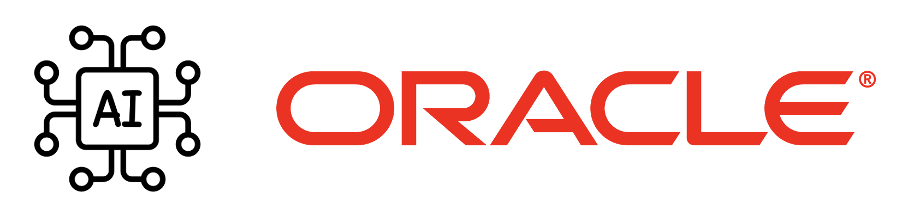

# **[AI Services Landing Zone Extension](#)**   <!-- omit from toc -->
## **An OCI Open LZ [Workload Extensions](#) to Create Your Artificial Intelligence**  <!-- omit from toc -->

 

&nbsp; 

## **1. Introduction**
Welcome to the **AI Services Landing Zone Extension**.

The AI Services Landing Zone (LZ) Extension is a secure cloud environment, designed with best practices to simplify the onboarding of AI Services workloads and enable the continuous operations of their cloud resources. This reference architecture provides an automated landing zone **configuration**.

&nbsp; 

## **2. Design Overview**

This workload extension uses the [One-OE](/blueprints/one-oe/readme.md) Blueprint as the reference Landing Zone and guides the deployment of AI services on top of it.

&nbsp;

## **3. Deployment**                              

Below are the  **deployment guide** to provision AI services landing zone extension: 

> [!NOTE]
> Step 1 : The One-OE Landing Zone serves as the foundational setup for all workloads. It covers essential IAM, network and security configurations. This deployment is necessary to create a secure and scalable environment for AI services. Ensure this base deployment is completed first before proceeding with any AI-specific extensions.

| DEPLOYMENT                                         | DEPLOYMENT SCENARIOS DESCRIPTION                                                                                                                  | TIME EFFORTS                          |
| ------------------------------------------------ | ------------------------------------------------------------------------------------------------------------------------------------------------ | ------------------------------------- |
| **[One-OE LZ](../../blueprints/one-oe/)**                   | **Deploy One-OE Landing Zone**. Cover Core network resources (Hub VCN), Core IAM resources (compartments, group, policies), and security services.          | **< 1h**                              |

> [!NOTE]
> Step 2 : After successfully deploying the One-OE Landing Zone, select the required AI services from the list below. Each service includes the configuration which holds compartments, groups, policies and networks which integrates with the base ONE-OE landing zone. 

| DEPLOYMENT                                         | DEPLOYMENT SCENARIOS DESCRIPTION                                                                                                                  | TIME EFFORTS                          |
| ------------------------------------------------ | ------------------------------------------------------------------------------------------------------------------------------------------------ | ------------------------------------- |
| **[GenAI](./genai/)**                            | **Deploy Genai extension**. Include AI service IAM resources (Compartment, Groups, Policies) | **< 15m**                             |
| **[Digital Assistant](./digital_assistant/)**            | **Deploy Digital Assistant extension**. Include AI service IAM resources (Compartment, Groups, Policies) and optional network resources (Spokes VCNs, Table Routes, Security Lists) |  **< 30m** (excluding deployment time) |
| **[Language](./language/)**                            | **Deploy Language Service extension**. Include AI service IAM resources (Compartment, Groups, Policies) | **< 15m**                             |
| **[Speech](./speech/)**                            | **Deploy Speech Service extension**. Include AI service IAM resources (Compartment, Groups, Policies) | **< 15m**                             |
| **[Vision](./vision/)**                            | **Deploy Vision Service extension**. Include AI service IAM resources (Compartment, Groups, Policies) | **< 15m**                             |
| **[Document Understanding](./document-understanding/)**                            | **Deploy Document Understanding extension**. Include AI service IAM resources (Compartment, Groups, Policies) | **< 15m**                             |

&nbsp; 
# License <!-- omit from toc -->

Copyright (c) 2026 Oracle and/or its affiliates.

Licensed under the Universal Permissive License (UPL), Version 1.0.

See [LICENSE](/LICENSE.txt) for more details.

