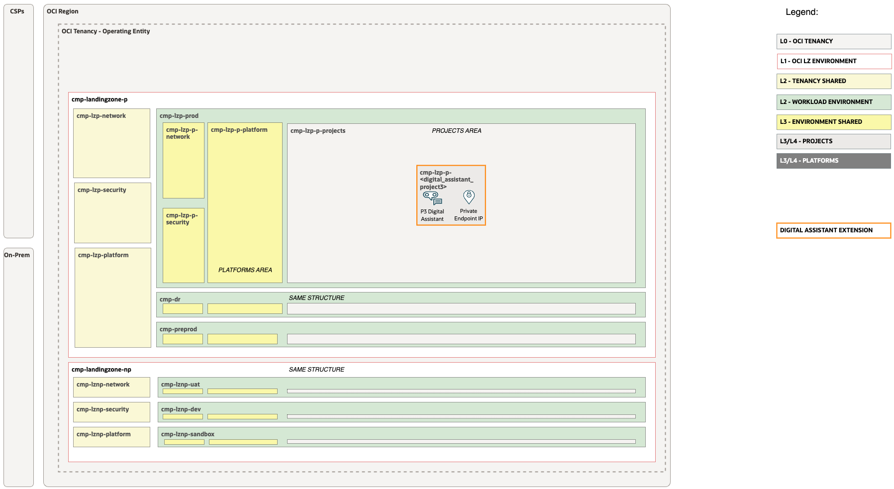
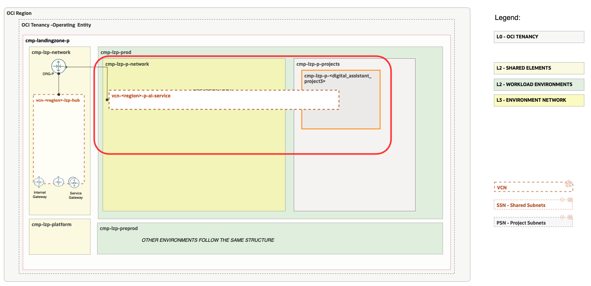

# Digital Assistant Workload Extension <!-- omit from toc -->

## **Table of Contents** <!-- omit from toc -->

- [**1. Summary**](#1-summary)
- [**2. Setup IAM Configuration**](#2-setup-iam-configuration)
  - [**2.1. Compartments**](#21-compartments)
  - [**2.2 Groups**](#22-groups)
  - [**2.3 Policies**](#23-policies)
- [**3. Setup Network Configuration**](#3-setup-network-configuration)
  - [**3.1 VCNs**](#31-vcns)
  - [**3.2 Subnets**](#32-subnets)
  - [**3.3 Route Tables (RTs)**](#33-route-tables-rts)
  - [**3.4 Security Lists (SLs)**](#34-security-lists-sls)
  - [**3.5 Gateways**](#35-gateways)
    - [**3.5.1 Dynamic Routing Gateway (DRGs) Attachments**](#351-dynamic-routing-gateway-drgs-attachments)
    - [**3.5.2 Service Gateway (SGs)**](#352-service-gateway-sgs)
- [**4. Run with ORM**](#4-run-with-orm)
- [**5. Run with Terraform CLI**](#5-run-with-terraform-cli)
  - [**5.1 Setup Terraform Authentication**](#51-setup-terraform-authentication)
  - [**5.2 Cl this Git repo to your Machine**](#52-clone-this-git-repo-to-your-machine)
  - [**5.3 Clone the orchestrator Git repo to your Machine**](#53-clone-the-orchestrator-git-repo-to-your-machine)
  - [**5.4 Change the Directory to the Terraform Orchestrator Module**](#54-change-the-directory-to-the-terraform-orchestrator-module)
  - [**5.5 Run ```terraform init```**](#55-run-terraform-init)
  - [**5.6 Run ```terraform plan```**](#56-run-terraform-plan)
  - [**5.7 Run ```terraform apply```**](#57-run-terraform-apply)

&nbsp; 


## **1. Summary**

|                           |                                                                                                                                                                |
| ------------------------- | -------------------------------------------------------------------------------------------------------------------------------------------------------------- |
| **DEPLOYMENT NAME**              | Digital Assistant Landing Zone Workload Extension                                                                                                                                    |
| **OBJECTIVE**             | Provision OCI Digital Assistant Landing Zone IAM and Network Extensions.                                                                                                    |
| **TARGET RESOURCES**      | - **Security**: Compartments, Groups, Policies</br>- **Network**: Spoke VCNs, Route tables, Security Lists                                                     |
| **IAM CONFIGURATION**     | [digital_assistant_identity.auto.tfvars.json](/workload-extensions/ai-services/digital_assistant/digital_assistant_identity.auto.tfvars.json) |
| **NETWORK CONFIGURATION** | [digital_assistant_network.auto.tfvars.json](/workload-extensions/ai-services/digital_assistant/digital_assistant_network.auto.tfvars.json)   |
| **PRE-ACTIVITIES**        | Execute [Deploy One-OE LZ](../../../blueprints/one-oe/)                                                                      |
| **RUN OPERATION**         | Use [ORM](#4-run-with-orm) or use [Terraform CLI](#5-run-with-terraform-cli).                                                                                  |


&nbsp; 

## **2. Setup IAM Configuration**

For configuring and running the One-OE Landing Zone Digital Assistant extension Identity Layer use the following JSON file: [digital_assistant_identity.auto.tfvars.json](/workload-extensions/ai-services/digital_assistant/digital_assistant_identity.auto.tfvars.json) You can customize this configuration to fit your exact OCI IAM topology.

This configuration file requires changes to reference the OCIDs of the One-OE Landing Zone resources which were deployed in [Deploy One-OE LZ](../../../blueprints/one-oe/) step.
Search for the values indicated below and replace with the correct OCIDs:

| Resource                  | OCID Text to Replace              | Description                        |
| ------------------------- | --------------------------------- | ---------------------------------- |
| Prod Project Compartment | \<OCID-COMPARTMENT-PROD-PROJECT> | The prod project compartment OCID |

&nbsp; 

###  **2.1. Compartments**

The diagram below identifies the compartments in the scope of this operation.



&nbsp; 

The Digital Assistant extension provisions a single compartment under the production project area.

Using this extension requires choosing the right platform for the use cases. Extension can be modified to provision multiple instances of the delpoyment. For customizations see the full [compartment resource documentation](https://github.com/oracle-quickstart/terraform-oci-cis-landing-zone-iam/tree/main/compartments).

&nbsp; 

### **2.2 Groups**
As part of the deployment the following groups are created in the [Default Identity Domain](https://docs.oracle.com/en-us/iaas/Content/Identity/domains/overview.htm):
| Group                      | Description                                                               |
| -------------------------- | ------------------------------------------------------------------------- |
| grp-p-project-dig-asst-admins | Members of the group are able to administer digital assistant and accompained services |
| grp-p-project-dig-asst-developers | Members of the group are digital assistant service developers |
| grp-p-project-dig-asst-business-users | Members of the group are digital assistant service business users |
| grp-p-project-dig-asst-api-users | Members of the group are digital assistant API users |

For customizations see the full [group resoruce documentation](https://github.com/oracle-quickstart/terraform-oci-cis-landing-zone-iam/tree/main/groups)

&nbsp; 

### **2.3 Policies**
As part of the deploymnet the following policies are created:
| Policy                     | Description                                             | Manage resources             | Use resources                   | Inspect resources |
| -------------------------- | ------------------------------------------------------- | ---------------------------- | ------------------------------- | ----------------- |
| pcy-p-project-dig-asst-admins | Grants group *grp-p-project-dig-asst-admins* perminssions. | oda-family, object-family | virtual-network-family, tagnamespace | Security Lists    |
| pcy-p-project-dig-asst-developers | Grants group *grp-p-project-dig-asst-developers* perminssions. |  | oda-design, oda-insights | oda-instances    |
| pcy-p-project-dig-asst-business-users | Grants group *grp-p-project-dig-asst-business-users* perminssions. |  | oda-insights | oda-design, oda-instances  |
| pcy-p-project-dig-asst-api-users | Grants group *grp-p-project-dig-asst-api-users* perminssions. |  | oda-instance-resource, oda-design |   |

Policies contain compartment paths. The paths can change based on the modification in the previous [Compartments](#21-compartments) section. The paths need to be updated following the OCI [Policies and Compartment hierarchy](https://docs.oracle.com/en-us/iaas/Content/Identity/Concepts/policies.htm#hierarchy).

For customizations see the full [policy resource documentation](https://github.com/oracle-quickstart/terraform-oci-cis-landing-zone-iam/tree/main/policies)

&nbsp; 

## **3. Setup Network Configuration**

For configuring and running the One-OE LZ Digital Assistant extension Network layer use the following JSON file: [digital_assistant_network.auto.tfvars.json](/workload-extensions/ai-services/digital_assistant/digital_assistant_network.auto.tfvars.json)

This configuration file will require changes to the resources to reference the OCIDs of the One-OE Landing Zone.
Search for the values indicated below and replace with the correct OCIDs:

| Resource                 | OCID Text to Replace             | Description                                                      |
| ------------------------ | -------------------------------- | ---------------------------------------------------------------- |
| Prod Network Compartment | \<OCID-COMPARTMENT-PROD-NETWORK> | The OCID of the Prod Network Compartment deployed in step OP.00. |
| Hub DRG                  | \<OCID-DRG-HUB>                  | The OCID of the DRG in Hub deployed in step OP.00.               |
| Hub DRG Route Table      | \<OCID-DRG-HUB-ROUTE-TABLE>      | The OCID of Route table in DRG                                   |

This configuration covers the following networking diagram. 

&nbsp; 



&nbsp; 

### **3.1 VCNs**
The following table describes the deployed VCNs.

> [!NOTE]
> A VCN is a customizable, software-defined network that you set up in an Oracle Cloud Infrastructure region. Like traditional data center networks, VCNs give you complete control over your network environment. A VCN can have multiple non-overlapping CIDR blocks that you can change after you create the VCN.

| ID     | OP    | NAME           | OBJECTIVES                         |
| ------ | ----- | -------------- | ---------------------------------- |
| VCN.00 | OP#01 | vcn-fra-p-ai-service | Spoke VCN for AI Services |

&nbsp; 

### **3.2 Subnets**
The following table describes the deployed Subnets.

> [!NOTE]
> You can segment a VCN into subnets, which can be scoped to a region or to an availability domain. Each subnet consists of a contiguous range of addresses that don't overlap with the other subnets in the VCN. You can change the size of a subnet after creation. A subnet can be public or private.

> [!IMPORTANT]  
> Digital Assistant AI service require a VCN and subnet to deploy private endpoint

| ID    | OP    | NAME             | OBJECTIVES                |
| ----- | ----- | ---------------- | ------------------------- |
| SN.00 | OP#01 | sn-fra-p-ai-service-da | AI service digital assistant subnet |


### **3.3 Route Tables (RTs)**
The following table describes the deployed Route Tables.

> [!NOTE]
> A collection of RouteRule objects, which are used to route packets based on destination IP to a particular network entity.
 
| ID    | OP    | NAME               | OBJECTIVES                            |
| ----- | ----- | ------------------ | ------------------------------------- |
| RT.00 | OP#01 | rt-01-p-ai-service-vcn-ep | AI service Digital Assistant subnet route table |

&nbsp; 

### **3.4 Security Lists (SLs)**
The following table describes the deployed Security Lists (SLs).

> [!NOTE]
> A security list consists of a set of ingress and egress security rules that apply to all the VNICs in any subnet that the security list is associated with. This means that all the VNICs in a given subnet are subject to the same set of security lists

| ID    | OP    | NAME                | OBJECTIVES                              |
| ----- | ----- | ------------------- | --------------------------------------- |
| SL.00 | OP#01 | sl-01-p-ai-service-vcn-da | AI service digital assistant subnet security list |

&nbsp; 

### **3.5 Gateways**
#### **3.5.1 Dynamic Routing Gateway (DRGs) Attachments**
The following tables describe the deployed DRG Attachments.
> [!NOTE]
> A DRG attachment serves as a link between a DRG and a network resource. A DRG can be attached to a VCN, IPSec tunnel, remote peering connection, or virtual circuit. For more information, see Overview of the Networking Service.


| ID      | OP    | NAME                      | OBJECTIVES                                   |
| ------- | ----- | ------------------------- | -------------------------------------------- |
| DRGA.00 | OP#02 | ai-service-vcn-p-drg-attachment | DRG Attachment for the AI Service spoke to the hub |


#### **3.5.2 Service Gateway (SGs)**
The following table describes the proposed Service Gateways.

> [!NOTE]
> A service gateway lets your virtual cloud network (VCN) privately access specific Oracle services without exposing the data to the public internet. No internet gateway or NAT gateway is required to reach those specific services. The resources in the VCN can be in a private subnet and use only private IP addresses.

| ID    | OP    | NAME          | OBJECTIVES           |
| ----- | ----- | ------------- | -------------------- |
| SG.00 | OP#01 | sg-fra-p-ai-service | SG in the AI Service VCN. |

&nbsp; 


For customization of the pre-defined setup please refer to the [Networking documentation](https://github.com/oci-landing-zones/terraform-oci-modules-networking) for documentation and examples.

The network layer covers the following resources:

1. Spoke VCN - one Spoke VCN for AI Services
2. Subnets - one Subnet for Digital Assistant 
3. Gateway - Service Gateway to access OCI services
4. Security List - Security list for Digital Assistant private endpoint
5. Route Tables - One for Service Gateway, and a default route for routing all trafic through the central hub
6. DRG Attachment - Connect spoke with the central Hub

&nbsp; 

## **4. Run with ORM**

| STEP  | ACTION                                                                                                                                                                                                                                                                                                                                                                                                                                                                                                                                                                                                                                                           |
| ----- | ---------------------------------------------------------------------------------------------------------------------------------------------------------------------------------------------------------------------------------------------------------------------------------------------------------------------------------------------------------------------------------------------------------------------------------------------------------------------------------------------------------------------------------------------------------------------------------------------------------------------------------------------------------------- |
| **1** | [](https://cloud.oracle.com/resourcemanager/stacks/create?zipUrl=https://github.com/oracle-quickstart/terraform-oci-landing-zones-orchestrator/archive/refs/tags/v2.0.0.zip&zipUrlVariables={"input_config_files_urls":"https://raw.githubusercontent.com/oci-landing-zones/oci-landing-zone-operating-entities/master/workload-extensions/ai-services/digital_assistant/digital_assistant_identity.auto.tfvars.json,https://raw.githubusercontent.com/oci-landing-zones/oci-landing-zone-operating-entities/master/workload-extensions/ai-services/digital_assistant/digital_assistant_network.auto.tfvars.json"}) |
| **2** | Accept terms,  wait for the configuration to load.                                                                                                                                                                                                                                                                                                                                                                                                                                                                                                                                                                                                               |
| **3** | Set the working directory to “orm-facade”.                                                                                                                                                                                                                                                                                                                                                                                                                                                                                                                                                                                                                       |
| **4** | Set the stack name you prefer.                                                                                                                                                                                                                                                                                                                                                                                                                                                                                                                                                                                                                                   |
| **5** | Set the terraform version to 1.2.x. Click Next.                                                                                                                                                                                                                                                                                                                                                                                                                                                                                                                                                                                                                  |
| **6** | Update with the links to your IAM and Network configurations (OCI Object Storage is recommended) Click Next.                                                                                                                                                                                                                                                                                                                                                                                                                                                                                                                                                     |
| **7** | Un-check run apply. Click Create.                                                                                                                                                                                                                                                                                                                                                                                                                                                                                                                                                                                                                                |

&nbsp; 

## **5. Run with Terraform CLI**
### **5.1 Setup Terraform Authentication**
For authenticating against the OCI tenancy terraform execute the following [instructions](/commons/content/terraform_authentication.md).
### **5.2 Clone this Git repo to your Machine**
```
git clone git@github.com:oracle-quickstart/terraform-oci-open-lz.git
```
### **5.3 Clone the orchestrator Git repo to your Machine**
Cloning the latest version:
```
git clone git@github.com:oracle-quickstart/terraform-oci-landing-zones-orchestrator.git
```
###  **5.4 Change the Directory to the Terraform Orchestrator Module**
Change the directory to the *terraform-oci-landing-zones-orchestrator* Terraform orchestrator module.
### **5.5 Run ```terraform init```**
Run ```terraform init``` to download all the required external terraform providers and Terraform modules.
### **5.6 Run ```terraform plan```**
Run ```terraform plan``` with the IAM and Network configuration.
```
terraform plan \
-var-file ../terraform-oci-open-lz/commons/content/oci-credentials.tfvars.json \
-var-file ../terraform-oci-open-lz/workload-extensions/oci-lz-ext-ai-services/digital_assistant/digital_assistant_identity.auto.tfvars.json \
-var-file ../terraform-oci-open-lz/workload-extensions/oci-lz-ext-ai-services/digital_assistant/digital_assistant_network.auto.tfvars.json
```

After the execution please analyze the output of the command above and check if it corresponds to your desired configuration.

Note that the ```terraform.tfstate``` file is generated in the configuration location and not in the terraform code location. This is the expected configuration as the terraform automation can support any number of configurations and the **state file** will belong to the configuration and not to the code.
  
The ideal scenario regarding the **state file** will be for each configuration to have a corresponding OCI Object Storage location for the state file. For more details on the Terraform state file recommended configuration please refer to the following [documentation](https://docs.oracle.com/en-us/iaas/Content/API/SDKDocs/terraformUsingObjectStore.htm).

### **5.7 Run ```terraform apply```**
Run terraform plan with the IAM and Network configuration. After  its execution the configured resources will be provisioned or updated on OCI.
```
terraform apply \
-var-file ../terraform-oci-open-lz/commons/content/oci-credentials.tfvars.json \
-var-file ../terraform-oci-open-lz/workload-extensions/oci-lz-ext-ai-services/digital_assistant/digital_assistant_identity.auto.tfvars.json \
-var-file ../terraform-oci-open-lz/workload-extensions/oci-lz-ext-ai-services/digital_assistant/digital_assistant_network.auto.tfvars.json
```


&nbsp; 

&nbsp; 

# License <!-- omit from toc -->

Copyright (c) 2025 Oracle and/or its affiliates.

Licensed under the Universal Permissive License (UPL), Version 1.0.

See [LICENSE](/LICENSE) for more details.
