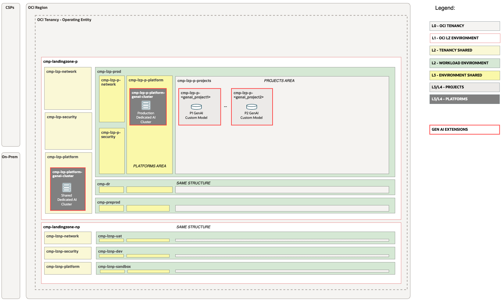

# Generative AI Workload Extension <!-- omit from toc -->

## **Table of Contents** <!-- omit from toc -->

- [**1. Summary**](#1-summary)
- [**2. Setup IAM Configuration**](#2-setup-iam-configuration)
  - [**2.1. Compartments**](#21-compartments)
  - [**2.2 Groups**](#22-groups)
  - [**2.3 Policies**](#23-policies)
- [**3. Run with ORM**](#3-run-with-orm)
- [**4. Run with Terraform CLI**](#4-run-with-terraform-cli)
  - [**4.1 Setup Terraform Authentication**](#41-setup-terraform-authentication)
  - [**4.2 Clone this Git repo to your Machine**](#42-clone-this-git-repo-to-your-machine)
  - [**4.3 Clone the orchestrator Git repo to your Machine**](#43-clone-the-orchestrator-git-repo-to-your-machine)
  - [**4.4 Change the Directory to the Terraform Orchestrator Module**](#44-change-the-directory-to-the-terraform-orchestrator-module)
  - [**4.5 Run ```terraform init```**](#45-run-terraform-init)
  - [**4.6 Run ```terraform plan```**](#46-run-terraform-plan)
  - [**4.7 Run ```terraform apply```**](#47-run-terraform-apply)

&nbsp; 


## **1. Summary**

|                           |                                                                                                                                                                |
| ------------------------- | -------------------------------------------------------------------------------------------------------------------------------------------------------------- |
| **DEPLOYMENT NAME**              | GenAI Landing Zone Workload Extension                                                                                                                                    |
| **OBJECTIVE**             | Provision OCI GENAI Landing Zone IAM Extensions.                                                                                                    |
| **TARGET RESOURCES**      | **Security**: Compartments, Groups, Policies</br>                                                      |
| **IAM CONFIGURATION**     | [genai_identity.auto.tfvars.json](/workload-extensions/ai-services/genai/oci_open_lz_one-oe_identity.auto.tfvars.json) |
| **PRE-ACTIVITIES**        | Execute [Deploy One-OE LZ](../../../blueprints/one-oe/)                                                                                                                                              
| **RUN OPERATION**         | Use [ORM](#3-run-with-orm) or use [Terraform CLI](#4-run-with-terraform-cli).                                                                                  |


&nbsp; 

## **2. Setup IAM Configuration**

For configuring and running the One-OE Landing Zone Genai extension Identity Layer use the following JSON file: [genai_identity.auto.tfvars.json](/workload-extensions/ai-services/genai/oci_open_lz_one-oe_identity.auto.tfvars.json) You can customize this configuration to fit your exact OCI IAM topology.

This configuration file covers three categories of resources described in the next sections.

This configuration file requires changes to reference the OCIDs of the One-OE Landing Zone resources which were deployed in [Deploy One-OE LZ](../../../blueprints/one-oe/) step.
Search for the values indicated below and replace with the correct OCIDs:

| Resource                  | OCID Text to Replace              | Description                        |
| ------------------------- | --------------------------------- | ---------------------------------- |
| Shared Platform Compartment | \<OCID-COMPARTMENT-SHARED-PLATFORM> | The Shared platform compartment OCID |
| Prod Platform Compartment | \<OCID-COMPARTMENT-PROD-PLATFORM> | The prod platform compartment OCID |
| Prod Project Compartment | \<OCID-COMPARTMENT-PROD-PROJECT> | The prod project compartment OCID |

&nbsp; 

###  **2.1. Compartments**

The diagram below identifies the compartments in the scope of this operation.



&nbsp; 

The Genai extension provisions 3 compartments. The shared Genai cluster compartment, Prod platform Genai cluster compartment and the genai project compartment under the production project area. 

One-OE Landing Zones defines multiple instances of platform compartment. Platform comparment is created **for each environement**, and **one shared** platform for resources spanning multiple environments. 

Using this extension requires choosing the right platform for the use cases. Extension can be modified to provision multiple instances of the delpoyment. For customizations see the full [compartment resource documentation](https://github.com/oracle-quickstart/terraform-oci-cis-landing-zone-iam/tree/main/compartments).

&nbsp; 

### **2.2 Groups**
As part of the deployment the following groups are created in the [Default Identity Domain](https://docs.oracle.com/en-us/iaas/Content/Identity/domains/overview.htm):
| Group                      | Description                                                               |
| -------------------------- | ------------------------------------------------------------------------- |
| grp-platform-genai-cluster-admins | Members of the group are able to administer shared genai cluster and accompained services |
| grp-p-platform-genai-cluster-admins | Members of the group are able to administer prod platform genai cluter and accompained services |
| grp-p-project-genai-admins | Members of the group are able to administer genai project and accompained services |

For customizations see the full [group resoruce documentation](https://github.com/oracle-quickstart/terraform-oci-cis-landing-zone-iam/tree/main/groups)

&nbsp; 

### **2.3 Policies**
As part of the deploymnet the following policies are created:
| Policy                     | Description                                             | Manage resources             | Use resources                   | Inspect resources |
| -------------------------- | ------------------------------------------------------- | ---------------------------- | ------------------------------- | ----------------- |
| pcy-platform-genai-cluster-admins | Grants group *grp-platform-genai-cluster-admins* perminssions. | genai-cluter, object family | tag namespace |    |
| pcy-p-platform-genai-cluster-admins | Grants group *grp-p-platform-genai-cluster-admins* perminssions. | genai-cluter, object family  | tag namespace  |
| pcy-p-project-genai-admins | Grants group *grp-p-project-genai-admins* perminssions. |  | genai-cluter, object family |      |

Policies contain compartment paths. The paths can change based on the modification in the previous [Compartments](#21-compartments) section. The paths need to be updated following the OCI [Policies and Compartment hierarchy](https://docs.oracle.com/en-us/iaas/Content/Identity/Concepts/policies.htm#hierarchy).

For customizations see the full [policy resource documentation](https://github.com/oracle-quickstart/terraform-oci-cis-landing-zone-iam/tree/main/policies)

&nbsp; 

## **3. Run with ORM**

| STEP  | ACTION                                                                                                                                                                                                                                                                                                                                                                                                                                                                                                                                                                                                                                                           |
| ----- | ---------------------------------------------------------------------------------------------------------------------------------------------------------------------------------------------------------------------------------------------------------------------------------------------------------------------------------------------------------------------------------------------------------------------------------------------------------------------------------------------------------------------------------------------------------------------------------------------------------------------------------------------------------------- |
| **1** | [](https://cloud.oracle.com/resourcemanager/stacks/create?zipUrl=https://github.com/oracle-quickstart/terraform-oci-landing-zones-orchestrator/archive/refs/tags/v2.0.0.zip&zipUrlVariables={"input_config_files_urls":"https://raw.githubusercontent.com/oci-landing-zones/oci-landing-zone-operating-entities/master/workload-extensions/ai-services/genai/genai_identity.auto.tfvars.json"}) |
| **2** | Accept terms,  wait for the configuration to load.                                                                                                                                                                                                                                                                                                                                                                                                                                                                                                                                                                                                               |
| **3** | Set the working directory to “orm-facade”.                                                                                                                                                                                                                                                                                                                                                                                                                                                                                                                                                                                                                       |
| **4** | Set the stack name you prefer.                                                                                                                                                                                                                                                                                                                                                                                                                                                                                                                                                                                                                                   |
| **5** | Set the terraform version to 1.2.x. Click Next.                                                                                                                                                                                                                                                                                                                                                                                                                                                                                                                                                                                                                  |
| **6** | Update with the links to your IAM and Network configurations (OCI Object Storage is recommended) Click Next.                                                                                                                                                                                                                                                                                                                                                                                                                                                                                                                                                     |
| **7** | Un-check run apply. Click Create.                                                                                                                                                                                                                                                                                                                                                                                                                                                                                                                                                                                                                                |

&nbsp; 

## **4. Run with Terraform CLI**
### **4.1 Setup Terraform Authentication**
For authenticating against the OCI tenancy terraform execute the following [instructions](/commons/content/terraform_authentication.md).
### **4.2 Clone this Git repo to your Machine**
```
git clone git@github.com:oracle-quickstart/terraform-oci-open-lz.git
```
### **4.3 Clone the orchestrator Git repo to your Machine**
Cloning the latest version:
```
git clone git@github.com:oracle-quickstart/terraform-oci-landing-zones-orchestrator.git
```
###  **4.4 Change the Directory to the Terraform Orchestrator Module**
Change the directory to the *terraform-oci-landing-zones-orchestrator* Terraform orchestrator module.
### **4.5 Run ```terraform init```**
Run ```terraform init``` to download all the required external terraform providers and Terraform modules.
### **4.6 Run ```terraform plan```**
Run ```terraform plan``` with the IAM and Network configuration.
```
terraform plan \
-var-file ../terraform-oci-open-lz/commons/content/oci-credentials.tfvars.json \
-var-file ../terraform-oci-open-lz/workload-extensions/ai-services/genai/genai_identity.auto.tfvars.json
```

After the execution please analyze the output of the command above and check if it corresponds to your desired configuration.

Note that the ```terraform.tfstate``` file is generated in the configuration location and not in the terraform code location. This is the expected configuration as the terraform automation can support any number of configurations and the **state file** will belong to the configuration and not to the code.
  
The ideal scenario regarding the **state file** will be for each configuration to have a corresponding OCI Object Storage location for the state file. For more details on the Terraform state file recommended configuration please refer to the following [documentation](https://docs.oracle.com/en-us/iaas/Content/API/SDKDocs/terraformUsingObjectStore.htm).

### **4.7 Run ```terraform apply```**
Run terraform plan with the IAM and Network configuration. After  its execution the configured resources will be provisioned or updated on OCI.
```
terraform apply \
-var-file ../terraform-oci-open-lz/commons/content/oci-credentials.tfvars.json \
-var-file ../terraform-oci-open-lz/workload-extensions/ai-services/genai/genai_identity.auto.tfvars.json
```


&nbsp; 

&nbsp; 

# License <!-- omit from toc -->

Copyright (c) 2025 Oracle and/or its affiliates.

Licensed under the Universal Permissive License (UPL), Version 1.0.

See [LICENSE](/LICENSE.txt) for more details.
