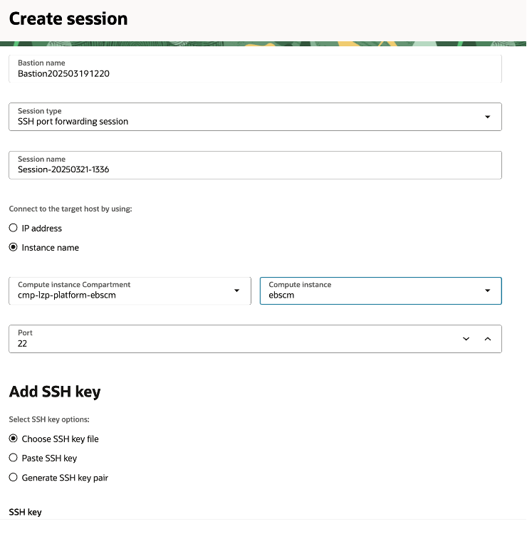
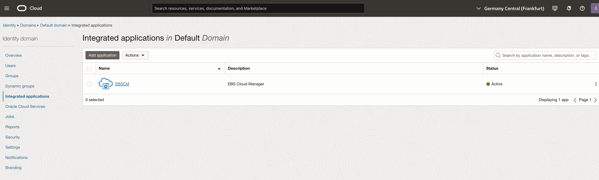
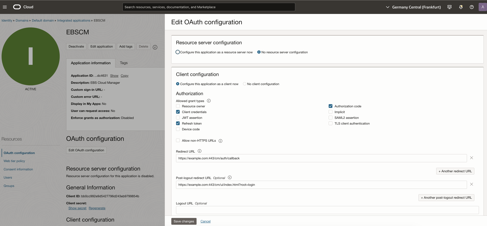
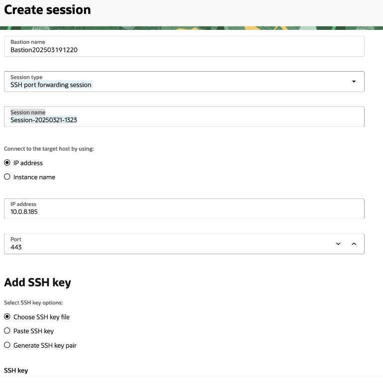
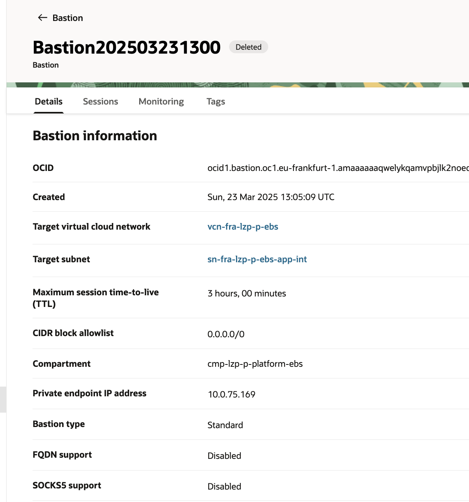

# Bastion Access <!-- omit from toc -->

## **Table of Contents** <!-- omit from toc -->

- [**1. EBS Cloud Manager SSH Connection**](#1-ebs-cloud-manager-ssh-connection)
- [**2. EBS Cloud Manager UI Connection**](#2-ebs-cloud-manager-ui-connection)
  - [**2.1 Set EBS Cloud Manager URL**](#21-set-ebs-cloud-manager-url)
  - [**2.2 Create EBS Cloud Manager UI Bastion Session**](#22-create-ebs-cloud-manager-ui-bastion-session)
- [**3. EBS Environment Access**](#3-ebs-environment-access)

## **1. EBS Cloud Manager SSH Connection**

You will need connect to the EBS Cloud Manager Application Server in order to be able to run the Perl configuration scripts.
Create the Bastion Server in the Security Compartment and target the VCN and Subnet containing the EBSCM Apps Server:

| Resource | Name |
| --- | --- |
| Compartment | cmp-lzp-security |
| Virtual Cloud Network | vcn-fra-lzp-m-ebs |
| Subnet | sn-fra-lzp-m-ebs-app |

Create the Bastion Session with the EBSCM Apps server as the target using port 22:



Once it has been created in the Actions menu for the session, select View SSH command.

You can then connect to the server using the following command in a terminal window:

```
ssh -i <private_Key> -N -L <local_Port>:<ip_ebscm_app>:22 -p 22 <bastion_session_ocid>
```

In the above example replace the parameters in brackets as below:

| Parameter | Description |
| --- | --- |
| <private_Key> | Path to your private key for EBSCM, eg: .ssh/ssh-key-ebscm.key |
| <local_Port> | Any unused local port, eg: 4433 |
| <ip_ebscm_app> | The IP address of the EBSCM Application server |
| <bastion_session_ocid> | The OCID of the Bastion session |

Then you can use another terminal session to open a session on the EBSCM server.

```
ssh  -i <privateKey> opc@localhost -p <localPort>
```

&nbsp; 

## **2. EBS Cloud Manager UI Connection**

### **2.1 Set EBS Cloud Manager URL**

The URL to access the EBSCM UI needs to be setup.

Update the EBSCM URL following the instructions contained [here](https://docs.oracle.com/cd/E26401_01/doc.122/f35809/T679330T679341.htm#cmg_manage_updatecmurl).

Now follows an example URL using example.com as the domain.

Login to the EBSCM App server and run the following commands:
```
sudo su - oracle
cd /u01/install/APPS/apps-unlimited-ebs/bin
./ebscmadmin update-load-balancer-url --load-balancer-url=https://example.com:443
```

Next, update the URL in the Confidential Application setup:



Select and Edit OAuth configuration:



Update Redirect URL and Post-logout redirect URL to include the domain.

Add your domain entry to your hosts file, eg:
```
##
# Host Database
#
# localhost is used to configure the loopback interface
# when the system is booting.  Do not change this entry.
##
127.0.0.1	localhost example.com
255.255.255.255	broadcasthost
::1             localhost
```

### **2.2 Create EBS Cloud Manager UI Bastion Session**

Once the configuration steps have been completed you can access the EBS Cloud Manager UI.
We can do this the Bastion Server created above.

Create the Bastion Session with the EBSCM Load Balancer server as the target using port 443:



In the above example 10.0.8.185 is the EBS Load Balancer

You can then connect to the server using the following command in a terminal window:
```
sudo ssh -i <private_Key> -N -L 443:<ip_ebscm_lb>:443 -p 22 <bastion_session_ocid>
```

| Parameter | Description |
| --- | --- |
| <private_Key> | Path to your private key for EBSCM, eg: .ssh/ssh-key-ebscm.key |
| <ip_ebscm_lb> | The IP address of the EBSCM Load Balancer |
| <bastion_session_ocid> | The OCID of the Bastion session |

> [!NOTE]
> Depending upon your OS you may not require the sudo command

You can now access the EBSCM UI with your URL eg:
https://example.com/

## **3. EBS Environment Access**

In this example we are using https and port 443 connecting to the domain https://prodapp.ebs with an IP of 10.0.73.89

Add your EBS domain entry to your hosts file, eg:
```
##
# Host Database
#
# localhost is used to configure the loopback interface
# when the system is booting.  Do not change this entry.
##
127.0.0.1	localhost example.com prodapp.ebs
255.255.255.255	broadcasthost
::1             localhost
```

Create a Bastion Server in the Security Compartment and target the VCN and Subnet containing the EBSCM Application Server. In the example below we are connecting to the Production environment internal application server.



| Resource | Name |
| --- | --- |
| Compartment | cmp-lzp-security |
| Virtual Cloud Network | vcn-fra-lzp-p-ebs |
| Subnet | sn-fra-lzp-p-ebs-app-int |

Create the Bastion Session with the EBS Internal Apps server as the target using port 443:


You can then connect to the server using the following command in a terminal window:
```
sudo ssh -i <private_Key> -N -L 443:<ip_ebs_lb>:443 -p 22 <bastion_session_ocid>
```

| Parameter | Description |
| --- | --- |
| <private_Key> | Path to your private key for EBSCM, eg: .ssh/ssh-key-ebscm.key |
| <ip_ebscm_lb> | The IP address of the EBSCM Load Balancer |
| <bastion_session_ocid> | The OCID of the Bastion session |

Finally, point your browser to: https://prodapp.ebs

&nbsp;

# License <!-- omit from toc -->

Copyright (c) 2026 Oracle and/or its affiliates.

Licensed under the Universal Permissive License (UPL), Version 1.0.

See [LICENSE](/LICENSE.txt) for more details.
