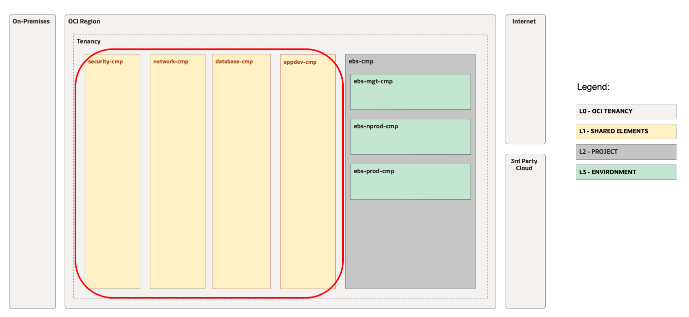
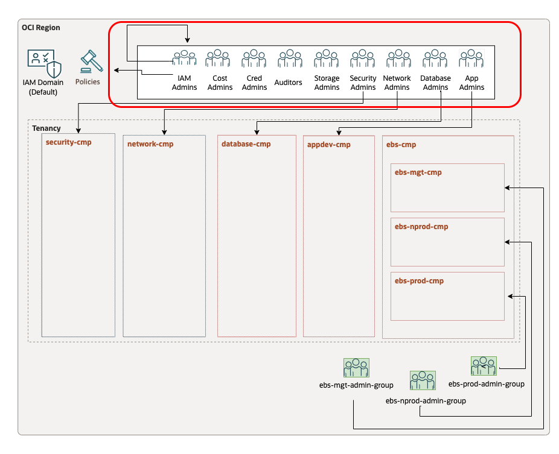
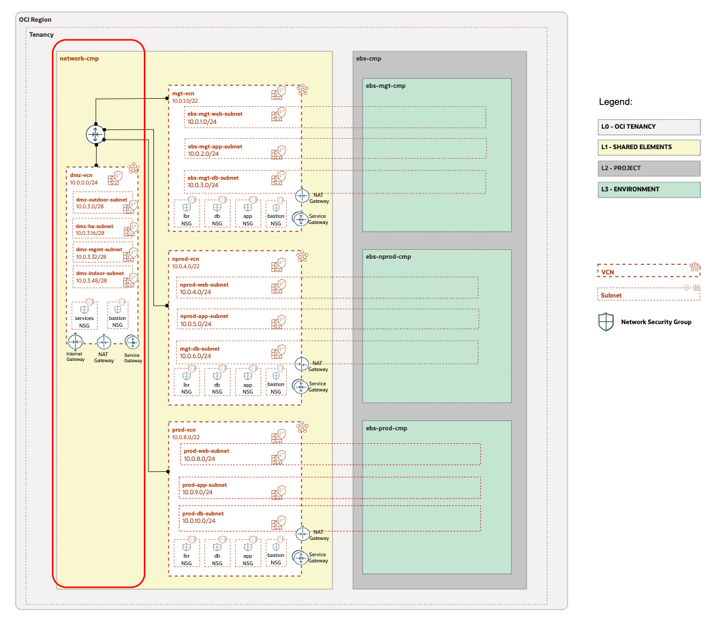

# OP.01 - CIS OCI LZ

## **Table of Contents**

[1. Summary](#1-summary) 
[2. CIS EBS Overview ](#2-cis-oci-lz-overview) 
[3. ORM Configuration Options ](#3-orm-configuration-options) 

&nbsp; 

## **1. Summary**

| |  |
|---|---| 
| **OP. ID** | OP.01 |
| **OP. NAME** | Deploy CIS OCI LZ  | 
| **OBJECTIVE** | Deploy Network and Security core resources for an EBS LZ using CIS LZ solution |
| **TARGET RESOURCES** | - **Security**: Core Compartments, Groups, Policies, OCI Security services  - **Network**: Hub VCN, subnets, SL, NSG |
| **DETAILS** |  For more details refer to the [OCI CIS LandingZone QuickStart](https://github.com/oracle-quickstart/oci-cis-landingzone-quickstart) |
| **PRE-ACTIVITIES** | Review [CIS Overview](#2-cis-oci-lz-overview) |
| **POST-ACTIVITIES** | [OP.02](/workload-extensions/ebs/op02-manage-ebs-lz-extension/readme.md) |
| **RUN WITH ORM** |    See section [3. ORM Configuration Options ](#3-orm-configuration-options) for the values and [template](EBS_CIS.pdf) for further details. |
| **CONFIG & RUN - TERRAFORM CLI** | Use the [CIS OCI LZ GitHub Repository](https://github.com/oracle-quickstart/oci-cis-landingzone-quickstart). |

&nbsp; 

## **2. CIS OCI LZ Overview**

The outcome should cover the design shown in the next diagrams.

&nbsp; 

## **3. ORM Configuration Options**

This section presents the Oracle Resource Manager steps with associated input. The flow is composed of a wizard guided setup. The values for each screen and the respective sections are specified in the following sections.

### 3.1 Stack Information Screen

| # | Input Field | Value |
|---|-------------| ----- |
| 1 | I have reviewed and accept the Oracle Terms of Use. | Check |
| 2 | Working Directory | oci-cis-landingzonequickstart-main/config |
| 3 | Name | < modify default stack name > |
| 4 | Create in Compartment | < include root compartment name > |
| 5 | Terraform Version | 1.1.x or later |

### 3.2 Environment

| # | Input Field | Value |
|---|-------------| ----- |
| 1 | Region | < region name > |
| 2 | Service Label | < your landing zone prefix > |
| 3 | CIS Level | 2 |
| 4 | Use an enclosing compartment? | Uncheck |
| 5 | Advanced Options | Uncheck |

### 3.3 Networking – Generic VCNs 

| # | Input Field | Value |
|---|-------------| ----- |
| 1 | VCNs CIDR Blocks | Leave blank |
| 2 | Advances Options | Uncheck |

### 3.4 Networking – Exadata Cloud Service VCNs

| # | Input Field | Value |
|---|-------------| ----- |
| 1 | Exadata CIDR Blocks | Leave blank |
| 2 | Advanced Options | Uncheck |

### 3.5 Networking – Hub / Spoke

| # | Input Field | Value |
|---|-------------| ----- |
| 1 | Deploy Hub/Spoke Architecture? | Check |
| 2 | Advanced Options | Check |
| 3 | DMZ VCN CIDR Block | 10.0.0.0/24 |
| 4 | Use DMZ VCN for 3rd-Party Firewalls | uncheck |
| 5 | Number of Subnets in the DMC | 4 |
| 6 | Size of the DMZ Subnet CIDRs | 4 |

### 3.6 Networking – Public Connectivity

| # | Input Field | Value |
|---|-------------| ----- |
| 1 | Block Internet Access? | UnCheck|
| 2 | Bastion Inboud SSH and RPD CIDR Blocks | Leave blank |
| 3 | Load Balancer Inbound HTTPS CIDR Blocks | Leave blank |
| 4 | NAT Outbound HTTPS CIDR Blocks | Leave blank |

### 3.7 Networking – Connectivity to On-premises

| # | Input Field | Value |
|---|-------------| ----- |
| 1 | Connect Landing Zone VNC(s) to on-premises network? | Check/Uncheck |

### 3.8 Networking – DRG (Dynamic Routing Gateway) 

| # | Input Field | Value |
|---|-------------| ----- |
| 1 | Existing DRG OCID | Leave blank |

### 3.9 Events and Notifications

| # | Input Field | Value |
|---|-------------| ----- |
| 1 | Network Admin Email Endpoints | < comma separated list of email recipients > |
| 2 | Security Admin Email Endpoints | < comma separated list of email recipients > |
| 3 | Additional Notification Endpoints | Uncheck |

### 3.10 Object Storage

| # | Input Field | Value |
|---|-------------| ----- |
| 1 | Enable Object Storage | Uncheck |

### 3.11 Cloud Guard

| # | Input Field | Value |
|---|-------------| ----- |
| 1 | Enable Cloud Guard Service | ENABLE |
| 2 | Enable Cloud Guard Cloned Recipes | ENABLE |
| 3 | Reporting Region | < region_name > |
| 4 | Minimum Risk Level Threshold | HIGH |
| 5 | Cloud Guard Admin Email Endpoints | Leave blank |

### 3.12 Security Zones

| # | Input Field | Value |
|---|-------------| ----- |
| 1 | Enable Security Zones | Uncheck |

### 3.13 Logging Consolidation: Service Connector Hub

| # | Input Field | Value |
|---|-------------| ----- |
| 1 | Enable Service Connector Hub? | Uncheck |

### 3.14 Vulnerability Scanning

| # | Input Field | Value |
|---|-------------| ----- |
| 1 | Enable Vulnerability Scanning | Check |
| 2 | Scanning Schedule | DAILY |
| 3 | Scanning Day | N/A |
| 4 | Port Scan Level | STANDARD |
| 5 | Agent CIS Benchmark Settings Scan Level | MEDIUM or STRICT |
| 6 | Enable File Scanning? | Uncheck |

### 3.15 Cost Management

| # | Input Field | Value |
|---|-------------| ----- |
| 1 | Create a default budget? | Uncheck |

&nbsp; 

You can proceed to [OP.02 Manage EBS Landing Zone Extension](/workload-extensions/ebs/op02-manage-ebs-lz-extension/readme.md).

&nbsp; 

# License

Copyright (c) 2025 Oracle and/or its affiliates.

Licensed under the Universal Permissive License (UPL), Version 1.0.

See [LICENSE](/LICENSE.txt) for more details.
