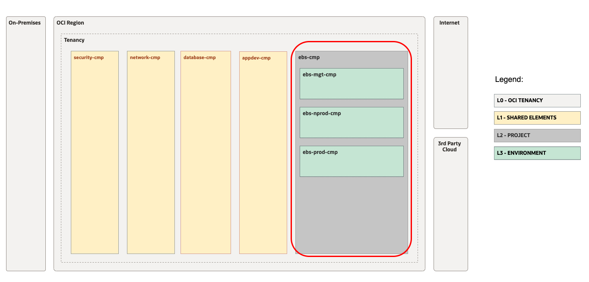
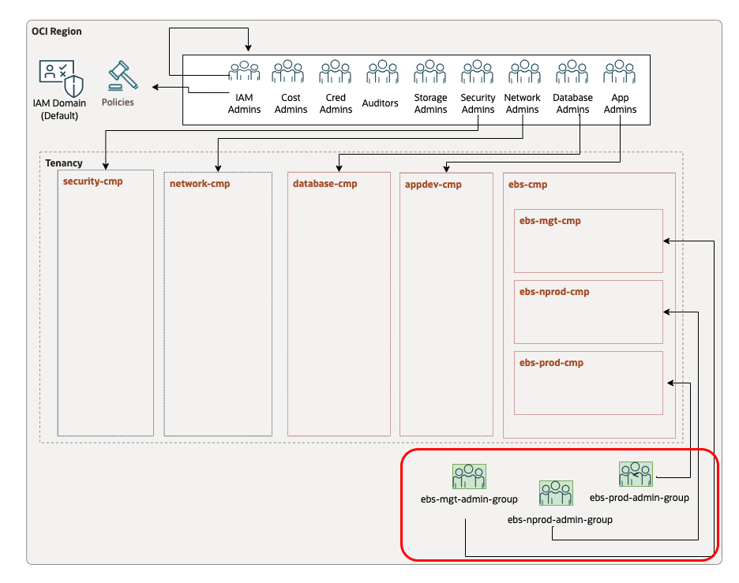
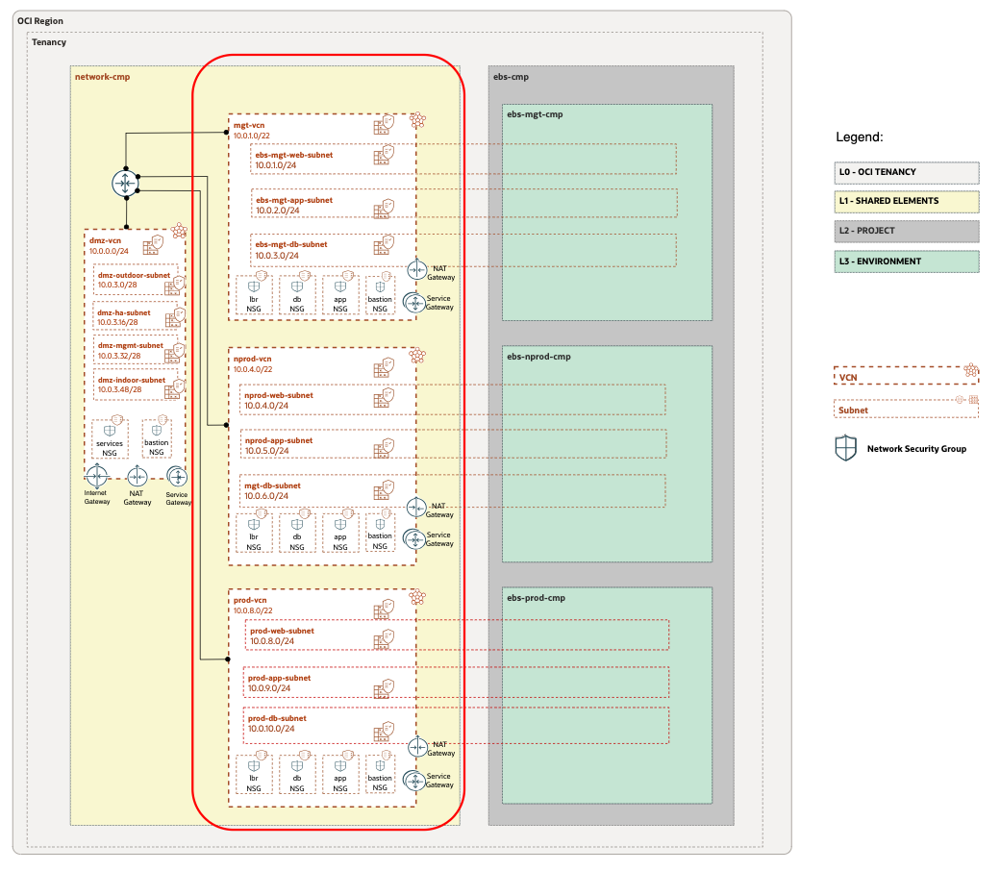

# OP.02 - Manage EBS Landing Zone Extension

## **Table of Contents**

[1. Summary](#1-summary)</br>
[2. Setup IAM Configuration](#2-setup-iam-configuration)</br>
[3. Setup Network Configuration](#3-setup-network-configuration)</br>
[4. Run with ORM](#4-run-with-orm)</br>
[5. Run with TF CLI](#5-run-with-terraform-cli)</br>
[6. Known Issues](#6-known-issues)</br>


&nbsp; 

## **1. Summary**

| |  |
|---|---| 
| **OP. ID** | OP.02 |
| **OP. NAME** |  Manage EBS Landing Zone Extension | 
| **OBJECTIVE** | Provision/change OCI EBS Landing Zone IAM and Network Extensions. |
| **TARGET RESOURCES** | - **Security**: Compartments, Groups, Policies</br>- **Network**: Spoke VCNs, Route tables, Security Lists  |
| **IAM CONFIGURATION**| [ebs_identity_cmp_grp_pl_v1.auto.tfvars.json](/workload-extensions/ebs/op02-manage-ebs-lz-extension/json/ebs_identity_cmp_grp_pl_v1.auto.tfvars.json)|
| **NETWORK CONFIGURATION** |[ebs_network_rt_sl_v1.auto.tfvars.json](/workload-extensions/ebs/op02-manage-ebs-lz-extension/json/ebs_network_rt_sl_v1.auto.tfvars.json) |
| **PRE-ACTIVITIES** | Execute [OP.01. Deploy OCI CIS LZ](/workload-extensions/ebs/op01-deploy-CIS/readme.md)  |
| **POST-ACTIVITIES** | Execute [OP.03 Manual Changes](/workload-extensions/ebs/op03-manual-changes/readme.md) |
| **RUN OPERATION** | Use [ORM](#4-run-with-orm) or use [Terraform CLI](#5-run-with-terraform-cli). |

&nbsp; 

## **2. Setup IAM Configuration**

For configuring and running the Open LZ EBS extension IAM layer use the following JSON file: [ebs_identity_cmp_grp_pl_v1.auto.tfvars.json](/workload-extensions/ebs/op02-manage-ebs-lz-extension/json/ebs_identity_cmp_grp_pl_v1.auto.tfvars.json) You can customize this configuration to fit your exact OCI IAM topology.

This configuration file will cover the following three categories of resources described in the next sections.

This configuration file will require changes to reference the OCIDs of the CIS Landing Zone resources which were deployed in OP01.
Search for the values indicated below and replace with the correct OCIDs:

| Resource | OCID Text to Replace | Description |
|---|---|---|
| Root Compartment | \<OCID-COMPARTMENT-ROOT> | The root compartment OCID for the tenancy

&nbsp; 

###  **2.1. Compartments**

The diagram below identifies the compartments in the scope of this operation.
&nbsp; 

&nbsp; 

The corresponding json configuration for the compartment topology described above is: 

Example of a compartment structure creation:
```
    "compartments_configuration": {
        "enable_delete": "true",
        "default_parent_id": "<OCID-COMPARTMENT-ROOT>",
        "compartments": {
            "CMP-EBS-KEY": {
                "name": "ebs-cmp",
                "description": "EBS compartment for all resources related to EBS",
                "parent_id": "<OCID-COMPARTMENT-ROOT>",
                "defined_tags": null,
                "freeform_tags": null,
                "children": {
                    "CMP-EBS-PROD-KEY": {
                        "name": "ebs-prod-cmp",
                        "description": "EBS prod compartment",
                        "defined_tags": null,
                        "freeform_tags": {}
                    },
                    "CMP-EBS-NPROD-KEY": {
                        "name": "ebs-nprod-cmp",
                        "description": "EBS non prod compartment",
                        "defined_tags": null,
                        "freeform_tags": {}
                    },
                    "CMP-EBS-MGT-KEY": {
                        "name": "ebs-mgt-cmp",
                        "description": "EBS management compartment",
                        "defined_tags": null,
                        "freeform_tags": {}
                    }
                }
            }
        }
    },
```

For extended documentation please refer to the [Identity & Access Management CIS Terraform module compartments example](https://github.com/oracle-quickstart/terraform-oci-cis-landing-zone-iam/blob/main/compartments/examples/vision/input.auto.tfvars.template).

&nbsp; 

### **2.2 Groups**

The diagram below identifies the groups in the scope of this operation.

&nbsp; 

&nbsp; 

Example of a group creation:
```
    "groups_configuration": {
        "default_defined_tags": null,
        "default_freeform_tags": null,
        "groups": {
            "ebs-prod-admin-group": {
                "name": "ebs-prod-admin-group",
                "description": "EBS extension group for ebs prod management"
            },
            "ebs-nprod-admin-group": {
                "name": "ebs-nprod-admin-group",
                "description": "EBS extension group for ebs Non prod management"
            },
            "ebs-mgt-admin-group": {
                "name": "ebs-mgt-admin-group",
                "description": "EBS extension group for ebs management"
            }
        }
    },
```

This automation provides fully supports any kind of OCI IAM Groups topology to be specified in the json format. 
For an example of such configuration and for extended documentation please refer to the [Identity & Access Management CIS Terraform module groups example](https://github.com/oracle-quickstart/terraform-oci-cis-landing-zone-iam/blob/main/groups/examples/vision/input.auto.tfvars.template).

&nbsp; 


### **2.3 Policies**

Example of policy creation:
```
    "policies_configuration": {
        "supplied_policies": {
            "ebs-prod-admin-policy": {
                "name": "ebs-prod-admin-policy",
                "description": "ebs prod policy",
                "compartment_id": "<OCID-COMPARTMENT-ROOT>",
                "statements": [
                    "allow group ebs-prod-admin-group to read all-resources in compartment ebs-cmp:ebs-prod-cmp",
                    "allow group ebs-prod-admin-group to manage instance-family in compartment ebs-cmp:ebs-prod-cmp",
                    "allow group ebs-prod-admin-group to manage database-family in compartment ebs-cmp:ebs-prod-cmp",
                    "allow group ebs-prod-admin-group to manage load-balancers in compartment ebs-cmp:ebs-prod-cmp",
                    "allow group ebs-prod-admin-group to manage volume-family in compartment ebs-cmp:ebs-prod-cmp",
                    "allow group ebs-prod-admin-group to manage tag-namespaces in compartment ebs-cmp:ebs-prod-cmp",
                    "allow group ebs-prod-admin-group to manage alarms in compartment ebs-cmp:ebs-prod-cmp",
                    "allow group ebs-prod-admin-group to manage metrics in compartment ebs-cmp:ebs-prod-cmp",
                    "allow group ebs-prod-admin-group to manage object-family in compartment ebs-cmp:ebs-prod-cmp",
                    "allow group ebs-prod-admin-group to manage orm-stacks in compartment ebs-cmp:ebs-prod-cmp",
                    "allow group ebs-prod-admin-group to manage orm-jobs in compartment ebs-cmp:ebs-prod-cmp",
                    "allow group ebs-prod-admin-group to manage orm-config-source-providers in compartment ebs-cmp:ebs-prod-cmp",
                    "allow group ebs-prod-admin-group to read audit-events in compartment ebs-cmp:ebs-prod-cmp",
                    "allow group ebs-prod-admin-group to read work-requests in compartment ebs-cmp:ebs-prod-cmp",
                    "allow group ebs-prod-admin-group to manage bastion-session in compartment ebs-cmp:ebs-prod-cmp",
                    "allow group ebs-prod-admin-group to read instance-agent-plugins in compartment ebs-cmp:ebs-prod-cmp",
                    "allow group ebs-prod-admin-group to manage functions-family in compartment ebs-cmp:ebs-prod-cmp",
                    "allow group ebs-prod-admin-group to manage api-gateway-family in compartment ebs-cmp:ebs-prod-cmp",
                    "allow group ebs-prod-admin-group to manage ons-family in compartment ebs-cmp:ebs-prod-cmp",
                    "allow group ebs-prod-admin-group to manage streams in compartment ebs-cmp:ebs-prod-cmp",
                    "allow group ebs-prod-admin-group to manage cluster-family in compartment ebs-cmp:ebs-prod-cmp",
                    "allow group ebs-prod-admin-group to manage logs in compartment ebs-cmp:ebs-prod-cmp",
                    "allow group ebs-prod-admin-group to manage object-family in compartment ebs-cmp:ebs-prod-cmp",
                    "allow group ebs-prod-admin-group to manage repos in compartment ebs-cmp:ebs-prod-cmp",
                    "allow group ebs-prod-admin-group to manage cloudevents-rules in compartment ebs-cmp:ebs-prod-cmp"
                ]
            },
            "ebs-nprod-admin-policy": {
                "name": "ebs-nprod-admin-policy",
                "description": "ebs non prod policy",
                "compartment_id": "<OCID-COMPARTMENT-ROOT>",
                "statements": [
                    "allow group ebs-nprod-admin-group to read all-resources in compartment ebs-cmp:ebs-nprod-cmp",
                    "allow group ebs-nprod-admin-group to manage instance-family in compartment ebs-cmp:ebs-nprod-cmp",
                    "allow group ebs-nprod-admin-group to manage database-family in compartment ebs-cmp:ebs-nprod-cmp",
                    "allow group ebs-nprod-admin-group to manage load-balancers in compartment ebs-cmp:ebs-nprod-cmp",
                    "allow group ebs-nprod-admin-group to manage volume-family in compartment ebs-cmp:ebs-nprod-cmp",
                    "allow group ebs-nprod-admin-group to manage tag-namespaces in compartment ebs-cmp:ebs-nprod-cmp",
                    "allow group ebs-nprod-admin-group to manage alarms in compartment ebs-cmp:ebs-nprod-cmp",
                    "allow group ebs-nprod-admin-group to manage metrics in compartment ebs-cmp:ebs-nprod-cmp",
                    "allow group ebs-nprod-admin-group to manage object-family in compartment ebs-cmp:ebs-nprod-cmp",
                    "allow group ebs-nprod-admin-group to manage orm-stacks in compartment ebs-cmp:ebs-nprod-cmp",
                    "allow group ebs-nprod-admin-group to manage orm-jobs in compartment ebs-cmp:ebs-nprod-cmp",
                    "allow group ebs-nprod-admin-group to manage orm-config-source-providers in compartment ebs-cmp:ebs-nprod-cmp",
                    "allow group ebs-nprod-admin-group to read audit-events in compartment ebs-cmp:ebs-nprod-cmp",
                    "allow group ebs-nprod-admin-group to read work-requests in compartment ebs-cmp:ebs-nprod-cmp",
                    "allow group ebs-nprod-admin-group to manage bastion-session in compartment ebs-cmp:ebs-nprod-cmp",
                    "allow group ebs-nprod-admin-group to read instance-agent-plugins in compartment ebs-cmp:ebs-nprod-cmp",
                    "allow group ebs-nprod-admin-group to manage functions-family in compartment ebs-cmp:ebs-nprod-cmp",
                    "allow group ebs-nprod-admin-group to manage api-gateway-family in compartment ebs-cmp:ebs-nprod-cmp",
                    "allow group ebs-nprod-admin-group to manage ons-family in compartment ebs-cmp:ebs-nprod-cmp",
                    "allow group ebs-nprod-admin-group to manage streams in compartment ebs-cmp:ebs-nprod-cmp",
                    "allow group ebs-nprod-admin-group to manage cluster-family in compartment ebs-cmp:ebs-nprod-cmp",
                    "allow group ebs-nprod-admin-group to manage logs in compartment ebs-cmp:ebs-nprod-cmp",
                    "allow group ebs-nprod-admin-group to manage object-family in compartment ebs-cmp:ebs-nprod-cmp",
                    "allow group ebs-nprod-admin-group to manage repos in compartment ebs-cmp:ebs-nprod-cmp",
                    "allow group ebs-nprod-admin-group to manage cloudevents-rules in compartment ebs-cmp:ebs-nprod-cmp"
                ]
            },
            "ebs-mgt-admin-policy": {
                "name": "ebs-mgt-admin-policy",
                "description": "ebs mngmt policy",
                "compartment_id": "<OCID-COMPARTMENT-ROOT>",
                "statements": [
                    "allow group ebs-mgt-admin-group to read all-resources in compartment ebs-cmp:ebs-mgt-cmp",
                    "allow group ebs-mgt-admin-group to manage instance-family in compartment ebs-cmp:ebs-mgt-cmp",
                    "allow group ebs-mgt-admin-group to manage database-family in compartment ebs-cmp:ebs-mgt-cmp",
                    "allow group ebs-mgt-admin-group to manage load-balancers in compartment ebs-cmp:ebs-mgt-cmp",
                    "allow group ebs-mgt-admin-group to manage volume-family in compartment ebs-cmp:ebs-mgt-cmp",
                    "allow group ebs-mgt-admin-group to manage tag-namespaces in compartment ebs-cmp:ebs-mgt-cmp",
                    "allow group ebs-mgt-admin-group to manage alarms in compartment ebs-cmp:ebs-mgt-cmp",
                    "allow group ebs-mgt-admin-group to manage metrics in compartment ebs-cmp:ebs-mgt-cmp",
                    "allow group ebs-mgt-admin-group to manage object-family in compartment ebs-cmp:ebs-mgt-cmp",
                    "allow group ebs-mgt-admin-group to manage orm-stacks in compartment ebs-cmp:ebs-mgt-cmp",
                    "allow group ebs-mgt-admin-group to manage orm-jobs in compartment ebs-cmp:ebs-mgt-cmp",
                    "allow group ebs-mgt-admin-group to manage orm-config-source-providers in compartment ebs-cmp:ebs-mgt-cmp",
                    "allow group ebs-mgt-admin-group to read audit-events in compartment ebs-cmp:ebs-mgt-cmp",
                    "allow group ebs-mgt-admin-group to read work-requests in compartment ebs-cmp:ebs-mgt-cmp",
                    "allow group ebs-mgt-admin-group to manage bastion-session in compartment ebs-cmp:ebs-mgt-cmp",
                    "allow group ebs-mgt-admin-group to read instance-agent-plugins in compartment ebs-cmp:ebs-mgt-cmp",
                    "allow group ebs-mgt-admin-group to manage functions-family in compartment ebs-cmp:ebs-mgt-cmp",
                    "allow group ebs-mgt-admin-group to manage api-gateway-family in compartment ebs-cmp:ebs-mgt-cmp",
                    "allow group ebs-mgt-admin-group to manage ons-family in compartment ebs-cmp:ebs-mgt-cmp",
                    "allow group ebs-mgt-admin-group to manage streams in compartment ebs-cmp:ebs-mgt-cmp",
                    "allow group ebs-mgt-admin-group to manage cluster-family in compartment ebs-cmp:ebs-mgt-cmp",
                    "allow group ebs-mgt-admin-group to manage logs in compartment ebs-cmp:ebs-mgt-cmp",
                    "allow group ebs-mgt-admin-group to manage object-family in compartment ebs-cmp:ebs-mgt-cmp",
                    "allow group ebs-mgt-admin-group to manage repos in compartment ebs-cmp:ebs-mgt-cmp",
                    "allow group ebs-mgt-admin-group to manage cloudevents-rules in compartment ebs-cmp:ebs-mgt-cmp"
                ]
            },
            "ebs-network-admin-policy": {
                "name": "ebs-network-admin-policy",
                "description": "ebs network policy",
                "compartment_id": "<OCID-COMPARTMENT-ROOT>",
                "statements": [
                    "allow group ebs-mgt-admin-group, ebs-prod-admin-group, ebs-nprod-admin-group to read virtual-network-family in compartment network-cmp",
                    "allow group ebs-mgt-admin-group, ebs-prod-admin-group, ebs-nprod-admin-groupto use vnics in compartment network-cmp",
                    "allow group ebs-mgt-admin-group, ebs-prod-admin-group, ebs-nprod-admin-group to manage private-ips in compartment network-cmp",
                    "allow group ebs-mgt-admin-group, ebs-prod-admin-group, ebs-nprod-admin-groupto use subnets in compartment network-cmp",
                    "allow group ebs-mgt-admin-group, ebs-prod-admin-group, ebs-nprod-admin-group to use network-security-groups in compartment network-cmp"
                ]
            },
            "ebs-security-admin-policy": {
                "name": "ebs-security-admin-policy",
                "description": "ebs security policy",
                "compartment_id": "<OCID-COMPARTMENT-ROOT>",
                "statements": [
                    "allow group ebs-mgt-admin-group, ebs-prod-admin-group, ebs-nprod-admin-group to read vss-family in compartment security-cmp",
                    "allow group ebs-mgt-admin-group, ebs-prod-admin-group, ebs-nprod-admin-group to use vaults in compartment security-cmp",
                    "allow group ebs-mgt-admin-group, ebs-prod-admin-group, ebs-nprod-admin-group to read logging-family in compartment security-cmp",
                    "allow group ebs-mgt-admin-group, ebs-prod-admin-group, ebs-nprod-admin-group to use bastion in compartment security-cmp",
                    "allow group ebs-mgt-admin-group, ebs-prod-admin-group, ebs-nprod-admin-group to manage bastion-session in compartment security-cmp",
                    "allow group ebs-mgt-admin-group, ebs-prod-admin-group, ebs-nprod-admin-group to inspect keys in compartment security-cmp",
                    "allow group ebs-mgt-admin-group, ebs-prod-admin-group, ebs-nprod-admin-group to manage cloudevents-rules in compartment security-cmp",
                    "allow group ebs-mgt-admin-group, ebs-prod-admin-group, ebs-nprod-admin-group to manage alarms in compartment security-cmp",
                    "allow group ebs-mgt-admin-group, ebs-prod-admin-group, ebs-nprod-admin-group to manage metrics in compartment security-cmp",
                    "allow group ebs-mgt-admin-group, ebs-prod-admin-group, ebs-nprod-admin-group to read instance-agent-plugins in compartment security-cmp"
                ]
            },
            "ebs-root-admin-policy": {
                "name": "ebs-root-admin-policy",
                "description": "ebs root policy",
                "compartment_id": "<OCID-COMPARTMENT-ROOT>",
                "statements": [
                    "allow group ebs-mgt-admin-group, ebs-prod-admin-group, ebs-nprod-admin-group to inspect compartments in tenancy",
                    "allow group ebs-mgt-admin-group, ebs-prod-admin-group, ebs-nprod-admin-group to inspect users in tenancy",
                    "allow group ebs-mgt-admin-group, ebs-prod-admin-group, ebs-nprod-admin-group to inspect groups in tenancy",
                    "allow group ebs-mgt-admin-group, ebs-prod-admin-group, ebs-nprod-admin-group to use tag-namespaces in tenancy where target.tag-namespace.name='Oracle-Tags'",
                    "allow group ebs-mgt-admin-group, ebs-prod-admin-group, ebs-nprod-admin-group to use tag-namespaces in tenancy where target.tag-namespace.name='Operations'",
                    "allow group ebs-mgt-admin-group, ebs-prod-admin-group, ebs-nprod-admin-group to use cloud-shell in tenancy",
                    "allow group ebs-mgt-admin-group, ebs-prod-admin-group, ebs-nprod-admin-group to read usage-budgets in tenancy",
                    "allow group ebs-mgt-admin-group, ebs-prod-admin-group, ebs-nprod-admin-group to read usage-reports in tenancy",
                    "allow group ebs-mgt-admin-group, ebs-prod-admin-group, ebs-nprod-admin-group to manage app-catalog-listing in tenancy",
                    "allow group ebs-mgt-admin-group, ebs-prod-admin-group, ebs-nprod-admin-group to inspect dynamic-groups in tenancy",
                    "allow group ebs-mgt-admin-group, ebs-prod-admin-group, ebs-nprod-admin-group to read app-catalog-listing in compartment ebs-cmp",
                    "allow group ebs-mgt-admin-group, ebs-prod-admin-group, ebs-nprod-admin-group to read instance-images in compartment ebs-cmp",
                    "allow group ebs-mgt-admin-group, ebs-prod-admin-group, ebs-nprod-admin-group to read repos in compartment ebs-cmp"
                ]
            }
        }
    }
```

**Note**: For each policy select your desired compartment_id

This automation fully supports any type of OCI IAM Policy to be specified in the json format. 
For an example of such configuration and for extended documentation please refer to the [Identity & Access Management CIS Terraform module policies examples](https://github.com/oracle-quickstart/terraform-oci-cis-landing-zone-iam/tree/main/policies/examples).


&nbsp; 

## **3. Setup Network Configuration**


For configuring and running the Open LZ EBS extension Network layer use the following JSON file: [ebs_network_rt_sl_v1.auto.tfvars.json](/workload-extensions/ebs/op02-manage-ebs-lz-extension/json/ebs_network_rt_sl_v1.auto.tfvars.json)

This configuration file will require changes to the resources to reference the OCIDs of the CIS Landing Zone which were deployed in OP01.
Search for the values indicated below and replace with the correct OCIDs:

| Resource         | OCID Text to Replace | Description |
|------------------|----------------------|-------------|
| VCN | \<OCID-VCN-HUB> | The OCID of the Hub VCN deployed by CIS: "dmz-vcn"
| Network Compartment | \<OCID-COMPARTMENT-NETWORK> | The OCID of the CIS Network Compartment: "network-cmp"
| Service Gateway | \<OCID-SERVICE-GATEWAY-HUB> | The OCID of the Hub Service Gateway deployed by CIS 
| Internet Gateway | \<OCID-INTERNET-GATEWAY-HUB> | The OCID of the Hub Internet Gateway deployed by CIS 
| Dynamic Routing Gateway | \<OCID-DYNAMIC-ROUTING-GATEWAY> | The OCID of the DRG deployed by CIS 
| DRG Route Table | \<OCID-DRG-ROUTE_TABLE> | The OCID of the DRG VCN Route Table deployed by CIS: "Autogenerated Drg Route Table for VCN attachments"

&nbsp; 

This configuration covers the following networking diagram. 

&nbsp; 



For complete documentation and a larger set of examples on configuring an OCI networking topology using this json terraform automation approach please refer to the [OCI CIS Terraform Networking Module](https://github.com/oci-landing-zones/terraform-oci-modules-networking) documentation and examples.

The network layer covers the next resources:

###  **3.1. Spoke VCNs**

OCI defines network resources in a hierarchy. This means that subnets, route tables, security lists, or gateways will depend on a specific VCN.
We will create three Spokes VCNs (VCN.02,VCN.03,VCN.04)

Example of a VCN creation:

```
"vcns": {
    "VCN-EBS-MGT-KEY": {
        "compartment_id": "<OCID-COMPARTMENT-NETWORK>",
        "block_nat_traffic": true,
        "cidr_blocks": [
            "10.0.1.0/24"
        ],
        "display_name": "ebs-mgt-vcn",
        "dns_label": "ebsmgtvcn",
        "is_attach_drg": true,
        "is_create_igw": false,
        "is_ipv6enabled": false,
        "is_oracle_gua_allocation_enabled": false,
        "route_tables": {},
        "security_lists": {},
        "subnets": {},
        "vcn_specific_gateways": {},
}
```
**Note**: 
* Change compartment_id with the ocid of the network compartment. **network-cmp ( CMP-02 )**


###  **4.2. Subnets**

We will create a three-layer configuration, adding three subnets per vcn.

Example of a Subnet creation:

```
"subnets": {
    "SN-MGT-WEB-KEY": {
        "compartment_id": "<OCID-COMPARTMENT-NETWORK>",
        "availability_domain": null,
        "cidr_block": "10.0.1.0/26",
        "dhcp_options_key": "default_dhcp_options",
        "display_name": "ebs-mgt-web-subnet",
        "dns_label": "ebsmgtwebsn",
        "prohibit_internet_ingress": true,
        "prohibit_public_ip_on_vnic": true,
        "route_table_key": "RT-MGT-WEB-VCN-KEY",
        "security_list_keys": [
            "SL-MGT-WEB-VCN-KEY"
        ]
    },
```
**Note**: 
* Change compartment_id with the ocid of the network compartment. **network-cmp ( CMP-02 )**
* Add route_table_key and security_list_keys to assign the desired route tables and security list to each subnet.


###  **3.3. Gateways**

We will add a Service Gateway and a NAT Gateway per spoke VCN.

Example of a Service Gateway and NAT Gateway creation:

```
"vcn_specific_gateways": {
    "service_gateways": {
        "SG-EBS-MGT-KEY": {
            "compartment_id": "<OCID-COMPARTMENT-NETWORK>",
            "display_name": "ebs-mgt-sgw",
            "services": "objectstorage"
        }
    },
    "nat_gateways": {
        "NG-EBS-MGT-KEY": {
            "compartment_id": "<OCID-COMPARTMENT-NETWORK>",
            "display_name": "ebs-mgt-ngw"
        }
    }
}
```
**Note**: Change compartment_id with the ocid of the network compartment. **network-cmp ( CMP-02 )**


###  **3.4. Security Lists**

We will create one SL per subnet. (SL.5,SL.6,SL.7,SL.8,SL.9,SL.10,SL.11,SL.12,SL.13)

Example of a Security List creation:

```
"security_lists": {
    "SL-MGT-WEB-VCN-KEY": {
        "compartment_id": "<OCID-COMPARTMENT-NETWORK>",
        "display_name": "ebs-mgt-web-subnet-security-list",
        "defined_tags": null,
        "freeform_tags": null,
        "egress_rules": [
            {
                "description": "Any egress from ebs-mgt-web-subnet",
                "dst": "0.0.0.0/0",
                "dst_type": "CIDR_BLOCK",
                "protocol": "TCP",
                "stateless": false
            }
        ],
        "ingress_rules": [
            {
                "description": "SSL External access to ebsmgt UI via LBR",
                "dst_port_max": 443,
                "dst_port_min": 443,
                "protocol": "TCP",
                "src": "0.0.0.0/0",
                "src_type": "CIDR_BLOCK",
                "stateless": false
            }
        ]
    }
},
```
**Note**: Change compartment_id with the ocid of the network compartment. **network-cmp ( CMP-02 )**


###  **3.5. Route Tables**

We need to create Route tables in the spoke VCNs (RT.9, RT.10, RT.11, RT.12, RT.13, RT.14, RT.15, RT.16, RT.17):

Example of a Route table creation:

```
"route_tables": {
    "RT-MGT-WEB-VCN-KEY": {
        "compartment_id": "<OCID-COMPARTMENT-NETWORK>",
        "display_name": "ebs-mgt-web-subnet-rtable",
        "route_rules": {
            "sgw_route": {
                "network_entity_key": "SG-EBS-MGT-KEY",
                "description": "Route for sgw",
                "destination": "all-services",
                "destination_type": "SERVICE_CIDR_BLOCK"
            },
            "ngw_route": {
                "network_entity_key": "NG-EBS-MGT-KEY",
                "description": "Route to ngw for EBS object storage location",
                "destination": "134.70.0.0/16",
                "destination_type": "CIDR_BLOCK"
            },
            "drg_route_1": {
                "description": "ebs-mgt-vcn to ebs-nprod-vcn VCN",
                "destination": "10.0.4.0/22",
                "destination_type": "CIDR_BLOCK",
                "network_entity_id": "<OCID-DYNAMIC-ROUTING-GATEWAY>"
            },
            "drg_route_2": {
                "description": "ebs-mgt-vcn to ebs-prod-vcn VCN",
                "destination": "10.0.8.0/22",
                "destination_type": "CIDR_BLOCK",
                "network_entity_id": "<OCID-DYNAMIC-ROUTING-GATEWAY>"
            }
        }
    },
```
**Note**: 
* Change compartment_id with the ocid of the network compartment. **network-cmp ( CMP-02 )**
* Change network_entity_id in route rules to the corresponding service gateways ids or drg ids.


Also, we need to inject route tables in the Hub VCN (RT.5, RT.6, RT.7, RT.8): 

Example of a Route table injection:

```
"inject_into_existing_vcns": {
"VCN-HUB-KEY": {
"vcn_id": "<OCID-VCN-HUB>",
"route_tables": {
"RT-DMZ-MGMT-KEY": {
    "compartment_id": "<OCID-COMPARTMENT-NETWORK>",
    "display_name": "dmz1-mgmt-subnet-rtable",
    "defined_tags": null,
    "freeform_tags": null,
    "route_rules": {
        "sgw_route": {
            "network_entity_id": "<OCID-SERVICE-GATEWAY-HUB>",
            "description": "Route for sgw",
            "destination": "objectstorage",
            "destination_type": "SERVICE_CIDR_BLOCK"
        },
        "igw_route": {
            "description": "Traffic destined to 0.0.0.0/0 CIDR range goes to Internet Gateway.",
            "destination": "0.0.0.0/0",
            "destination_type": "CIDR_BLOCK",
            "network_entity_id": "<OCID-INTERNET-GATEWAY-HUB>"
        },
        "drg_route_1": {
            "description": "Traffic destined to ebs-mgt-vcn VCN goes to DRG.",
            "destination": "10.0.1.0/24",
            "destination_type": "CIDR_BLOCK",
            "network_entity_id": "<OCID-DYNAMIC-ROUTING-GATEWAY>"
        },
        "drg_route_2": {
            "description": "Traffic destined to ebs-nprod-vcn VCN goes to DRG.",
            "destination": "10.0.4.0/22",
            "destination_type": "CIDR_BLOCK",
            "network_entity_id": "<OCID-DYNAMIC-ROUTING-GATEWAY>"
        },
        "drg_route_3": {
            "description": "Traffic destined to ebs-prod-vcn VCN goes to DRG.",
            "destination": "10.0.8.0/22",
            "destination_type": "CIDR_BLOCK",
            "network_entity_id": "<OCID-DYNAMIC-ROUTING-GATEWAY>"
        }
    }
},
```

**Note**: 
* Change vcn_ocid with the ocid of the Hub VCN.
* Change compartment_id with the ocid of the network compartment. **network-cmp ( CMP-02 )**
* Change network_entity_id in route rules to the corresponding internet gateways, service gateways ids or drg ids.


###  **3.6. DRG Attachements**

We need to add new DRG attachments (DRGA.02, DRGA.03, DRGA.04) to the DRG ( DRG.01) created by the CIS LZ (OP#01)

Example of a DRG attachment creation:

```
"drgattach": {
    "non_vcn_specific_gateways": {
        "inject_into_existing_drgs": {
            "DRG-KEY": {
                "drg_id": "<OCID-DYNAMIC-ROUTING-GATEWAY>",
                "drg_attachments": {
                    "DRG-VCN-EBS-MGT-KEY": {
                        "defined_tags": null,
                        "display_name": "ebs-mgt-vcn-drg-attachment",
                        "freeform_tags": null,
                        "drg_route_table_id": "<OCID-DRG-ROUTE_TABLE>",
                        "drg_route_table_name": null,
                        "network_details": {
                            "attached_resource_id": null,
                            "attached_resource_key": "VCN-EBS-MGT-KEY",
                            "type": "VCN",
                            "route_table_id": null,
                            "route_table_name": null,
                            "vcn_route_type": null
                        }
                    }
                }
            }
        }
    }
}
```

**Note**: 
* Change drg_route_table_id with the ocid of the DRG VCN Route Table deployed by CIS: "Autogenerated Drg Route Table for VCN attachments"

## **4. Run with ORM**

| STEP |  ACTION |
|---|---| 
| **1** | [](https://cloud.oracle.com/resourcemanager/stacks/create?zipUrl=https://github.com/oci-landing-zones/terraform-oci-modules-orchestrator/archive/refs/tags/v2.0.0.zip&zipUrlVariables={"input_config_files_urls":"https://raw.githubusercontent.com/oracle-quickstart/terraform-oci-open-lz/master/workload-extensions/ebs/op02-manage-ebs-lz-extension/json/ebs_identity_cmp_grp_pl_v1.auto.tfvars.json,https://raw.githubusercontent.com/oracle-quickstart/terraform-oci-open-lz/master/workload-extensions/ebs/op02-manage-ebs-lz-extension/json/ebs_network_rt_sl_v1.auto.tfvars.json"}) |
| **2** | Accept terms,  wait for the configuration to load. |
| **3** | Set the working directory to “orm-facade”. | 
| **4** | Set the stack name you prefer. | 
| **5** | Set the terraform version to 1.2.x. Click Next. | 
| **6** | Update with the links to your IAM and Network configurations. Click Next. |
| **7** | Un-check run apply. Click Create. 

&nbsp; 


## **5. Run with Terraform CLI**
&nbsp; 

### **5.1 Setup Terraform Authentication**

For authenticating against the OCI tenancy terraform execute the following [instructions](/commons/content/terraform_authentication.md).


&nbsp; 

### **5.2 Clone this Git repo to your Machine**

```
git clone git@github.com:oracle-quickstart/terraform-oci-open-lz.git
```

&nbsp; 

### **5.3 Clone the orchestrator Git repo to your Machine**

Cloning the latest version:
```
git clone git@github.com:oracle-quickstart/terraform-oci-landing-zones-orchestrator.git
```

&nbsp; 

###  **5.4 Change the Directory to the Terraform Orchestrator Module**

Change the directory to the *terraform-oci-landing-zones-orchestrator* Terraform orchestrator module.

&nbsp; 

### **5.5 Run ```terraform init```**

Run ```terraform init``` to download all the required external terraform providers and Terraform modules.

&nbsp; 

 ### **5.6 Run ```terraform plan```**

Run ```terraform plan``` with the IAM and Network configuration.

```
terraform plan \
-var-file ../terraform-oci-open-lz/commons/content/oci-credentials.tfvars.json \
-var-file ../terraform-oci-open-lz/workload-extensions/ebs/op02-manage-ebs-lz-extension/json/ebs_identity_cmp_grp_pl_v1.auto.tfvars.json \
-var-file ../terraform-oci-open-lz/workload-extensions/ebs/op02-manage-ebs-lz-extension/json/ebs_network_rt_sl_v1.auto.tfvars.json \
-state ../terraform-oci-open-lz/workload-extensions/ebs/op02-manage-ebs-lz-extension/terraform.tfstate
```

After the execution please analyze the output of the command above and check if it corresponds to your desired configuration.

Note that the ```terraform.tfstate``` file is generated in the configuration location and not in the terraform code location. This is the expected configuration as the terraform automation can support any number of configurations and the **state file** will belong to the configuration and not to the code.
  
The ideal scenario regarding the **state file** will be for each configuration to have a corresponding OCI Object Storage location for the state file. For more details on the Terraform state file recommended configuration please refer to the following [documentation](https://docs.oracle.com/en-us/iaas/Content/API/SDKDocs/terraformUsingObjectStore.htm).

&nbsp; 

### **5.7 Run ```terraform apply```**

Run terraform plan with the IAM and Network configuration. After  its execution the configured resources will be provisioned or updated on OCI.

```
terraform apply \
-var-file ../terraform-oci-open-lz/workload-extensions/ebs/op02-manage-ebs-lz-extension/json/oci-credentials.tfvars.json \
-var-file ../terraform-oci-open-lz/workload-extensions/ebs/op02-manage-ebs-lz-extension/json/ebs_identity_cmp_grp_pl_v1.auto.tfvars.json \
-var-file ../terraform-oci-open-lz/workload-extensions/ebs/op02-manage-ebs-lz-extension/json/ebs_network_rt_sl_v1.auto.tfvars.json \
-state ../terraform-oci-open-lz/workload-extensions/ebs/op02-manage-ebs-lz-extension/terraform.tfstate
```

## **6. Known Issues**

### **6.1 ```Policy error```**

```
400-InvalidParameter, Compartment {ebs-cmp:ebs-nprod-cmp} does not exist or is not part of the policy compartment subtree
│ Suggestion: Please update the parameter(s) in the Terraform config as per error message Compartment {ebs-cmp:ebs-nprod-cmp} does not exist or is not part of the policy compartment subtree
│ Documentation: https://registry.terraform.io/providers/oracle/oci/latest/docs/resources/identity_policy 
│ API Reference: https://docs.oracle.com/iaas/api/#/en/identity/20160918/Policy/CreatePolicy 
│ Request Target: POST https://identity.eu-frankfurt-1.oci.oraclecloud.com/20160918/policies 
│ Provider version: 5.15.0, released on 2023-10-04. This provider is 2 Update(s) behind to current. 
│ Service: Identity Policy 
│ Operation Name: CreatePolicy 
│ OPC request ID: 33ff328d7fe0175638e619bc27211854/3CD31809CBAC9EE12C6BE5D040D4D4E7/582906BF0BCFBB09FC88552AC6275DF7 
│ 
│ 
│   with module.cislz_policies.oci_identity_policy.these["ebs-nprod-admin-policy"],
│   on .terraform/modules/cislz_policies/policies/main.tf line 22, in resource "oci_identity_policy" "these":
│   22: resource "oci_identity_policy" "these" {
│ 
```
**Analysis:**
The compartment associated to the policy is not available during policy creation.

**workaround:**
Re-run the apply job.

&nbsp; 

You can proceed to [OP.03 Execute Manual Changes](../op03-manual-changes/).

&nbsp; 

# License

Copyright (c) 2024 Oracle and/or its affiliates.

Licensed under the Universal Permissive License (UPL), Version 1.0.

See [LICENSE](/LICENSE.txt) for more details.
