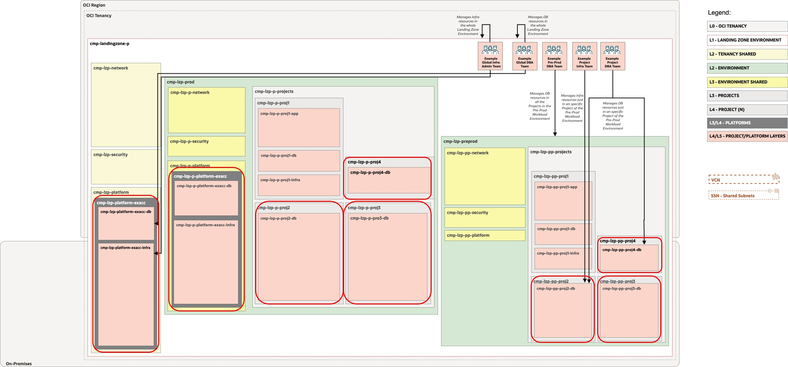
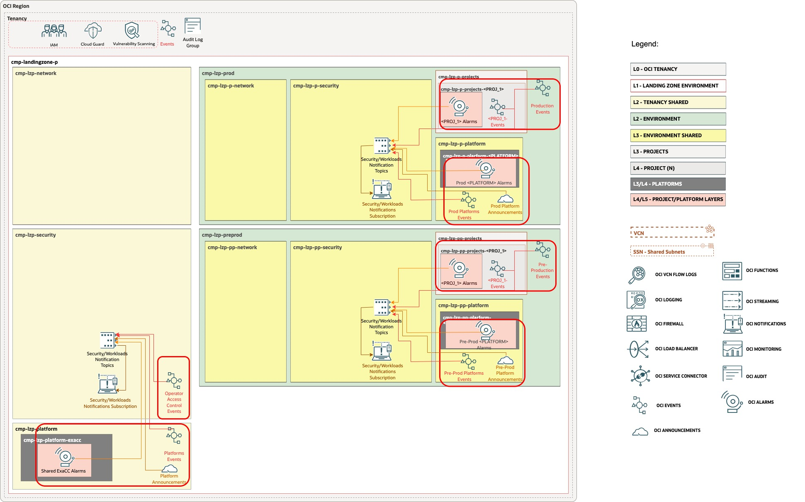

# ExaDB-C@C Workload Extension Set-up <!-- omit from toc -->

## **Table of Contents** <!-- omit from toc -->

- [**1. Summary**](#1-summary)
- [**2. Setup IAM Configuration**](#2-setup-iam-configuration)
  - [**2.1. Compartments**](#21-compartments)
  - [**2.2 Groups**](#22-groups)
  - [**2.3 Policies**](#23-policies)
- [**3. Setup Observability Configuration**](#3-setup-observability-configuration)
- [**4. Deploy**](#4-deploy)

&nbsp; 

## **1. Summary**

|||
|---|---|
| **NAME**                | **ExaDB-C@C Landing Zone Extension** |
| **OBJECTIVE**           | Provision Identity and Monitoring resources |
| **TARGET RESOURCES**    | - **Security**: Compartments, Groups, Policies - **Monitoring**: Events and Alarms |
| **PREREQUISITES**       | A light version, without Networking resources, of the [One-OE](../../../blueprints/one-oe/) Blueprint is deployed as a foundation.    For this example we use:   **IAM, Security, Observability** [**IAM Configuration**](/blueprints/one-oe/runtime/one-stack/oci_open_lz_one-oe_iam.auto.tfvars.json) [**Security Configuration**](/blueprints/one-oe/runtime/one-stack/oci_open_lz_one-oe_security_cisl1.auto.tfvars.json) [**Observability Configuration**](/blueprints/one-oe/runtime/one-stack/oci_open_lz_one-oe_observability_cisl1.auto.tfvars.json)   <a href='https://cloud.oracle.com/resourcemanager/stacks/create?zipUrl=https://github.com/oci-landing-zones/terraform-oci-modules-orchestrator/archive/refs/tags/v2.0.8.zip&zipUrlVariables={"input_config_files_urls":"https://raw.githubusercontent.com/oracle-quickstart/terraform-oci-open-lz/master/blueprints/one-oe/runtime/one-stack/oci_open_lz_one-oe_iam.auto.tfvars.json,https://raw.githubusercontent.com/oracle-quickstart/terraform-oci-open-lz/master/blueprints/one-oe/runtime/one-stack/oci_open_lz_one-oe_observability_cisl1.auto.tfvars.json,https://raw.githubusercontent.com/oracle-quickstart/terraform-oci-open-lz/master/blueprints/one-oe/runtime/one-stack/oci_open_lz_one-oe_security_cisl1.auto.tfvars.json"}'></a> |
| **CONFIGURATION FILES** | - [exacc_identity.auto.tfvars.json](./exacc_identity.auto.tfvars.json)    - [exacc_observability.auto.tfvars.json](./exacc_observability.auto.tfvars.json) |
| **DEPLOYMENT**          | Using [Oracle Resource Manager (ORM)](/commons/content/orm.md):    <a href='https://cloud.oracle.com/resourcemanager/stacks/create?zipUrl=https://github.com/oci-landing-zones/terraform-oci-modules-orchestrator/archive/refs/tags/v2.0.8.zip&zipUrlVariables={"input_config_files_urls":"https://raw.githubusercontent.com/oracle-quickstart/terraform-oci-open-lz/master/workload-extensions/exacc/1_exacc_extension/exacc_identity.auto.tfvars.json,https://raw.githubusercontent.com/oracle-quickstart/terraform-oci-open-lz/master/workload-extensions/exacc/1_exacc_extension/exacc_observability.auto.tfvars.json"}'></a>  Using: [Terraform CLI](/commons/content/terraform.md).            |

&nbsp; 

## **2. Setup IAM Configuration**

For configuring and running the One-OE Landing Zone ExaDB-C@C extension Identity Layer, use the following JSON file: [exacc_identity.auto.tfvars.json](./exacc_identity.auto.tfvars.json). You can customize this configuration to fit your exact OCI IAM topology.

This configuration file covers three categories of resources described in the next sections.

This configuration file requires changes to reference the OCIDs of the One-OE Landing Zone resources which were deployed in [One-OE Landing Zone](../../../blueprints/one-oe/) set-up. 

If you used the [orchestrator external dependencies](https://github.com/oci-landing-zones/terraform-oci-modules-orchestrator?tab=readme-ov-file#external-dependencies), saving the outputs while deploying your baseline One-OE stack, you will not need to replace any of the following text string with OCIDs. All you need to do is to configure your extension stack with the dependencies of the saved *IAM output* from the One-OE deployment stack.

Search for the values indicated below and replace with the correct OCIDs:

| Resource                  | OCID Text to Replace              | Description                        |
| ------------------------- | --------------------------------- | ---------------------------------- |
| Global Shared Platform Compartment | "CMP-LZP-PLATFORM-KEY" | The Global Shared Platform parent compartment OCID |
| Production Shared Platform Compartment | "CMP-LZP-P-PLATFORM-KEY" | The Production Platform parent compartment OCID |
| Production Projects Compartment | "CMP-LZP-P-PROJECTS-KEY" | The Production Projects parent compartment OCID |
| Pre-Production Projects Compartment | "CMP-LZP-PP-PROJECTS-KEY"| The Pre-Production Projects parent compartment OCID |

&nbsp; 

###  **2.1. Compartments**

The diagram below identifies the compartments in the scope of this operation.

&nbsp; 

The ExaDB-C@C extension provisions 2 different types of compartments. 

1. **ExaDB-C@C Infrastructure & common components compartments**. In the above diagram these compartments are shown in *dark* grey color. They have also sub-comparments for **database** related components, intended to be managed by Database Administrators (DBAs), like Software Images and for **infrastructure** related components, intended to be managed by Infrastructure Administrators.
   
2. **Project compartments**. In the above diagrams these compartments are shown in *light* grey color. These compartments have also one sub-compartment for **databases** related components. These compartments are intended to hold ExaDB-C@C Virtual Machine Clusters (VMCs), or ExaDB-C@C Autonomous Virtual Machine Clusters (AVMCs), ExaDB-C@C Autonomous Container Databases (ACDs), ExaDB-C@C Autonomous Databases Dedicated (ADB-Ds), and related components, as Backup Destinations.

As an *example* in the extension, a ***Global ExaDB-C@C Shared Platform*** environment is set-up to allow the deployment and management of an ExaDB-C@C Infrastructure to be shared between different ***Workload Environments***. A typical use case is for Non-Production, where you can create different regular and autonomous VM clusters to be used for different workload environments in different ***Projects Compartments***, which will be set-up with the needed policies to be managed by dedicated *Project Teams*. We also deploy these different example ***Projects Compartments*** to hold different types of VM Cluster deployments, projects for regular VM Clusters (projects 2), autonomous (projects 3), or independent ADB deployments (projects 4). In this example all these projects are created in a ***Pre-Production Workload Environment***.

A dedicated ***ExaDB-C@C Production Platform*** environment is set-up to allow the deployment and management of an ExaDB-C@C Production Infrastructure, dedicated to ***Production Workload Environment***. A typical use case for those customers who dedicate one infrastructure for Production Databases, having a shared one for the Non-Production, where they can test the application changes or maintenance lifecycle before they're confortable to apply the changes in Production environment. Different ***Project Compartments*** are also created to maintain the same structure as with the previous Pre-Production components.

If you want to know more about the different use-cases where the ExaDB-C@C components can be placed in the Landing Zone, please, read the [*ExaDB-C@C Use Cases Guide*](../2_exacc_use_cases/readme.md).

Extension can be modified to fit your custom architecture. For customizations see the full [compartment resource documentation](https://github.com/oracle-quickstart/terraform-oci-cis-landing-zone-iam/tree/main/compartments).

&nbsp; 

### **2.2 Groups**

As part of the deployment the following groups are created in the [Default Identity Domain](https://docs.oracle.com/en-us/iaas/Content/Identity/domains/overview.htm):

|||
|---|---|
| Group                | Description                                                               |
| **grp-lzp-infra-admins** | Group members can administer ExaDB-C@C Infrastructure and VM Cluster Networks. |
| **grp-lzp-db-admins**    | Group members can administer ExaDB-C@C Database Components, as VM Cluster ASM storage, OHs, CDBs, PDBs, Autonomous components and shared elements. |
| **grp-lzp-preprod-db-admins**| Group members dedicated to ExaDB-C@C Database components limited to Pre-Prod projects. |
| **grp-lzp-preprod-proj2-infra-admins** | Group members dedicated to ExaDB-C@C Infra components limited to Pre-production Project 2 compartment. |
| **grp-lzp-preprod-proj2-db-admins** | Group members dedicated to ExaDB-C@C Database components limited to Pre-production Project 2 compartment. |
| **grp-lzp-preprod-proj4-db-admins** | Group members dedicated to ExaDB-C@C Database components limited to Pre-production Project 4 compartment. |

For customizations see the full [group resource documentation](https://github.com/oracle-quickstart/terraform-oci-cis-landing-zone-iam/tree/main/groups).

&nbsp; 

### **2.3 Policies**

As part of the deploymnet the following policies are created:

| Policy                     | Description                                             | Group | 
| -------------------------- | ------------------------------------------------------- | ------|
| **pcy-lzp-security-opctl-administration** | Grants permissions for managing the Operator Access Control Service. | grp-lzp-security-admins |
| **pcy-lzp-platform-exacc-administration** | Grants permissions for the separation of duty of activities related with ExaDB-C@C components. | grp-lzp-infra-admins, grp-lzp-db-admins |
| **pcy-lzp-db-administration** | Grants permissions to manage the ExaDB-C@C Database related components in all the Landing Zone. | grp-lzp-db-admins |
| **pcy-lzp-infra-administration** | Grants permissions to manage the ExaDB-C@C Infrastruture related components in all the Landing Zone. | grp-lzp-infra-admins |
| **pcy-lzp-preprod-db-administration** | Grants permissions to manage the ExaDB-C@C Database related components in all the Pre-Production Projecs compartments.| grp-lzp-preprod-db-admins |
| **pcy-lzp-pp-proj2-db-administration** | Grants permissions to manage the ExaDB-C@C Database related components in the Pre-Production Project 2 compartment. | grp-lzp-preprod-proj2-infra-admins, grp-lzp-preprod-proj2-db-admins|
| **pcy-lzp-pp-proj4-db-administration** | Grants permissions to manage the ExaDB-C@C Autonomous Database related components in the Pre-Production Project 4 compartment. | grp-lzp-preprod-proj4-db-admins |

Policies contain compartment paths. The paths can change based on the modification in the previous [Compartments](#21-compartments) section. The paths need to be updated following the OCI [Policies and Compartment hierarchy](https://docs.oracle.com/en-us/iaas/Content/Identity/Concepts/policies.htm#hierarchy).

For customizations see the full [policy resource documentation](https://github.com/oracle-quickstart/terraform-oci-cis-landing-zone-iam/tree/main/policies).

You can get the full IAM Policies details for ExaDB-C@C resource types in [Policy Details for Oracle Exadata Database Service on Cloud@Customer](https://docs.oracle.com/en/engineered-systems/exadata-cloud-at-customer/ecccm/ecc-policy-details.html#GUID-523EBAE0-C17F-435A-97A6-374DE2F94747).

&nbsp; 

## **3. Setup Observability Configuration**

For configuring and running the ExaDB-C@C Landing Zone extension Observability layer use the following JSON file: [exacc_observability.auto.tfvars.json](./exacc_observability.auto.tfvars.json).

This configuration file will require changes to the resources to reference the KEYs/OCIDs of the One-OE Landing Zone.

If you used the [orchestrator external dependencies](https://github.com/oci-landing-zones/terraform-oci-modules-orchestrator?tab=readme-ov-file#external-dependencies), saving the outputs while deploying your baseline One-OE stack, you will not need to replace any of the following text string with OCIDs. All you need to do is to configure your extension stack with the dependencies of the saved *Observability output* from the One-OE deployment stack.

Search for the values indicated below and replace with the correct OCIDs from the resources deployed in the step to deploy the baseline Landing Zone (One-OE):

| Resource Type | Resource                | OCID Text to Replace             | Description                                                    |
|-------------| ------------------------------------------ | -------------------------- |--------------------------------------------------- |
| Compartment | Global Shared Security Compartment         | "CMP-LZP-SECURITY-KEY"     | The OCID of the Global Shared Security Compartment |
| Compartment | Global Shared Platform Compartment         | "CMP-LZP-PLATFORM-KEY"     | The OCID of the Global Shared Platform Compartment |
| Compartment | Production Shared Platform Compartment     | "CMP-LZP-P-PLATFORM-KEY"   | The OCID of the Production Shared Platform Compartment |
| Compartment | Production Projects Compartment            | "CMP-LZP-P-PROJECTS-KEY"   | The OCID of the Production Projects Compartment |
| Compartment | Pre-Production Projects Compartment        | "CMP-LZP-PP-PROJECTS-KEY"  | The OCID of the Pre-Production Projects Compartment |
| Topic       | Global Shared Security Notification Topic  | "NOTT-LZP-SECURITY-KEY"    | The OCID of the Global Security Notification Topic |
| Topic       | Global Shared Platform Notification Topic  | "NOTT-LZP-PLATFORM-KEY"    | The OCID of the Global Shared Platform Notification Topic |
| Topic       | Production Platform Notification Topic     | "NOTT-LZP-P-PLATFORM-KEY"  | The OCID of the Production Platform Notification Topic |
| Topic       | Pre-Production Platform Notification Topic | "NOTT-LZP-PP-PLATFORM-KEY" | The OCID of the Pre-Production Platform Notification Topic |
| Topic       | Production Workloads Notification Topic    | "NOTT-LZP-P-WORKLOADS-KEY" | The OCID of the Production Workloads Notification Topic |
| Topic       | Pre-Production Workloads Notification Topic| "NOTT-LZP-PP-WORKLOADS-KEY"| The OCID of the Production Workloads Notification Topic |

This configuration covers the following monitoring diagram. 

&nbsp; 

&nbsp; 

For customization of the pre-defined setup please refer to the [Observability documentation](https://github.com/oci-landing-zones/terraform-oci-modules-observability) for documentation and examples.

The observability consist in the following elements:

1. Shared ExaDB-C@C Platform Events.
2. Shared ExaDB-C@C Platform Alarms.
3. Shared ExaDB-C@C Platform Announcements.
4. Production Workload Environment ExaDB-C@C Platform Events.
5. Production Workload Environment ExaDB-C@C Platform Alarms.
6. Production Workload Environment ExaDB-C@C Platform Announcements.
7. Production Workload Environment ExaDB-C@C Events.
8. Pre-Production Workload Environment ExaDB-C@C Platform Events.
9. Pre-Production Workload Environment ExaDB-C@C Platform Alarms.
10. Pre-Production Workload Environment ExaDB-C@C Platform Announcements.
11. Pre-Production Workload Environment ExaDB-C@C Events.
12. Example Production Project Alarms.
13. Example Pre-Production Project Alarms.

The ExaDB-C@C *Events* are organized by resource type. You can check the latest documentation in [*Oracle Exadata Database Service on Cloud@Customer Events*](https://docs.oracle.com/en/engineered-systems/exadata-cloud-at-customer/ecccm/ecc-customer-events.html#GUID-1BDBB213-B153-48F9-BE06-D85CAD6386B8).

Some ExaDB-C@C resources can emit *Metrics*, like the VM Clusters and Databases. You can check the metrics that can be used to setup alarms in the document [*Metrics for Oracle Exadata Database Service on Cloud@Customer in the Monitoring Service*](https://docs.oracle.com/en/engineered-systems/exadata-cloud-at-customer/ecccm/metrics-for-exacc-in-the-monitoring-service.html).

Autonomous Databases *Alarms*, and platform *Announcements* will be added in a future version of this extension.

&nbsp; 

## **4. Deploy**
<a href='https://cloud.oracle.com/resourcemanager/stacks/create?zipUrl=https://github.com/oci-landing-zones/terraform-oci-modules-orchestrator/archive/refs/tags/v2.0.8.zip&zipUrlVariables={"input_config_files_urls":"https://raw.githubusercontent.com/oracle-quickstart/terraform-oci-open-lz/master/workload-extensions/exacc/1_exacc_extension/exacc_identity.auto.tfvars.json,https://raw.githubusercontent.com/oracle-quickstart/terraform-oci-open-lz/master/workload-extensions/exacc/1_exacc_extension/exacc_observability.auto.tfvars.json"}'></a>

Use the link above to deploy using [Oracle Resource Manager (ORM)](/commons/content/orm.md) or use [Terraform CLI](/commons/content/terraform.md)

You can check the [Step 2 - ExaDB-C@C Use Cases](./../2_exacc_use_cases/readme.md) to get familiar with the different use cases where to place your ExaDB-C@C for your deployment so you can understand and customize your configuration.

&nbsp;
&nbsp; 

# License <!-- omit from toc -->

Copyright (c) 2026 Oracle and/or its affiliates.

Licensed under the Universal Permissive License (UPL), Version 1.0.

See [LICENSE](/LICENSE.txt) for more details.
