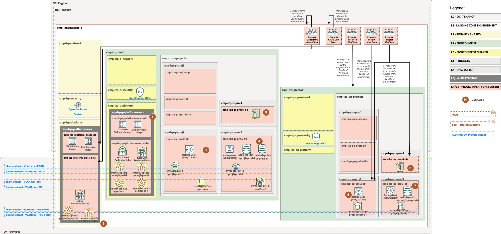
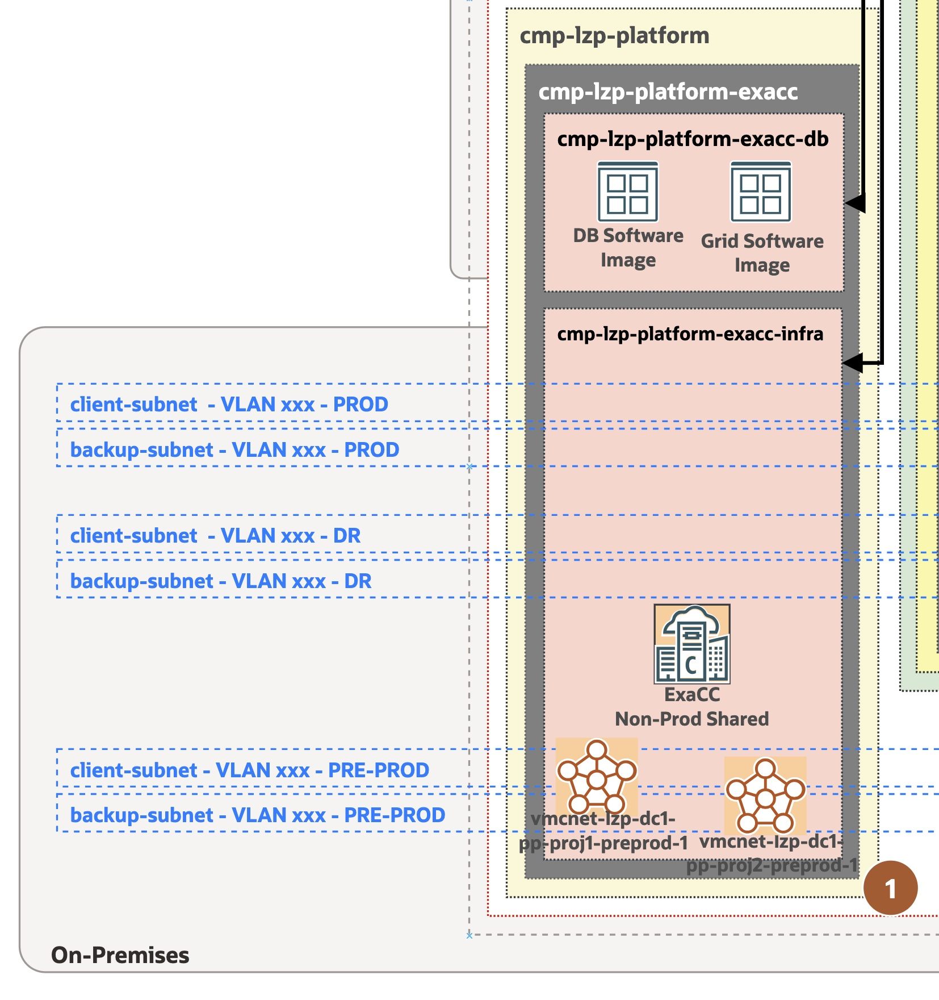
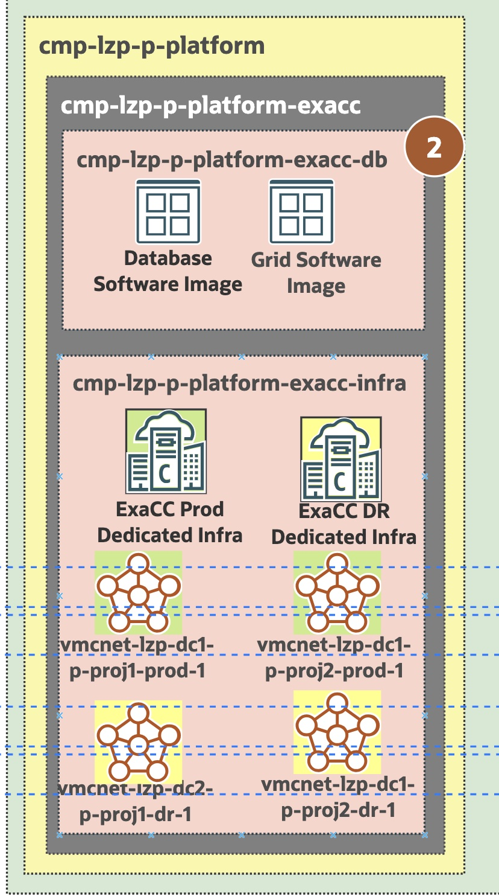
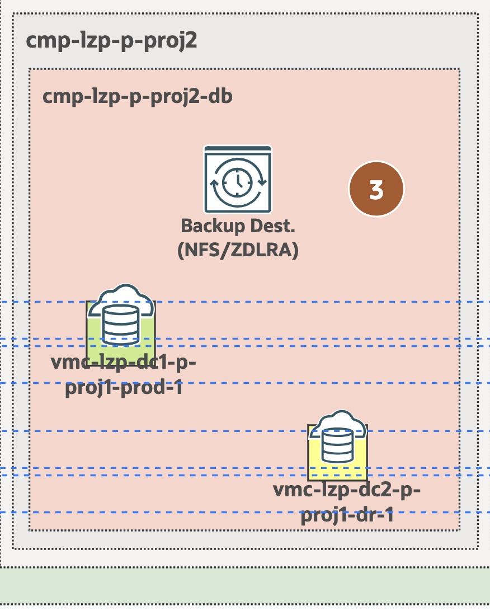
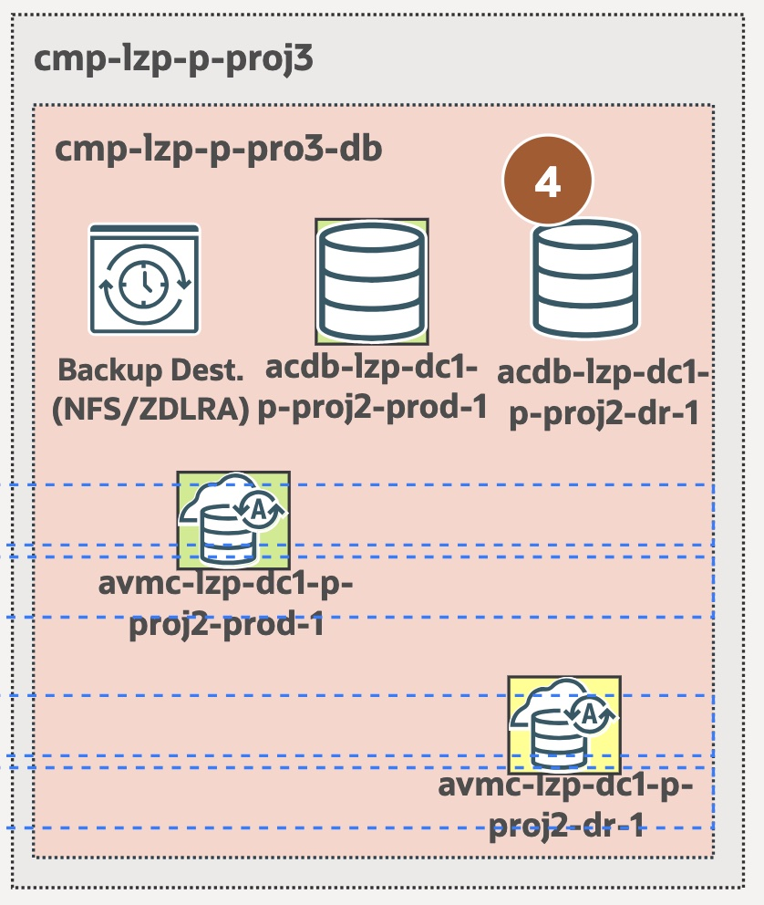
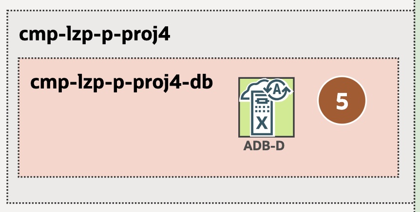

# ExaDB-C@C Use Cases <!-- omit from toc -->

## **Table of Contents** <!-- omit from toc -->

- [**1. Summary**](#1-summary)
- [**2. Use Cases**](#2-use-cases)
  - [**2.1 Global Shared ExaCC Platform**](#21-global-shared-exacc-platform)
  - [**2.2 Dedicated Worload Environment ExaDB-C@C Platform**](#22-dedicated-worload-environment-exadb-cc-platform)
  - [**2.3 Workload Environment Project with Production \& Disaster Recovery Regular VM Clusters**](#23-workload-environment-project-with-production--disaster-recovery-regular-vm-clusters)
  - [**2.4 Workload Environment Project with AVMCs and Primary/DR ACDs**](#24-workload-environment-project-with-avmcs-and-primarydr-acds)
  - [**2.5 Workload Environment Project with ADBs**](#25-workload-environment-project-with-adbs)
  - [**2.6 Worload Environment Project with a Regular VMCs managed by Global and Environment Dedicated Teams**](#26-worload-environment-project-with-a-regular-vmcs-managed-by-global-and-environment-dedicated-teams)
  - [**2.7 Workload Environment Project with an AVMC and ACD managed by Global and Environment Dedicated Teams**](#27-workload-environment-project-with-an-avmc-and-acd-managed-by-global-and-environment-dedicated-teams)
  - [**2.8 Workload Environment Project with an AVMC managed by Global and Project Dedicated Teams**](#28-workload-environment-project-with-an-avmc-managed-by-global-and-project-dedicated-teams)
- [**3. Management of other resources**](#3-management-of-other-resources)
  - [**3.1 Operator Access Control**](#31-operator-access-control)
  - [**3.2 Software Images**](#32-software-images)
  - [**3.3 Backup Destinations**](#33-backup-destinations)

&nbsp; 

## **1. Summary**

The ExaDB-C@C infrastructure is a platform for massive Oracle Database consolidation. A same infrastructure can serve to different Virtual Machine and Autonomous Virtual Machine platforms which can be shared or dedicated to different Operating Entities, Organizational Units, Lines of Business, departments, etc. 

We provide in this Landing Zone Workload Extension an example to try to bring some different scenarios that usually the customers can face and know how the available templates can be used to implement exactly your scenario that meets your requirements.

This section is intended to guide you on the different scenarios you can see.

The diagram below illustrates the ExaDB-C@C Workload Extension example:

&nbsp; 

Consider that the ExaDB-C@C Infrastructure is formed of Database and Storage Servers, connected through a RoCE switches fabric, that supports different Virtual Machine Clusters (VMC), known as "regular" VMCs, and/or Autonomous Virtual Machine Clusters (AVMC).

Every VMC is a set of one or many Virtual Machines running in different Database Servers for high availability, with the help of Grid Infrastructure clusterware software. On top of a VMC, you can deploy several Oracle Homes (OHs), which can be used to create/run Oracle Container Databases (CDBs). In every CDB, you can run multiple Pluggable Databases (PDBs). While creating VMCs, you can select the compartment where you want to place it, for logical, functional or security reasons. The rest of components, can't be places in different compartments so consider that where you place the VMC will be the place where you'll find all these elements, and the teams who are going to manage them, will have access to all of them. It is possible to fine-tune the IAM policies to grant the access of different teams to OHs, CDBs or even PDBs, but it would require a high effort after the depanloyment of any of these resources to create the needed, restricted IAM policies and something really hard to maintain.

The IAM policies for the ExaDB-C@C gives you the flexibility to create policies per resource types (exadata-infrastructures, vmclusters, backup-destinations, db-nodes, etc.). For each of them you can also use advance IAM policies syntax to be able to create fine tuned IAM policies by playing with permissions and event with API operations. These detailed use of IAM policies is described in the [Policy Details for Oracle Exadata Database Service on Cloud@Customer](https://docs.oracle.com/en/engineered-systems/exadata-cloud-at-customer/ecccm/ecc-policy-details.html#GUID-523EBAE0-C17F-435A-97A6-374DE2F94747).

We use this approach in this ExaDB-C@C extention, as some operations for some components, as the VMCs, can have operations supported by API calls more suitable for infrastructure/systems teams (as scaling OCPUs, system memory or local filesystems), and other operations more suitable for DBA teams (as scaling ASM Storage or every operation related to Databases). This is because, sometimes, the operation might fail for different reasons and every team is differently skilled for troubleshooting due to different needed skills.

Every AVMC can also be created on top of an ExaDB-C@C Infrastructure. On each AVMC you can create multiple Autonomous Container Databases (ACDs) and on each of every ACDs you can create multiple Autonomous Databases (ADBs or ADB-D, dedicated). In contrast to regular VMCs, you can place every Autonomous component in different compartments, which gives to you more flexibility and ease of use to create and maintain the IAM policies. You'll have also less operations to do with these components, as they are autonomously operated.

Below you can see a table with the summary of use-cases:

| Use Case Number | Use Case| Description              | When to use |
| ------------------------- | --------------------------------- | ---| --- |
| **1** | **Global Shared ExaCC Platform** | ExaDB-C@C Infrastructure and common elements to be ***shared*** across Workload Environments. | You have an infrastructure that can be shared between environments, like a Non-Prod Infrastructure |
| **2** | **Dedicated Worload Environment ExaDB-C@C Platform** | ExaDB-C@C Infrastructure and common elements dedicated to Production Workload Environment but shared by multiple Production Projects" | You need a dedicated infrastructure for Production, where you can apply previously tested changes. |
| **3** | **Workload Environment Project with Production & Disaster Recovery Regular VM Clusters** | VMCs can be dedicated to one or many applications. | You have a same team managing different Production VMCs, highly available for Mission Critical DBs |
| **4** | **Workload Environment Project with AVMCs and Primary/DR ACDs** | AVMCs and ACDs are shared for different ADBs managed by other Project Teams | You have a same team managing the AVMCs of highly available ACDs for your organization or to support different customer's applications | 
| **5** | **Workload Environment Project with ADBs** | ADB managed by a Project Team | You have an ADB than can hold 1 or many applications based of different schemas  |
| **6** | **Worload Environment Project with a Regular VMCs managed by Global and Environment Dedicated Teams** | You have a Project where Global Infra & DBA teams can manage the resources but you have a dedicated Workload Environment team | Non-prod environment where you have outsourced teams that admins the environments for you, but you also have access as owner. |
| **7** | **Workload Environment Project with an AVMC and ACD managed by Global and Environment Dedicated Teams** | You have a Project where Global Infra & DBA teams can manage the resources but you have a dedicated Workload Environment team | Non-prod environment where you have outsourced teams that admins the environments for you, but you also have access as owner. |
| **8** | **Workload Environment Project with an ADB managed by Global and Project Dedicated Teams** | You have a Project where Global Infra & DBA teams can manage the resources but you have a dedicated Workload Environment team | Non-prod environment where you have outsourced teams that admins the environments for you, but you also have access as owner. |

&nbsp; 

## **2. Use Cases**

In this section we will comment of the different use case scenarios identified, bringing additional information that might be useful for you, from the Separation of Duties of the different Operations Teams, to the different architecture considerations for placing the resources and related ExaDB-C@C components.

Not all the possibilities are identified here, but probably the most common ones you might find.

&nbsp;

### **2.1 Global Shared ExaCC Platform** 

In a Global Shared ExaDB-C@C Platform, the infrastructure and common Database components (as Software Images), are shared among different workload environments. Global infra & DBA teams manages the different resources located in the DB & Infra layered compartments and the workload environment projects compartments, use the infrastructure to be able to create VMCs or AVMCs.

Other Landing Zone Baseline Blueprints (as the Multi-OE), can share the infrastructure between different Operating Entities and workload environments.

In our example, we have an ExaDB-C@C Non-Production infrastructure, that is used by Pre-Production projects and can be potentially used by other non-prod environments as it could be dev, test, UAT, etc., with each environment using its one or more VMCs. 

The Database common resources, as the Database Software Image or Grid Infrastructure Software image, allows you to create centrally these images that can be used by different workload environments of a same project or application(s). See the section 3.2 in this page to know more.

In the example:

&nbsp;

### **2.2 Dedicated Worload Environment ExaDB-C@C Platform**

In a Dedicated Worload Environment ExaDB-C@C Platform, the infrastructure is dedicated to the workload environment (as Production), but it is shared between the different environment projects. This is a typical use case where you have a Production or DR infrastructure where you don't allow to mix the infrastructure with non-prod environments. You typically has a non-prod infrastructure or cheaper, less capable hardware for those environments.

This use case allows you to test in non-prod environments the software changes made periodically by Oracle Operators before you schedule the quarterly patching in your production infrastructure once you're confortable how the patching procedure affects to your business application databases.

In the example: 

&nbsp;

### **2.3 Workload Environment Project with Production & Disaster Recovery Regular VM Clusters**

You can place VMCs in the same compartment VMCs that you plan to for Production and Disaster Recovery (DR) purposes. Both are usually managed by the same teams, so there is no reason to create separated compartments for DR. If you need to allocate costs, this can be filtered by OCI tags specific to the VMCs. The Database replication is done thanks to Oracle Data Guard associations created between CDBs. There are different options to create the standby with the creation of a new VMC in an infrastructure or by re-using an existing VMC and/or OH.

In this example shown in the below diagram or the general diagram, you can see that the VMCs has a background color with the same color of the infrastructure they're created on, so this can help you to identify the infrastructure. 

Dedicated VMC Networks are created in the Infrastructure compartment (as this can not be located in a different comapartment as the infrastructure), for every VMC. Every VMC requires from an on-premise client and backup VLANs, trunked in the DB Server ethernet/FCe cables, to be able to create the VMC Networks. In this example we're using different VLANs for PROD and DR. Some customers extends their VLANs between DCs or rooms where they separate the different ExaDB-C@C infrastructures, so they can use the same VLAN in both DCs. In this example we're using different VLANs but your could have the same in your case. 

While you have to create dedicated VMC Network component in the ExaDB-C@C, this doesn't not mean that you can use the same VLANs for many different VMCs that you plan to have in the same backend subnets. You can see that you use the same PROD and DR subnets for the VMC and AVMCs in the projects 2 & 3 in the different workload environments.

In the example: 

&nbsp;

### **2.4 Workload Environment Project with AVMCs and Primary/DR ACDs**

In this use case, we have AVMCs dedicated for Primary and DR ACDs in the same compartment, coming from different, dedicated, ExaDB-C@C infrastructures. In this case, we're assuming that a same DBA team is going to manage these resources. On top of every AVMC you can create different ACDs, that can hold also different ADBs. You can use the AVMC/ACD for massive database consolidation, with dedicated ADBs per project that you can delegate to specific project teams while a central team is managing the consolidation platform. 

This global team can decide which ACDs are created on which AVM, to create Autonomous Data Guard associations between ACDs to protect the databases and to perform some operations for sizing, scaling or operating backups on the environments.

In the example: 

&nbsp;

### **2.5 Workload Environment Project with ADBs**

You can assign an ADB to an specific project. In this way, you can have a dedicated Project Team to be able to manage the database independently. This is typical for service providers that allows its customers to manage their own database while the rest of infrastructure is maintained by them (or Oracle Cloud Ops), customers that delegates this environments to outsourced projects teams (as external development teams), or any other reason.

In the example: 

&nbsp;

### **2.6 Worload Environment Project with a Regular VMCs managed by Global and Environment Dedicated Teams**

This use case is similar to the use case 3, but with the difference that we're assuming that non only the global DBA & Infra teams can manage the environment, but also a dedicated team for the workload environment. As you can see in the overall example diagram, we have Global Infra & DBA teams. They have IAM policies that allows them to manage all the database compartments in the Landing Zone environment. In this example we use also an specific group for the Pre-Prod environment that can also manage all the Database compartments for all the projects. This is an example of how you can leverage the delegation of duties in a workload environment for an outsourced team. They can manage the ExaDB-C@C VMCs, AVMCs and the rest of the elements in the Pre-prod projects, but they don't have permissions to do it in another environments like Production.

&nbsp;

### **2.7 Workload Environment Project with an AVMC and ACD managed by Global and Environment Dedicated Teams**

This use case is identical to be previous one but focused in the Autonomous resources.

&nbsp;

### **2.8 Workload Environment Project with an AVMC managed by Global and Project Dedicated Teams**

This use case is to allow the management of the resources for an specific Project Team, formed by people for Infra & DBAs. They can only manage the resources located in the specific project.

&nbsp;

## **3. Management of other resources**

### **3.1 Operator Access Control**

Oracle Operator Access Control is an OCI compliance audit service that allows you to know when an access from Oracle operators is needed to check or fixed any problem in the ExaDB-C@C underlying infrastructure. It provides audit trails of all actions that Oracle operators performs on your Exadata Infrastructure in a near real-time manner.

This service is usually managed by your Security Team. That's why, it is located in the Global Shared Security compartment and this extension provides a policy to grant that team to be able to manage the service.

The extension also provides an OCI Event Rule to capture the events generated by the Operator Access Control activities and are integrated with the OCI Notification Topic used by the Global Security Team.

An alternate design could be to place the Operator Access Controls for specific workload environments shared security compartment. In this way, you can have specific dedicated workload environment security teams for managing the workload environment infrastructures, as with Production environments. In other Operating Entities Landing Zones, as with the Multi-OE Blueprint, it could be make more sense in case that some OEs has their own dedicated infrastructures.

To know more about the Oracle Operator Access Control you can check the public document [Oracle Operator Access Control](https://docs.oracle.com/en-us/iaas/operator-access-control/index.html).

### **3.2 Software Images**

You can define your own Oracle Database and Grid Infrastructure binaries golden images in OCI. This is called Database Software Images and Grid Infrastructure Software Images.

These images allows you to create a specific major version of the Oracle major version of the Database or Grid Infrastructure software, with a given Release Update of your choice and with specific One-Offs that fixes specific problems you might be facing.

The convenience of these images is that you can create an image to create new Oracle or Grid Homes with them or to patch in-place an exiting Oracle/GI home with them. It is very common to use a same image in the different workload environments that you might have, following a testing lifecycle of new versions of these Oracle Product beginning with non-prod environments up to production environments.

This Landing Zone extension provides IAM policies granting the different proposed DBA teams to manage these images. The DB Platform Layer compartments are the proposal to locate these resources as this can be shared among your different workload environments VM Clusters.

An alternate design could be to place the Software Images in the dedicated ExaDB-C@C platform DB layer compartment, just in case you have specific cases restricted to production environments or dedicated teams for it.

To know more about the Software Images you can check the public document [Manage Software Images](https://docs.oracle.com/en/engineered-systems/exadata-cloud-at-customer/ecccm/ecc-oracle-database-software-images.html#GUID-93D6419A-DD43-45E0-BF69-92E8907C6652).

### **3.3 Backup Destinations**

There are different autonamtic backup options for the ExaDB-C@C Databases. One of them is to be able to define on-premise Network File Storage (NFS) mountpoint or a Zero Data Loss Recovery Appliance (ZDLRA).

In order to allow the cloud tooling to be able to use this external elements, an ExaDB-C@C component called "Backup Destinations" can be created through the OCI console or APIs to define this element and link it with the cloud tooling.

The backup destinations are applied to the (Container Databases), so in this ExaDB-C@C Worload extensions are proposed to be located in those compartments where the Databases are located, as the Projects compartments. 

In regular ExaDB-C@C VM Clusters, its Databases are located in the same compartment, you can't choose a different one, so that's why we created policies to allow the different DBA Teams to be able to manage this kind of resources.

An alternate design could be to place the Backup Destinations in the ExaDB-C@C Platform DB layer compartments. However, the management of IAM policies will be harder to create and maintain.

To know more about the Backup Destinations you can check the public document [Creating Database Backup Destinations for Oracle Exadata Database Service on Cloud@Customer](https://docs.oracle.com/en/engineered-systems/exadata-cloud-at-customer/ecccm/ecc-create-bkup-dest.html#GUID-24E43ABF-29D3-4660-BB2C-3FCAF8424293).

&nbsp;
&nbsp; 

# License <!-- omit from toc -->

Copyright (c) 2025 Oracle and/or its affiliates.

Licensed under the Universal Permissive License (UPL), Version 1.0.

See [LICENSE](/LICENSE.txt) for more details.