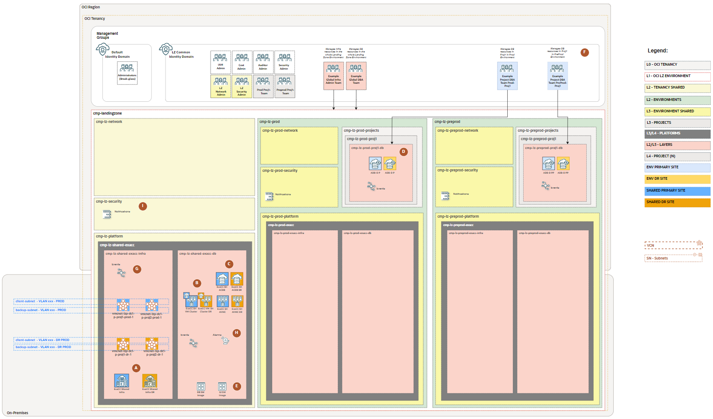
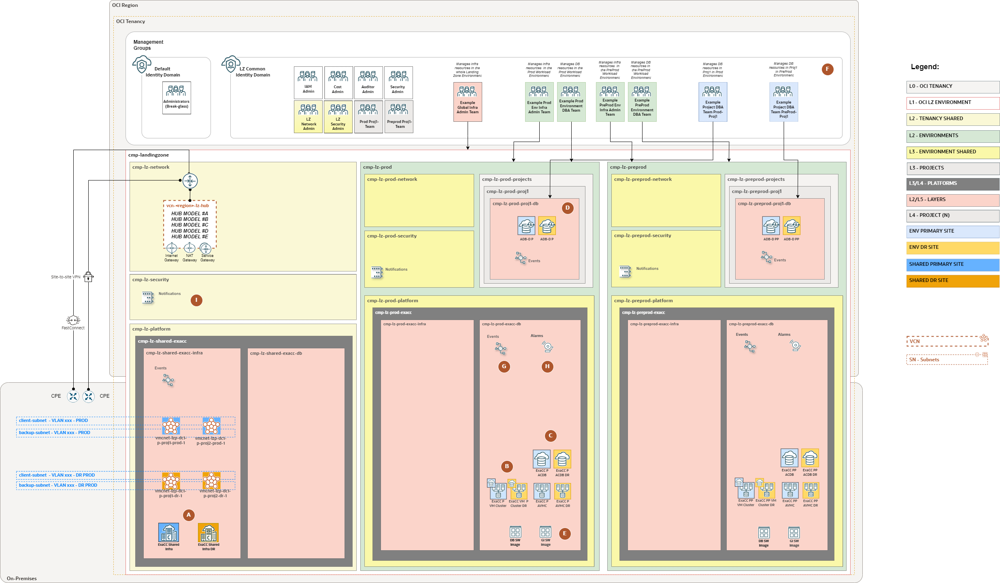
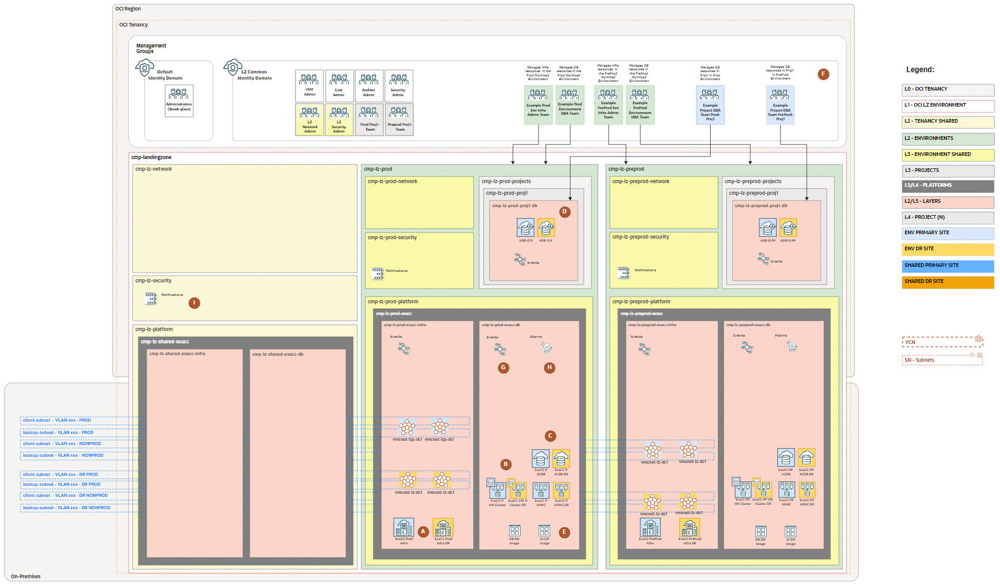

# ExaDB-C@C Use Cases <!-- omit from toc -->

## **Table of Contents** <!-- omit from toc -->

- [**1. Summary**](#1-summary)
- [**2. Use Cases**](#2-use-cases)
  - [**2.1 Shared ExaDB-C@C Platform: Shared infrastructure and shared VMCs/AVMCs across multiple environments**](#21-shared-exadb-cc-platform-shared-infrastructure-and-shared-vmcsavmcs-across-multiple-environments)
    - [**ExaDB-C@C Resources**](#exadb-cc-resources)
    - [**ExaDB-C@C Groups**](#exadb-cc-groups)
    - [**ExaDB-C@C Observability**](#exadb-cc-observability)
  - [**2.2 Hybrid ExaDB-C@C Platform: Shared infrastructure with dedicated VMCs/AVMCs per environment**](#22-hybrid-exadb-cc-platform-shared-infrastructure-with-dedicated-vmcsavmcs-per-environment)
    - [**ExaDB-C@C Resources**](#exadb-cc-resources-1)
    - [**ExaDB-C@C Groups**](#exadb-cc-groups-1)
    - [**ExaDB-C@C Observability**](#exadb-cc-observability-1)
  - [**2.3 Dedicated ExaDB-C@C Platform: Fully dedicated infrastructure and VMCs/AVMCs per environment**](#23-dedicated-exadb-cc-platform-fully-dedicated-infrastructure-and-vmcsavmcs-per-environment)
    - [**ExaDB-C@C Resources**](#exadb-cc-resources-2)
    - [**ExaDB-C@C Groups**](#exadb-cc-groups-2)
    - [**ExaDB-C@C Observability**](#exadb-cc-observability-2)
- [**3. Design Decisions**](#3-design-decisions)
- [**3. Management of other resources**](#3-management-of-other-resources)
  - [**3.1 Disaster Recovery (DR)**](#31-disaster-recovery-dr)
  - [**3.2 Operator Access Control**](#32-operator-access-control)
  - [**3.3 Software Images**](#33-software-images)
  - [**3.4 Backup Destinations**](#34-backup-destinations)

## **1. Summary**

The ExaDB-C@C infrastructure is a platform designed for large-scale Oracle Database consolidation. A single infrastructure can support multiple Virtual Machine Clusters (VMCs) and Autonomous Virtual Machine Clusters (AVMCs), which may be shared or dedicated across different workload environments, operating entities, organizational units, lines of business, departments, and more.

In this Landing Zone Workload Extension, we provide examples of common scenarios that customers typically encounter, along with guidance on how the available templates can be used to implement solutions tailored to specific requirements.

This section is intended to guide you through several of these scenarios.

We have identified three main use cases:

1. Shared ExaDB-C@C Platform: Shared infrastructure and shared VMCs/AVMCs across multiple environments.
2. Hybrid ExaDB-C@C Platform: Shared infrastructure with dedicated VMCs/AVMCs per environment.
3. Dedicated ExaDB-C@C Platform: Fully dedicated infrastructure and VMCs/AVMCs per environment.

While not all possible configurations are covered, these represent the most common scenarios. If your use case involves a combination of these, you can leverage elements from each to design a custom solution.

The ExaDB-C@C infrastructure consists of database and storage servers connected through a RoCE switch fabric. It supports both "regular" *Virtual Machine Clusters (VMCs)* and *Autonomous Virtual Machine Clusters (AVMCs)*. Each VMC/AVMC is composed of one or more virtual machines distributed across database servers, ensuring high availability through Oracle Grid Infrastructure clusterware.

On top of regular VMCs, you can deploy multiple *Oracle Homes (OHs)*, which are used to create and run *Oracle Container Databases (CDBs)*. Each CDB can host multiple *Pluggable Databases (PDBs)*.

When creating VMCs, you can select the compartment where they will reside, based on logical, functional, or security considerations. However, other associated components cannot be placed in different compartments. Therefore, the VMC’s compartment determines where all related resources will reside, and which teams will have access to them.

Although it is possible to fine-tune IAM policies to grant access to specific OHs, CDBs, or PDBs using tags, this approach requires significant effort after deployment and can be difficult to maintain over time.

Similarly, AVMCs can be created on top of an ExaDB-C@C infrastructure. Within each AVMC, you can create multiple *Autonomous Container Databases (ACDs)*, and within each ACD, multiple *Autonomous Databases Dedicated (ADB-D)*. Unlike regular VMCs, Autonomous components can be placed in different compartments, providing greater flexibility and simplifying IAM policy management. Additionally, these components require fewer operational tasks, as they are autonomously managed.

IAM policies for ExaDB-C@C provide flexibility to define permissions by *resource type* (e.g., exadata-infrastructures, vmclusters, backup-destinations, db-nodes, etc.). Advanced IAM policy syntax can also be used to create fine-grained access control based on *permissions* and *API operations*. More details can be found in the [Policy Details for Oracle Exadata Database Service on Cloud@Customer](https://docs.oracle.com/en/engineered-systems/exadata-cloud-at-customer/ecccm/ecc-policy-details.html#GUID-523EBAE0-C17F-435A-97A6-374DE2F94747) documentation.

This extension adopts such approach, as certain operations (e.g., scaling OCPUs, system memory, or local file systems in VMCs) are typically handled by infrastructure or systems teams, while others (e.g., ASM storage scaling or database-related operations) are more suited to DBA teams. In some cases, operations may fail for different reasons, and each team’s expertise is better aligned with troubleshooting within their domain.

## **2. Use Cases**

In this section, we describe the identified use case scenarios, providing additional guidance on key aspects such as the **separation of duties** across operations teams and the **architectural design decisions** involved in placing resources and ExaDB-C@C components.

### **2.1 Shared ExaDB-C@C Platform: Shared infrastructure and shared VMCs/AVMCs across multiple environments**

#### **ExaDB-C@C Resources**

In this scenario, the ExaDB-C@C stack is treated as a **shared platform** from the infrastructure perspective. There are two infrastructures, : one primary and one disaster recovery (DR), both deployed in the shared ExaDB-C@C infra compartment.

Regular Virtual Machine Clusters (VMCs), along with their associated Oracle Homes (OHs), Container Databases (CDBs), and Pluggable Databases (PDBs) are all deployed within the same ExaDB-C@C DB compartment , as these resources cannot be distributed across multiple compartments. This model simplifies management but implies that access control must be handled carefully, as all resources reside in a shared scope.

For Autonomous deployments AVMCs and Autonomous Container Databases (ACDs) are also created within the ExaDB-C@C DB compartment . However, Autonomous Databases Dedicated (ADB-D) can be deployed in separate project compartments . This provides greater flexibility, allowing better isolation between environments, more granular IAM policy control, and easier delegation of administrative responsibilities.

The images used to provision the different Oracle Homes, both for Grid Infrastructure and for the databases, are stored in the ExaDB-C@C DB compartment .

#### **ExaDB-C@C Groups**

The administrative groups  are defined to align with the operational model of this shared platform and enforce a clear separation of responsibilities.

The groups associated with the shared ExaDB-C@C environment are:

- **Global Infra Admin Team**, responsible for the management and maintenance of the ExaDB-C@C infrastructure, including VMCs and AVMCs, as well as related infrastructure-level operations.
- **Global DBA Team**, responsible for database administration tasks within the shared compartment, including Oracle Homes (OHs), CDBs, PDBs, and ACDs.

In addition, environment-specific database administration is handled by dedicated groups:

- **Project DBA Team (per environment and project)**, responsible exclusively for managing the ADB-D databases deployed within their respective project compartments.

This approach ensures that infrastructure and shared database layers are centrally managed, while granting each environment its own level of autonomy over its dedicated Autonomous Databases, reinforcing both governance and operational efficiency.

#### **ExaDB-C@C Observability**

The observability framework for this scenario is based on the combined use of **Events, Alarms, and Notifications**, enabling centralized monitoring and controlled dissemination of operational signals across both shared and environment-specific resources.

**Events** 

Event rules  are configured to capture relevant lifecycle and operational events generated by ExaDB-C@C resources. These rules are defined across both shared and environment-specific compartments and are responsible for routing events to the corresponding notification topics.

At the shared level:

- **ExaDB-C@C infrastructure compartment**: rul-lz-notify-on-exacc-infra-events
- **ExaDB-C@C database compartment**: rul-lz-notify-on-exacc-db-events

At the project level:

- **Production Project Compartments**: rul-lz-prod-notify-on-notifications-projects
- **Pre-Production Project Compartments**: rul-lz-preprod-notify-on-notifications-projects

These event rules ensure that operational changes, failures, or state transitions are automatically propagated to the appropriate notification channels.

**Alarms**

Alarms  are defined within the shared ExaDB-C@C Database compartment to monitor key performance and utilization metrics of the database clusters.

The following alarms are configured:

- al-lz-db-cpuutil
- al-lz-db-storageutil
- al-lz-vmc-cpuutil
- al-lz-vmc-dgutil
- al-lz-vmc-fsutil
- al-lz-vmc-memutil
- al-lz-vmc-swaputil

These alarms continuously evaluate defined thresholds and, upon breach, generate alerts that are forwarded to the corresponding notification topics.

**Notifications**

Notification topics  are configured within the security compartments, both at a global scope and at the environment level, to serve as the primary mechanism for delivering alerts and event messages.

At the global level, the following notification topics are defined to support shared infrastructure and database workloads:

- nott-lz-exacc-infra-workloads
- nott-lz-exacc-db-workloads

At the environment level, dedicated notification topics are defined for each environment scope:

- **Production**: nott-lz-prod-exacc-projects
- **Pre-Production**: nott-lz-preprod-exacc-projects

These topics act as targets for both alarm actions and event rules, ensuring consistent and centralized message delivery.

**Operational Flow**

The observability components operate in an integrated manner:

- *Alarms* evaluate metric thresholds and generate alerts.
- *Events* capture resource state changes and operational signals. Event Rules route events to notification topics.
- *Notifications* deliver messages to subscribed endpoints.

This model provides a consistent and scalable observability approach, combining centralized monitoring of shared ExaDB-C@C resources with environment-specific visibility and control.

### **2.2 Hybrid ExaDB-C@C Platform: Shared infrastructure with dedicated VMCs/AVMCs per environment**

#### **ExaDB-C@C Resources**

In this scenario, the ExaDB-C@C stack follows a **hybrid model**, where the infrastructure layer is shared while compute resources (VMCs/AVMCs) are dedicated per environment.

There are two infrastructures, : one primary and one disaster recovery (DR), both deployed in the shared ExaDB-C@C infra compartment.

Regular Virtual Machine Clusters (VMCs), along with their associated Oracle Homes (OHs), Container Databases (CDBs), and Pluggable Databases (PDBs), are deployed in environment-specific compartments . This allows each environment to have dedicated database stacks, improving isolation, governance, and operational control compared to the fully shared model.

For Autonomous deployments, AVMCs and Autonomous Container Databases (ACDs) are also created within their respective environment-specific compartments .

Autonomous Databases Dedicated (ADB-D) are deployed in project-level compartments , maintaining a clear separation between projects within the same environment and enabling fine-grained IAM control.

The images used to provision the different Oracle Homes, both for Grid Infrastructure and for the databases, are stored in each environment-specific ExaDB-C@C DB compartment , ensuring that software artifacts are fully segregated per environment.

#### **ExaDB-C@C Groups**

The administrative groups  are defined following a hybrid model, combining global, environment-level, and project-level responsibilities to balance central governance with environment isolation.

At the global level, shared administration groups are defined:

- **Global Infra Admin Team**, responsible for managing infrastructure resources across the entire Landing Zone, including the ExaDB-C@C infrastructure and shared components.

At the environment level, dedicated groups are defined per environment:

- **Env Infra Admin Team (per environment)**, responsible for the management and maintenance of infrastructure resources within the environment, including VMCs and AVMCs.
- **Environment DBA Team (per environment)**, responsible for database administration within the environment, including Oracle Homes (OHs), CDBs, PDBs, and ACDs.

In addition, project-scoped groups are defined:

- **Project DBA Team (per environment and project)**, responsible exclusively for managing the ADB-D databases deployed within their respective project compartments.

These project-level DBA groups are scoped at the project level within each environment, enabling fine-grained ownership and access control.

This model enforces a layered separation of duties, where infrastructure governance is partially centralized at the global level, environment-specific resources are managed at the environment level, and Autonomous Databases Dedicated (ADB-D) are managed at the project level providing a balanced approach between central control, environment isolation, and project-level autonomy.

#### **ExaDB-C@C Observability**

The observability framework for this scenario is based on the combined use of **Events, Alarms, and Notifications**, enabling centralized monitoring and controlled dissemination of operational signals across both shared and environment-specific resources.

**Events** 

Event rules  are configured to capture relevant lifecycle and operational events generated by ExaDB-C@C resources. These rules are defined across both shared and environment-specific compartments and are responsible for routing events to the corresponding notification topics.

At the shared level:

- **ExaDB-C@C infrastructure compartment**: rul-lz-notify-on-exacc-infra-events

At the environment level:

- **ExaDB-C@C prod/preprod database compartment**: rul-lz-notify-on-exacc-db-events

At the project level:

- **Production Project Compartments**: rul-lz-prod-notify-on-notifications-projects
- **Pre-Production Project Compartments**: rul-lz-preprod-notify-on-notifications-projects

These event rules ensure that operational changes, failures, or state transitions are automatically propagated to the appropriate notification channels.

**Alarms**

Alarms  are defined within each environment-specific ExaDB-C@C Database compartment to monitor key performance and utilization metrics of the database clusters.

The following alarms are configured:

- al-lz-db-cpuutil
- al-lz-db-storageutil
- al-lz-vmc-cpuutil
- al-lz-vmc-dgutil
- al-lz-vmc-fsutil
- al-lz-vmc-memutil
- al-lz-vmc-swaputil

These alarms continuously evaluate defined thresholds and, upon breach, generate alerts that are forwarded to the corresponding notification topics.

**Notifications**

Notification topics  are configured within the security compartments, both at a global scope and at the environment level, to serve as the primary mechanism for delivering alerts and event messages.

At the global level, the following notification topics are defined to support shared infrastructure and database workloads:

- nott-lz-exacc-infra-workloads
- nott-lz-exacc-db-workloads

At the environment level, dedicated notification topics are defined for each environment scope:

- **Production**: nott-lz-prod-exacc-projects
- **Pre-Production**: nott-lz-preprod-exacc-projects

These topics act as targets for both alarm actions and event rules, ensuring consistent and centralized message delivery.

**Operational Flow**

The observability components operate in an integrated manner:

- *Alarms* evaluate metric thresholds and generate alerts.
- *Events* capture resource state changes and operational signals. Event Rules route events to notification topics.
- *Notifications* deliver messages to subscribed endpoints.

This model provides a consistent and scalable observability approach, combining centralized monitoring of shared ExaDB-C@C resources with environment-specific visibility and control.

### **2.3 Dedicated ExaDB-C@C Platform: Fully dedicated infrastructure and VMCs/AVMCs per environment**

#### **ExaDB-C@C Resources**

In this scenario, the ExaDB-C@C stack follows a **fully dedicated model**, where both the infrastructure and compute layers are isolated per environment.

Each environment is provisioned with its own ExaDB-C@C infrastructure , including both primary and disaster recovery (DR) deployments, ensuring complete isolation across environments.

Regular Virtual Machine Clusters (VMCs), along with their associated Oracle Homes (OHs), Container Databases (CDBs), and Pluggable Databases (PDBs), are deployed within environment-specific compartments . This ensures that each environment operates its own fully isolated database stack, with no shared resources across environments.

For Autonomous deployments, AVMCs and Autonomous Container Databases (ACDs) are also created within their respective environment-specific compartments , maintaining full separation between environments.

Autonomous Databases Dedicated (ADB-D) are deployed in project-level compartments , providing isolation between projects within the same environment and enabling fine-grained IAM control.

The images used to provision the different Oracle Homes, both for Grid Infrastructure and for the databases, are stored in each environment-specific ExaDB-C@C DB compartment , ensuring that software artifacts are fully segregated per environment.

#### **ExaDB-C@C Groups**

The administrative groups  are defined following a fully dedicated model, where responsibilities are primarily scoped at the environment level, with additional segregation at the project level for Autonomous databases.

For each environment, dedicated groups are defined:

- **Env Infra Admin Team (per environment)**, responsible for the management and maintenance of the ExaDB-C@C infrastructure within that environment, including VMCs and AVMCs, as well as all infrastructure-related operations.
- **Environment DBA Team (per environment)**, responsible for database administration within the environment, including Oracle Homes (OHs), CDBs, PDBs, and ACDs.

In addition, project-scoped groups are defined:

- **Project DBA Team (per environment and project)**, responsible exclusively for the ADB-D databases deployed within their respective project compartments.

These project-level DBA groups are not scoped at the environment level, but rather at the project level within each environment, ensuring fine-grained ownership and access control for Autonomous databases.

This model enforces a clear multi-level separation of duties, where infrastructure and core database layers are managed at the environment level and Autonomous Databases Dedicated (ADB-D) are managed at the project level ensuring strong isolation, governance, and operational ownership across both environments and projects.

#### **ExaDB-C@C Observability**

The observability framework for this scenario is based on the combined use of **Events, Alarms, and Notifications**, enabling centralized monitoring and controlled dissemination of operational signals across both shared and environment-specific resources.

**Events** 

Event rules  are configured per environment to capture lifecycle and operational events generated by ExaDB-C@C resources.

At the environment level:

- **ExaDB-C@C infrastructure compartment**: rul-lz-notify-on-exacc-infra-events
- **ExaDB-C@C prod/preprod database compartment**: rul-lz-notify-on-exacc-db-events

At the project level:

- **Production Project Compartments**: rul-lz-prod-notify-on-notifications-projects
- **Pre-Production Project Compartments**: rul-lz-preprod-notify-on-notifications-projects

This ensures that all events are handled within the scope of their corresponding environment.

**Alarms**

Alarms  are defined within each environment-specific ExaDB-C@C Database compartment to monitor key performance and utilization metrics of the database clusters.

The following alarms are configured:

- al-lz-db-cpuutil
- al-lz-db-storageutil
- al-lz-vmc-cpuutil
- al-lz-vmc-dgutil
- al-lz-vmc-fsutil
- al-lz-vmc-memutil
- al-lz-vmc-swaputil

These alarms continuously evaluate defined thresholds and, upon breach, generate alerts that are forwarded to the corresponding notification topics.

**Notifications**

Notification topics  are configured within the security compartments, both at a global scope and at the environment level, to serve as the primary mechanism for delivering alerts and event messages.

At the global level, the following notification topics are defined to support shared infrastructure and database workloads:

- nott-lz-exacc-infra-workloads
- nott-lz-exacc-db-workloads

At the environment level, dedicated notification topics are defined for each environment scope:

- **Production**: nott-lz-prod-exacc-projects
- **Pre-Production**: nott-lz-preprod-exacc-projects

These topics act as targets for both alarm actions and event rules, ensuring consistent and centralized message delivery.

**Operational Flow**

The observability components operate in an integrated manner:

- *Alarms* evaluate metric thresholds and generate alerts.
- *Events* capture resource state changes and operational signals. Event Rules route events to notification topics.
- *Notifications* deliver messages to subscribed endpoints.

This model provides a consistent and scalable observability approach, combining centralized monitoring of shared ExaDB-C@C resources with environment-specific visibility and control.

## **3. Design Decisions**

This section outlines the key design decisions adopted for the ExaDB-C@C architecture, covering administrative responsibilities, resource placement, visual representation, and networking strategy.

**Administrative Model**

The administrative model is structured across three levels: global, environment, and project, enabling a consistent separation of responsibilities across the platform. The presence and scope of these administrative groups may vary depending on the selected use case.

At the global level, centralized teams are defined:

- **Global Infra Admin Team**, responsible for the management and maintenance of ExaDB-C@C infrastructure components across the Landing Zone.
- **Global DBA Team**, responsible for governance, standards, and administration of shared database-related components.

At the environment level, dedicated teams are defined per environment:

- **Env Infra Admin Team (per environment)**, responsible for infrastructure operations within the environment, including VMCs and AVMCs.
- **Env DBA Team (per environment)**, responsible for database administration within the environment, including Oracle Homes (OHs), CDBs, PDBs, and ACDs.

At the project level, administration is limited to database ownership:

- **Project DBA Team (per project)**, responsible exclusively for managing ADB-D databases within their respective project compartments.

This model enforces a multi-level separation of duties, aligning operational ownership with the scope of each resource.

**Visual Representation (Diagram Interpretation)**

The architecture diagrams use a color-based convention to represent the scope of resources:

- Dark-colored elements represent globally shared components, managed at the global level.
- Light-colored elements represent environment-specific (dedicated) resources, regardless of the environment (e.g., Production or Pre-Production).

This visual distinction allows quick identification of level of isolation (global vs environment).

**Networking Strategy**

Networking for ExaDB-C@C is designed to align with infrastructure constraints while enabling reuse and flexibility across environments.

VMC Networks must be created within the ExaDB-C@C Infrastructure compartment, as they cannot reside in a different compartment from the infrastructure itself. Each VMC requires connectivity to on-premises networks through both client VLANs, used for application traffic, and backup VLANs, used for backup and replication purposes. These VLANs are trunked through the database server network interfaces.

In this design, separate VLANs are typically defined for Primary (PROD) and Disaster Recovery (DR) environments. However, depending on the customer’s network architecture, VLANs may be extended across data centers or availability locations, allowing the same VLANs to be reused across multiple ExaDB-C@C infrastructures.

Although each VMC requires its own VMC Network resource, this does not imply that network segmentation must be unique per cluster. Multiple VMCs and AVMCs can share the same backend subnets and VLANs when operating within the same network domain. This enables efficient reuse of network configurations across environments and projects while still complying with ExaDB-C@C networking requirements.

This approach ensures consistency, optimizes network resource utilization, and aligns with enterprise networking standards while respecting platform constraints.

**Resource Placement Strategy**

A key design decision in this architecture is how database resources are placed and managed, taking into account the inherent differences between regular database deployments (VMC-based) and Autonomous Database deployments.

In the case of regular database clusters, the placement model is inherently constrained by the platform. A VMC, together with its associated Oracle Homes (OHs), Container Databases (CDBs), and Pluggable Databases (PDBs), must be deployed within a single compartment, and all dependent resources must remain within that same boundary. Since PDBs cannot be placed outside of their parent CDB and VMC, the cluster effectively defines both the administrative and placement scope. This means that any level of isolation or delegation must be defined at the level where the VMC is deployed (for example, global or environment level), as finer granularity at the database level is not possible.

In contrast, Autonomous Databases Dedicated (ADB-D) provide a fundamentally different model. Although they are hosted within AVMC/ACD structures, they can be deployed in independent compartments, separate from the underlying infrastructure components. This introduces true flexibility at the database level, allowing each database to be aligned with a specific ownership and operational boundary.

Based on this capability, a deliberate design decision has been made to always deploy Autonomous Databases at the project level. This ensures that each ADB is associated with its corresponding project compartment, enabling clear ownership, fine-grained access control, and independent lifecycle management.

By combining these two approaches, the architecture acknowledges the structural constraints of VMC-based deployments—where the cluster defines the boundary—while leveraging the flexibility of Autonomous Databases to achieve project-level isolation and delegation.

## **3. Management of other resources**

### **3.1 Disaster Recovery (DR)**

In this architecture, Disaster Recovery (DR) is implemented by defining two ExaDB-C@C infrastructures, one acting as primary and the other as standby.

These infrastructures may be placed in the same or in different logical compartments, depending on governance, access control, or organizational requirements. The logical placement does not impact the DR mechanism itself, which is defined at the database layer.

Database protection is implemented using Data Guard, with associations established between database clusters running on different infrastructures. This ensures that each workload is replicated across independent platforms, providing resilience and continuity in case of failure.

From an operational perspective, Production and DR resources are typically managed by the same administrative teams, following the administrative model defined for the Landing Zone.

Cost allocation between primary and DR deployments can be managed through the use of OCI tags, applied consistently to the corresponding infrastructure and database resources.

This approach provides a consistent and scalable DR model, where protection is based on cluster-to-cluster replication across infrastructures, while maintaining flexibility in terms of logical organization, cost tracking, and operational ownership.

### **3.2 Operator Access Control**

Oracle Operator Access Control is an OCI compliance and auditing service that provides visibility into when Oracle operators require access to the underlying ExaDB-C@C infrastructure for maintenance or issue resolution. It offers near real-time audit trails of all actions performed by Oracle personnel.

In this architecture, the service is typically managed by the Security Team and is therefore deployed in the Global Shared Security compartment. The Landing Zone extension includes IAM policies that grant the appropriate permissions for managing this service.

Additionally, OCI Event Rules are configured to capture Operator Access Control activities and route them to the corresponding Notification Topics, ensuring that security teams are informed of all relevant events.

An alternative design may place Operator Access Control resources within environment-specific security compartments, enabling dedicated security teams to manage infrastructure access independently per environment. This approach may be particularly relevant in multi-tenant or multi–Operating Entity (OE) scenarios, where each OE manages its own infrastructure.

To know more about the Oracle Operator Access Control you can check the public document [Oracle Operator Access Control](https://docs.oracle.com/en-us/iaas/operator-access-control/index.html).

### **3.3 Software Images**

Oracle provides the capability to define custom Database Software Images and Grid Infrastructure Software Images in OCI. These images represent curated versions of Oracle software, including specific Release Updates (RUs) and optional one-off patches, allowing organizations to standardize the software stack used across their database platforms.

These software images can be leveraged both for provisioning new Oracle or Grid Infrastructure Homes and for performing in-place patching of existing homes, enabling a consistent and controlled approach to software lifecycle management.

In this architecture, the placement of software images is not fixed and depends on the selected use case and operational model. Software images can be managed as shared resources or as environment-specific resources, depending on the required level of isolation and governance.

When a shared model is adopted, software images are typically placed in shared DB Platform Layer compartments, allowing reuse across multiple environments and supporting a controlled lifecycle promotion model, where versions are validated in non-production environments before being promoted to production.

In contrast, in more isolated models, software images may be placed in environment-specific compartments, enabling tighter control, independent lifecycle management, and alignment with dedicated operational teams per environment.

IAM policies are defined accordingly to grant the appropriate DBA teams permissions to manage and use these images, ensuring consistency with the overall administrative model.

This flexible approach ensures consistency in software deployment while allowing the architecture to adapt to different organizational, operational, and governance requirements.

For more information, refer to the official documentation [Manage Software Images](https://docs.oracle.com/en/engineered-systems/exadata-cloud-at-customer/ecccm/ecc-oracle-database-software-images.html#GUID-93D6419A-DD43-45E0-BF69-92E8907C6652).

### **3.4 Backup Destinations**

ExaDB-C@C supports multiple backup options, including integration with external systems such as on-premises Network File Systems (NFS) and Zero Data Loss Recovery Appliance (ZDLRA), allowing organizations to align database backups with their enterprise backup strategy.

OCI provides the Backup Destination resource to register and use these external systems within ExaDB-C@C. Backup configuration is defined in relation to the database platforms rather than as an independent resource.

In this architecture, it is a design decision to define Backup Destinations in the same compartment as their associated database platforms ensuring alignment between backup configuration and the administrative scope of the databases.

In VMC-based deployments, backup configuration is managed at the CDB level, following the scope of the VMC. In Autonomous deployments, backup configuration is defined at the ACD level and inherited by all ADB-D databases, even when these are deployed in project-level compartments. This creates a clear separation between database placement and backup configuration.

This approach is recommended as it simplifies IAM policy management, maintains clear ownership boundaries, and ensures consistency with the operational model of the database platforms. Alternative placements may be considered, but they typically introduce additional complexity without clear benefits.

IAM policies are defined accordingly, allowing DBA teams to manage backup configuration within the scope of the database resources they administer.

For more information, refer to the official documentation [Creating Database Backup Destinations for Oracle Exadata Database Service on Cloud@Customer](https://docs.oracle.com/en/engineered-systems/exadata-cloud-at-customer/ecccm/ecc-create-bkup-dest.html#GUID-24E43ABF-29D3-4660-BB2C-3FCAF8424293).

&nbsp; 

# License <!-- omit from toc -->

Copyright (c) 2026 Oracle and/or its affiliates.

Licensed under the Universal Permissive License (UPL), Version 1.0.

See [LICENSE](/LICENSE.txt) for more details.
