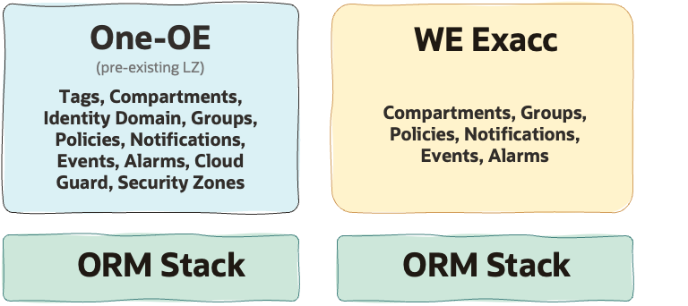

# ExaDB-C@C Workload Extension - Multi-stack Deployment  <!-- omit from toc -->

## **1. Summary**

<table>
  <tbody>
    <tr>
      <td><strong>NAME</strong></td>
      <td>WE ExaDB-C@C Deployment to extend an existing One-OE LZ (Multi-Stack)</td>
    </tr>
    <tr>
      <td><strong>OBJECTIVE</strong></td>
      <td>WE ExaDB-C@C</td>
    </tr>
    <tr>
      <td><strong>TARGET RESOURCES</strong></td>
      <td>compartments, groups, policies, events, alarms and notifications</td>
    </tr>
  </tbody>
</table>

&nbsp;

## **2. Architecture Overview**

 The main reason for using a multi-stack model in OCI Resource Manager (ORM) is to reuse existing assets as building blocks. Instead of deploying everything as a single monolithic stack, the solution is split into independent layers that can be deployed, reused, and extended in a controlled way. This approach also helps reduce coupling, improve traceability, and simplify dependency management across layers.

In this model, the first operation is to deploy [One-OE](https://github.com/oci-landing-zones/oci-landing-zone-operating-entities/tree/master/blueprints/one-oe/runtime/one-stack), which establishes the foundation landing zone structure. Once this base is in place, the environment can be further extended with a Workload Extension (WE) that adds workload-specific resources and configurations. This makes the overall deployment model more modular, reusable, and easier to manage over time.

In this asset, we assume that One-OE has already been deployed, and we focus on the WE ExaDB-C@C deployment.
&nbsp;

## **3. Deployment Steps**

<table>
  <thead>
    <tr>
      <th>USE CASE</th>
      <th>1</th>
      <th>2</th>
      <th>3</th>
    </tr>
  </thead>
  <tbody>
    <tr>
      <td>Description</td>
      <td><a href="../exacc_use_cases/readme.md/#21-shared-exadb-cc-platform-shared-infrastructure-and-shared-vmcsavmcs-across-multiple-environments">shared ExaDB-C@C platform</a></td>
      <td><a href="../exacc_use_cases/readme.md/#22-hybrid-exadb-cc-platform-shared-infrastructure-with-dedicated-vmcsavmcs-per-environment">hybrid ExaDB-C@C platform</a></td>
      <td><a href="../exacc_use_cases/readme.md/#23-dedicated-exadb-cc-platform-fully-dedicated-infrastructure-and-vmcsavmcs-per-environment">dedicated ExaDB-C@C platform</a></td>
    </tr>
    <tr>
      <td>Files</td>
      <td>Deploy the EXACC extension stack with IAM <a href="./exacc_identity_uc1.json">exacc_identity_uc1.json</a> and observability <a href="./exacc_observability_uc1.json">exacc_observability_uc1.json</a>.</td>
      <td>Deploy the EXACC extension stack with IAM <a href="./exacc_identity_uc2.json">exacc_identity_uc2.json</a> and observability <a href="./exacc_observability_uc2.json">exacc_observability_uc2.json</a>.</td>
      <td>Deploy the EXACC extension stack with IAM <a href="./exacc_identity_uc3.json">exacc_identity_uc3.json</a> and observability <a href="./exacc_observability_uc3.json">exacc_observability_uc3.json</a>.</td>
    </tr>
    <tr>
      <td>Deployment</td>
      <td colspan="3">Use the files listed above with Terraform CLI, or stage them in a private Object Storage bucket or approved private source for OCI Resource Manager. Configure outputs and dependencies because pre-existing resources are used. To learn more about this, go <a href="../../../commons/content/orm_bp.md">here</a>.</td>
    </tr>
  </tbody>
</table>

&nbsp;

## **4. Architecture Components**

<table>
  <thead>
    <tr>
      <th>Use Case</th>
      <th>JSON configurations</th>
      <th>Configuration-defined components</th>
      <th>Resources</th>
    </tr>
  </thead>
  <tbody>
    <tr>
      <td rowspan="2"><strong>Use Case 1 (UC1)</strong></td>
      <td><strong>IAM configuration</strong> <a href="exacc_identity_uc1.json">exacc_identity_uc1.json</a></td>
      <td>• ExaDB-C@C compartments • ExaDB-C@C IAM groups and policies</td>
      <td>cmp-lz-shared-exacc, cmp-lz-shared-exacc-db, cmp-lz-shared-exacc-infra, cmp-lz-preprod-proj1-exacc-db, cmp-lz-prod-proj1-exacc-db    grp-lz-global-exacc-db-admin, grp-lz-global-exacc-infra-admin, grp-lz-preprod-proj1-exacc-admin, grp-lz-prod-proj1-exacc-admin    pcy-lz-global-exacc-db-admin, pcy-lz-global-exacc-generic, pcy-lz-global-exacc-infra-admin, pcy-lz-preprod-exacc-proj1-admin, pcy-lz-prod-exacc-proj1-admin</td>
    </tr>
    <tr>
      <td><strong>Observability configuration</strong> <a href="exacc_observability_uc1.json">exacc_observability_uc1.json</a></td>
      <td>• Events • Alarms • Notifications</td>
      <td>rul-lz-notify-on-opctl-events, rul-lz-notify-on-exacc-vmc-events, rul-lz-notify-on-exacc-db-events, rul-lz-notify-on-exacc-infra-events, rul-lz-preprod-notify-on-notifications, rul-lz-prod-notify-on-notifications    al-lz-db-cpuutil, al-lz-vmc-cpuutil, al-lz-vmc-dgutil, al-lz-vmc-fsutil, al-lz-vmc-memutil, al-lz-vmc-swaputil, al-lz-db-storageutil    nott-lz-exacc-db-workloads, nott-lz-exacc-infra-workloads, nott-lz-preprod-exacc-projects, nott-lz-prod-exacc-projects</td>
    </tr>
    <tr>
      <td rowspan="2"><strong>Use Case 2 (UC2)</strong></td>
      <td><strong>IAM configuration</strong> <a href="exacc_identity_uc2.json">exacc_identity_uc2.json</a></td>
      <td>• ExaDB-C@C compartments • ExaDB-C@C IAM groups and policies</td>
      <td>cmp-lz-shared-exacc, cmp-lz-shared-exacc-db, cmp-lz-shared-exacc-infra, cmp-lz-preprod-exacc, cmp-lz-preprod-exacc-db, cmp-lz-preprod-exacc-infra, cmp-lz-preprod-proj1-exacc-db, cmp-lz-prod-exacc, cmp-lz-prod-exacc-db, cmp-lz-prod-exacc-infra, cmp-lz-prod-proj1-exacc-db    grp-lz-global-exacc-db-admin, grp-lz-global-exacc-infra-admin, grp-lz-preprod-proj1-exacc-admin, grp-lz-prod-proj1-exacc-admin    pcy-lz-global-exacc-db-admin, pcy-lz-global-exacc-generic, pcy-lz-global-exacc-infra-admin, pcy-lz-preprod-exacc-proj1-admin, pcy-lz-prod-exacc-proj1-admin</td>
    </tr>
    <tr>
      <td><strong>Observability configuration</strong> <a href="exacc_observability_uc2.json">exacc_observability_uc2.json</a></td>
      <td>• Events • Alarms • Notifications</td>
      <td>rul-lz-notify-on-opctl-events, rul-lz-notify-on-exacc-db-events, rul-lz-notify-on-exacc-infra-events, rul-lz-notify-on-exacc-vmc-events, rul-lz-preprod-notify-on-exacc-db-events, rul-lz-preprod-notify-on-exacc-infra-events, rul-lz-preprod-notify-on-exacc-vmc-events, rul-lz-preprod-notify-on-notifications, rul-lz-prod-notify-on-exacc-db-events, rul-lz-prod-notify-on-exacc-infra-events, rul-lz-prod-notify-on-exacc-vmc-events, rul-lz-prod-notify-on-notifications    al-lz-db-cpuutil, al-lz-vmc-cpuutil, al-lz-vmc-dgutil, al-lz-vmc-fsutil, al-lz-vmc-memutil, al-lz-vmc-swaputil, al-lz-preprod-db-cpuutil, al-lz-preprod-vmc-cpuutil, al-lz-preprod-vmc-dgutil, al-lz-preprod-vmc-fsutil, al-lz-preprod-vmc-memutil, al-lz-preprod-vmc-swaputil, al-lz-preprod-db-storageutil, al-lz-prod-db-cpuutil, al-lz-prod-vmc-cpuutil, al-lz-prod-vmc-dgutil, al-lz-prod-vmc-fsutil, al-lz-prod-vmc-memutil, al-lz-prod-vmc-swaputil, al-lz-prod-db-storageutil, al-lz-db-storageutil    nott-lz-exacc-db-workloads, nott-lz-exacc-infra-workloads, nott-lz-preprod-exacc-projects, nott-lz-prod-exacc-projects</td>
    </tr>
    <tr>
      <td rowspan="2"><strong>Use Case 3 (UC3)</strong></td>
      <td><strong>IAM configuration</strong> <a href="exacc_identity_uc3.json">exacc_identity_uc3.json</a></td>
      <td>• ExaDB-C@C compartments • ExaDB-C@C IAM groups and policies</td>
      <td>cmp-lz-preprod-exacc, cmp-lz-preprod-exacc-db, cmp-lz-preprod-exacc-infra, cmp-lz-preprod-proj1-exacc-db, cmp-lz-prod-exacc, cmp-lz-prod-exacc-db, cmp-lz-prod-exacc-infra, cmp-lz-prod-proj1-exacc-db    grp-lz-global-exacc-db-admin, grp-lz-global-exacc-infra-admin, grp-lz-preprod-proj1-exacc-admin, grp-lz-prod-proj1-exacc-admin    pcy-lz-global-exacc-db-admin, pcy-lz-global-exacc-generic, pcy-lz-global-exacc-infra-admin, pcy-lz-preprod-exacc-proj1-admin, pcy-lz-prod-exacc-proj1-admin</td>
    </tr>
    <tr>
      <td><strong>Observability configuration</strong> <a href="exacc_observability_uc3.json">exacc_observability_uc3.json</a></td>
      <td>• Events • Alarms • Notifications</td>
      <td>rul-lz-preprod-notify-on-exacc-db-events, rul-lz-preprod-notify-on-exacc-infra-events, rul-lz-preprod-notify-on-exacc-vmc-events, rul-lz-preprod-notify-on-notifications, rul-lz-prod-notify-on-exacc-db-events, rul-lz-prod-notify-on-exacc-infra-events, rul-lz-prod-notify-on-exacc-vmc-events, rul-lz-prod-notify-on-notifications    al-lz-preprod-db-cpuutil, al-lz-preprod-vmc-cpuutil, al-lz-preprod-vmc-dgutil, al-lz-preprod-vmc-fsutil, al-lz-preprod-vmc-memutil, al-lz-preprod-vmc-swaputil, al-lz-preprod-db-storageutil, al-lz-prod-db-cpuutil, al-lz-prod-vmc-cpuutil, al-lz-prod-vmc-dgutil, al-lz-prod-vmc-fsutil, al-lz-prod-vmc-memutil, al-lz-prod-vmc-swaputil, al-lz-prod-db-storageutil    nott-lz-preprod-exacc-projects, nott-lz-prod-exacc-projects</td>
    </tr>
  </tbody>
</table>

&nbsp;

# License <!-- omit from toc -->

Copyright (c) 2026 Oracle and/or its affiliates.

Licensed under the Universal Permissive License (UPL), Version 1.0.

See [LICENSE](/LICENSE.txt) for more details.
