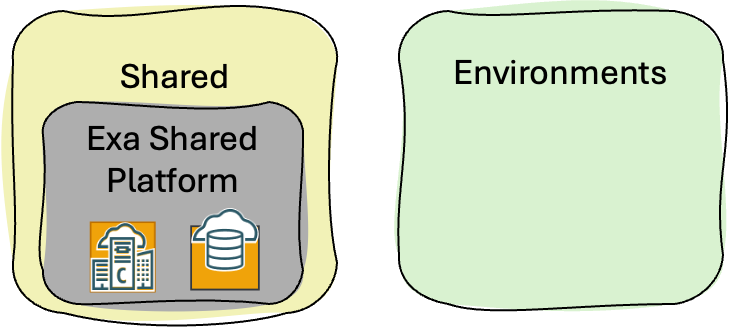
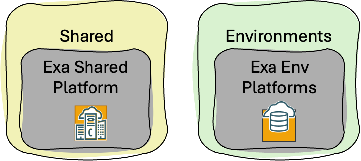
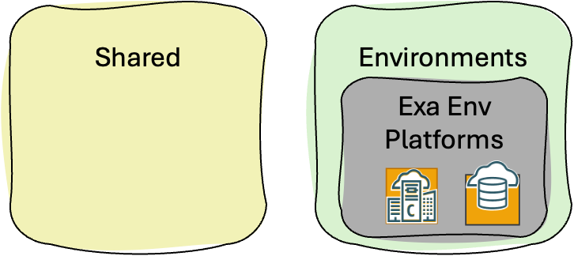

# ExaDB-C@C WE Set-up <!-- omit from toc -->

## **Table of Contents** <!-- omit from toc -->

- [**1. Summary**](#1-summary)
- [**2. Design Overview**](#2-design-overview)
- [**3. Deployment Options**](#3-deployment-options)

&nbsp;

## **1. Summary**

Welcome to the ExaDB-C@C Landing Zone Workload Extension (WE).

The ExaDB-C@C Landing Zone Workload Extension is a secure cloud environment, designed with the best practices to simplify the on-boarding of ExaDB-C@C workloads and enable the continuous operations of their cloud resources. This reference architecture provides an automated landing zone configuration.

&nbsp;

## **2. Design Overview**
This workload extension uses the [One-OE](../../blueprints/one-oe/) Blueprint as the reference Landing Zone and guides the deployment of ExaDB-C@C on top of it. The extension includes a base infrastructure layer that provisions the required OCI resources for deploying ExaDB-C@C. The ExaDB-C@C extension is networkless and does not deploy VCNs, subnets, route tables, or other network resources.

The extension covers three ExaDB-C@C Use Cases (UCs):

1. **Use Case 1 (UC1): Shared ExaDB-C@C Platform**: Shared infrastructure and shared VMCs/AVMCs across multiple environments.
2. **Use Case 2 (UC2): Hybrid ExaDB-C@C Platform**: Shared infrastructure with dedicated VMCs/AVMCs per environment.
3. **Use Case 3 (UC3): Dedicated ExaDB-C@C Platform**: Fully dedicated infrastructure and VMCs/AVMCs per environment.

Published generated artifacts currently support Use Case 1 (UC1), Use Case 2 (UC2), and Use Case 3 (UC3) for both single-stack and multi-stack deployment.

If you have not reviewed it yet, we recommend checking the [ExaDB-C@C use cases section](./exacc_use_cases/readme.md) to better understand the available scenarios and identify the one that best fits your needs.

&nbsp;

## **3. Deployment Options**
&nbsp;

| When to use it / Use Case  | POC or one-shot reference deployment | Extension of an existing Landing Zone or Modular IaC Model. |
|---|---|---|
| Use Case 1 (UC1): Shared ExaDB-C@C Platform   | Use when deploying a new One-OE foundation and the shared ExaDB-C@C platform together in one deployable set without VCN/network resources. Published Use Case 1 artifacts are available in the [single-stack](./single-stack/readme.md) folder. | Use when extending an existing One-OE landing zone with the shared ExaDB-C@C platform. Published Use Case 1 artifacts are available in the [multi-stack](./multi-stack/readme.md) folder. The extension adds IAM and observability only; it does not include network configuration files. |
| Use Case 2 (UC2): Hybrid ExaDB-C@C Platform   | Use when deploying a new One-OE foundation with shared ExaDB-C@C infrastructure and environment-specific VMCs/AVMCs. Published Use Case 2 artifacts are available in the [single-stack](./single-stack/readme.md) folder. | Use when extending an existing One-OE landing zone with shared ExaDB-C@C infrastructure and dedicated environment-level database platform scopes. Published Use Case 2 artifacts are available in the [multi-stack](./multi-stack/readme.md) folder. |
| Use Case 3 (UC3): Dedicated ExaDB-C@C Platform   | Use when deploying a new One-OE foundation where each environment has its own ExaDB-C@C infrastructure and VMCs/AVMCs. Published Use Case 3 artifacts are available in the [single-stack](./single-stack/readme.md) folder. | Use when extending an existing One-OE landing zone with fully environment-dedicated ExaDB-C@C platform scopes. Published Use Case 3 artifacts are available in the [multi-stack](./multi-stack/readme.md) folder. |

&nbsp;

This Landing Zone Extension provides **two deployment approaches**, single-stack and multi-stack, to accommodate different use cases and architectural preferences. Both approaches use the [OCI Landing Zone Orchestrator](https://github.com/oci-landing-zones/terraform-oci-modules-orchestrator).

&nbsp;
# License <!-- omit from toc -->

Copyright (c) 2026 Oracle and/or its affiliates.

Licensed under the Universal Permissive License (UPL), Version 1.0.

See [LICENSE](/LICENSE.txt) for more details.
