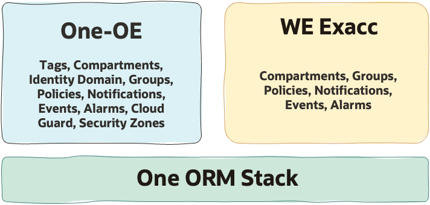

# EXACC Workload Extension - Single-Stack Deployment  <!-- omit from toc -->

## **1. Summary**

| | |
| -------------------- | ----------------------------------------------------- |
| **NAME**         | Complete Landing Zone with EXACC (Single-Stack)                                    |
| **OBJECTIVE**        | Deploy One-oe Landing Zone (No Network Layer) + WE EXACC  |
| **TARGET RESOURCES** | Complete LZ Foundation, IAM, Security, Observability |

&nbsp;

## **2. Architecture Overview**

## **3. Architecture Components**
&nbsp;

<table border="1">
  <thead>
    <tr>
      <th>USE CASE</th>
      <th>1</th>
      <th>2</th>
      <th>3</th>
    </tr>
  </thead>
  <tbody>
    <tr>
      <td colspan="4"><strong>IAM</strong></td>
    </tr>
    <tr>
      <td><strong>WE compartments</strong></td>
      <td>
        cmp-lz-platform &gt; cmp-lz-shared-exacc &gt; cmp-lz-shared-exacc-db 
        cmp-lz-platform &gt; cmp-lz-shared-exacc &gt; cmp-lz-shared-exacc-infra 
        cmp-lz-platform &gt; cmp-lz-prod-projects &gt; cmp-lz-prod-proj1 &gt; cmp-lz-prod-proj1-db 
        cmp-lz-platform &gt; cmp-lz-preprod-projects &gt; cmp-lz-preprod-proj1 &gt; cmp-lz-preprod-proj1-db
      </td>
      <td></td>
      <td></td>
    </tr>
    <tr>
      <td><strong>WE groups</strong></td>
      <td>
        grp-lz-global-exacc-db-admin, 
        grp-lz-global-exacc-infra-admin, 
        grp-lz-preprod-proj1-exacc-admin, 
        grp-lz-preprod-proj1-exacc-admin
      </td>
      <td>-</td>
      <td>-</td>
    </tr>
    <tr>
      <td><strong>WE policies</strong></td>
      <td>
        pcy-lz-global-exacc-db-admin, 
        pcy-lz-global-exacc-generic, 
        pcy-lz-global-exacc-infra-admin, 
        pcy-lz-preprod-exacc-proj1-admin, 
        pcy-lz-prod-exacc-proj1-admin
      </td>
      <td>-</td>
      <td>-</td>
    </tr>
    <tr>
      <td colspan="4"><strong>OBSERVABILITY</strong></td>
    </tr>
    <tr>
      <td><strong>WE Alarms</strong></td>
      <td>
        al-lz-db-cpuutil, 
        al-lz-vmc-cpuutil, 
        al-lz-vmc-dgutil, 
        al-lz-vmc-fsutil, 
        al-lz-vmc-memutil, 
        al-lz-vmc-swaputil, 
        al-lz-db-storageutil
      </td>
      <td>-</td>
      <td>-</td>
    </tr>
    <tr>
      <td><strong>WE Events</strong></td>
      <td>
        rul-lz-notify-on-opctl-events, 
        rul-lz-notify-on-exacc-vmc-events, 
        rul-lz-notify-on-exacc-db-events, 
        rul-lz-notify-on-exacc-infra-events
      </td>
      <td>-</td>
      <td>-</td>
    </tr>
  </tbody>
</table>

## **5. Deployment Steps**

| USE CASE | 1 | 2 | 3 |
|----------|---|---|---|
| Description | [Shared exacc platform](../exacc_use_cases/readme.md/#21-shared-exadb-cc-platform-shared-infrastructure-and-shared-vmcsavmcs-across-multiple-environments) |  |  |
| Deployment | CIS v1 [](https://cloud.oracle.com/resourcemanager/stacks/create?zipUrl=https://github.com/oci-landing-zones/terraform-oci-modules-orchestrator/archive/refs/tags/v2.1.0.zip&zipUrlVariables={"input_config_files_urls":"https://raw.githubusercontent.com/oci-landing-zones/oci-landing-zone-operating-entities/refs/heads/we_exacc_update/workload-extensions/exacc/single-stack/exacc_governance_uc1.json,https://raw.githubusercontent.com/oci-landing-zones/oci-landing-zone-operating-entities/refs/heads/we_exacc_update/workload-extensions/exacc/single-stack/exacc_identity_uc1.json,https://raw.githubusercontent.com/oci-landing-zones/oci-landing-zone-operating-entities/refs/heads/we_exacc_update/workload-extensions/exacc/single-stack/exacc_observability_cis1_uc1.json,https://raw.githubusercontent.com/oci-landing-zones/oci-landing-zone-operating-entities/refs/heads/we_exacc_update/workload-extensions/exacc/single-stack/exacc_security_cis1_uc1.json"})   CIS v2 [](https://cloud.oracle.com/resourcemanager/stacks/create?zipUrl=https://github.com/oci-landing-zones/terraform-oci-modules-orchestrator/archive/refs/tags/v2.1.0.zip&zipUrlVariables={"input_config_files_urls":"https://raw.githubusercontent.com/oci-landing-zones/oci-landing-zone-operating-entities/refs/heads/we_exacc_update/workload-extensions/exacc/single-stack/exacc_governance_uc1.json,https://raw.githubusercontent.com/oci-landing-zones/oci-landing-zone-operating-entities/refs/heads/we_exacc_update/workload-extensions/exacc/single-stack/exacc_identity_uc1.json,https://raw.githubusercontent.com/oci-landing-zones/oci-landing-zone-operating-entities/refs/heads/we_exacc_update/workload-extensions/exacc/single-stack/exacc_observability_cis2_uc1.json,https://raw.githubusercontent.com/oci-landing-zones/oci-landing-zone-operating-entities/refs/heads/we_exacc_update/workload-extensions/exacc/single-stack/exacc_security_cis2_uc1.json"}.)   To read some best practices about how to use ORM go [here](../../../blueprints/one-oe/runtime/one-stack/orm_bp.md).| Coming Soon | Coming Soon |
|Files|CIS v1: [governance](./exacc_governance_uc1.json), [iam](./exacc_identity_uc1.json), [observability CIS v1](./exacc_observability_cis1_uc1.json), [security CIS v1](./exacc_security_cis1_uc1.json)   CIS v2:  [governance](./exacc_governance_uc1.json), [iam](./exacc_identity_uc1.json), [observability CIS v2](./exacc_observability_cis2_uc1.json), [security CIS v2](./exacc_security_cis2_uc1.json) |

&nbsp;

# License <!-- omit from toc -->

Copyright (c) 2026 Oracle and/or its affiliates.

Licensed under the Universal Permissive License (UPL), Version 1.0.

See [LICENSE](/LICENSE.txt) for more details.
