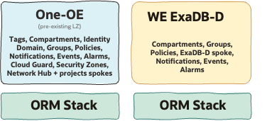

# ExaDB-D Workload Extension - Multi-stack Deployment  <!-- omit from toc -->

## **1. Summary**

| | |
| -------------------- | ----------------------------------------------------- |
| **NAME**         | WE ExaDB-D Deployment to extend an existing One-oe LZ (Multi-Stack)                                    |
| **OBJECTIVE**        |  WE ExaDB-D   |
| **TARGET RESOURCES** | compartments, groups, policies, network, events, alarms and notifications |

&nbsp;

## **2. Architecture Overview**

## **3. Architecture Components**
&nbsp;

<table border="1">
  <thead>
    <tr>
      <th>USE CASE</th>
      <th>1</th>
      <th>2</th>
      <th>3</th>
    </tr>
  </thead>
  <tbody>
    <tr>
      <td colspan="4"><strong>IAM</strong></td>
    </tr>
    <tr>
      <td><strong>WE compartments</strong></td>
      <td>
        cmp-lz-platform &gt; cmp-lz-shared-exacs &gt; cmp-lz-shared-exacs-db 
        cmp-lz-platform &gt; cmp-lz-shared-exacs &gt; cmp-lz-shared-exacs-infra 
        cmp-lz-platform &gt; cmp-lz-prod-projects &gt; cmp-lz-prod-proj1 &gt; cmp-lz-prod-proj1-db 
        cmp-lz-platform &gt; cmp-lz-preprod-projects &gt; cmp-lz-preprod-proj1 &gt; cmp-lz-preprod-proj1-db
      </td>
      <td></td>
      <td></td>
    </tr>
    <tr>
      <td><strong>WE groups</strong></td>
      <td>
        grp-lz-global-exacs-db-admin, 
        grp-lz-global-exacs-infra-admin, 
        grp-lz-preprod-proj1-exacs-admin, 
        grp-lz-preprod-proj1-exacs-admin
      </td>
      <td>-</td>
      <td>-</td>
    </tr>
    <tr>
      <td><strong>WE policies</strong></td>
      <td>
        pcy-lz-global-exacs-db-admin, 
        pcy-lz-global-exacs-generic, 
        pcy-lz-global-exacs-infra-admin, 
        pcy-lz-preprod-exacs-proj1-admin, 
        pcy-lz-prod-exacs-proj1-admin
      </td>
      <td>-</td>
      <td>-</td>
    </tr>
    <tr>
      <td colspan="4"><strong>OBSERVABILITY</strong></td>
    </tr>
    <tr>
      <td><strong>WE Alarms</strong></td>
      <td>
        al-lz-db-cpuutil, 
        al-lz-vmc-cpuutil, 
        al-lz-vmc-dgutil, 
        al-lz-vmc-fsutil, 
        al-lz-vmc-memutil, 
        al-lz-vmc-swaputil, 
        al-lz-db-storageutil
      </td>
      <td>-</td>
      <td>-</td>
    </tr>
    <tr>
      <td><strong>WE Events</strong></td>
      <td>
        rul-lz-notify-on-opctl-events, 
        rul-lz-notify-on-exacs-vmc-events, 
        rul-lz-notify-on-exacs-db-events, 
        rul-lz-notify-on-exacs-infra-events
      </td>
       <td>-</td>
      <td>-</td>
    </tr>
    <tr>
      <td colspan="4"><strong>NETWORK</strong></td>
    </tr>
    <tr>
      <td><strong>WE VCN and Subnets</strong></td>
      <td>
      </td>
      <td>-</td>
      <td>-</td>
    </tr>
    <tr>
      <td><strong>WE RTs and SLs</strong></td>
      <td>
      </td>
      <td>-</td>
      <td>-</td>
    </tr>
  </tbody>
</table>

&nbsp;

## **5. Deployment Steps**

| USE CASE | 1 | 2 | 3 |
|----------|---|---|---|
| Description | [Shared exacs platform](../exacs_use_cases/readme.md/#21-shared-exadb-d-platform-shared-infrastructure-and-shared-vmcsavmcs-across-multiple-environments) |  |  |
| Deployment | [](https://cloud.oracle.com/resourcemanager/stacks/create?zipUrl=https://github.com/oci-landing-zones/terraform-oci-modules-orchestrator/archive/refs/tags/v2.1.0.zip&zipUrlVariables={"input_config_files_urls":"https://raw.githubusercontent.com/oci-landing-zones/oci-landing-zone-operating-entities/refs/heads/we_exacc_update/workload-extensions/exacs/multi-stack/exacs_identity_uc1.json,https://raw.githubusercontent.com/oci-landing-zones/oci-landing-zone-operating-entities/refs/heads/we_exacc_update/workload-extensions/exacs/multi-stack/exacs_observability_uc1_pre.json,https://raw.githubusercontent.com/oci-landing-zones/oci-landing-zone-operating-entities/refs/heads/we_exacc_update/workload-extensions/exacs/multi-stack/exacs_network_uc1_pre.json"}). To deploy with ORM, you’ll need to configure outputs and dependencies, since pre-existing resources will be used. To learn more about this, go here.| Soon | Soon |
|Files|  [iam](./exacs_identity_uc1.json), [observability without VCN Flow logs](./exacs_observability_uc1_pre.json) , [observability with VCN Flow logs](./exacs_observability_uc1.json), [network, shared exacs spoke vcn](./exacs_network_uc1_pre.json) , [network, one-oe update to add attachment and RTs](./oneoe_network_hub_e_post.json) |

&nbsp;

# License <!-- omit from toc -->

Copyright (c) 2026 Oracle and/or its affiliates.

Licensed under the Universal Permissive License (UPL), Version 1.0.

See [LICENSE](/LICENSE.txt) for more details.
