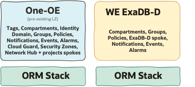

# ExaDB-D Workload Extension — Multi-stack Deployment <!-- omit from toc -->

- [1. Summary](#1-summary)
- [2. Architecture Overview](#2-architecture-overview)
- [3. Configuration Files](#3-configuration-files)
- [4. Deployment Steps](#4-deployment-steps)
- [5. Post-Deployment Configuration](#5-post-deployment-configuration)
- [6. Customization](#6-customization)
- [7. Troubleshooting](#7-troubleshooting)
- [8. Cleanup](#8-cleanup)
- [9. Additional Resources](#9-additional-resources)

## 1. Summary

| Item | Description |
| --- | --- |
| Scope | ExaDB-D foundation for UC1–UC3 added to an existing One-OE landing zone |
| Resources | ExaCS compartments, IAM, networking, and observability |
| State | One extension state, separate from the One-OE foundation state |
| Workload | Three optional regular database workload states after the foundation flow |

OCI Resource Manager (ORM) with configuration files in a customer-controlled private OCI Object Storage bucket is the recommended delivery path. Use the pinned OCI Landing Zone Orchestrator source with working directory `rms-facade`. Terraform CLI, customer-controlled CI/CD, and an approved private Git source are supported alternatives.

## 2. Architecture Overview

The multi-stack package adds ExaDB-D prerequisites to an existing One-OE foundation. The extension owns the ExaCS compartments and networks. A matching hub post-update in the existing One-OE state completes the routes and DRG integration.

Published foundations support Hub A and Hub E. Hub A provides firewall-based routing and is the published option for production. Hub E has no firewall and is reserved for PoC, lab, or explicitly non-production designs that accept that tradeoff. Match the extension network and hub post-update to the existing hub.

| Use case | Infrastructure placement | Database platform placement |
| --- | --- | --- |
| UC1 — Shared | One shared infrastructure | Shared VMCs/AVMCs |
| UC2 — Hybrid | One shared infrastructure | Dedicated VMCs/AVMCs per environment |
| UC3 — Dedicated | Dedicated infrastructure per environment | Dedicated VMCs/AVMCs per environment |

See the [ExaDB-D use cases](../exacs_use_cases/readme.md) for the placement diagrams. Foundations prepare compartments, IAM, networking, and observability for these placements. The optional [regular database workload](../database-workload/readme.md) creates the Cloud Exadata Infrastructure, VMCs, DB Homes, CDBs, and PDBs. Autonomous lifecycle is outside that workload contract.

UC1 uses one shared ExaCS platform network. UC2 uses shared infrastructure without a shared VCN and separate environment database networks. UC3 uses separate infrastructure and database networks in each environment.

| Use case | Compartments and administration roles | Platform network |
| --- | --- | --- |
| UC1 | Shared infrastructure/database compartments; Global Infra and Global DBA roles; Project DBA roles for Autonomous project tiers | One shared ExaCS VCN |
| UC2 | Shared infrastructure and environment database compartments; Global Infra umbrella plus environment Infra/DBA roles with shared-infrastructure dependency permissions | One ExaCS VCN per environment; the shared infrastructure scope is networkless |
| UC3 | Infrastructure/database compartments and Infra/DBA roles per environment; no global ExaCS administration group | One ExaCS VCN per environment |

The published foundation IAM also prepares `proj1` Autonomous project DB tiers. The regular database workload does not create Autonomous databases or use those project tiers.

## 3. Configuration Files

Select one UC and one hub variant. Apply the extension pre files, then the matching One-OE hub post file, then the extension final network and observability files.

| Use case | Identity | Network: initial → final | One-OE hub post-update | Observability: initial → final |
| --- | --- | --- | --- | --- |
| UC1 | [exacs_identity_uc1.json](exacs_identity_uc1.json) | `exacs_network_uc1_a_pre.json` → `exacs_network_uc1_a.json`, or `exacs_network_uc1_e_pre.json` → `exacs_network_uc1_e.json` | [oneoe_network_hub_a_post.json](oneoe_network_hub_a_post.json) or [oneoe_network_hub_e_post.json](oneoe_network_hub_e_post.json) | `exacs_observability_uc1_pre.json` → `exacs_observability_uc1.json` |
| UC2 | [exacs_identity_uc2.json](exacs_identity_uc2.json) | `exacs_network_uc2_a_pre.json` → `exacs_network_uc2_a.json`, or `exacs_network_uc2_e_pre.json` → `exacs_network_uc2_e.json` | [oneoe_network_hub_a_uc2_post.json](oneoe_network_hub_a_uc2_post.json) or [oneoe_network_hub_e_uc2_post.json](oneoe_network_hub_e_uc2_post.json) | `exacs_observability_uc2_pre.json` → `exacs_observability_uc2.json` |
| UC3 | [exacs_identity_uc3.json](exacs_identity_uc3.json) | `exacs_network_uc3_a_pre.json` → `exacs_network_uc3_a.json`, or `exacs_network_uc3_e_pre.json` → `exacs_network_uc3_e.json` | [oneoe_network_hub_a_uc3_post.json](oneoe_network_hub_a_uc3_post.json) or [oneoe_network_hub_e_uc3_post.json](oneoe_network_hub_e_uc3_post.json) | `exacs_observability_uc3_pre.json` → `exacs_observability_uc3.json` |

IAM prepares the selected ExaCS compartments and administration roles. Network files prepare the platform VCNs, `db` and `backup` subnets, gateways, routing, and security lists. The hub post file updates routes, attachments, and DRG distributions in the existing One-OE network. Final observability enables network-dependent flow logs.

## 4. Deployment Steps

### Prerequisites

- An existing [One-OE foundation](/blueprints/one-oe/runtime/one-stack/readme.md) with Hub A or Hub E and persistent dependency outputs.
- Reviewed UC, region, non-overlapping CIDRs, administration roles, and matching foundation keys.
- Private configuration and dependency locations, with a separate extension state/output location.
- The pinned Orchestrator version selected for the foundation deployment workflow.

### OCI Resource Manager

1. Stage the selected ExaCS identity, pre network, and pre observability files with the required One-OE dependencies in a private Object Storage bucket.
2. Create a separate extension stack using the pinned Orchestrator source and working directory `rms-facade`. Review and apply its plan.
3. Re-apply the existing One-OE stack with the matching hub post-update. Replace only its network document and retain IAM, governance, security, observability, and every other unchanged family.
4. Re-apply the ExaCS extension stack with the final network and observability documents. Retain the matching identity document and foundation dependencies.
5. Review each saved plan and confirm routing and flow logs before starting the optional database workload.

Provide one document per top-level configuration family in each operation. Supply the selected pre or final variant, rather than both together.

### Terraform CLI

Use the same selected file sets and sequence with the pinned Orchestrator source. Keep the original One-OE state and the separate ExaCS extension state, tfvars, and outputs explicit. Retain all unchanged input families on each re-apply. See the [Terraform CLI guidance](/commons/content/terraform.md) for authentication and plan/apply commands.

## 5. Post-Deployment Configuration

Complete the **hub post-update** and final network and observability re-applies before starting a regular database workload. Published workloads cover UC1–UC3; use the [database workload guide](../database-workload/multi-stack/readme.md) and its validated Orchestrator pin. It adds three independent states for infrastructure, VMCs, and database objects. Each downstream stage consumes only the immediately preceding stage's `cloud_exadata_database_output.json` through `exadata_database_dependency`, alongside its applicable foundation dependencies.

Autonomous VM Clusters, Autonomous Container Databases, and Autonomous Database Dedicated lifecycle require **Manual post-deployment configuration** under the workload owner's lifecycle, drift, and compliance controls.

## 6. Customization

Use [Blueprint Factory](/addons/oci-lz-blueprint-factory/README.md) when the published shape does not fit the required environments, placement, projects, network ranges, or hub. The [configuration reference](/addons/oci-lz-blueprint-factory/blueprint-factory-configuration-reference.md) describes the supported input. Keep the source configuration and generated outputs in separate, explicit locations and deploy the generated working set together.

For regular Exadata Database Service, omit `project_db_compartments`. That setting is only for Autonomous Database Dedicated project tiers. Infrastructure-only scopes have no VCN; VMC/AVMC placement requires the ExaCS platform network with `db` and `backup` subnets.

## 7. Troubleshooting

| Symptom | Check |
| --- | --- |
| A configuration key cannot be resolved | Check the selected use case, matching foundation keys, and any required dependency output files. |
| Flow logs cannot be created | Apply the pre observability configuration first, then use its final counterpart after network resources exist. |
| A re-apply plans unexpected deletion | Retain every unchanged configuration family and use the original state. Replace only the selected pre/post documents. |
| Database network connectivity fails | Check the platform `db`/`backup` subnets, NSGs or security lists, DRG attachments, and the matching hub routes. |
| A workload refers to a compartment or subnet from another use case | Select the workload and foundation files for the same UC and review the key references before applying. |

## 8. Cleanup

Destroy dependent database workloads before the extension foundation. Review backups, retained data, and each destroy plan. Keep the One-OE foundation and required dependencies available until dependent extension resources are removed, then review the hub routing update in its original state.

## 9. Additional Resources

- [ExaDB-D workload extension overview](../readme.md)
- [ExaDB-D use cases](../exacs_use_cases/readme.md)
- [Database workload deployment](../database-workload/readme.md)
- [ORM deployment guidance](/commons/content/orm_bp.md)

## License <!-- omit from toc -->

Copyright (c) 2026 Oracle and/or its affiliates.

Licensed under the Universal Permissive License (UPL), Version 1.0.

See [LICENSE](/LICENSE.txt) for more details.
