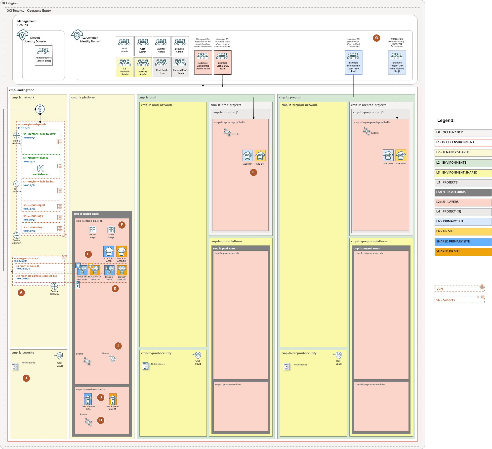
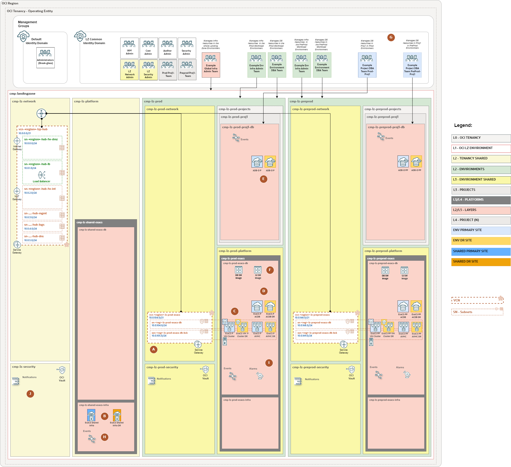
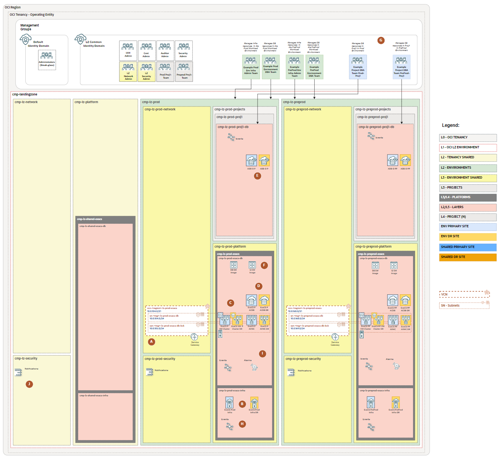

# ExaDB-D WE Set-up <!-- omit from toc -->

## **Table of Contents** <!-- omit from toc -->

- [**1. Summary**](#1-summary)
- [**2. Design Overview**](#2-design-overview)
- [**3. Deployment Options**](#3-deployment-options)

&nbsp;

## **1. Summary**

Welcome to the ExaDB-D Landing Zone Workload Extension (WE).

The ExaDB-D Landing Zone Workload Extension is a secure cloud environment, designed with the best practices to simplify the on-boarding of ExaDB-D workloads and enable the continuous operations of their cloud resources. This reference architecture provides an automated landing zone configuration.

&nbsp;

## **2. Design Overview**
This workload extension uses the [One-OE](../../blueprints/one-oe/) Blueprint as the reference Landing Zone and guides the deployment of ExaDB-D on top of it. The extension includes a base infrastructure layer that provisions the required OCI resources for deploying ExaDB-D.

The extension covers three ExaDB-D Use Cases (UCs):

1. **Use Case 1 (UC1): Shared ExaDB-D Platform**: Shared infrastructure and shared VMCs/AVMCs across multiple environments.
2. **Use Case 2 (UC2): Hybrid ExaDB-D Platform**: Shared infrastructure with dedicated VMCs/AVMCs per environment.
3. **Use Case 3 (UC3): Dedicated ExaDB-D Platform**: Fully dedicated infrastructure and VMCs/AVMCs per environment.

Published generated artifacts currently support Use Case 1 (UC1), Use Case 2 (UC2), and Use Case 3 (UC3) for both single-stack and multi-stack deployment.

If you have not reviewed it yet, we recommend checking the [ExaDB-D use cases section](./exacs_use_cases/readme.md) to better understand the available scenarios and identify the one that best fits your needs.

&nbsp;

## **3. Deployment Options**

&nbsp;

<table width="100%">
  <thead>
    <tr>
      <th width="34%">When to use it / Use Case</th>
      <th width="33%">Single-stack POC or one-shot reference deployment</th>
      <th width="33%">Multi-stack Extension of an existing Landing Zone or Modular IaC Model</th>
    </tr>
  </thead>
  <tbody>
    <tr>
      <td width="34%">Use Case 1 (UC1): Shared ExaDB-D Platform  </td>
      <td width="33%">Use when deploying a new One-OE Hub E foundation and the shared ExaDB-D platform together in one deployable set. Published Use Case 1 artifacts are available in the <a href="./single-stack/readme.md">single-stack</a> folder and include the Hub E network configuration.</td>
      <td width="33%">Use when extending an existing One-OE landing zone with the shared ExaDB-D platform. Published Use Case 1 artifacts are available in the <a href="./multi-stack/readme.md">multi-stack</a> folder. Choose the Hub A or Hub E network and hub-post files according to the hub used by the existing One-OE deployment.</td>
    </tr>
    <tr>
      <td width="34%">Use Case 2 (UC2): Hybrid ExaDB-D Platform  </td>
      <td width="33%">Use when deploying a new One-OE Hub E foundation with shared ExaDB-D infrastructure and environment-specific VMCs/AVMCs. Published Use Case 2 artifacts are available in the <a href="./single-stack/readme.md">single-stack</a> folder and include the Hub E network configuration.</td>
      <td width="33%">Use when extending an existing One-OE landing zone with shared ExaDB-D infrastructure and dedicated environment-level database platform scopes. Published Use Case 2 artifacts are available in the <a href="./multi-stack/readme.md">multi-stack</a> folder. Choose the Hub A or Hub E network and hub-post files according to the hub used by the existing One-OE deployment.</td>
    </tr>
    <tr>
      <td width="34%">Use Case 3 (UC3): Dedicated ExaDB-D Platform  </td>
      <td width="33%">Use when deploying a new One-OE Hub E foundation where each environment has its own ExaDB-D infrastructure and VMCs/AVMCs. Published Use Case 3 artifacts are available in the <a href="./single-stack/readme.md">single-stack</a> folder and include the Hub E network configuration.</td>
      <td width="33%">Use when extending an existing One-OE landing zone with fully environment-dedicated ExaDB-D platform scopes. Published Use Case 3 artifacts are available in the <a href="./multi-stack/readme.md">multi-stack</a> folder. Choose the Hub A or Hub E network and hub-post files according to the hub used by the existing One-OE deployment.</td>
    </tr>
  </tbody>
</table>

&nbsp;

> **Note:** The published deployment options include only the hub variants documented in the blueprint artifacts. If you need to use a different hub, create custom configuration files by running the Factory blueprint and use the generated files for deployment instead of the published examples.

&nbsp;

This Landing Zone Extension provides **two deployment approaches**, single-stack and multi-stack, to accommodate different use cases and architectural preferences. Both approaches use the [OCI Landing Zone Orchestrator](https://github.com/oci-landing-zones/terraform-oci-modules-orchestrator).

&nbsp;

# License <!-- omit from toc -->

Copyright (c) 2026 Oracle and/or its affiliates.

Licensed under the Universal Permissive License (UPL), Version 1.0.

See [LICENSE](/LICENSE.txt) for more details.
