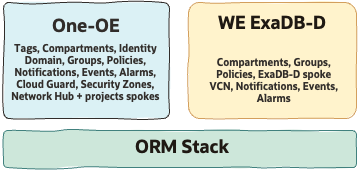

# ExaDB-D Workload Extension - Single-Stack Deployment <!-- omit from toc -->

## **1. Summary**

<table>
  <tbody>
    <tr>
      <td><strong>NAME</strong></td>
      <td>Complete Landing Zone with ExaDB-D (Single-Stack)</td>
    </tr>
    <tr>
      <td><strong>OBJECTIVE</strong></td>
      <td>Deploy One-OE Hub E Landing Zone + WE ExaDB-D</td>
    </tr>
    <tr>
      <td><strong>TARGET RESOURCES</strong></td>
      <td>Complete LZ Foundation, Network, IAM, Governance, Security, Observability</td>
    </tr>
  </tbody>
</table>

&nbsp;

## **2. Architecture Overview**

In a single-stack model in OCI Resource Manager (ORM), the deployment is managed as a single operation that combines the required landing zone components into one stack. This approach is useful when you want a simpler execution model, with a single lifecycle for planning, applying, and managing the environment.

In this model, the Landing Zone Foundations, the One-OE foundation, and the required Workload Extension (WE) are deployed together as part of the same stack. While this model offers less modularity than a multi-stack approach, it can reduce operational overhead for simpler scenarios and provide a more straightforward deployment flow. It still benefits from ORM capabilities such as managed state, centralized job visibility, and controlled execution, but without the need to manage cross-stack dependencies between layers.

&nbsp;

&nbsp;

## **3. Architecture Components**

| JSON configurations | Configuration-defined components | Resources |
|:-|:-|:-|
| **IAM configuration**  [exacs_identity_uc1.json](exacs_identity_uc1.json) | • Landing Zone and ExaDB-D compartments  • Landing Zone and ExaDB-D IAM groups and policies | cmp-landingzone, cmp-lz-network, cmp-lz-platform, cmp-lz-shared-exacs, cmp-lz-shared-exacs-db, cmp-lz-shared-exacs-infra, cmp-lz-preprod, cmp-lz-preprod-network, cmp-lz-preprod-platform, cmp-lz-preprod-exacs, cmp-lz-preprod-exacs-db, cmp-lz-preprod-exacs-infra, cmp-lz-preprod-projects, cmp-lz-preprod-proj1, cmp-lz-preprod-proj1-exacs-db, cmp-lz-preprod-security, cmp-lz-prod, cmp-lz-prod-network, cmp-lz-prod-platform, cmp-lz-prod-exacs, cmp-lz-prod-exacs-db, cmp-lz-prod-exacs-infra, cmp-lz-prod-projects, cmp-lz-prod-proj1, cmp-lz-prod-proj1-exacs-db, cmp-lz-prod-security, cmp-lz-security    grp-auditors-admin, grp-cost-admin, grp-iam-admin, grp-lz-global-exacs-db-admin, grp-lz-global-exacs-infra-admin, grp-lz-network-admin, grp-lz-preprod-proj1-exacs-admin, grp-lz-preprod-proj1-admin, grp-lz-prod-proj1-exacs-admin, grp-lz-prod-proj1-admin, grp-lz-security-admin, grp-security-admin    pcy-auditing-admin, pcy-cost-admin, pcy-generic-admin, pcy-iam-admin, pcy-lz-global-exacs-db-admin, pcy-lz-global-exacs-generic, pcy-lz-global-exacs-infra-admin, pcy-lz-network-admin, pcy-lz-preprod-exacs-proj1-admin, pcy-lz-preprod-proj1-admin, pcy-lz-preprod-proj1-admin-net, pcy-lz-preprod-proj1-admin-sec, pcy-lz-prod-exacs-proj1-admin, pcy-lz-prod-proj1-admin, pcy-lz-prod-proj1-admin-net, pcy-lz-prod-proj1-admin-sec, pcy-lz-security-admin, pcy-security-admin, pcy-services-admin |
| **Governance configuration**  [exacs_governance_uc1.json](exacs_governance_uc1.json) | • Tag namespace and tag definitions | tagns-lz-role, tag-lz-role |
| **Network configuration**  [exacs_network_hub_e.json](exacs_network_hub_e.json) | • Hub E, spoke, and shared ExaDB-D VCN resources  • Subnets, route tables, gateways, DRG attachments, security lists, NSGs, and public load balancer resources | vcn-fra-lz-hub, vcn-fra-lz-prod-projects, vcn-fra-lz-preprod-projects, vcn-fra-lz-shared-exacs    sn-fra-lz-hub-lb, sn-fra-lz-hub-mgmt, sn-fra-lz-hub-mon, sn-fra-lz-hub-dns, sn-fra-lz-prod-web, sn-fra-lz-prod-app, sn-fra-lz-prod-db, sn-fra-lz-prod-infra, sn-fra-lz-preprod-web, sn-fra-lz-preprod-app, sn-fra-lz-preprod-db, sn-fra-lz-preprod-infra, sn-fra-lz-shared-exacs-db, sn-fra-lz-shared-exacs-backup    rt-fra-lz-hub-lb, rt-fra-lz-hub-mgmt, rt-fra-lz-prod-proj-generic, rt-fra-lz-preprod-proj-generic, rt-fra-lz-shared-exacs-generic    drg-fra-lz-hub, drgatt-fra-lz-hub, drgatt-fra-lz-prod-proj, drgatt-fra-lz-preprod-proj, drgatt-fra-lz-shared-exacs, drgrd-fra-lz-hub, drgrd-fra-lz-spoke, drgrt-fra-lz-hub, drgrt-fra-lz-spokes    sl-fra-lz-hub-lb, sl-fra-lz-hub-mgmt, sl-fra-lz-prod-proj-generic, sl-fra-lz-preprod-proj-generic, sl-fra-lz-shared-exacs-generic    nsg-fra-lz-hub-lb, nsg-fra-lz-prod-proj1-web, nsg-fra-lz-prod-proj1-app, nsg-fra-lz-prod-proj1-db, nsg-fra-lz-preprod-proj1-web, nsg-fra-lz-preprod-proj1-app, nsg-fra-lz-preprod-proj1-db    igw-fra-lz-hub, ngw-fra-lz-hub, ngw-fra-lz-prod-proj, ngw-fra-lz-preprod-proj, ngw-fra-lz-shared-exacs, sgw-fra-lz-hub, sgw-fra-lz-prod-proj, sgw-fra-lz-preprod-proj, sgw-fra-lz-shared-exacs    lb-fra-lz-prod-01, lblsnr-fra-lz-prod-01, lbbkst-fra-lz-prod-01, lbbkst-fra-lz-prod-02, lbrt_fra_lz_prod_01 |
| **Security configuration**  **CIS v1**: [exacs_security_cis1_uc1.json](exacs_security_cis1_uc1.json)  **CIS v2**: [exacs_security_cis2_uc1.json](exacs_security_cis2_uc1.json) | • Cloud Guard target  • Security Zone recipes and targets  • Vulnerability scanning resources  • CIS v2 Vault and key resources | **Common**: cg-tgt-root, sz-rcp-lz-01-cis-l1, sz-rcp-lz-02-cis-l2, sz-rcp-lz-03-shared-network, sz-rcp-lz-04-environment-network, sz-rcp-lz-05-workload, sz-tgt-lz-prod-environment-network, sz-tgt-lz-prod-proj1, sz-tgt-lz-shared-network, vss-rcph-lz, vss-tgth-lz    **CIS v1 only**: sz-tgt-lz-cis-l1    **CIS v2 only**: key-lz-shared-oss-audit-bkt, sz-tgt-lz-cis-l2, vlt-lz-shared-security |
| **Observability configuration**  **CIS v1 pre**: [exacs_observability_cis1_uc1_pre.json](exacs_observability_cis1_uc1_pre.json)  **CIS v1 final**: [exacs_observability_cis1_uc1.json](exacs_observability_cis1_uc1.json)  **CIS v2 pre**: [exacs_observability_cis2_uc1_pre.json](exacs_observability_cis2_uc1_pre.json)  **CIS v2 final**: [exacs_observability_cis2_uc1.json](exacs_observability_cis2_uc1.json) | • Events  • Alarms  • Notifications  • VCN and subnet flow logs  • Service connector components | **Common resources**: rul-lz-notify-on-cloudguard-changes, rul-lz-notify-on-exacs-db-events, rul-lz-notify-on-exacs-infra-events, rul-lz-notify-on-exacs-vmc-events, rul-lz-notify-on-iam-changes, rul-lz-notify-on-opctl-events, rul-lz-notify-network, rul-lz-notify-security, rul-lz-preprod-notify-on-notifications, rul-lz-preprod-notify-network, rul-lz-preprod-notify-security, rul-lz-prod-notify-on-notifications, rul-lz-prod-notify-network, rul-lz-prod-notify-security    al-lz-db-cpuutil, al-lz-db-storageutil, al-lz-network-lb, al-lz-vmc-cpuutil, al-lz-vmc-dgutil, al-lz-vmc-fsutil, al-lz-vmc-memutil, al-lz-vmc-swaputil    nott-lz-cloudguard, nott-lz-exacs-db-workloads, nott-lz-exacs-infra-workloads, nott-lz-iam, nott-lz-network, nott-lz-preprod-exacs, nott-lz-prod-exacs, nott-lz-security    lgrp-lz-preprod-vcn-flow, lgrp-lz-prod-vcn-flow, lgrp-lz-vcn-flow    bkt-lz-service-connector, sch-lz-monitor, service-connector-audit-policy    **Final observability only**: VCN and subnet flow-log definitions for shared, production, and pre-production network compartments.    **CIS-specific configuration**: CIS v1 sets `cis_level: 1` on `bkt-lz-service-connector`; CIS v2 sets `cis_level: 2` and adds `kms_key_id: KEY-LZ-SHARED-OSS-AUDIT-BKT-KEY` to the same bucket. |

The published single-stack UC1 example uses one shared EXACS platform VCN with database and backup subnets. It also creates environment EXACS platform compartments and project-level EXACS database compartments for `prod` and `preprod` so the published artifacts continue to cover multiple ExaDB-D placement use cases.

Published generated artifacts in this folder currently cover UC1. UC2 and UC3 are retained as design guidance and require config-driven generation before use.

&nbsp;

## **4. Deployment Steps**

<table>
  <thead>
    <tr>
      <th>USE CASE</th>
      <th>1</th>
      <th>Notes</th>
    </tr>
  </thead>
  <tbody>
    <tr>
      <td>Description</td>
      <td><a href="../exacs_use_cases/readme.md/#21-shared-exadb-d-platform-shared-infrastructure-and-shared-vmcsavmcs-across-multiple-environments">shared ExaDB-D platform</a></td>
      <td></td>
    </tr>
    <tr>
      <td>ORM</td>
      <td><strong>CIS v1</strong> <a href='https://cloud.oracle.com/resourcemanager/stacks/create?zipUrl=https://github.com/oci-landing-zones/terraform-oci-modules-orchestrator/archive/refs/tags/v2.1.0.zip&amp;zipUrlVariables={"input_config_files_urls":"https://raw.githubusercontent.com/oci-landing-zones/oci-landing-zone-operating-entities/refs/heads/master/workload-extensions/exacs/single-stack/exacs_governance_uc1.json,https://raw.githubusercontent.com/oci-landing-zones/oci-landing-zone-operating-entities/refs/heads/master/workload-extensions/exacs/single-stack/exacs_identity_uc1.json,https://raw.githubusercontent.com/oci-landing-zones/oci-landing-zone-operating-entities/refs/heads/master/workload-extensions/exacs/single-stack/exacs_network_hub_e.json,https://raw.githubusercontent.com/oci-landing-zones/oci-landing-zone-operating-entities/refs/heads/master/workload-extensions/exacs/single-stack/exacs_observability_cis1_uc1_pre.json,https://raw.githubusercontent.com/oci-landing-zones/oci-landing-zone-operating-entities/refs/heads/master/workload-extensions/exacs/single-stack/exacs_security_cis1_uc1.json"}'></a> Files: <a href="./exacs_governance_uc1.json">governance</a>, <a href="./exacs_identity_uc1.json">iam</a>, <a href="./exacs_network_hub_e.json">network</a>, <a href="./exacs_observability_cis1_uc1_pre.json">observability CIS v1 pre</a>, <a href="./exacs_security_cis1_uc1.json">security CIS v1</a> Final re-apply: replace <a href="./exacs_observability_cis1_uc1_pre.json">observability CIS v1 pre</a> with <a href="./exacs_observability_cis1_uc1.json">observability CIS v1</a> after network resources exist.  <strong>CIS v2</strong> <a href='https://cloud.oracle.com/resourcemanager/stacks/create?zipUrl=https://github.com/oci-landing-zones/terraform-oci-modules-orchestrator/archive/refs/tags/v2.1.0.zip&amp;zipUrlVariables={"input_config_files_urls":"https://raw.githubusercontent.com/oci-landing-zones/oci-landing-zone-operating-entities/refs/heads/master/workload-extensions/exacs/single-stack/exacs_governance_uc1.json,https://raw.githubusercontent.com/oci-landing-zones/oci-landing-zone-operating-entities/refs/heads/master/workload-extensions/exacs/single-stack/exacs_identity_uc1.json,https://raw.githubusercontent.com/oci-landing-zones/oci-landing-zone-operating-entities/refs/heads/master/workload-extensions/exacs/single-stack/exacs_network_hub_e.json,https://raw.githubusercontent.com/oci-landing-zones/oci-landing-zone-operating-entities/refs/heads/master/workload-extensions/exacs/single-stack/exacs_observability_cis2_uc1_pre.json,https://raw.githubusercontent.com/oci-landing-zones/oci-landing-zone-operating-entities/refs/heads/master/workload-extensions/exacs/single-stack/exacs_security_cis2_uc1.json"}'></a> Files: <a href="./exacs_governance_uc1.json">governance</a>, <a href="./exacs_identity_uc1.json">iam</a>, <a href="./exacs_network_hub_e.json">network</a>, <a href="./exacs_observability_cis2_uc1_pre.json">observability CIS v2 pre</a>, <a href="./exacs_security_cis2_uc1.json">security CIS v2</a> Final re-apply: replace <a href="./exacs_observability_cis2_uc1_pre.json">observability CIS v2 pre</a> with <a href="./exacs_observability_cis2_uc1.json">observability CIS v2</a> after network resources exist.</td>
      <td>These ORM buttons are convenience links. For production or customer-controlled deployments, stage the configuration files in a private Object Storage bucket or approved private source. For ORM best practices, see <a href="../../../commons/content/orm_bp.md">ORM Best Practices</a>.</td>
    </tr>
    <tr>
      <td>Terraform CLI</td>
      <td></td>
      <td>Use the same configuration files listed in the ORM row with Terraform CLI. Apply the `*_pre.json` observability file first, then re-apply with the final observability file to enable VCN flow logs after the network resources exist. For command examples and prerequisites, see <a href="../../../commons/content/terraform.md">Run with Terraform CLI</a>.</td>
    </tr>
  </tbody>
</table>

&nbsp;

# License <!-- omit from toc -->

Copyright (c) 2026 Oracle and/or its affiliates.

Licensed under the Universal Permissive License (UPL), Version 1.0.

See [LICENSE](/LICENSE.txt) for more details.
