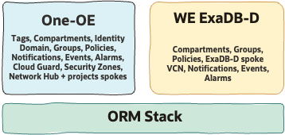

# ExaDB-D Workload Extension — Single-stack Deployment <!-- omit from toc -->

- [1. Summary](#1-summary)
- [2. Architecture Overview](#2-architecture-overview)
- [3. Configuration Files](#3-configuration-files)
- [4. Deployment Steps](#4-deployment-steps)
- [5. Post-Deployment Configuration](#5-post-deployment-configuration)
- [6. Customization](#6-customization)
- [7. Troubleshooting](#7-troubleshooting)
- [8. Cleanup](#8-cleanup)
- [9. Additional Resources](#9-additional-resources)

## 1. Summary

| Item | Description |
| --- | --- |
| Scope | One-OE Hub E landing zone and ExaDB-D foundation for UC1–UC3 |
| Resources | Compartments, IAM, governance, networking, security, and observability |
| State | One Resource Manager stack or one Terraform state |
| Workload | Optional regular database workload for the matching UC |

OCI Resource Manager (ORM) with configuration files in a customer-controlled private OCI Object Storage bucket is the recommended delivery path. Use the pinned OCI Landing Zone Orchestrator source with working directory `rms-facade`. Terraform CLI, customer-controlled CI/CD, and an approved private Git source are supported alternatives.

## 2. Architecture Overview

The single-stack package creates the One-OE foundation and ExaDB-D platform prerequisites together. Their resources share one state and lifecycle.

Hub E has no firewall. Use this published reference for a PoC, lab, or explicitly non-production deployment that accepts that tradeoff. Production requires a firewall-based design; use Blueprint Factory for a customized single-stack package or the published [Hub A multi-stack foundation](../multi-stack/readme.md).

| Use case | Infrastructure placement | Database platform placement |
| --- | --- | --- |
| UC1 — Shared | One shared infrastructure | Shared VMCs/AVMCs |
| UC2 — Hybrid | One shared infrastructure | Dedicated VMCs/AVMCs per environment |
| UC3 — Dedicated | Dedicated infrastructure per environment | Dedicated VMCs/AVMCs per environment |

See the [ExaDB-D use cases](../exacs_use_cases/readme.md) for the placement diagrams. Foundations prepare compartments, IAM, networking, and observability for these placements. The optional [regular database workload](../database-workload/readme.md) creates the Cloud Exadata Infrastructure, VMCs, DB Homes, CDBs, and PDBs. Autonomous lifecycle is outside that workload contract.

The examples use `prod` and `preprod` environment names. Their names do not change the Hub E firewall tradeoff. UC1 has a shared ExaCS VCN at `10.0.24.0/21`. UC2 and UC3 use environment ExaCS VCNs at `10.0.104.0/21` and `10.0.168.0/21`. Review the complete hub, project, and platform address plan before deployment.

| Use case | Compartments and administration roles | Platform network |
| --- | --- | --- |
| UC1 | Shared infrastructure/database compartments; Global Infra and Global DBA roles; Project DBA roles for Autonomous project tiers | One shared ExaCS VCN |
| UC2 | Shared infrastructure and environment database compartments; Global Infra umbrella plus environment Infra/DBA roles with shared-infrastructure dependency permissions | One ExaCS VCN per environment; the shared infrastructure scope is networkless |
| UC3 | Infrastructure/database compartments and Infra/DBA roles per environment; no global ExaCS administration group | One ExaCS VCN per environment |

The published foundation IAM also prepares `proj1` Autonomous project DB tiers. The regular database workload does not create Autonomous databases or use those project tiers.

## 3. Configuration Files

Select one use case and one CIS level. The initial apply uses the matching IAM, governance, network, security, and pre observability files.

| Use case | Core files | Security | Observability: initial → final |
| --- | --- | --- | --- |
| UC1 | [exacs_identity_uc1.json](exacs_identity_uc1.json), [exacs_governance_uc1.json](exacs_governance_uc1.json), [exacs_network_hub_e.json](exacs_network_hub_e.json) | `exacs_security_cis1_uc1.json` or `exacs_security_cis2_uc1.json` | `exacs_observability_cis1_uc1_pre.json` → `exacs_observability_cis1_uc1.json`, or `exacs_observability_cis2_uc1_pre.json` → `exacs_observability_cis2_uc1.json` |
| UC2 | [exacs_identity_uc2.json](exacs_identity_uc2.json), [exacs_governance_uc2.json](exacs_governance_uc2.json), [exacs_network_hub_e_uc2.json](exacs_network_hub_e_uc2.json) | `exacs_security_cis1_uc2.json` or `exacs_security_cis2_uc2.json` | `exacs_observability_cis1_uc2_pre.json` → `exacs_observability_cis1_uc2.json`, or `exacs_observability_cis2_uc2_pre.json` → `exacs_observability_cis2_uc2.json` |
| UC3 | [exacs_identity_uc3.json](exacs_identity_uc3.json), [exacs_governance_uc3.json](exacs_governance_uc3.json), [exacs_network_hub_e_uc3.json](exacs_network_hub_e_uc3.json) | `exacs_security_cis1_uc3.json` or `exacs_security_cis2_uc3.json` | `exacs_observability_cis1_uc3_pre.json` → `exacs_observability_cis1_uc3.json`, or `exacs_observability_cis2_uc3_pre.json` → `exacs_observability_cis2_uc3.json` |

The network prepares ExaCS platform VCNs, `db` and `backup` subnets, gateways, routing, and security lists. IAM prepares the selected infrastructure/database compartments and administration roles. Observability supplies topics, events, alarms, and flow logs; the final file enables network-dependent resources after the first apply.

### Optional Database Workload

The workload files are absent from the public convenience buttons because they contain secret and SSH-key placeholders. Complete the foundation first, including its final observability re-apply. After reviewing the workload substitutions, add the matching file to the same existing stack and state with every foundation input retained. **Do not include the workload in the initial foundation plan.**

| Use case | Combined workload file |
| --- | --- |
| UC1 | [exacs_cloud_exadata_database_uc1.json](../database-workload/single-stack/exacs_cloud_exadata_database_uc1.json) |
| UC2 | [exacs_cloud_exadata_database_uc2.json](../database-workload/single-stack/exacs_cloud_exadata_database_uc2.json) |
| UC3 | [exacs_cloud_exadata_database_uc3.json](../database-workload/single-stack/exacs_cloud_exadata_database_uc3.json) |

Each workload file has one Cloud Exadata root with all five sections. Once added, retain that workload JSON unchanged with every foundation document on all later re-applies, including any final observability re-apply. Follow the [database workload guide](../database-workload/single-stack/readme.md), including its workload-specific Orchestrator pin.

## 4. Deployment Steps

### Prerequisites

- OCI tenancy access and permissions for the listed foundation resources.
- Reviewed use case, region, CIS level, non-overlapping CIDRs, and administration roles.
- A private configuration location and persistent state/output location.
- For the optional database workload, reviewed Vault secret and SSH-key substitutions.

The foundation-only reference links below use Orchestrator `v2.1.3`. When including the database workload, use its [validated Orchestrator pin](../database-workload/blueprint-factory.md#1-summary).

### OCI Resource Manager

1. Stage only the matching foundation files and selected pre observability file in a private Object Storage bucket.
2. Create one stack from the selected pinned Orchestrator source with working directory `rms-facade` and a persistent output prefix.
3. Run Plan, review the resources, permissions, and network exposure, then apply the saved plan.
4. Once the network exists, replace only the pre observability input with its final counterpart of the same UC and CIS level. Retain every other foundation file.
5. Review and apply a fresh plan in the same stack.
6. For the optional database workload, follow its [same-state deployment steps](../database-workload/single-stack/readme.md#4-deployment-steps) after this foundation flow has completed. Add the workload to the existing stack with all foundation inputs retained.

### Terraform CLI

Use the same selected JSON set with the pinned Orchestrator source, one tfvars file, and one Terraform state. Follow the [Terraform CLI guidance](/commons/content/terraform.md) for authentication and plan/apply commands. On the final re-apply, replace only the pre observability reference and retain all other inputs and the same state.

### Foundation Reference Links

These public convenience links are foundation-only reference material. The recommended customer path stages reviewed files in a private source.

Published ORM foundation reference links — Orchestrator v2.1.3

- [UC1, CIS1](https://cloud.oracle.com/resourcemanager/stacks/create?zipUrl=https://github.com/oci-landing-zones/terraform-oci-modules-orchestrator/archive/refs/tags/v2.1.3.zip&amp;zipUrlVariables={"input_config_files_urls":"https://raw.githubusercontent.com/oci-landing-zones/oci-landing-zone-operating-entities/refs/heads/master/workload-extensions/exacs/single-stack/exacs_governance_uc1.json,https://raw.githubusercontent.com/oci-landing-zones/oci-landing-zone-operating-entities/refs/heads/master/workload-extensions/exacs/single-stack/exacs_identity_uc1.json,https://raw.githubusercontent.com/oci-landing-zones/oci-landing-zone-operating-entities/refs/heads/master/workload-extensions/exacs/single-stack/exacs_network_hub_e.json,https://raw.githubusercontent.com/oci-landing-zones/oci-landing-zone-operating-entities/refs/heads/master/workload-extensions/exacs/single-stack/exacs_observability_cis1_uc1_pre.json,https://raw.githubusercontent.com/oci-landing-zones/oci-landing-zone-operating-entities/refs/heads/master/workload-extensions/exacs/single-stack/exacs_security_cis1_uc1.json"})
- [UC1, CIS2](https://cloud.oracle.com/resourcemanager/stacks/create?zipUrl=https://github.com/oci-landing-zones/terraform-oci-modules-orchestrator/archive/refs/tags/v2.1.3.zip&amp;zipUrlVariables={"input_config_files_urls":"https://raw.githubusercontent.com/oci-landing-zones/oci-landing-zone-operating-entities/refs/heads/master/workload-extensions/exacs/single-stack/exacs_governance_uc1.json,https://raw.githubusercontent.com/oci-landing-zones/oci-landing-zone-operating-entities/refs/heads/master/workload-extensions/exacs/single-stack/exacs_identity_uc1.json,https://raw.githubusercontent.com/oci-landing-zones/oci-landing-zone-operating-entities/refs/heads/master/workload-extensions/exacs/single-stack/exacs_network_hub_e.json,https://raw.githubusercontent.com/oci-landing-zones/oci-landing-zone-operating-entities/refs/heads/master/workload-extensions/exacs/single-stack/exacs_observability_cis2_uc1_pre.json,https://raw.githubusercontent.com/oci-landing-zones/oci-landing-zone-operating-entities/refs/heads/master/workload-extensions/exacs/single-stack/exacs_security_cis2_uc1.json"})
- [UC2, CIS1](https://cloud.oracle.com/resourcemanager/stacks/create?zipUrl=https://github.com/oci-landing-zones/terraform-oci-modules-orchestrator/archive/refs/tags/v2.1.3.zip&amp;zipUrlVariables={"input_config_files_urls":"https://raw.githubusercontent.com/oci-landing-zones/oci-landing-zone-operating-entities/refs/heads/master/workload-extensions/exacs/single-stack/exacs_governance_uc2.json,https://raw.githubusercontent.com/oci-landing-zones/oci-landing-zone-operating-entities/refs/heads/master/workload-extensions/exacs/single-stack/exacs_identity_uc2.json,https://raw.githubusercontent.com/oci-landing-zones/oci-landing-zone-operating-entities/refs/heads/master/workload-extensions/exacs/single-stack/exacs_network_hub_e_uc2.json,https://raw.githubusercontent.com/oci-landing-zones/oci-landing-zone-operating-entities/refs/heads/master/workload-extensions/exacs/single-stack/exacs_observability_cis1_uc2_pre.json,https://raw.githubusercontent.com/oci-landing-zones/oci-landing-zone-operating-entities/refs/heads/master/workload-extensions/exacs/single-stack/exacs_security_cis1_uc2.json"})
- [UC2, CIS2](https://cloud.oracle.com/resourcemanager/stacks/create?zipUrl=https://github.com/oci-landing-zones/terraform-oci-modules-orchestrator/archive/refs/tags/v2.1.3.zip&amp;zipUrlVariables={"input_config_files_urls":"https://raw.githubusercontent.com/oci-landing-zones/oci-landing-zone-operating-entities/refs/heads/master/workload-extensions/exacs/single-stack/exacs_governance_uc2.json,https://raw.githubusercontent.com/oci-landing-zones/oci-landing-zone-operating-entities/refs/heads/master/workload-extensions/exacs/single-stack/exacs_identity_uc2.json,https://raw.githubusercontent.com/oci-landing-zones/oci-landing-zone-operating-entities/refs/heads/master/workload-extensions/exacs/single-stack/exacs_network_hub_e_uc2.json,https://raw.githubusercontent.com/oci-landing-zones/oci-landing-zone-operating-entities/refs/heads/master/workload-extensions/exacs/single-stack/exacs_observability_cis2_uc2_pre.json,https://raw.githubusercontent.com/oci-landing-zones/oci-landing-zone-operating-entities/refs/heads/master/workload-extensions/exacs/single-stack/exacs_security_cis2_uc2.json"})
- [UC3, CIS1](https://cloud.oracle.com/resourcemanager/stacks/create?zipUrl=https://github.com/oci-landing-zones/terraform-oci-modules-orchestrator/archive/refs/tags/v2.1.3.zip&amp;zipUrlVariables={"input_config_files_urls":"https://raw.githubusercontent.com/oci-landing-zones/oci-landing-zone-operating-entities/refs/heads/master/workload-extensions/exacs/single-stack/exacs_governance_uc3.json,https://raw.githubusercontent.com/oci-landing-zones/oci-landing-zone-operating-entities/refs/heads/master/workload-extensions/exacs/single-stack/exacs_identity_uc3.json,https://raw.githubusercontent.com/oci-landing-zones/oci-landing-zone-operating-entities/refs/heads/master/workload-extensions/exacs/single-stack/exacs_network_hub_e_uc3.json,https://raw.githubusercontent.com/oci-landing-zones/oci-landing-zone-operating-entities/refs/heads/master/workload-extensions/exacs/single-stack/exacs_observability_cis1_uc3_pre.json,https://raw.githubusercontent.com/oci-landing-zones/oci-landing-zone-operating-entities/refs/heads/master/workload-extensions/exacs/single-stack/exacs_security_cis1_uc3.json"})
- [UC3, CIS2](https://cloud.oracle.com/resourcemanager/stacks/create?zipUrl=https://github.com/oci-landing-zones/terraform-oci-modules-orchestrator/archive/refs/tags/v2.1.3.zip&amp;zipUrlVariables={"input_config_files_urls":"https://raw.githubusercontent.com/oci-landing-zones/oci-landing-zone-operating-entities/refs/heads/master/workload-extensions/exacs/single-stack/exacs_governance_uc3.json,https://raw.githubusercontent.com/oci-landing-zones/oci-landing-zone-operating-entities/refs/heads/master/workload-extensions/exacs/single-stack/exacs_identity_uc3.json,https://raw.githubusercontent.com/oci-landing-zones/oci-landing-zone-operating-entities/refs/heads/master/workload-extensions/exacs/single-stack/exacs_network_hub_e_uc3.json,https://raw.githubusercontent.com/oci-landing-zones/oci-landing-zone-operating-entities/refs/heads/master/workload-extensions/exacs/single-stack/exacs_observability_cis2_uc3_pre.json,https://raw.githubusercontent.com/oci-landing-zones/oci-landing-zone-operating-entities/refs/heads/master/workload-extensions/exacs/single-stack/exacs_security_cis2_uc3.json"})

## 5. Post-Deployment Configuration

Confirm compartments, administration policies, ExaCS platform networks, routing, and final flow logs before introducing database resources. If the combined regular workload was selected, verify its infrastructure-to-PDB chain in the same state. Autonomous VM Clusters, Autonomous Container Databases, and Autonomous Database Dedicated lifecycle require **Manual post-deployment configuration** under the workload owner's lifecycle, drift, and compliance controls.

## 6. Customization

Use [Blueprint Factory](/addons/oci-lz-blueprint-factory/README.md) when the published shape does not fit the required environments, placement, projects, network ranges, or hub. The [configuration reference](/addons/oci-lz-blueprint-factory/blueprint-factory-configuration-reference.md) describes the supported input. Keep the source configuration and generated outputs in separate, explicit locations and deploy the generated working set together.

For regular Exadata Database Service, omit `project_db_compartments`. That setting is only for Autonomous Database Dedicated project tiers. Infrastructure-only scopes have no VCN; VMC/AVMC placement requires the ExaCS platform network with `db` and `backup` subnets.

## 7. Troubleshooting

| Symptom | Check |
| --- | --- |
| A configuration key cannot be resolved | Check the selected use case, matching foundation keys, and any required dependency output files. |
| Flow logs cannot be created | Apply the pre observability configuration first, then use its final counterpart after network resources exist. |
| A re-apply plans unexpected deletion | Retain every unchanged configuration family and use the original state. Replace only the selected pre/post documents. |
| Database network connectivity fails | Check the platform `db`/`backup` subnets, NSGs or security lists, DRG attachments, and the matching hub routes. |
| A workload refers to a compartment or subnet from another use case | Select the workload and foundation files for the same UC and review the key references before applying. |

## 8. Cleanup

Review retained data, backups, live database dependents, and the complete destroy plan before applying it. This state includes the foundation and any selected combined workload. Use the original configuration and the same stack/state; keep configuration and output files available until cleanup is complete.

## 9. Additional Resources

- [ExaDB-D workload extension overview](../readme.md)
- [ExaDB-D use cases](../exacs_use_cases/readme.md)
- [Database workload deployment](../database-workload/readme.md)
- [ORM deployment guidance](/commons/content/orm_bp.md)

## License <!-- omit from toc -->

Copyright (c) 2026 Oracle and/or its affiliates.

Licensed under the Universal Permissive License (UPL), Version 1.0.

See [LICENSE](/LICENSE.txt) for more details.
