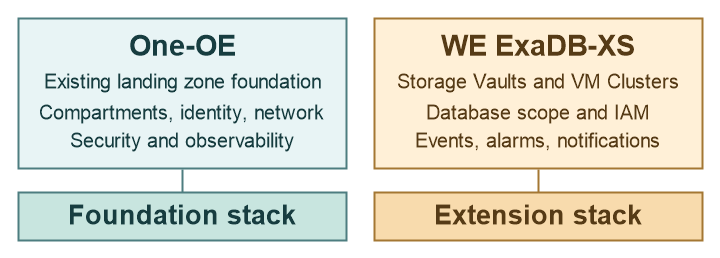

# ExaDB-XS Workload Extension - Multi-Stack Deployment <!-- omit from toc -->

## **1. Summary**

<table>
  <tbody>
    <tr><td><strong>NAME</strong></td><td>ExaDB-XS extension of an existing One-OE Landing Zone (Multi-Stack Model)</td></tr>
    <tr><td><strong>OBJECTIVE</strong></td><td>Describe separate foundation and ExaDB-XS extension lifecycles</td></tr>
    <tr><td><strong>TARGET RESOURCES</strong></td><td>ExaDB-XS compartments and networks, IAM, Storage Vaults, VM Clusters, Events, Alarms, and Notifications</td></tr>
    <tr><td><strong>STATUS</strong></td><td>Architecture only; no published ExaDB-XS extension stack or configuration files</td></tr>
  </tbody>
</table>

&nbsp;

## **2. Architecture Overview**

The multi-stack model would build on an existing One-OE foundation. A separate ExaDB-XS extension stack would consume the foundation's compartment and network outputs and add the selected Storage Vault, VM Cluster, IAM, and observability resources. The resource placement remains the [UC1, UC2, or UC3](../exaxs_use_cases/readme.md) design; splitting the lifecycle does not relax ExaDB-XS IAM, vault-sharing, or network requirements.

| Layer in a future stack set | Design responsibility |
| --- | --- |
| Existing One-OE foundation | Own the base compartments, hub and environment networks, security, and governance resources. |
| ExaDB-XS extension | Own its selected vault and cluster scopes and their workload-specific IAM and observability. |
| Integration contract | Pass the required compartment and network references, define deployment ordering, and review any foundation routing or security changes. |

&nbsp;

## **3. Deployment Steps**

The table follows the ExaDB-D multi-stack guide's use-case layout. It records dependencies for a future ExaDB-XS extension; no extension stack or re-apply sequence has been published.

| Deployment item | Use Case 1 (UC1) | Use Case 2 (UC2) | Use Case 3 (UC3) |
| --- | --- | --- | --- |
| Description | [Shared vaults and clusters](../exaxs_use_cases/readme.md#21-shared-exadb-xs-platform) | [Shared vaults, environment clusters](../exaxs_use_cases/readme.md#22-hybrid-exadb-xs-platform) | [Environment vaults and clusters](../exaxs_use_cases/readme.md#23-dedicated-exadb-xs-platform) |
| Existing foundation | One-OE compartments and shared platform network | One-OE compartments and environment platform networks | One-OE compartments and environment platform networks |
| Extension files | Not published | Not published | Not published |
| Integration | Shared compartment and network references | Shared vault access plus environment network references | Environment compartment and network references |
| Deployment | Requires a validated output contract and file set | Requires a validated output contract and file set | Requires a validated output contract and file set |

## **4. Architecture Components**

| Component | UC1: shared | UC2: hybrid | UC3: dedicated |
| --- | --- | --- | --- |
| IAM | Global vault and cluster administration | Global vault ownership with environment cluster administrators | Environment vault and cluster administrators |
| Network integration | Attach or reference the shared platform VCN | Attach or reference environment platform VCNs | Attach or reference environment platform VCNs |
| Database resources | Shared cluster scope for Database Homes, CDBs, and PDBs | Environment cluster scopes for Database Homes, CDBs, and PDBs | Environment cluster scopes for Database Homes, CDBs, and PDBs |
| Observability | Shared vault and cluster signals | Shared vault and environment cluster signals | Environment-specific vault and cluster signals |

Foundation changes, dependency outputs, resource ordering, and any re-apply procedure must be established by a future implementation. See the [use-case detail](../exaxs_use_cases/readme.md) for the service and ownership qualifications.

## **5. Publication Status**

No multi-stack ExaDB-XS JSON, Terraform, OCI Resource Manager package, output contract, or deployment sequence is included in this directory. A future implementation must verify the orchestrator and downstream resource contracts, test cross-stack dependencies and re-apply behavior, and publish exact file sets before this model can be used. Return to the [ExaDB-XS overview](../readme.md) for the three design choices.

&nbsp;

# License <!-- omit from toc -->

Copyright (c) 2026 Oracle and/or its affiliates.

Licensed under the Universal Permissive License (UPL), Version 1.0.

See [LICENSE](/LICENSE.txt) for more details.
