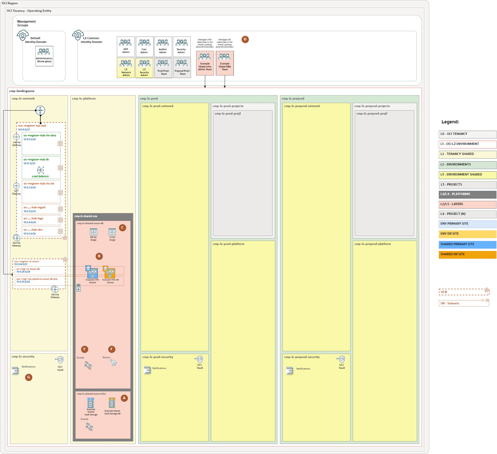
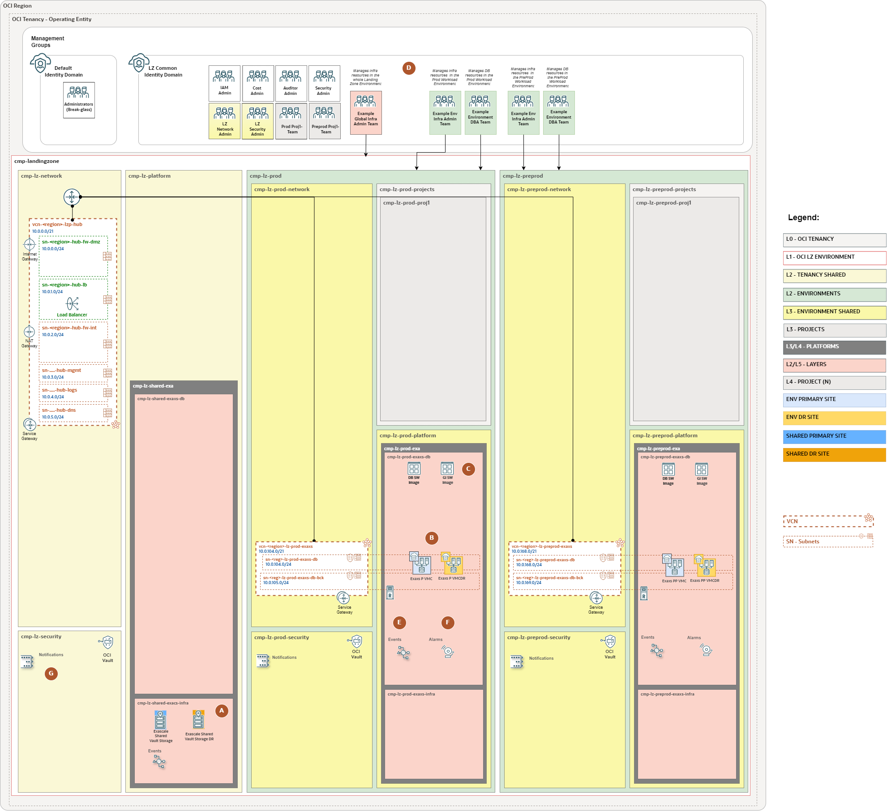
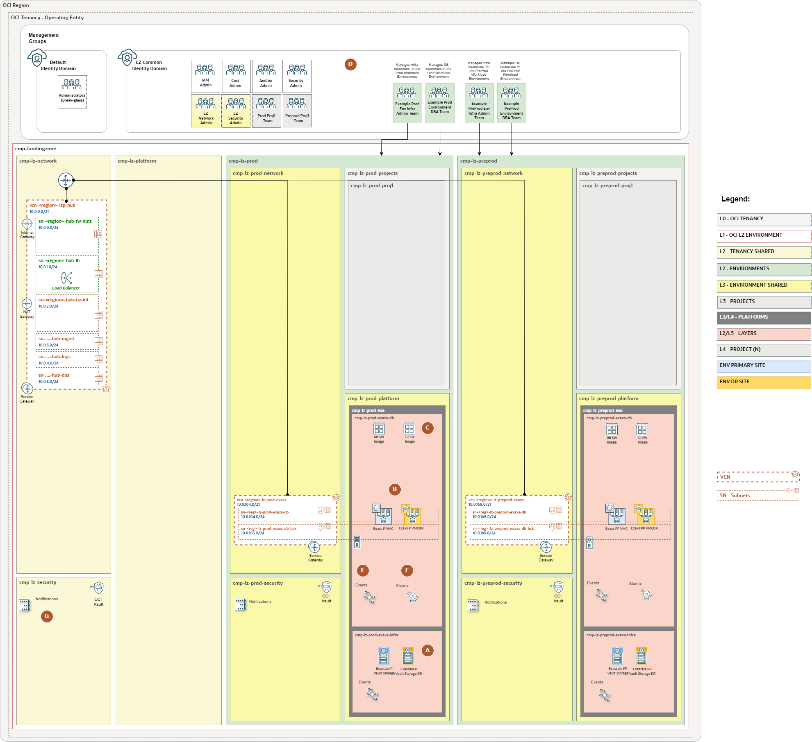

# ExaDB-XS WE Set-up <!-- omit from toc -->

## **Table of Contents** <!-- omit from toc -->

- [**1. Summary**](#1-summary)
- [**2. Design Overview**](#2-design-overview)
- [**3. Deployment Options**](#3-deployment-options)

&nbsp;

## **1. Summary**

Welcome to the Oracle Exadata Database Service on Exascale Infrastructure (ExaDB-XS) Landing Zone Workload Extension (WE) design.

This documentation describes compartment placement, administrative ownership, networking, and observability for ExaDB-XS workloads on a [One-OE](../../blueprints/one-oe/) Landing Zone. Oracle manages the physical Exascale infrastructure. The customer-facing service resources in this design are **Exascale Database Storage Vaults** and **ExaDB-XS VM Clusters**, with Database Homes, container databases (CDBs), and pluggable databases (PDBs) on the clusters. See the [Oracle ExaDB-XS overview](https://docs.oracle.com/en-us/iaas/exadb-xs/doc/overview-exadb-xs-service.html).

The [single-stack package](./single-stack/readme.md) now contains generated One-OE foundation and ExaDB-XS prerequisite JSON, including IAM policies, network, security, and observability for UC1–UC3. It does not provision ExaDB-XS Storage Vaults, VM Clusters, or databases. The multi-stack page remains an architecture reference.

&nbsp;

## **2. Design Overview**

The design uses the One-OE compartment and network model as a reference. It compares three ways to place and administer Storage Vaults and VM Clusters. The **shared** model centralizes both; the **hybrid** model keeps vault ownership global while placing clusters in environment platform compartments; the **dedicated** model gives each environment its own vaults and clusters. Dedicated here means a dedicated *logical resource scope*, not customer-owned physical Exadata hardware.

The extension describes three ExaDB-XS use cases:

1. **Use Case 1 (UC1): Shared ExaDB-XS Platform**: Shared Storage Vaults, VM Clusters, and database network across multiple environments.
2. **Use Case 2 (UC2): Hybrid ExaDB-XS Platform**: Shared Storage Vaults with environment-specific VM Clusters and database networks.
3. **Use Case 3 (UC3): Dedicated ExaDB-XS Platform**: Separate Storage Vaults, VM Clusters, and database networks for each environment.

Each VM Cluster selects a Storage Vault. Oracle permits selection of an existing vault in another compartment and permits multiple VM Clusters to share a vault. The storage mode limits that sharing: a cluster using Oracle AI Database 26ai Exascale smart storage cannot share its vault with a cluster using Oracle Database 19c Exascale block storage. The same VM Cluster cannot host both modes. Plan separate vaults and clusters when both modes are required. See [VM Cluster management](https://docs.oracle.com/en-us/iaas/exadb-xs/doc/manage-vm-clusters.html) and the [service overview](https://docs.oracle.com/en-us/iaas/exadb-xs/doc/overview-exadb-xs-service.html).

For detailed placement, team ownership, IAM dependencies, and observability, see the [ExaDB-XS use cases](./exaxs_use_cases/readme.md).

&nbsp;

## **3. Deployment Options**

The following table explains when each use case fits a new One-OE foundation or an existing Landing Zone. The linked stack pages describe the architecture and component responsibilities. ExaDB-XS implementation files are not yet published for either approach.

<table width="100%">
  <thead>
    <tr>
      <th width="34%">When to use it / Use Case</th>
      <th width="33%">Single-stack New One-OE foundation and ExaDB-XS platform in one coordinated lifecycle</th>
      <th width="33%">Multi-stack Extension of an existing One-OE Landing Zone</th>
    </tr>
  </thead>
  <tbody>
    <tr>
      <td width="34%">Use Case 1 (UC1): Shared ExaDB-XS Platform  </td>
      <td width="33%">Use this design when a new One-OE foundation and one centrally administered database platform are planned together. A shared database VCN, shared Exascale Storage Vaults, and shared VM Clusters would serve multiple environments under global platform and DBA ownership. The <a href="./single-stack/readme.md">single-stack model</a> describes the coordinated lifecycle.</td>
      <td width="33%">Use this design when an existing One-OE Landing Zone needs a common ExaDB-XS platform. The extension would use or add the shared database network and place Storage Vaults and VM Clusters in shared platform compartments. Confirm network integration and ownership with the existing foundation. See the <a href="./multi-stack/readme.md">multi-stack model</a>.</td>
    </tr>
    <tr>
      <td width="34%">Use Case 2 (UC2): Hybrid ExaDB-XS Platform  </td>
      <td width="33%">Use this design when a new One-OE foundation should centralize Storage Vault capacity while giving production and pre-production their own VM Clusters and database VCNs. Global teams would own the shared Vaults; environment teams would own their clusters and databases. The <a href="./single-stack/readme.md">single-stack model</a> would coordinate those scopes in one lifecycle.</td>
      <td width="33%">Use this design when an existing One-OE Landing Zone has or can accommodate environment-specific database networks and platform compartments. Shared Vaults would remain globally owned, while each environment's VM Clusters would consume them across compartment boundaries. Plan the cross-compartment IAM and shared-capacity dependencies described in the <a href="./multi-stack/readme.md">multi-stack model</a>.</td>
    </tr>
    <tr>
      <td width="34%">Use Case 3 (UC3): Dedicated ExaDB-XS Platform  </td>
      <td width="33%">Use this design when a new One-OE foundation needs separate ExaDB-XS platform ownership for each environment. Each environment would have its own database VCN, Storage Vaults in its ExaDB-XS infrastructure compartment, and VM Clusters in its database compartment. The <a href="./single-stack/readme.md">single-stack model</a> would include those scopes in one coordinated lifecycle.</td>
      <td width="33%">Use this design when an existing One-OE Landing Zone needs independently administered ExaDB-XS resources per environment. Each environment would add its own Vaults, VM Clusters, and database network integration while retaining separate IAM and observability scopes. See the <a href="./multi-stack/readme.md">multi-stack model</a>.</td>
    </tr>
  </tbody>
</table>

The figures are conceptual. The primary and DR symbols show a possible database protection design; they do not represent customer-managed Exadata infrastructure or a completed Data Guard deployment. Diagram labels that require qualification are explained in the [use-case design decisions](./exaxs_use_cases/readme.md#3-design-decisions).

This Landing Zone Workload Extension describes single-stack for a new One-OE foundation and multi-stack for an existing one. The single-stack JSON can establish the foundation and ExaDB-XS prerequisites; ExaDB-XS service resources still require a separate provisioning workflow. The multi-stack model does not yet publish configuration files.

&nbsp;

# License <!-- omit from toc -->

Copyright (c) 2026 Oracle and/or its affiliates.

Licensed under the Universal Permissive License (UPL), Version 1.0.

See [LICENSE](/LICENSE.txt) for more details.
