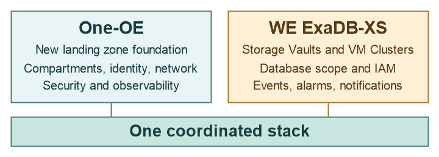

# ExaDB-XS Workload Extension - Single-Stack Deployment <!-- omit from toc -->

## **1. Summary**

<table>
  <tbody>
    <tr><td><strong>NAME</strong></td><td>One-OE Landing Zone with ExaDB-XS (Single-Stack Model)</td></tr>
    <tr><td><strong>OBJECTIVE</strong></td><td>Describe one coordinated lifecycle for the foundation and the selected ExaDB-XS platform design</td></tr>
    <tr><td><strong>TARGET RESOURCES</strong></td><td>One-OE foundation, ExaDB-XS compartments and networks, IAM, Storage Vaults, VM Clusters, Events, Alarms, and Notifications</td></tr>
    <tr><td><strong>STATUS</strong></td><td>Generated One-OE foundation and ExaDB-XS prerequisite JSON for UC1–UC3; ExaDB-XS Vaults, VM Clusters, and databases are not provisioned by these files</td></tr>
  </tbody>
</table>

&nbsp;

## **2. Architecture Overview**

The single-stack configuration combines the One-OE foundation with the compartments, network, IAM, and observability prerequisites for one selected [ExaDB-XS use case](../exaxs_use_cases/readme.md). The generated JSON does not create Exascale Storage Vaults, VM Clusters, Database Homes, or databases. Those service resources need a separate provisioning workflow after the Landing Zone prerequisites exist.

| Layer in a future stack | Design responsibility |
| --- | --- |
| One-OE foundation | Establish the selected landing zone compartments, network, security, and governance baseline. |
| ExaDB-XS extension | Add the selected Storage Vault and VM Cluster scopes, database prerequisites, IAM model, Events, Alarms, and Notifications. |
| Database operations | Complete Database Home, CDB/PDB, backup, and optional DR design according to service requirements. |

&nbsp;

## **3. Deployment Steps**

Select one use case and one CIS level. The initial configuration uses the `*_pre.json` observability file; replace it with the matching final observability file after network creation to enable network-dependent flow logs. The JSON files are generated from [ExaDB-XS Jsonnet sources](../../../gen/workload-extensions/exaxs/single-stack/profiles.libsonnet), not edited directly.

| Deployment item | Use Case 1 (UC1) | Use Case 2 (UC2) | Use Case 3 (UC3) |
| --- | --- | --- | --- |
| Description | [Shared vaults and clusters](../exaxs_use_cases/readme.md#21-shared-exadb-xs-platform) | [Shared vaults, environment clusters](../exaxs_use_cases/readme.md#22-hybrid-exadb-xs-platform) | [Environment vaults and clusters](../exaxs_use_cases/readme.md#23-dedicated-exadb-xs-platform) |
| Foundation | New One-OE landing zone | New One-OE landing zone | New One-OE landing zone |
| IAM | [UC1](exaxs_identity_uc1.json) | [UC2](exaxs_identity_uc2.json) | [UC3](exaxs_identity_uc3.json) |
| Governance | [UC1](exaxs_governance_uc1.json) | [UC2](exaxs_governance_uc2.json) | [UC3](exaxs_governance_uc3.json) |
| Network | [UC1](exaxs_network_hub_e.json) | [UC2](exaxs_network_hub_e_uc2.json) | [UC3](exaxs_network_hub_e_uc3.json) |
| Security | [CIS 1](exaxs_security_cis1_uc1.json) / [CIS 2](exaxs_security_cis2_uc1.json) | [CIS 1](exaxs_security_cis1_uc2.json) / [CIS 2](exaxs_security_cis2_uc2.json) | [CIS 1](exaxs_security_cis1_uc3.json) / [CIS 2](exaxs_security_cis2_uc3.json) |
| Observability | [CIS 1 pre](exaxs_observability_cis1_uc1_pre.json) / [final](exaxs_observability_cis1_uc1.json); [CIS 2 pre](exaxs_observability_cis2_uc1_pre.json) / [final](exaxs_observability_cis2_uc1.json) | [CIS 1 pre](exaxs_observability_cis1_uc2_pre.json) / [final](exaxs_observability_cis1_uc2.json); [CIS 2 pre](exaxs_observability_cis2_uc2_pre.json) / [final](exaxs_observability_cis2_uc2.json) | [CIS 1 pre](exaxs_observability_cis1_uc3_pre.json) / [final](exaxs_observability_cis1_uc3.json); [CIS 2 pre](exaxs_observability_cis2_uc3_pre.json) / [final](exaxs_observability_cis2_uc3.json) |
| Deployment | Apply foundation and prerequisite JSON, then provision ExaDB-XS service resources separately | Same sequence, with environment clusters using the shared Vault compartment | Same sequence, with environment Vault and cluster compartments |

## **4. Architecture Components**

| Component | UC1: shared | UC2: hybrid | UC3: dedicated |
| --- | --- | --- | --- |
| IAM | Global vault and cluster administration; access for the shared network and database scope | Global vault ownership; environment cluster administrators need access to the shared vault and their own network | Environment-owned vault and cluster permissions |
| Network | Shared platform VCN with client and backup subnets | Environment platform VCNs with client and backup subnets | Environment platform VCNs with client and backup subnets |
| Database resources | Shared cluster scope for Database Homes, CDBs, and PDBs | Environment cluster scopes for Database Homes, CDBs, and PDBs | Environment cluster scopes for Database Homes, CDBs, and PDBs |
| Observability | Shared vault and cluster Events, Alarms, and Notifications | Shared vault and environment cluster signals | Environment-specific vault and cluster signals |

The table summarizes the generated prerequisite configuration. It does not describe provisioned ExaDB-XS service resources. See the [use-case detail](../exaxs_use_cases/readme.md) for placement and ownership qualifications.

## **5. Publication Status**

The generated files establish the One-OE foundation and ExaDB-XS prerequisites. IAM policies include the documented VM Cluster dependencies on database, Vault, and network resources; `use exascale-db-storage-vaults` also permits Vault updates, so review that grant before deployment. Example email subscriptions and disabled alarms require operational values and thresholds. No ExaDB-XS Vault, VM Cluster, Database Home, database, backup, or Data Guard resource is created by this JSON set. Validate the selected region, OCI policies, resource ordering, and service limits before using the files with the Orchestrator. Return to the [ExaDB-XS overview](../readme.md) for the three design choices.

&nbsp;

# License <!-- omit from toc -->

Copyright (c) 2026 Oracle and/or its affiliates.

Licensed under the Universal Permissive License (UPL), Version 1.0.

See [LICENSE](/LICENSE.txt) for more details.
