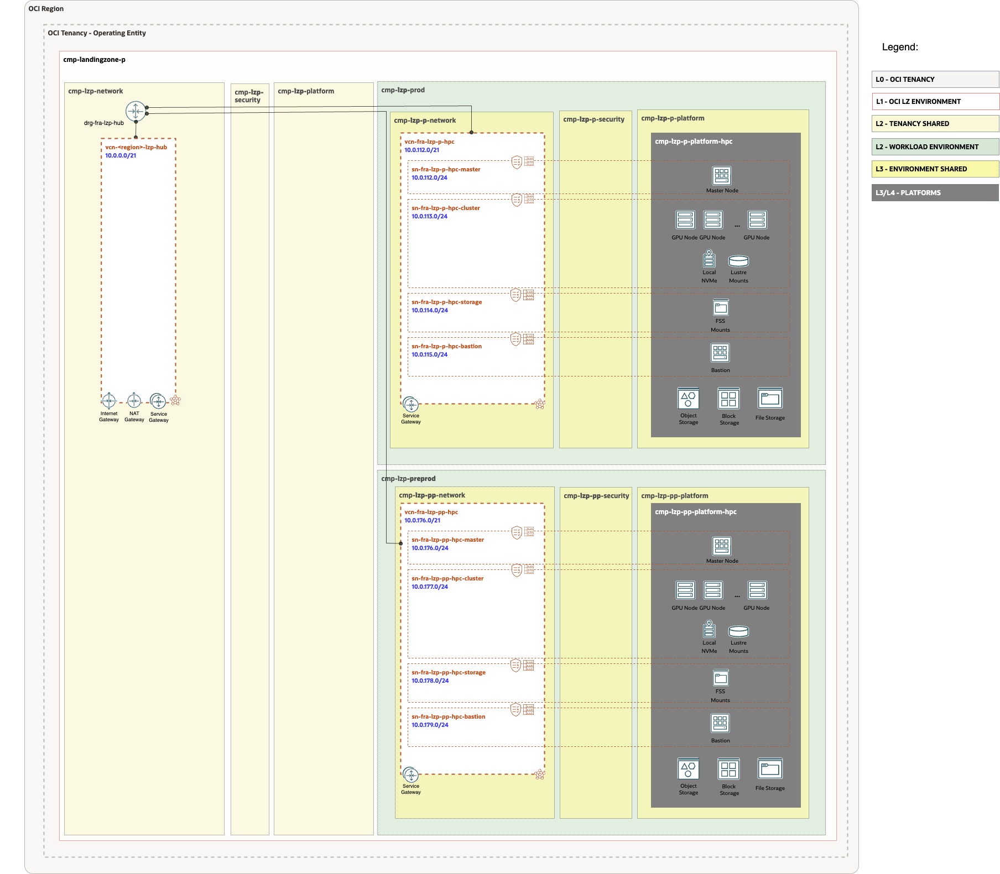

# HPC Landing Zone Extension Set-up <!-- omit from toc -->

## **Table of Contents** <!-- omit from toc -->

- [**1. Summary**](#1-summary)
- [**2. Setup IAM Configuration**](#2-setup-iam-configuration)
  - [**2.1. Compartments**](#21-compartments)
  - [**2.2 Groups**](#22-groups)
  - [**2.3 Dynamic groups**](#23-dynamic-groups)
  - [**2.4 Policies**](#24-policies)
- [**3. Setup Network Configuration**](#3-setup-network-configuration)
  - [**3.1 VCNs**](#31-vcns)
  - [**3.2 Subnets**](#32-subnets)
  - [**3.3 Route Tables (RTs)**](#33-route-tables-rts)
  - [**3.4 Security Lists (SLs)**](#34-security-lists-sls)
  - [**3.5 DNS Private Zones**](#35-dns-private-zones)
  - [**3.6 Gateways**](#36-gateways)
    - [**3.6.1 Dynamic Routing Gateway (DRGs) Attachments**](#361-dynamic-routing-gateway-drgs-attachments)
    - [**3.6.2 Service Gateway**](#362-service-gateway)
- [**4. JSON files Required Changes**](#4-json-files-required-changes)
- [**5. Deploy**](#5-deploy)

## **1. Summary**

|                         |                                                                                                                            |
| ----------------------- | -------------------------------------------------------------------------------------------------------------------------- |
| **NAME**                | HPC Landing Zone Extension set-up                                                                                                    |
| **OBJECTIVE**           | Provision Identity and Network                                                                               |
| **TARGET RESOURCES**    | - **Identity**: Compartments, Groups, Dynamic groups and Policies  - **Network**: Spoke VCNs, Route tables, Security Lists, NSGs                 |
| **PREREQUISITES**       | The [One-OE](../../../blueprints/one-oe/) Blueprint deployed as a foundation.   For this example we have used:   [](https://cloud.oracle.com/resourcemanager/stacks/create?zipUrl=https://github.com/oci-landing-zones/terraform-oci-modules-orchestrator/archive/refs/tags/v2.0.5.zip&zipUrlVariables={"input_config_files_urls":"https://raw.githubusercontent.com/oci-landing-zones/oci-landing-zone-operating-entities/master/blueprints/one-oe/runtime/one-stack/oci_open_lz_one-oe_iam.auto.tfvars.json,https://raw.githubusercontent.com/oci-landing-zones/oci-landing-zone-operating-entities/refs/heads/master/addons/oci-hub-models/hub_a/oci_open_lz_hub_a_network_light.auto.tfvars.json,https://raw.githubusercontent.com/oci-landing-zones/oci-landing-zone-operating-entities/master/blueprints/one-oe/runtime/one-stack/oci_open_lz_one-oe_observability_cisl1.auto.tfvars.json,https://raw.githubusercontent.com/oci-landing-zones/oci-landing-zone-operating-entities/master/blueprints/one-oe/runtime/one-stack/oci_open_lz_one-oe_security_cisl1.auto.tfvars.json"})  **Note**: To understand how to perform this operation with ORM, follow these [steps](ORM_ONE-OE_deployment_steps.md).|
| **CONFIGURATION FILES** | - [oci_hpc_lz_ext_iam.auto.tfvars.json](./oci_hpc_lz_ext_iam.auto.tfvars.json)    - [oci_hpc_lz_ext_network.auto.tfvars.json](./oci_hpc_lz_ext_network.auto.tfvars.json)|
| **DEPLOYMENT**          | [](https://cloud.oracle.com/resourcemanager/stacks/create?zipUrl=https://github.com/oci-landing-zones/terraform-oci-modules-orchestrator/archive/refs/tags/v2.0.5.zip&zipUrlVariables={"input_config_files_urls":"https://raw.githubusercontent.com/oci-landing-zones/oci-landing-zone-operating-entities/master/workload-extensions/hpc/1_hpc_extension/oci_hpc_lz_ext_iam.auto.tfvars.json,https://raw.githubusercontent.com/oci-landing-zones/oci-landing-zone-operating-entities/master/workload-extensions/hpc/1_hpc_extension/oci_hpc_lz_ext_network.auto.tfvars.json"})   **Note**: To understand how to perform this operation with ORM, follow these [steps](ORM_HPC-LZ-EXT_deployment_steps.md). [Terraform CLI](/commons/content/terraform.md)  can be also used.           |

&nbsp; 

## **2. Setup IAM Configuration**

For configuring and running the One-OE Landing Zone HPC extension IAM Layer use the following JSON file: [oci_hpc_lz_ext_iam.auto.tfvars.json](./oci_hpc_lz_ext_iam.auto.tfvars.json). You can customize this configuration to fit your exact OCI IAM topology.

This configuration file covers three categories of resources described in the next sections.

###  **2.1. Compartments**

The HPC LZ extension provisions two **compartments** dedicated to managing environments, such as PROD and PRE-PROD.

New HPC compartments will be added as platform in each One-OE LZ environment, following the example shown in the next diagram:

> [!NOTE]
> For extended documentation regarding compartment definition please refer to the [Identity & Access Management CIS Terraform module compartment example](https://github.com/oci-landing-zones/terraform-oci-modules-iam/blob/main/compartments/examples/vision/input.auto.tfvars.template).

### **2.2 Groups**

The HPC extension will deploy IAM groups to manage resources in HPC compartments and provide fine-grained access to specific HPC resources.

As part of the deployment the following groups are created in the [Default Identity Domain](https://docs.oracle.com/en-us/iaas/Content/Identity/domains/overview.htm):

| ID     |     NAME                       | TYPE | OBJECTIVES                                  |
| ------ |  -------------------------- | ------------------------------------------- |---|
| GRP.01 |  grp-lzp-p-platform-hpc-admins | IAM | Group for managing HPC Prod related resources |
| GRP.02 |  grp-lzp-pp-platform-hpc-admins | IAM | Group for managing HPC PreProd related resources |
| GRP.03 |  grp-lzp-p-platform-lustre-admins | IAM | Group for managing Lustre Prod related resources |
| GRP.04 |  grp-lzp-pp-platform-lustre-admins | IAM | Group for managing Lustre PreProd related resources |

> [!NOTE]
> For extended documentation regarding group definition please refer to the [Identity & Access Management CIS Terraform module groups example](https://github.com/oci-landing-zones/terraform-oci-cis-landing-zone-iam/blob/main/groups/examples/vision/input.auto.tfvars.template).

### **2.3 Dynamic Groups**

The HPC LZ Extension includes the following dynamic group as an example:

* **dg-lzp-p-platform-hpc** for authenticating all instances of the Prod HPC cluster against OCI.
* **dg-lzp-pp-platform-hpc** for authenticating all instances of the Pre-prod HPC cluster against OCI.

See [OCI documentation](https://docs.oracle.com/en-us/iaas/Content/Identity/Tasks/callingservicesfrominstances.htm) for reference.

### **2.4 Policies**

As part of the deployment the following policies are created:
| Policy                     | Description                                             | Manage resources             | Use resources                   | Inspect resources |
| -------------------------- | ------------------------------------------------------- | ---------------------------- | ------------------------------- | ----------------- |
| pcy-lzp-p-platform-hpc-autoscale | Grants dynamic group **dg-lzp-p-platform-hpc** permissions. | Computes, DNS | Tags, Network, Volumes | Catalog |
| pcy-lzp-p-platform-hpc-admins | Grants group **grp-lzp-p-platform-hpc-admins** permissions. | All Resources in HPC compartment |     |     |
| pcy-lzp-p-lustre-network | Grants Lustre service Prod permissions. |   | Network |    |
| pcy-lzp-p-lustre-vault | Grants group **grp-lzp-p-platform-lustre-admins** permissions. |   | Keys |   |
| pcy-lzp-pp-platform-hpc-autoscale | Grants dynamic group **dg-lzp-pp-platform-hpc** permissions. | Computes, DNS | Tags, Network, Volumes | Catalog |
| pcy-lzp-pp-platform-hpc-admins | Grants group **grp-lzp-pp-platform-hpc-admins** permissions. | All Resources in HPC compartment |     |     |
| pcy-lzp-pp-lustre-network | Grants Lustre service PreProd permissions. |   | Network |    |
| pcy-lzp-pp-lustre-vault | Grants group **grp-lzp-pp-platform-lustre-admins** permissions. |   | Keys |   |

> [!NOTE]
>For extended documentation regarding policies refer to the [Identity & Access Management CIS Terraform module policies examples](https://github.com/oci-landing-zones/terraform-oci-cis-landing-zone-iam/tree/main/policies/examples) and [policy resource documentation](https://github.com/oci-landing-zones/terraform-oci-cis-landing-zone-iam/tree/main/policies)

## **3. Setup Network Configuration**

The HPC Cluster requires specific network resources. The network design is based on the requirements of the [HPC Stack](https://github.com/oracle-quickstart/oci-hpc)

For configuring and running the HPC LZ extension Network layer use the following JSON file: [oci_hpc_lz_ext_network.auto.tfvars.json](./oci_hpc_lz_ext_network.auto.tfvars.json).

Our HPC LZ extension will deploy the necessary core resources for both the Production and Pre-production environments included in the ONE-OE blueprint.

The network layer covers the following resources:
1. Hub VCN for traffic inspection purposes, centralized DNS service, Internet Gateway, and NAT Gateway.
2. Spoke VCNs for each environment - one Spoke Pre-prod HPC VCN and one Spoke Prod HPC VCN
3. Subnets - HPC required subnets; master, cluster, storage as well as a bastion subnet.
4. Service Gateway - Service Gateway for access OCI services in all VCNs
5. Security List - allowing all ingress/egress
6. Route Tables.
7. DRG Attachments - Connect spokes with the central Hub
8. DNS Private Zone 

In this asset, we use reserved CIDR blocks for the different VCNs, but this can be customized. To learn more about managing your OCI subnetting, we recommend checking this [asset](https://github.com/oci-landing-zones/oci-landing-zone-operating-entities/tree/LZ_Subnetting/addons/oci-lz-subnetting).

For customization of the pre-defined setup please refer to the [Networking documentation](https://github.com/oci-landing-zones/terraform-oci-cis-landing-zone-networking) for documentation and examples.

### **3.1 VCNs**

The following table describes the deployed VCNs.

| ID       | NAME           | OBJECTIVES                         |
| ------  | -------------- | ---------------------------------- |
| VCN.01  | vcn-fra-lzp-p-hpc | Spoke VCN dedicated to Prod HPC set-up |
| VCN.02  | vcn-fra-lzp-pp-hpc | Spoke VCN dedicated to Preprod HPC set-up |

### **3.2 Subnets**

The following table describes the deployed Subnets added for each HPC environment platform:

| ID    |  NAME             | OBJECTIVES                |
| ----- | ---------------- | ------------------------- |
| SN.01 |  sn-fra-lzp-p-hpc-master | HPC Prod master subnet |
| SN.02 |  sn-fra-lzp-p-hpc-cluster | HPC Prod cluster subnet |
| SN.03 |  sn-fra-lzp-p-hpc-storage | HPC Prod storage subnet |
| SN.04 |  sn-fra-lzp-p-hpc-bastion | HPC Prod bastion subnet |
| SN.05 |  sn-fra-lzp-pp-hpc-master | HPC PreProd master subnet |
| SN.06 |  sn-fra-lzp-pp-hpc-cluster | HPC PreProd cluster subnet |
| SN.07 |  sn-fra-lzp-pp-hpc-storage | HPC PreProd storage subnet |
| SN.08 |  sn-fra-lzp-pp-hpc-bastion | HPC PreProd bastion subnet |

### **3.3 Route Tables (RTs)**

The following table describes the deployed Route Tables:

| ID    |  NAME               | OBJECTIVES                            |
| ----- |  ------------------ | ------------------------------------- |
| RT.01 |  rt-fra-lzp-p-hpc-master | HPC Prod master subnet route table |
| RT.02 |  rt-fra-lzp-p-hpc-cluster | HPC Prod cluster subnet route table |
| RT.03 |  rt-fra-lzp-p-hpc-storage | HPC Prod storage subnet route table |
| RT.04 |  rt-fra-lzp-p-hpc-bastion | HPC Prod bastion subnet route table |
| RT.05 |  rt-fra-lzp-pp-hpc-master | HPC PreProd master subnet route table |
| RT.06 |  rt-fra-lzp-pp-hpc-cluster | HPC PreProd cluster subnet route table |
| RT.07 |  rt-fra-lzp-pp-hpc-storage | HPC PreProd storage subnet route table |
| RT.08 |  rt-fra-lzp-pp-hpc-bastion | HPC PreProd bastion subnet route table |

### **3.4 Security Lists (SLs)**
The following table describes the deployed Security Lists (SLs):

| ID    |  NAME                | OBJECTIVES                              |
| ----- |  ------------------- | --------------------------------------- |
| SL.01 |  sl-fra-lzp-p-hpc-master | HPC Prod master subnet security list |
| SL.02 |  sl-fra-lzp-p-hpc-cluster | HPC Prod cluster subnet security list |
| SL.03 |  sl-fra-lzp-p-hpc-storage | HPC Prod storage subnet security list |
| SL.04 |  sl-fra-lzp-p-hpc-bastion | HPC Prod bastion subnet security list |
| SL.05 |  sl-fra-lzp-pp-hpc-master | HPC PreProd master subnet security list |
| SL.06 |  sl-fra-lzp-pp-hpc-cluster | HPC PreProd cluster subnet security list |
| SL.07 |  sl-fra-lzp-pp-hpc-storage | HPC PreProd storage subnet security list |
| SL.08 |  sl-fra-lzp-pp-hpc-bastion | HPC PreProd bastion subnet security list |

### **3.5 DNS Private Zones**
The following table describes the deployed DNS Private Zones:

| ID    |  NAME                | OBJECTIVES                              |
| ----- |  ------------------- | --------------------------------------- |
| DPZ.01 |  hpc-prod-cluster.local | HCM Prod DNS Private Zone |
| DPZ.02 |  hpc-preprod-cluster.local | HCM PreProd DNS Private Zone |

### **3.6 Gateways**

#### **3.6.1 Dynamic Routing Gateway (DRGs) Attachments**

The following tables describe the deployed DRG Attachments.

| ID      |  NAME                      | OBJECTIVES                                   |
| ------- |  ------------------------- | -------------------------------------------- |
| DRGA.01 |  drgatt-fra-lzp-p-hpc-vcn | DRG Attachment for the HPC Prod spoke to the hub |
| DRGA.02 |  drgatt-fra-lzp-pp-hpc-vcn | DRG Attachment for the HPC PreProd spoke to the hub 

#### **3.6.2 Service Gateway**

The following table describes the proposed Service Gateways added for each environment HPC platform:

| ID    |  NAME          | OBJECTIVES           |
| ----- |  ------------- | -------------------- |
| SGW.01 |  sgw-fra-lzp-p-hpc | SGW HPC Prod VCN |
| SGW.02 |  sgw-fra-lzp-pp-hpc | SGW HPC PreProd VCN |

## **4. JSON files Required Changes**

If ONE-OE is used as the foundation Landing Zone with output saving enabled, running this HPC extension with the added dependencies will automatically match the keys with the correct OCIDs. No changes to the JSON file are needed. Therefore, you can skip this section and move to section 5.

If you are using the CORE Landing Zone or another OCI Landing Zone option, this configuration file requires modification to reference the OCIDs of the existing deployed resources. Locate the values indicated below and replace them with the correct OCIDs.

| Resource         | Section          | Replace with OCIDs              | Description                        |
| ------------------------- | ------| --------------------------------- | ---------------------------------- |
| cmp-lzp-p-platform |  compartments| CMP-LZP-P-PLATFORM-KEY | The Prod platforms compartment OCID in Prod Env |
| cmp-lzp-pp-platform | compartments| CMP-LZP-PP-PLATFORM-KEY| The Pre-prod platforms compartment OCID  in Preprod Env |
| cmp-lzp-platform |compartments | CMP-LZP-PLATFORM-KEY| The Shared platforms compartment OCID |
| Prod Network Compartment | Network| CMP-LZP-P-NETWORK-KEY | The OCID of the Prod Network Compartment |
| Pre-prod Network Compartment | Network| CMP-LZP-PP-NETWORK-KEY |  The OCID of the Pre-prod Network Compartment  |
| Mgt Network Compartment |  Network| CMP-LZP-NETWORK-KEY |  The OCID of the Network Compartment |
| Hub DRG                  | Network| DRG-FRA-LZP-HUB-KEY                 | The OCID of the DRG in Hub deployed by One-OE LZ             |
| Hub DRG Route Table      | Network| OCID-DRG-HUB-ROUTE-TABLE      | The OCID of Route table in DRG  |

**NOTE:**
Policies contain compartment paths. 
The paths can change based on the modification in the previous [Compartments](#21-compartments) section. The paths need to be updated following the OCI [Policies and Compartment hierarchy](https://docs.oracle.com/en-us/iaas/Content/Identity/Concepts/policies.htm#hierarchy).

## **5. Deploy**

Use the magic button provided in the summary section to deploy the HPC LZ extension using [Oracle Resource Manager (ORM)](/../../../commons/content/orm.md) or use [Terraform CLI](../../../commons/content/terraform.md).

This operation creates a default routing configuration. To complete the network layer setup, deploy the firewalls and update the routing in the hub to prepare for deploying the HPC Stack. All these steps are defined in this [POST operation](1.1_Network_post_updates/readme.md). Once completed, everything will be ready for creating the HPC Cluster.

You can now proceed and create the [HPC Cluster](../2_hpc/).

&nbsp;

# License <!-- omit from toc -->

Copyright (c) 2025 Oracle and/or its affiliates.

Licensed under the Universal Permissive License (UPL), Version 1.0.

See [LICENSE](/LICENSE) for more details.
