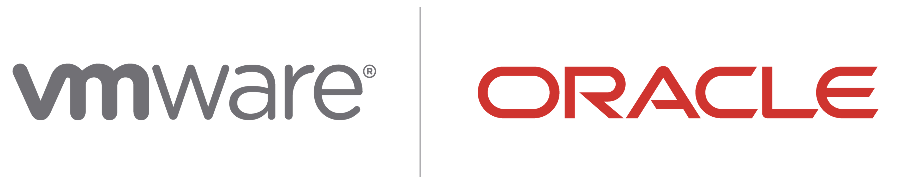
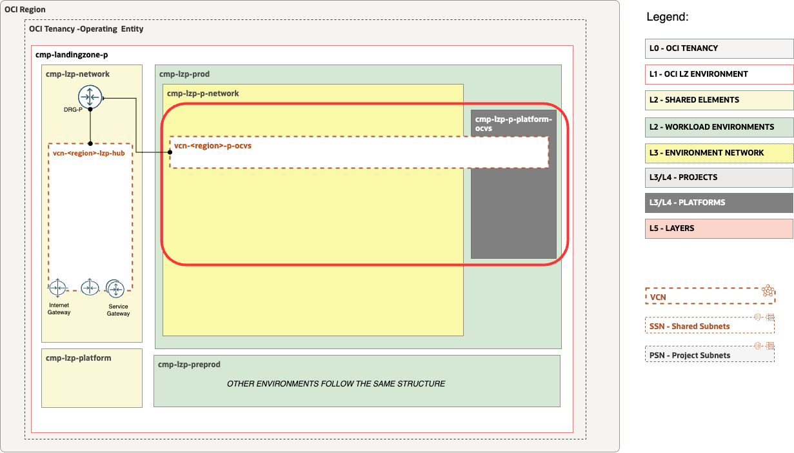

# **[OCVS Landing Zone Extension](#)**   <!-- omit from toc -->
## **An OCI Open LZ [Workload Extensions](#) to Reduce Your Time-to-Production**  <!-- omit from toc -->

 

&nbsp; 

## **Table of Contents** <!-- omit from toc -->
- [**1. Introduction**](#1-introduction)
- [**2. Design Overview**](#2-design-overview)
- [**3. Security View**](#3-security-view)
  - [**3.1 Compartments**](#31-compartments)
  - [**3.2 Groups**](#32-groups)
  - [**3.4 Policies**](#34-policies)
- [**4. Network View**](#4-network-view)
  - [**4.1 VCNs**](#41-vcns)
  - [**4.2 Subnets**](#42-subnets)
  - [**4.3 Route Tables (RTs)**](#43-route-tables-rts)
  - [**4.4 Security Lists (SLs)**](#44-security-lists-sls)
  - [**4.5 Gateways**](#45-gateways)
    - [**4.5.1 Dynamic Routing Gateway (DRGs) Attachments**](#451-dynamic-routing-gateway-drgs-attachments)
    - [**4.5.2 Service Gateway (SGs)**](#452-service-gateway-sgs)
- [**5. Runtime View**](#5-runtime-view)

&nbsp; 

## **1. Introduction**
Welcome to the **OCVS Landing Zone Extension**.

The OCVS Landing Zone (LZ) Extension is a secure cloud environment, designed with best practices to simplify the onboarding of OCVS workloads and enable the continuous operations of their cloud resources. This reference architecture provides an automated landing zone **configuration**.

&nbsp; 

## **2. Design Overview**
| ID    | DOMAIN                | DESCRIPTION                                                                                                                                                                                                                                                                                                                                                                                                                                                                                                       |
| ----- | --------------------- | ----------------------------------------------------------------------------------------------------------------------------------------------------------------------------------------------------------------------------------------------------------------------------------------------------------------------------------------------------------------------------------------------------------------------------------------------------------------------------------------------------------------- |
| **1** | **General**           | - The OCI Open LZ [One-OE](/blueprints/one-oe/readme.md) Blueprint deployed as a foundation.  - The OCVS LZ Extension will extend the One-OE LZ and add OCVS Workloads example. </li> </ul>                                                                                                                                                                                                                                                                                                                                                           |
| **2** | **Tenancy Structure** | Extend the standard landing zone compartment structure with additional compartments for OCVS-related resources:  - Parent OCVS compartment. - OCVS Load Balancer. - Software defined data center (SDDC).                                                                                                                                                                                                                                                                                              |
| **3** | **Groups & Policies** | Additional groups and associated policies are deployed to manage OCVS compartment resources.                                                                                                                                                                                                                                                                                                                                                                                                                      |
| **4** | **Network Structure** | Additional VCNs and related elements will be added - to segregate OCVS deployment as a Spoke extensions to the OneOZ LZ Hub.                                                                                                                                                                                                                                                                                                                                                                                      |
| **5** | **Runtime**           | - There are be **three deployment steps** to provision this landing zone: **(1)** The One-OE LZ will be used as an initial setup and **(2)** extended with the OCVS LZ Extension Runtime configurations. Additional **(3)** manual configuration tasks are also required to complete the setup.   - Note that the **'Operation/(OP)**' column on the next sections identifies the three moment in time when OCI resources are created.  - For more details refer to the [Runtime](#5-runtime-view) section. |

&nbsp; 

## **3. Security View**

### **3.1 Compartments**

The OCVS LZ Extension  includes the following compartments:
> [!NOTE]
> Compartments help you organize and control access to your resources. A compartment is a collection of related resources (such as cloud networks, compute instances, or block volumes) that can be accessed only by those groups that have been given permission by an administrator in your organization.

&nbsp; 

The following table provides details on the compartments presented above, their level of deepness in the tenancy, and objectives. 

| ID     | OP    | LEVEL | NAME                     | OBJECTIVES                                     |
| ------ | ----- | ----- | ------------------------ | ---------------------------------------------- |
| CMP.00 | OP#01 | 0     | cmp-lzp-p-platform-ocvs  | Parent for all OCVS resources                  |
| CMP.01 | OP#01 | 1     | cmp-p-platform-ocvs-lb   | Holds OCVS Load Balancers                      |
| CMP.02 | OP#01 | 1     | cmp-p-platform-ocvs-sddc | Contains software defined datacenter resources |

&nbsp; 

### **3.2 Groups**
The OCVS LZ Extension includes the following groups. 

> [!NOTE]
> In OCI Identity and Access Management, groups are the links between user accounts and applications.

| ID     | OP    | NAME                       | OBJECTIVES                                  |
| ------ | ----- | -------------------------- | ------------------------------------------- |
| GRP.00 | OP#01 | grp-p-platform-ocvs-admins | Group for managing VMWare related resources |

&nbsp; 

### **3.4 Policies**
The OCVS LZ Extension includes the following policies:

> [!NOTE]
> A Policy is a document that specifies who can access which Oracle Cloud Infrastructure resources that your company has, and how. A policy simply allows a group to work in certain ways with specific types of resources in a particular compartment

| ID     | OP    | NAME                       | OBJECTIVES                                                                                                     |
| ------ | ----- | -------------------------- | -------------------------------------------------------------------------------------------------------------- |
| POL.00 | OP#01 | pcy-p-platform-ocvs-admins | Policy granting permissions for administering OCVS related resources to the *grp-p-platform-ocvs-admins* group |

&nbsp; 

## **4. Network View**
The following diagram presents the network structure of the OCVS LZ Extension.

&nbsp; 

### **4.1 VCNs**
The following table describes the deployed VCNs.

> [!NOTE]
> A VCN is a customizable, software-defined network that you set up in an Oracle Cloud Infrastructure region. Like traditional data center networks, VCNs give you complete control over your network environment. A VCN can have multiple non-overlapping CIDR blocks that you can change after you create the VCN.

| ID     | OP    | NAME           | OBJECTIVES                         |
| ------ | ----- | -------------- | ---------------------------------- |
| VCN.00 | OP#01 | vcn-fra-p-ocvs | Spoke VCN dedicated to OCVS set-up |

&nbsp; 

### **4.2 Subnets**
The following table describes the deployed Subnets.

> [!NOTE]
> You can segment a VCN into subnets, which can be scoped to a region or to an availability domain. Each subnet consists of a contiguous range of addresses that don't overlap with the other subnets in the VCN. You can change the size of a subnet after creation. A subnet can be public or private.

> [!IMPORTANT]  
> OCVS utlizies VLANs instead of subnets. VLANs are set-up in [OP.02](./op02-ocvs-setup/)

| ID    | OP    | NAME             | OBJECTIVES                |
| ----- | ----- | ---------------- | ------------------------- |
| SN.00 | OP#01 | sn-fra-p-ocvs-lb | OCVS Load Balancer subnet |

### **4.3 Route Tables (RTs)**
The following table describes the deployed Route Tables.

> [!NOTE]
> A collection of RouteRule objects, which are used to route packets based on destination IP to a particular network entity.
 
| ID    | OP    | NAME               | OBJECTIVES                            |
| ----- | ----- | ------------------ | ------------------------------------- |
| RT.00 | OP#01 | rt-01-p-ocvs-vcn-l | OCVS Load Balancer subnet route table |

&nbsp; 

### **4.4 Security Lists (SLs)**
The following table describes the deployed Security Lists (SLs).

> [!NOTE]
> A security list consists of a set of ingress and egress security rules that apply to all the VNICs in any subnet that the security list is associated with. This means that all the VNICs in a given subnet are subject to the same set of security lists

| ID    | OP    | NAME                | OBJECTIVES                              |
| ----- | ----- | ------------------- | --------------------------------------- |
| SL.00 | OP#01 | sl-01-p-ocvs-vcn-lb | OCVS Load Balancer subnet security list |

&nbsp; 

### **4.5 Gateways**
#### **4.5.1 Dynamic Routing Gateway (DRGs) Attachments**
The following tables describe the deployed DRG Attachments.
> [!NOTE]
> A DRG attachment serves as a link between a DRG and a network resource. A DRG can be attached to a VCN, IPSec tunnel, remote peering connection, or virtual circuit. For more information, see Overview of the Networking Service.

| ID      | OP    | NAME                      | OBJECTIVES                                   |
| ------- | ----- | ------------------------- | -------------------------------------------- |
| DRGA.00 | OP#02 | ocvs-vcn-p-drg-attachment | DRG Attachment for the OCVS spoke to the hub |

#### **4.5.2 Service Gateway (SGs)**
The following table describes the proposed Service Gateways.

> [!NOTE]
> A service gateway lets your virtual cloud network (VCN) privately access specific Oracle services without exposing the data to the public internet. No internet gateway or NAT gateway is required to reach those specific services. The resources in the VCN can be in a private subnet and use only private IP addresses.

| ID    | OP    | NAME          | OBJECTIVES           |
| ----- | ----- | ------------- | -------------------- |
| SG.00 | OP#01 | sg-fra-p-ocvs | SG in the OCVSS VCN. |

&nbsp; 

## **5. Runtime View**

This chapter presents the OCVS LZ Extension operations scenarios.

The operations scenarios are one of the most important elements of this design, as they represent the use cases and its key activities on the OCVS LZ Extension that create or update resources.

An operation scenario is normally triggered by a service request, on a ticketing system. In a more formal definition, it should be seen as an operational process, which is a set of correlated activities executed as one unit of work, with its own frequency. The owner of each scenario will be the cloud operations team which has associated OCI Groups and Policies that allow the management of those resources.

The OCVS LZ Extension has three operation scenarios described in the following table.

| OP. ID                                           | OPERATION SCENARIOS DESCRIPTION                                                                                                                  | TIME EFFORTS                          |
| ------------------------------------------------ | ------------------------------------------------------------------------------------------------------------------------------------------------ | ------------------------------------- |
| **[OP. ID.00](/blueprints/one-oe/runtime/one-stack/readme.md)**                   | **Deploy One-OE Landing Zone**. Cover Core network resources (Hub VCN), Core IAM resources (compartments, group, policies), and security services.          | **< 1h**                              |
| **[OP. ID.01](./op01-ocvs-workload-extension/)** | **Deploy OCVS extension**. Include OCVS network resources (Spokes VCNs, Table Routes, Security Lists) and IAM OCVS resources (Groups, Policies). | **< 30m**                             |
| **[OP. ID.02](./op02-ocvs-setup/)**              | **OCVS Setup**                                                                                                                                   | **< 15m** (excluding deployment time) |
| **[OP. ID.03](./op03-postop-lb/)**               | **Provision LB for OCVS (optional) Cleanup**                                                                                                     | **< 15m**                             |

&nbsp; 

&nbsp; 

# License <!-- omit from toc -->

Copyright (c) 2024 Oracle and/or its affiliates.

Licensed under the Universal Permissive License (UPL), Version 1.0.

See [LICENSE](/LICENSE) for more details.
