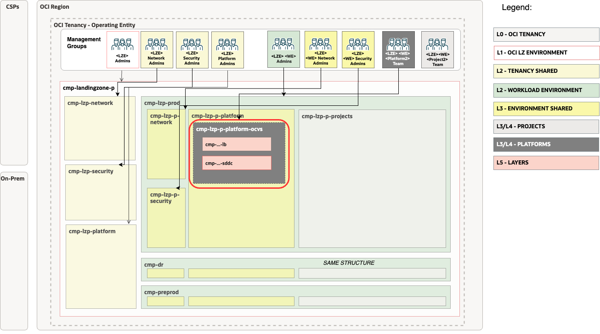
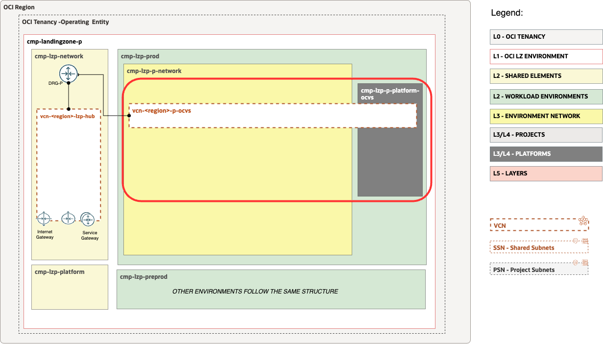

# OP.01 - Manage OCVS Landing Zone Extension <!-- omit from toc -->

## **Table of Contents** <!-- omit from toc -->

- [**1. Summary**](#1-summary)
- [**2. Setup IAM Configuration**](#2-setup-iam-configuration)
  - [**2.1. Compartments**](#21-compartments)
  - [**2.2 Groups**](#22-groups)
  - [**2.3 Policies**](#23-policies)
- [**3. Setup Network Configuration**](#3-setup-network-configuration)
- [**4. Run with ORM**](#4-run-with-orm)
- [**5. Run with Terraform CLI**](#5-run-with-terraform-cli)
  - [**5.1 Setup Terraform Authentication**](#51-setup-terraform-authentication)
  - [**5.2 Clone this Git repo to your Machine**](#52-clone-this-git-repo-to-your-machine)
  - [**5.3 Clone the orchestrator Git repo to your Machine**](#53-clone-the-orchestrator-git-repo-to-your-machine)
  - [**5.4 Change the Directory to the Terraform Orchestrator Module**](#54-change-the-directory-to-the-terraform-orchestrator-module)
  - [**5.5 Run ```terraform init```**](#55-run-terraform-init)
  - [**5.6 Run ```terraform plan```**](#56-run-terraform-plan)
  - [**5.7 Run ```terraform apply```**](#57-run-terraform-apply)

&nbsp; 


## **1. Summary**

|                           |                                                                                                                                                                |
| ------------------------- | -------------------------------------------------------------------------------------------------------------------------------------------------------------- |
| **OP. ID**                | OP.01                                                                                                                                                          |
| **OP. NAME**              | OCVS Landing Zone Extension                                                                                                                                    |
| **OBJECTIVE**             | Provision OCI OCVS Landing Zone IAM and Network Extensions.                                                                                                    |
| **TARGET RESOURCES**      | - **Security**: Compartments, Groups, Policies</br>- **Network**: Spoke VCNs, Route tables, Security Lists                                                     |
| **IAM CONFIGURATION**     | [oci_open_lz_one-oe_identity.auto.tfvars.json](/workload-extensions/oci-lz-ext-ocvs/op01-ocvs-workload-extension/oci_open_lz_one-oe_identity.auto.tfvars.json) |
| **NETWORK CONFIGURATION** | [oci_open_lz_one-oe_network.auto.tfvars.json](/workload-extensions/oci-lz-ext-ocvs/op01-ocvs-workload-extension/oci_open_lz_one-oe_network.auto.tfvars.json)   |
| **PRE-ACTIVITIES**        | Execute [OP.00. Deploy OneOE LZ](../../../one-oe/)                                                                      |
| **POST-ACTIVITIES**       | Execute [OP.02 Manual Changes](/workload-extensions/oci-lz-ext-ocvs/op02-ocvs-setup)                                                                           |
| **RUN OPERATION**         | Use [ORM](#4-run-with-orm) or use [Terraform CLI](#5-run-with-terraform-cli).                                                                                  |

The visualitzation of the set-up process including OCVS set-up is available below.


&nbsp; 

## **2. Setup IAM Configuration**

For configuring and running the OneOE Landing Zone OCVS extension Identity Layer use the following JSON file: [oci_open_lz_one-oe_identity.auto.tfvars.json](/workload-extensions/oci-lz-ext-ocvs/op01-ocvs-workload-extension/oci_open_lz_one-oe_identity.auto.tfvars.json) You can customize this configuration to fit your exact OCI IAM topology.

This configuration file covers three categories of resources described in the next sections.

This configuration file requires changes to reference the OCIDs of the OneOE Landing Zone resources which were deployed in [OP.00. Deploy OneOE LZ](../../../one-oe/) step.
Search for the values indicated below and replace with the correct OCIDs:

| Resource                  | OCID Text to Replace              | Description                        |
| ------------------------- | --------------------------------- | ---------------------------------- |
| Prod Platform Compartment | \<OCID-COMPARTMENT-PROD-PLATFORM> | The prod platform compartment OCID |

&nbsp; 

###  **2.1. Compartments**

The diagram below identifies the compartments in the scope of this operation.



&nbsp; 

The OCVS extension provisions 3 compartments. Parent OCVS platform compartment is created as an *example* in the platform compartment inside the **production environment**. The other 2 compartments LB and SDDC are created as nested children in the OCVS comparmetn.

OneOE Landing Zones defines multiple instances of platform compartment. Platform comparment is created **for each environement**, and **one shared** platform for resources spanning multiple environments. 

Using this extension requires choosing the right platform for the use cases. Extension can be modified to provision multiple instances of the delpoyment. For customizations see the full [compartment resource documentation](https://github.com/oracle-quickstart/terraform-oci-cis-landing-zone-iam/tree/main/compartments).

&nbsp; 

### **2.2 Groups**
As part of the deployment the following groups are created in the [Default Identity Domain](https://docs.oracle.com/en-us/iaas/Content/Identity/domains/overview.htm):
| Group                      | Description                                                               |
| -------------------------- | ------------------------------------------------------------------------- |
| grp-p-platform-ocvs-admins | Members of the group are able to administer OCVS and accompained services |

For customizations see the full [group resoruce documentation](https://github.com/oracle-quickstart/terraform-oci-cis-landing-zone-iam/tree/main/groups)

&nbsp; 

### **2.3 Policies**
As part of the deploymnet the following policies are created:
| Policy                     | Description                                             | Manage resources             | Use resources                   | Inspect resources |
| -------------------------- | ------------------------------------------------------- | ---------------------------- | ------------------------------- | ----------------- |
| pcy-p-platform-ocvs-admins | Grants group *pcy-p-platform-ocvs-admins* perminssions. | OCVS, Compute instances, VCN | NSG, Subnets, VNICs, IPs, VLANs | Security Lists    |

Policies contain compartment paths. The paths can change based on the modification in the previous [Compartments](#21-compartments) section. The paths need to be updated following the OCI [Policies and Compartment hierarchy](https://docs.oracle.com/en-us/iaas/Content/Identity/Concepts/policies.htm#hierarchy).

For customizations see the full [policy resource documentation](https://github.com/oracle-quickstart/terraform-oci-cis-landing-zone-iam/tree/main/policies)

&nbsp; 

## **3. Setup Network Configuration**

For configuring and running the OneOE LZ OCVS extension Network layer use the following JSON file: [oci_open_lz_one-oe_network.auto.tfvars.json](/workload-extensions/oci-lz-ext-ocvs/op01-ocvs-workload-extension/oci_open_lz_one-oe_network.auto.tfvars.json)

This configuration file will require changes to the resources to reference the OCIDs of the OneOE Landing Zone.
Search for the values indicated below and replace with the correct OCIDs:

| Resource                 | OCID Text to Replace             | Description                                                      |
| ------------------------ | -------------------------------- | ---------------------------------------------------------------- |
| Prod Network Compartment | \<OCID-COMPARTMENT-PROD-NETWORK> | The OCID of the Prod Network Compartment deployed in step OP.00. |
| Hub DRG                  | \<OCID-DRG-HUB>                  | The OCID of the DRG in Hub deployed in step OP.00.               |
| Hub DRG Route Table      | \<OCID-DRG-HUB-ROUTE-TABLE>      | The OCID of Route table in DRG                                   |

This configuration covers the following networking diagram. 

&nbsp; 



&nbsp; 

For customization of the pre-defined setup please refer to the [Networking documentation](https://github.com/oracle-quickstart/terraform-oci-cis-landing-zone-networking) for documentation and examples.

The network layer covers the following resources:

1. Spoke VCN - one Spoke VCN for OCVS platform
2. Subnets - one Subnet for Load Balancers
3. Gateway - Service Gateway to access OCI services
4. Security List - Security list for Load Balancers allowing all ingress/egress
5. Route Tables - One for Service Gateway, and a default route for routing all trafic through the central hub
6. DRG Attachment - Connect spoke with the central Hub

&nbsp; 

## **4. Run with ORM**

| STEP  | ACTION                                                                                                                                                                                                                                                                                                                                                                                                                                                                                                                                                                                                                                                           |
| ----- | ---------------------------------------------------------------------------------------------------------------------------------------------------------------------------------------------------------------------------------------------------------------------------------------------------------------------------------------------------------------------------------------------------------------------------------------------------------------------------------------------------------------------------------------------------------------------------------------------------------------------------------------------------------------- |
| **1** | [](https://cloud.oracle.com/resourcemanager/stacks/create?zipUrl=https://github.com/oracle-quickstart/terraform-oci-landing-zones-orchestrator/archive/refs/tags/v2.0.0.zip&zipUrlVariables={"input_config_files_urls":"https://raw.githubusercontent.com/oracle-quickstart/terraform-oci-open-lz/master/workload-extensions/oci-lz-ext-ocvs/op01-ocvs-workload-extension/oci_open_lz_one-oe_identity.auto.tfvars.json,https://raw.githubusercontent.com/oracle-quickstart/terraform-oci-open-lz/master/workload-extensions/oci-lz-ext-ocvs/op01-ocvs-workload-extension/oci_open_lz_one-oe_network.auto.tfvars.json"}) |
| **2** | Accept terms,  wait for the configuration to load.                                                                                                                                                                                                                                                                                                                                                                                                                                                                                                                                                                                                               |
| **3** | Set the working directory to “orm-facade”.                                                                                                                                                                                                                                                                                                                                                                                                                                                                                                                                                                                                                       |
| **4** | Set the stack name you prefer.                                                                                                                                                                                                                                                                                                                                                                                                                                                                                                                                                                                                                                   |
| **5** | Set the terraform version to 1.2.x. Click Next.                                                                                                                                                                                                                                                                                                                                                                                                                                                                                                                                                                                                                  |
| **6** | Update with the links to your IAM and Network configurations (OCI Object Storage is recommended) Click Next.                                                                                                                                                                                                                                                                                                                                                                                                                                                                                                                                                     |
| **7** | Un-check run apply. Click Create.                                                                                                                                                                                                                                                                                                                                                                                                                                                                                                                                                                                                                                |

&nbsp; 

## **5. Run with Terraform CLI**
### **5.1 Setup Terraform Authentication**
For authenticating against the OCI tenancy terraform execute the following [instructions](/commons/content/terraform_authentication.md).
### **5.2 Clone this Git repo to your Machine**
```
git clone git@github.com:oracle-quickstart/terraform-oci-open-lz.git
```
### **5.3 Clone the orchestrator Git repo to your Machine**
Cloning the latest version:
```
git clone git@github.com:oracle-quickstart/terraform-oci-landing-zones-orchestrator.git
```
###  **5.4 Change the Directory to the Terraform Orchestrator Module**
Change the directory to the *terraform-oci-landing-zones-orchestrator* Terraform orchestrator module.
### **5.5 Run ```terraform init```**
Run ```terraform init``` to download all the required external terraform providers and Terraform modules.
### **5.6 Run ```terraform plan```**
Run ```terraform plan``` with the IAM and Network configuration.
```
terraform plan \
-var-file ../terraform-oci-open-lz/commons/content/oci-credentials.tfvars.json \
-var-file ../terraform-oci-open-lz/workload-extensions/oci-lz-ext-ocvs/op01-ocvs-workload-extension/oci_open_lz_one-oe_identity.auto.tfvars.json \
-var-file ../terraform-oci-open-lz/workload-extensions/oci-lz-ext-ocvs/op01-ocvs-workload-extension/oci_open_lz_one-oe_network.auto.tfvars.json
```

After the execution please analyze the output of the command above and check if it corresponds to your desired configuration.

Note that the ```terraform.tfstate``` file is generated in the configuration location and not in the terraform code location. This is the expected configuration as the terraform automation can support any number of configurations and the **state file** will belong to the configuration and not to the code.
  
The ideal scenario regarding the **state file** will be for each configuration to have a corresponding OCI Object Storage location for the state file. For more details on the Terraform state file recommended configuration please refer to the following [documentation](https://docs.oracle.com/en-us/iaas/Content/API/SDKDocs/terraformUsingObjectStore.htm).

### **5.7 Run ```terraform apply```**
Run terraform plan with the IAM and Network configuration. After  its execution the configured resources will be provisioned or updated on OCI.
```
terraform apply \
-var-file ../terraform-oci-open-lz/commons/content/oci-credentials.tfvars.json \
-var-file ../terraform-oci-open-lz/workload-extensions/oci-lz-ext-ocvs/op01-ocvs-workload-extension/oci_open_lz_one-oe_identity.auto.tfvars.json \
-var-file ../terraform-oci-open-lz/workload-extensions/oci-lz-ext-ocvs/op01-ocvs-workload-extension/oci_open_lz_one-oe_network.auto.tfvars.json
```
You can proceed to [OP.02 OCVS Set-up](../op02-ocvs-setup/).

&nbsp; 

&nbsp; 

# License <!-- omit from toc -->

Copyright (c) 2024 Oracle and/or its affiliates.

Licensed under the Universal Permissive License (UPL), Version 1.0.

See [LICENSE](/LICENSE) for more details.
