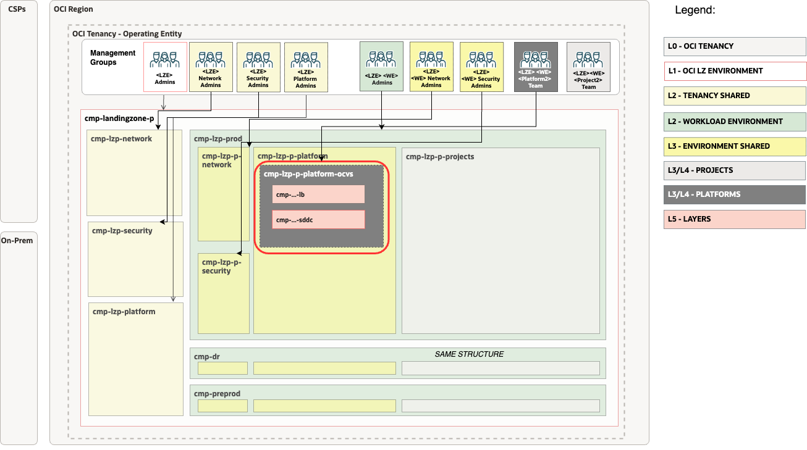

# Foundations set-up <!-- omit from toc -->

## **Table of Contents** <!-- omit from toc -->

- [**1. Summary**](#1-summary)
- [**2. Setup IAM Configuration**](#2-setup-iam-configuration)
  - [**2.1. Compartments**](#21-compartments)
  - [**2.2 Groups**](#22-groups)
  - [**2.3 Policies**](#23-policies)
- [**3. Setup Network Configuration**](#3-setup-network-configuration)
- [**4. Deploy**](#4-deploy)

&nbsp; 

## **1. Summary**

*Use the link above to run this extension by adding the updated configuration*

|                         |                                                                                                                            |
| ----------------------- | -------------------------------------------------------------------------------------------------------------------------- |
| **NAME**                | OCVS Foundation set-up                                                                                                    |
| **OBJECTIVE**           | Provision Identity and Network                                                                               |
| **TARGET RESOURCES**    | - **Security**: Compartments, Groups, Policies - **Network**: Spoke VCNs, Route tables, Security Lists                 |
| **PREREQUISITES**       | The [One-OE](../../../blueprints/one-oe/) Blueprint deployed as a foundation.                                                                 |
| **CONFIGURATION FILES** | - [identity.auto.tfvars.json](./identity.auto.tfvars.json)    - [network.auto.tfvars.json](./network.auto.tfvars.json) |
| **DEPLOYMENT**          | Use [Oracle Resource Manager (ORM)](/commons/content/orm.md) or [Terraform CLI](/commons/content/terraform.md).            |

&nbsp; 

## **2. Setup IAM Configuration**

For configuring and running the OneOE Landing Zone OCVS extension Identity Layer use the following JSON file: [identity.auto.tfvars.json](./identity.auto.tfvars.json) You can customize this configuration to fit your exact OCI IAM topology.

This configuration file covers three categories of resources described in the next sections.

This configuration file requires changes to reference the OCIDs of the OneOE Landing Zone resources which were deployed in [OneOE LZ](../../../blueprints/one-oe/) set-up.
Search for the values indicated below and replace with the correct OCIDs:

| Resource                  | OCID Text to Replace              | Description                        |
| ------------------------- | --------------------------------- | ---------------------------------- |
| Prod Platform Compartment | \<OCID-COMPARTMENT-PROD-PLATFORM> | The prod platform compartment OCID |

&nbsp; 

###  **2.1. Compartments**

The diagram below identifies the compartments in the scope of this operation.

&nbsp; 

The OCVS extension provisions 3 compartments. Parent OCVS platform compartment is created as an *example* in the platform compartment inside the **production environment**. The other 2 compartments LB and SDDC are created as nested children in the OCVS comparmetn.

OneOE Landing Zones defines multiple instances of platform compartment. Platform comparment is created **for each environement**, and **one shared** platform for resources spanning multiple environments. 

Using this extension requires choosing the right platform for the use cases. Extension can be modified to provision multiple instances of the delpoyment. For customizations see the full [compartment resource documentation](https://github.com/oracle-quickstart/terraform-oci-cis-landing-zone-iam/tree/main/compartments).

&nbsp; 

### **2.2 Groups**
As part of the deployment the following groups are created in the [Default Identity Domain](https://docs.oracle.com/en-us/iaas/Content/Identity/domains/overview.htm):
| Group                      | Description                                                               |
| -------------------------- | ------------------------------------------------------------------------- |
| grp-p-platform-ocvs-admins | Members of the group are able to administer OCVS and accompained services |

For customizations see the full [group resoruce documentation](https://github.com/oracle-quickstart/terraform-oci-cis-landing-zone-iam/tree/main/groups)

&nbsp; 

### **2.3 Policies**
As part of the deploymnet the following policies are created:
| Policy                     | Description                                             | Manage resources             | Use resources                   | Inspect resources |
| -------------------------- | ------------------------------------------------------- | ---------------------------- | ------------------------------- | ----------------- |
| pcy-p-platform-ocvs-admins | Grants group *pcy-p-platform-ocvs-admins* perminssions. | OCVS, Compute instances, VCN | NSG, Subnets, VNICs, IPs, VLANs | Security Lists    |

Policies contain compartment paths. The paths can change based on the modification in the previous [Compartments](#21-compartments) section. The paths need to be updated following the OCI [Policies and Compartment hierarchy](https://docs.oracle.com/en-us/iaas/Content/Identity/Concepts/policies.htm#hierarchy).

For customizations see the full [policy resource documentation](https://github.com/oracle-quickstart/terraform-oci-cis-landing-zone-iam/tree/main/policies)

&nbsp; 

## **3. Setup Network Configuration**

For configuring and running the OneOE LZ OCVS extension Network layer use the following JSON file: [network.auto.tfvars.json](/workload-extensions/ocvs/1_foundations/network.auto.tfvars.json)

This configuration file will require changes to the resources to reference the OCIDs of the OneOE Landing Zone.
Search for the values indicated below and replace with the correct OCIDs:

| Resource                 | OCID Text to Replace             | Description                                                    |
| ------------------------ | -------------------------------- | -------------------------------------------------------------- |
| Prod Network Compartment | \<OCID-COMPARTMENT-PROD-NETWORK> | The OCID of the Prod Network Compartment deployed in One-OE LZ |
| Hub DRG                  | \<OCID-DRG-HUB>                  | The OCID of the DRG in Hub deployed in step One-OE             |
| Hub DRG Route Table      | \<OCID-DRG-HUB-ROUTE-TABLE>      | The OCID of Route table in DRG                                 |

This configuration covers the following networking diagram. 

&nbsp; 

&nbsp; 

For customization of the pre-defined setup please refer to the [Networking documentation](https://github.com/oci-landing-zones/terraform-oci-modules-networking) for documentation and examples.

The network layer covers the following resources:

1. Spoke VCN - one Spoke VCN for OCVS platform
2. Subnets - one Subnet for Load Balancers
3. Gateway - Service Gateway to access OCI services
4. Security List - Security list for Load Balancers allowing all ingress/egress
5. Route Tables - One for Service Gateway, and a default route for routing all trafic through the central hub
6. DRG Attachment - Connect spoke with the central Hub

&nbsp; 

## **4. Deploy**

Use the link above to deploy using [Oracle Resource Manager (ORM)](/commons/content/orm.md) or use [Terraform CLI](/commons/content/terraform.md)

You can now proceed with [Step 2](./../2_ocvs/README.md).

&nbsp;
&nbsp; 

# License <!-- omit from toc -->

Copyright (c) 2024 Oracle and/or its affiliates.

Licensed under the Universal Permissive License (UPL), Version 1.0.

See [LICENSE](/LICENSE.txt) for more details.
