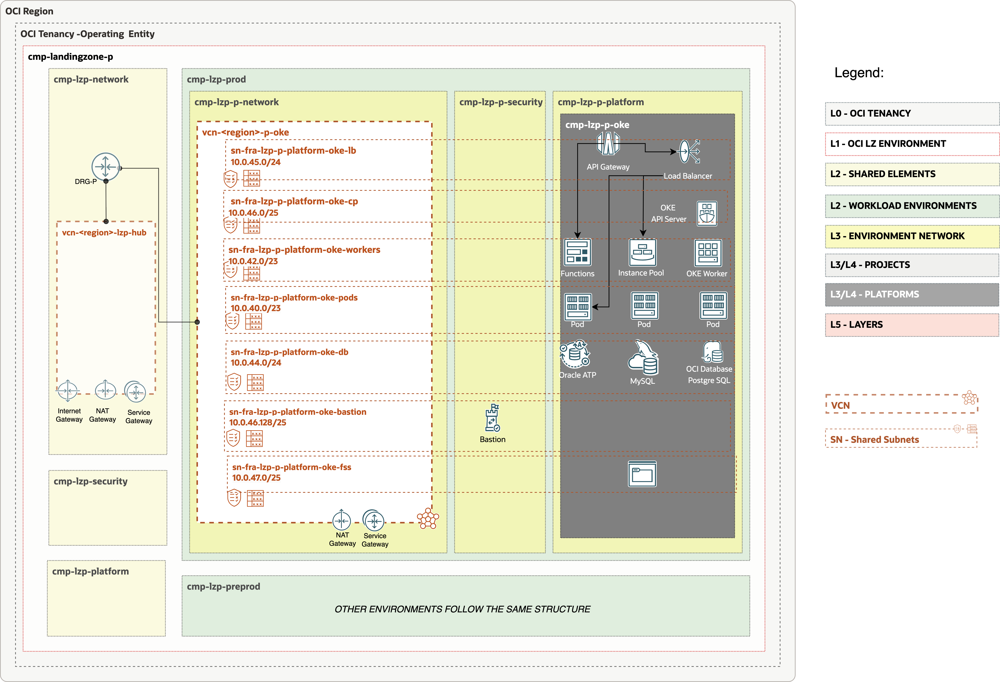
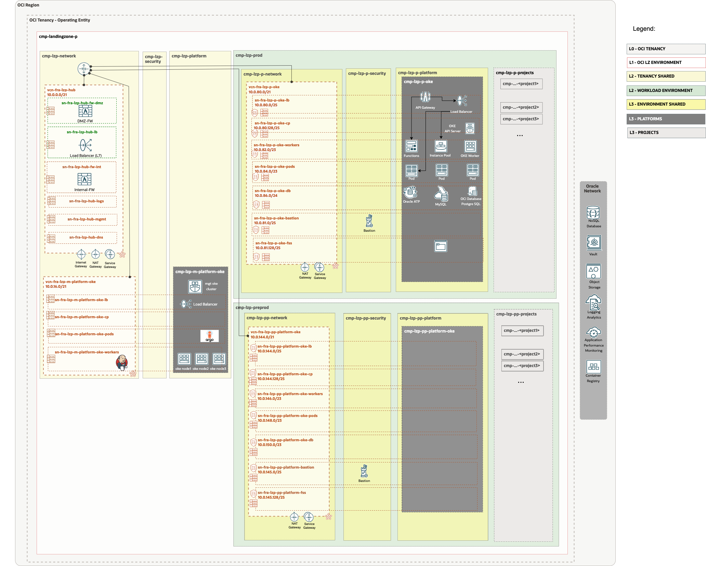

# Foundations set-up <!-- omit from toc -->

## **Table of Contents** <!-- omit from toc -->

- [**1. Summary**](#1-summary)
- [**2. Setup IAM Configuration**](#2-setup-iam-configuration)
  - [**2.1. Compartments**](#21-compartments)
  - [**2.2 Groups**](#22-groups)
  - [**3.4 Dynamic groups**](#34-dynamic-groups)
  - [**2.3 Policies**](#23-policies)
- [**3. Setup Network Configuration**](#3-setup-network-configuration)
  - [**3.1 VCNs**](#31-vcns)
  - [**3.2 Subnets**](#32-subnets)
  - [**3.3 Route Tables (RTs)**](#33-route-tables-rts)
  - [**3.4 Security Lists (SLs)**](#34-security-lists-sls)
  - [**3.5 Gateways**](#35-gateways)
    - [**3.5.1 Dynamic Routing Gateway (DRGs) Attachments**](#351-dynamic-routing-gateway-drgs-attachments)
    - [**3.5.2 Service Gateway (SGs)**](#352-service-gateway-sgs)
- [**4. Deploy**](#4-deploy)


## **1. Summary**

|                         |                                                                                                                            |
| ----------------------- | -------------------------------------------------------------------------------------------------------------------------- |
| **NAME**                | OKE Landing Zone Extension set-up                                                                                                    |
| **OBJECTIVE**           | Provision Identity and Network                                                                               |
| **TARGET RESOURCES**    | - **Security**: Compartments, Groups, Policies</br>- **Network**: Spoke VCNs, Route tables, Security Lists                 |
| **PREREQUISITES**       | The [One-OE](../../../blueprints/one-oe/) Blueprint deployed as a foundation. We recommend saving the stack outputs in the same bucket or GitHub repository where the one-off JSON files are stored. The saved file can then be used as a reference for future operations.                                                        |
| **CONFIGURATION FILES** | - [oci_open_lz_one-oe_iam.auto.tfvars.json](https://github.com/oci-landing-zones/oci-landing-zone-operating-entities/blob/v2.2.0-oneoe_v2/blueprints/one-oe/runtime/one-stack/oci_open_lz_one-oe_iam.auto.tfvars.json)  </br> - [oci_open_lz_hub_a_network_light.auto.tfvars.json]([./network.auto.tfvars.json](https://github.com/oci-landing-zones/oci-landing-zone-operating-entities/blob/v2.2.0-oneoe_v2/addons/oci-hub-models/hub_a/oci_open_lz_hub_a_network_light.auto.tfvars.json)|
| **DEPLOYMENT**          | Use [Oracle Resource Manager (ORM)](/commons/content/orm.md) or [Terraform CLI](/commons/content/terraform.md).            |

&nbsp; 

## **2. Setup IAM Configuration**

For configuring and running the One-OE Landing Zone OKE extension Identity Layer use the following JSON file: [identity.auto.tfvars.json](./identity.auto.tfvars.json) You can customize this configuration to fit your exact OCI IAM topology.

This configuration file covers three categories of resources described in the next sections.

###  **2.1. Compartments**


The OKE LZ extension provisions three **compartments**: two dedicated to managing environments, such as PROD and PRE-PROD, and a third compartment for management purposes.

New OKE compartments will be added as platform in each One-OE LZ environment, following the example shown in the next diagram:


The following diagram covers deployment with 2 Landing zone environments.


For simplicity, we will use single landing zone environment option in this template.

> [!NOTE]
> For extended documentation regarding compartment definition please refer to the [Identity & Access Management CIS Terraform module compartment example](https://github.com/oracle-quickstart/terraform-oci-cis-landing-zone-iam/blob/main/compartments/examples/vision/input.auto.tfvars.template).

&nbsp;

**JSON FILE REQUIRED CHANGES**
If ONE-OE is used as the baseline Landing Zone with output saving enabled, running this OKE extension with the added dependencies will automatically match the keys with the correct OCIDs. No changes to the JSON file are needed. Therefore, you can skip this section.

If you are using the CIS Landing Zone or another OCI Landing Zone option, this configuration file requires modification to reference the OCIDs of the existing deployed resources. Locate the values indicated below and replace them with the correct OCIDs.

| Resource         | Section          | Replace with OCIDs              | Description                        |
| ------------------------- | ------| --------------------------------- | ---------------------------------- |
| cmp-lzp-p-platform |  compartments| CMP-LZP-P-PLATFORM-KEY | The Prod platforms compartment OCID in Prod Env |
| cmp-lzp-d-platform | compartments| CMP-LZP-PP-PLATFORM-KEY| The Pre-prod platforms compartment OCID  in Preprod Env |
| cmp-lzp-platform |compartments | CMP-LZP-PLATFORM-KEY| The Shared platforms compartment OCID |


### **2.2 Groups**

The OKE extension will deploy IAM groups to manage resources in OKE compartments and provide fine-grained access to specific OKE resources.

As part of the deployment the following groups are created in the [Default Identity Domain](https://docs.oracle.com/en-us/iaas/Content/Identity/domains/overview.htm):


| ID     |     NAME                       | TYPE | OBJECTIVES                                  |
| ------ |  -------------------------- | ------------------------------------------- |---|
| GRP.00 |  grp-lzp-m-platform-oke-admins | IAM |Group for managing mgt OKE-related resources |
| GRP.01 | grp-lzp-p-platform-oke-admins | IAM| Group for managing Prod OKE-related resources |
| GRP.02 |  grp-lznp-pp-platform-oke-admins | IAM | Group for managing Pre-prod OKE-related resources |
| GRP.03 |  grp-lzp-p-platform-oke-viewer-role | IAM + OKE RBAC |Group for managing Prod OKE-related resources |
| GRP.04 |  grp-lzp-p-platform-oke-admin-role | IAM + OKE RBAC |Group for managing Prod OKE-related resources |
| GRP.05 |  grp-lzp-pp-platform-oke-viewer-role | IAM + OKE RBAC |Group for managing Pre-prod OKE-related resources |
| GRP.06 |  grp-lzp-pp-platform-oke-admin-role | IAM + OKE RBAC |Group for managing Pre-prod OKE-related resources |


In our pattern we define two different types of groups:

1. **IAM groups** to manage resources in OKE compartments.
2. **IAM groups with OKE RBAC** to grant fine-grained access control to OKE specific resources. In addition to IAM, the Kubernetes RBAC Authorizer can enforce additional fine-grained access controls via Kubernetes RBAC roles and clusterroles. A Kubernetes RBAC role is a collection of permissions. For example, a role might include read permission on pods and list permission for pods. A Kubernetes RBAC clusterrole is just like a role, applies across the whole cluster. A Kubernetes RBAC rolebinding maps a role to a user or group, granting that role's permissions to the user or group for resources in a namespace. Similarly, a Kubernetes RBAC clusterrolebinding maps a clusterrole to a user or group, granting that clusterrole's permissions across the entire cluster. IAM and the Kubernetes RBAC Authorizer work together to enable users who have been successfully authorized by at least one of them to complete the requested Kubernetes operation.

In our case as an example we have created the recommended groups for the prod oke cluster and pre-prod oke cluster. These are the steps for prod :

1. Create a new group in OCI IAM (e.g grp-lzp-p-platform-oke-viewer-role, which is already included in the blueprint)
2. Configure an OCI policy to grant access to the group to access the OKE clusters. (e.g pcy-p-platform-oke-rbal-viewer-role, which is already included in the blueprint) 
3. Create Roles and Role Bindings in OKE RBAC to authorize our user to access OKE resources. In a text editor, create the following manifest (for example, called pod-reader-group.yaml) to define the role and a role binding to enable the new IAM group to list pods in the kube-system namespace:

```
cat > pod-reader-group.yaml << EOF
  kind: Role
apiVersion: rbac.authorization.k8s.io/v1
metadata:
  name: pod-reader-ks
  namespace: kube-system
rules:
- apiGroups: [""]
  resources: ["pods"]
  verbs: ["get", "watch", "list"]
---
kind: RoleBinding
apiVersion: rbac.authorization.k8s.io/v1
metadata:
  name: pod-reader-ks-role-binding
  namespace: kube-system
subjects:
- kind: group
  name: <group-ocid>
  apiGroup: rbac.authorization.k8s.io
roleRef:
  kind: Role
  name: pod-reader-ks
  apiGroup: rbac.authorization.k8s.io

EOF
```
4. Create the new role and rolebinding by applying configuration file to the Kubernetes. 
  ```kubectl apply -f pod-reader-group.yml```

To check all the steps for managing RBAC visit [documentation](https://docs.oracle.com/en-us/iaas/Content/ContEng/Concepts/contengaboutaccesscontrol.htm#About_Access_Control_and_Container_Engine_for_Kubernetes). There are blogs further covering the steps [Kubernetes RBAC Explained — With Examples](https://medium.com/system-weakness/kubernetes-rbac-explained-with-examples-40e1c5e44c32) or [Demystifying Kubernetes RBAC](https://medium.com/@extio/demystifying-kubernetes-rbac-a-deep-dive-into-role-based-access-control-b3fc5969794a)

> [!NOTE]
> For extended documentation regarding group definition please refer to the [Identity & Access Management CIS Terraform module groups example](https://github.com/oracle-quickstart/terraform-oci-cis-landing-zone-iam/blob/main/groups/examples/vision/input.auto.tfvars.template).

### **3.4 Dynamic groups**

The OKE LZ Extension includes the following dynamic groups as examples:

* **dg-lzp-prod-platform-oke** for authenticating all instances of the Prod OKE cluster against OCI. See [OCI documentation](https://docs.oracle.com/en-us/iaas/Content/Identity/Tasks/callingservicesfrominstances.htm) for details.
* **dg-lzp-sec-fun-dynamic-group** to enable a function to access another Oracle Cloud Infrastructure resource. To read more about this go [here](https://docs.oracle.com/en-us/iaas/Content/Functions/Tasks/functionsaccessingociresources.htm).

TODO:
- why is there Oracle Function as example in OKE?

> [!NOTE]
> For extended documentation regarding dynamic groups please refer to the [Identity & Access Management CIS Terraform module dynamic groups example](https://github.com/oracle-quickstart/terraform-oci-cis-landing-zone-iam/blob/main/dynamic-groups/examples/vision/input.auto.tfvars.template).

>**_JSON FILE REQUIRED Dynamic Groups CHANGES_**
>**NOTE:**
>Run the dynamic groups as defined. The matching rules have associated OCIDs that cannot be referenced using the dependencies feature. After the first apply job, you need to update the CMP-LZP-SECURITY-KEY and CMP-LZP-PLATFORM-KEY attributes with the correct OCIDs, and then run a second apply job.


### **2.3 Policies**

As part of the deployment the following policies are created:
| Policy                     | Description                                             | Manage resources             | Use resources                   | Inspect resources |
| -------------------------- | ------------------------------------------------------- | ---------------------------- | ------------------------------- | ----------------- |
| pcy-p-platform-oke-admins | Grants group **grp-lzp-p-platform-oke-admins** permissions. | OKE, Computes, VCN | NSG, Subnets, VNICs, IPs | compartments    |
| pcy-pp-platform-oke-admins | Grants group **grp-lzp-pp-platform-oke-admins** permissions. | OKE, Computes, VCN | NSG, Subnets, VNICs, IPs | compartments    |
| pcy-m-platform-oke-admins | Grants group **grp-lzp-m-platform-oke-admins** permissions. | OKE, Computes, VCN | NSG, Subnets, VNICs, IPs | compartments    |
| pcy-p-platform-oke-rbac-admin-role | Grants group **pcy-p-platform-oke-rbac-admin-role** permissions. | -  | OKE |  -  |
| pcy-p-platform-oke-rbac-view-role | Grants group **pcy-p-platform-oke-rbac-view-role** permissions. | - | OKE |  -  |
| pcy-pp-platform-oke-rbac-admin-role | Grants group **pcy-pp-platform-oke-rbac-admin-role** permissions. | -  | OKE |  -  |
| pcy-pp-platform-oke-rbac-view-role | Grants group **pcy-pp-platform-oke-rbac-view-role** permissions. | -  | OKE |  -   |
| pcy-root-oke-hybrid | The **pcy-p-platform-oke-hybrid** policy is an example of an additional IAM policy required when a cluster and its related resources reside in separate compartments.To use the OCI VCN-Native Pod Networking CNI plugin on top a LZ deployment, where a cluster's related resources (such as node pools, VCN, and VCN resources) are in a different compartment to the cluster itself, you must include this [policy](https://docs.oracle.com/en-us/iaas/Content/ContEng/Concepts/contengpodnetworking_topic-OCI_CNI_plugin.htm). If you are deploying the flannel option this specific policy is not needed.| instances  | private-ips ,network-security-groups | -    |
| pcy-p-oke-secrets| The **pcy-p-oke-secrets** is an example of a recommended policy to allow applications running on the cluster to be authenticated with OCI through InstancePrincipal, for example to grant access to secrets. To read more about his check this [article](https://vaibhav-sonavane.medium.com/use-instance-principal-to-access-secrets-6c4aee1bfea4) or the [official documentation](https://docs.oracle.com/en-us/iaas/Content/Identity/Tasks/callingservicesfrominstances.htm?source=post_page-----6c4aee1bfea4--------------------------------)| -  | - | -    |


For a detailed review of OKE policies, please refer to the official OKE documentation [here](https://docs.oracle.com/en-us/iaas/Content/ContEng/Concepts/contengpolicyconfig.htm#Policy_Configuration_for_Cluster_Creation_and_Deployment).

Additional policies may be required for using [Capacity Reservations](https://docs.oracle.com/en-us/iaas/Content/ContEng/Tasks/contengmakingcapacityreservations.htm) or if you choose to [manage the master encryption key yourself](https://docs.oracle.com/en-us/iaas/Content/ContEng/Tasks/contengencryptingdata.htm). These policies are not included in this example, make sure to add them if they apply to your use case.

> [!NOTE]
>For extended documentation regarding policies refer to the [Identity & Access Management CIS Terraform module policies examples](https://github.com/oracle-quickstart/terraform-oci-cis-landing-zone-iam/tree/main/policies/examples) and [policy resource documentation](https://github.com/oracle-quickstart/terraform-oci-cis-landing-zone-iam/tree/main/policies)


>**_JSON FILE REQUIRED Policies CHANGES_**
>**NOTE:**
>Policies contain compartment paths. The paths can change based on the modification in the previous [Compartments](#21-compartments) section. The paths need to be updated following the OCI [Policies and Compartment hierarchy](https://docs.oracle.com/en-us/iaas/Content/Identity/Concepts/policies.htm#hierarchy).


## **3. Setup Network Configuration**

The OKE Cluster requires specific subnets. You can review all these requirements in the [OKE documentation](https://docs.oracle.com/en-us/iaas/Content/ContEng/Concepts/contengnetworkconfig.htm)



For configuring and running the One-OELZ OKE extension Network layer use the following JSON file: [network.auto.tfvars.json](./network.auto.tfvars.json)

>**_JSON FILE REQUIRED CHANGES_**
>If ONE-OE is used as the baseline Landing Zone with output saving enabled, running this OKE extension with the added dependencies will automatically match the keys with the correct OCIDs. Therefore, you can skip this section. If you are using the CIS Landing Zone or another core Landing Zone, this configuration file requires modification to reference the OCIDs of the existing deployed resources. Locate the values indicated below and replace them with the correct OCIDs.

>| Resource                 | Replace with OCIDs              | Description                                                    |
>| ------------------------ | -------------------------------- | -------------------------------------------------------------- |
>| Prod Network Compartment | CMP-LZP-P-NETWORK-KEY | The OCID of the Prod Network Compartment |
>| Pre-prod Network Compartment | CMP-LZP-PP-NETWORK-KEY |  The OCID of the Pre-prod Network Compartment  |
>| Mgt Network Compartment | CMP-LZP-NETWORK-KEY |  The OCID of the Network Compartment |
>| Hub DRG                  | DRG-FRA-LZP-HUB-KEY                 | The OCID of the DRG in Hub deployed by One-OE LZ             |
>| Hub DRG Route Table      | OCID-DRG-HUB-ROUTE-TABLE      | The OCID of Route table in DRG                                 |


Our OKE LZ extension will deploy the necessary core resources for both the Production and Pre-production environments included in the ONE-OE blueprint. This example is based on the OCI VCN-Native Pod Networking CNI scenario. Some adjustments would be required for a Flannel setup.



The network layer covers the following resources:
1. Spoke management VCN for OKE management purposes.
2. Spokes VNCs for each environment - one Spoke Pre-prod OKE VCN and one Spoke Prod OKE VCN
3. Subnets - OKE required subnets; like cp,workers,pods,lb,database,fss and bastion subnet.
4. Service Gateway - Service Gateway for access OCI services
5. Nat Gateway
6. Security List - allowing all ingress/egress
7. Route Tables.
8. DRG Attachments - Connect spokes with the central Hub
9. Route tables ONE-OE Hub VCN updates (Covered in OP 3)


For customization of the pre-defined setup please refer to the [Networking documentation](https://github.com/oracle-quickstart/terraform-oci-cis-landing-zone-networking) for documentation and examples.
&nbsp; 

### **3.1 VCNs**

The following table describes the deployed VCNs.

| ID       | NAME           | OBJECTIVES                         |
| ------  | -------------- | ---------------------------------- |
| VCN.01  | vcn-fra-lzp-m-platform-oke | Spoke VCN dedicated to Mgt OKE set-up |
| VCN.02  | vcn-fra-lzp-p-platform-oke | Spoke VCN dedicated to Prod OKE set-up |
| VCN.03  | vcn-fra-lzp-pp-platform-oke | Spoke VCN dedicated to Preprod OKE set-up |


### **3.2 Subnets**

The following table describes the deployed Subnets added for each environment OKE platform:

| ID    |  NAME             | OBJECTIVES                |
| ----- | ---------------- | ------------------------- |
| SN.00 |  sn-fra-lzp-p-platform-oke-lb | OKE private Prod lb subnet |
| SN.01 |  sn-fra-lzp-p-platform-oke-cp | OKE Prod control plane subnet |
| SN.02 |  sn-fra-lzp-p-platform-oke-workers | OKE Prod workers subnet |
| SN.03 |  sn-fra-lzp-p-platform-oke-pods| OKE Prod pods subnet |
| SN.04 |  sn-fra-lzp-p-platform-oke-db| db Prod subnet |
| SN.05 |  sn-fra-lzp-p-platform-oke-bastion| Prod bastion subnet |
| SN.06 |  sn-fra-lzp-p-platform-oke-fss| Prod fss subnet |
| SN.07 |  sn-fra-lzp-pp-platform-oke-lb | OKE PreProd private lb subnet |
| SN.08 |  sn-fra-lzp-pp-platform-oke-cp | OKE PreProd control plane subnet |
| SN.09 |  sn-fra-lzp-pp-platform-oke-workers | OKE PreProd workers subnet |
| SN.10 |  sn-fra-lzp-pp-platform-oke-pods| OKE PreProd pods subnet |
| SN.11 |  sn-fra-lzp-pp-platform-oke-db| db PreProd subnet |
| SN.12 |  sn-fra-lzp-pp-platform-oke-bastion| PreProd bastion subnet |
| SN.13 |  sn-fra-lzp-pp-platform-oke-fss| fss PreProd subnet |

### **3.3 Route Tables (RTs)**

The following table describes the deployed Route Tables:

| ID    |  NAME               | OBJECTIVES                            |
| ----- |  ------------------ | ------------------------------------- |
| RT.00 | rt-fra-lzp-p-lb | OKE Load Balancer Prod subnet route table |
| RT.01 | rt-fra-lzp-p-cp | OKE Control Plane Prod subnet route table |
| RT.02 | rt-fra-lzp-p-pods | OKE Pods Prod subnet route table |
| RT.03 | rt-fra-lzp-p-workers | OKE Workers Prod subnet route table |
| RT.04 | rt-fra-lzp-p-generic | OKE Generic Prod subnet route table |
| RT.00 | rt-fra-lzp-pp-lb | OKE Load Balancer PreProd subnet route table |
| RT.01 | rt-fra-lzp-pp-cp | OKE Control Plane PreProd subnet route table |
| RT.02 | rt-fra-lzp-pp-pods | OKE Pods PreProd subnet route table |
| RT.03 | rt-fra-lzp-pp-workers | OKE Workers PreProd subnet route table |
| RT.04 | rt-fra-lzp-pp-generic | OKE Generic PreProd subnet route table |


### **3.4 Security Lists (SLs)**
The following table describes the deployed Security Lists (SLs):

| ID    |  NAME                | OBJECTIVES                              |
| ----- |  ------------------- | --------------------------------------- |
| SL.00 | sl-lzp-p-platform-pods | OKE Prod pods subnet security list |
| SL.01 | sl-lzp-p-platform-workers| OKE Prod Workers subnet security list |
| SL.02 | sl-lzp-d-platform-lb | OKE Prod Load Balancer subnet security list |
| SL.03 | sl-lzp-p-platform-cp | OKE Prod Control Plane subnet security list |
| SL.04 | sl-lzp-pp-platform-pods | OKE Pre-prod pods subnet security list |
| SL.05 | sl-lzp-pp-platform-workers| OKE Pre-prod Workers subnet security list |
| SL.06 | sl-lzp-pp-platform-lb | OKE Pre-prod Load Balancer  subnet security list |
| SL.07 | sl-lzp-pp-platform-cp | OKE Pre-prod Control Plane subnet security list |


### **3.5 Gateways**


#### **3.5.1 Dynamic Routing Gateway (DRGs) Attachments**

The following tables describe the deployed DRG Attachments.

| ID      |  NAME                      | OBJECTIVES                                   |
| ------- |  ------------------------- | -------------------------------------------- |
| DRGA.00 |  drgatt-vcn-fra-lzp-p-platform-oke | DRG Attachment for the OKE Prod spoke to the hub |
| DRGA.00 |  drgatt-vcn-fra-lzp-pp-platform-oke | DRG Attachment for the OKE Preprod spoke to the hub 
| DRGA.00 |  drgatt-vcn-fra-lzp-m-platform-oke | DRG Attachment for the OKE Mgt spoke to the hub 


#### **3.5.2 Service Gateway (SGs)**


The following table describes the proposed Service Gateways added for each environment OKE platform:

| ID    |  NAME          | OBJECTIVES           |
| ----- |  ------------- | -------------------- |
| SG.00 |  sg-fra-p-ocvs | SG in OKE Prod VCN. |
| SG.00 |  sg-fra-pp-ocvs | SG in OKE Pre-prod VCN. |
| SG.00 |  sg-fra-m-ocvs | SG in OKE Mgt VCN. |


## **4. Deploy**
<a href='https://cloud.oracle.com/resourcemanager/stacks/create?zipUrl=https://github.com/oracle-quickstart/terraform-oci-landing-zones-orchestrator/archive/refs/tags/v2.0.0.zip'></a>

Use the link above to deploy using [Oracle Resource Manager (ORM)](/../../../commons/content/orm.md) or use [Terraform CLI](../../../commons/content/terraform.md)

You can now proceed with [Step 2](../2_oke/).


&nbsp;

# License <!-- omit from toc -->

Copyright (c) 2024 Oracle and/or its affiliates.

Licensed under the Universal Permissive License (UPL), Version 1.0.

See [LICENSE](/LICENSE) for more details.
