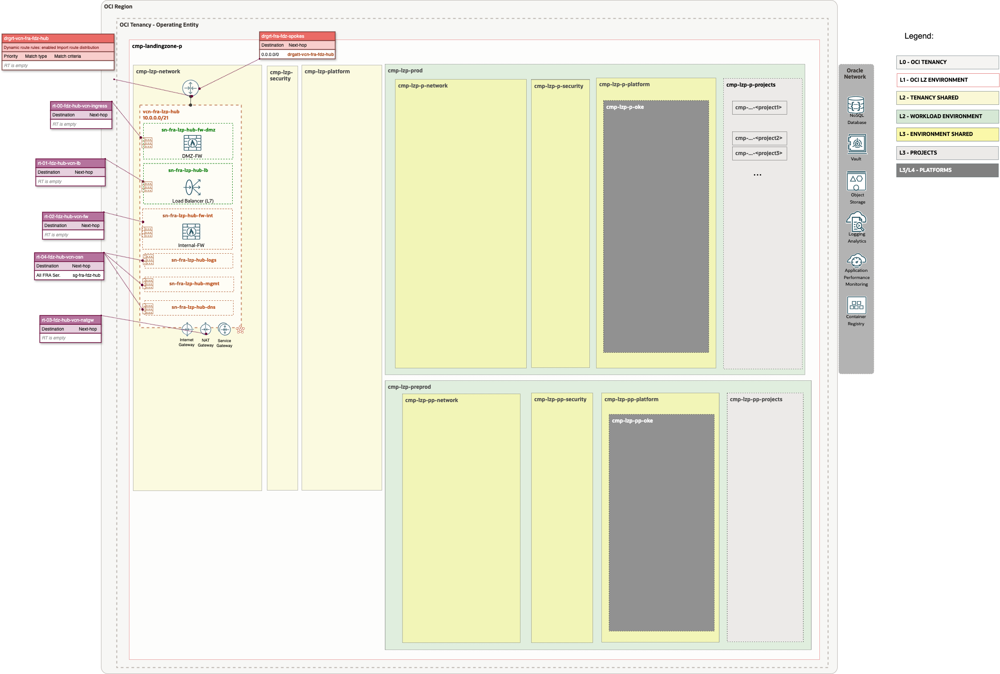
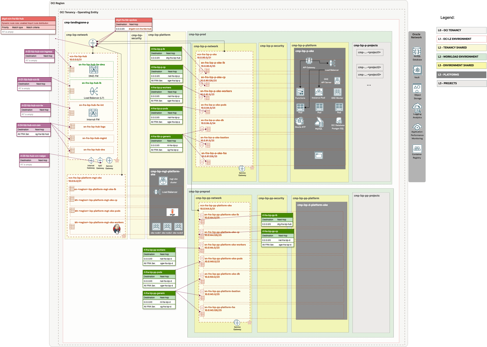

# OP.1.1 - Firewall and RT updates <!-- omit from toc -->
## **Table of Contents** <!-- omit from toc -->
- [**1. Routing**](#1-routing)

&nbsp; 

## **1. Routing**

In all of our OCI Landing Zone models, we recommend implementing a Hub-and-Spoke network architecture. This approach enables you to deploy a firewall in the hub for traffic inspection, ensuring enhanced security. To save time in the design phase with our customers, we have included four hub models. You can choose to use either our OCI native firewall or a third-party solution, such as Fortinet or Palo Alto. Explore the four models [here](https://github.com/oci-landing-zones/oci-landing-zone-operating-entities/tree/master/addons/oci-hub-models).

In this case we have selected model A that is equipped with two OCI Network Firewalls - a next-generation managed network firewall and an intrusion detection and prevention service. The first firewall is dedicated to inbound traffic, while the second is responsible for outbound and East-West traffic control and inspection.

Model A offer two options: a **Light Version** (No Cost), where a virtual machine (VM) is deployed with a load balancer, and a **Complete Version** (With Cost), which includes the deployment of a firewalls.

The next Diagram shows the routing included in the [ONE-OE Hub A Deployment (Light Version - No Cost)](https://github.com/oci-landing-zones/oci-landing-zone-operating-entities/blob/master/addons/oci-hub-models/hub_b/readme.md):

The next Diagram shows  rounting included in the OKE Ext LZ:

The next steps are to add the firewall and update the corresponding routes. To accomplish this, we need to follow the steps outlined in the [Hub B Deployment (Light Version - No Cost)](https://github.com/oci-landing-zones/oci-landing-zone-operating-entities/blob/master/addons/oci-hub-models/hub_b/readme.md)	

For demo purposes, we will deploy a dummy VM instead of a firewall. If needed, the steps to deploy the firewall are also provided on the previous page

**a.** Deploy a dummy FW VM for the DMZ and Internal FWs following these steps [How to create a dummy FW VM](https://github.com/oci-landing-zones/oci-landing-zone-operating-entities/blob/master/commons/content/howto_create_dummy_fw_vm.md)

**b.** Identify the Private IP OCID of your firewalls following these [steps](https://github.com/oci-landing-zones/oci-landing-zone-operating-entities/blob/master/commons/content/howto_identify_private_ip_ocid_vm_vnic.md)

**c.** Update the POST network JSON configuration [**oci_open_lz_hub_b_network_light_post.auto.tfvars.json**](https://github.com/oci-landing-zones/oci-landing-zone-operating-entities/blob/v2.2.0-oneoe_v2/addons/oci-hub-models/hub_a/oci_open_lz_hub_a_network_light.auto.tfvars.json) and replace the "DMZ FW PRIVATE IP OCID" with the OCID of the Public DMZ Firewall Private IP OCID identified in the previous steps. You can use the find & replace of the IDE of your choice.
You can see the customized file for this OKE template here.

**d.** Edit the ORM stack and replace the original Network JSON configuration file with the new one **oci_open_lz_hub_b_network_light_post.auto.tfvars.json**

**e.** Run Plan & Apply.

This is the diagram that show the final Network configuration:

TBC

# Acknowledgments <!-- omit from toc -->
* **Authors**: *Paola Juárez* (Landing Zones Specialist) 
* **Contributors**: 

&nbsp;

# License <!-- omit from toc -->

Copyright (c) 2024 Oracle and/or its affiliates.

Licensed under the Universal Permissive License (UPL), Version 1.0.

See [LICENSE](/LICENSE) for more details.