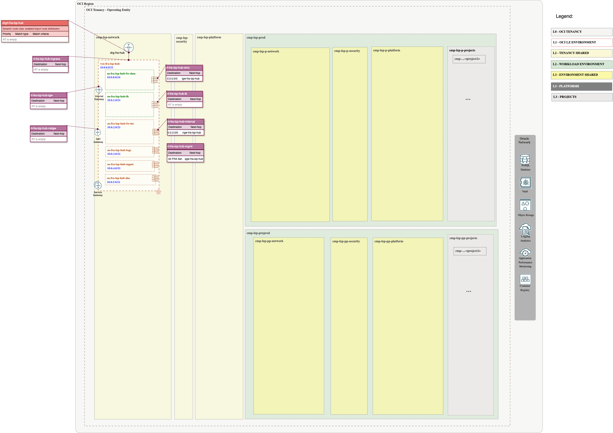
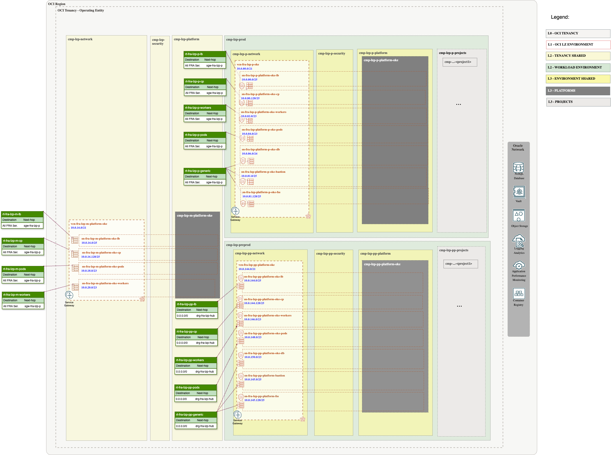
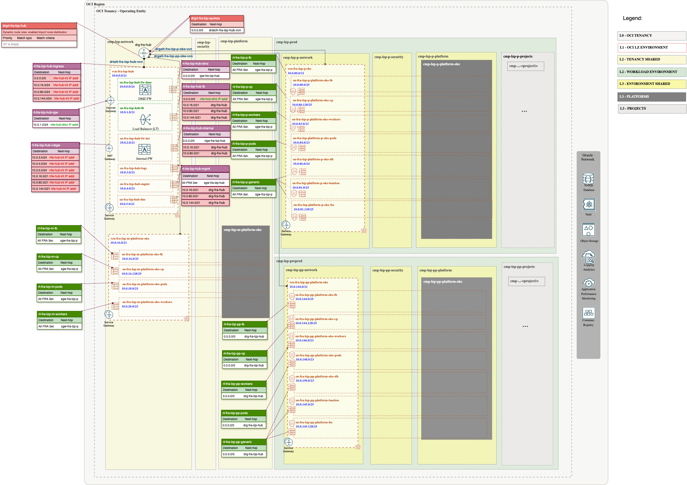
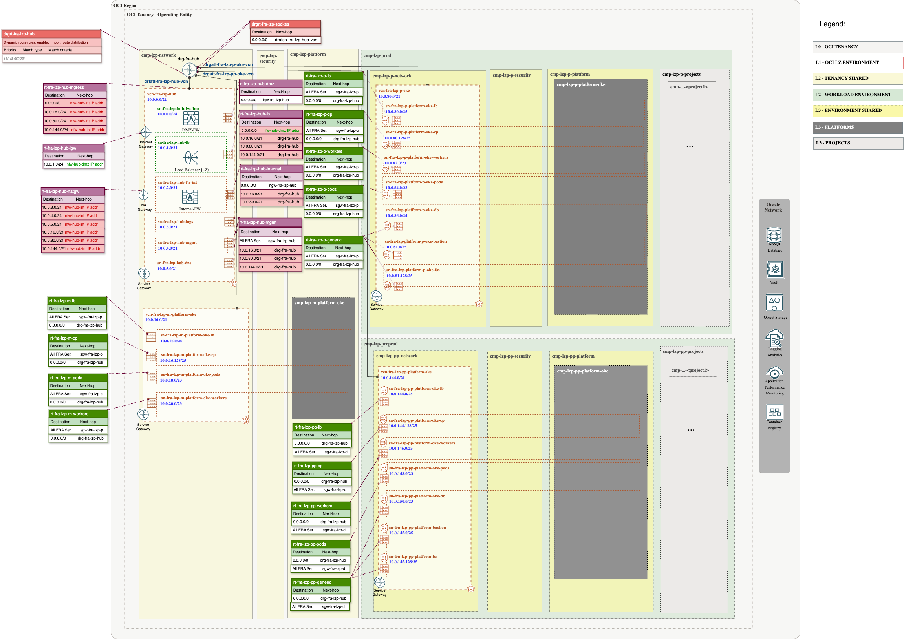
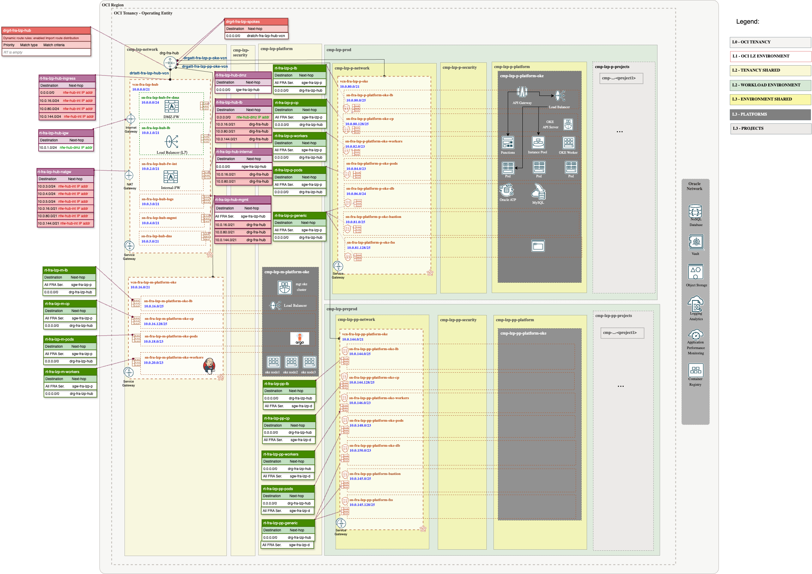

# Firewalls and RT updates <!-- omit from toc -->

## **Routing**

In all of our OCI Landing Zone models, we recommend implementing a Hub-and-Spoke network architecture. This approach enables you to deploy a firewall in the hub for traffic inspection, ensuring enhanced security. To save time in the design phase with our customers, we have included four hub models. You can choose to use either our OCI native firewall or a third-party solution, such as Fortinet or Palo Alto. Explore the four models [here](https://github.com/oci-landing-zones/oci-landing-zone-operating-entities/tree/master/addons/oci-hub-models).

In this case we have selected model A that is equipped with two OCI Network Firewalls - a next-generation managed network firewall and an intrusion detection and prevention service. The first firewall is dedicated to inbound traffic, while the second is responsible for outbound and East-West traffic control and inspection.

Model A offer two options: a **Light Version** (No Cost), where a virtual machine (VM) is deployed with a load balancer, and a **Complete Version** (With Cost), which includes the deployment of a firewalls. In this asset we are using the Light Version.

The purpose of this page is to guide you through the routing configuration. These are the steps:

**1.**

The next Diagram shows the routing included in the [ONE-OE Hub A Deployment (Light Version - No Cost)](https://github.com/oci-landing-zones/oci-landing-zone-operating-entities/blob/master/addons/oci-hub-models/hub_b/readme.md) note that is almost empty:

For IAM, Security, and Observability Layers, we are reusing the ONE-OE [one-stack](https://github.com/oci-landing-zones/oci-landing-zone-operating-entities/tree/master/blueprints/one-oe/runtime/one-stack).

**2.**

The next Diagram shows the routing included in the OKE LZ Extension:

 **3.**

The next step is to add the firewalls and update the corresponding routes. To accomplish this, we need to follow the steps outlined in the [Hub A Deployment (Light Version - No Cost)](https://github.com/oci-landing-zones/oci-landing-zone-operating-entities/blob/master/addons/oci-hub-models/hub_a/readme.md).

For demonstration purposes, we will deploy a dummy VMs instead of firewalls. However, the option to deploy firewalls is also available on the previous page if needed.

 Deploy dummy FW VMs for the DMZ and INTERNAL FWs following these steps [How to create a dummy FW VM](https://github.com/oci-landing-zones/oci-landing-zone-operating-entities/blob/master/commons/content/howto_create_dummy_fw_vm.md).

 **4.**

Identify the Private IP OCID of your VMs following these [steps](https://github.com/oci-landing-zones/oci-landing-zone-operating-entities/blob/master/commons/content/howto_identify_private_ip_ocid_vm_vnic.md).

Edit the provided [customized post hub A Json file](../oci_oke_lz_ext_open_lz_post_hub_a_network_light.auto.tfvars.json).
Note: You can find a generic JSON file for HUB A checking our [hub models asset](https://github.com/oci-landing-zones/oci-landing-zone-operating-entities/tree/master/addons/oci-hub-models/hub_a).

- Replace the "**DMZ FW PRIVATE IP OCID**" with the OCID of the Public DMZ Firewall Private IP OCID identified in the previous steps.
- Replace the "**INT FW PRIVATE IP OCID**" with the OCID of the Private Internal Firewall Private IP OCID identified in the previous steps.
- Replace the "**OCID VCN OKE PROD**" with the OCID for the Prod VCN.
- Replace the "**OCID VCN OKE PREPROD**" with the OCID for the PreProd VCN.
- Replace the "**OCID VCN OKE MGT**" with the OCID for the MGT VCN.

You can use the find & replace of the IDE of your choice.

 **5.**

Edit the ONE-OE ORM stack and replace the original Network JSON configuration file with the new **oci_oke_lz_ext_open_lz_post_hub_a_network_light.auto.tfvars** updated file.

 **6.**
 
Run Plan & Apply to populate the new changes.

This is the diagram that show the Network after adding the post STEP1 configuration:

Now that the spokes are attached to the hub, you can update their routing by adding a rule to the DRG.

 **7.**
 
 Update file **oci_oke_lz_ext_network_npn_post.auto.tfvars** adding your DRG OCID and edit the ORM stack (STEP2) replacing the original Network JSON configuration with the updated file.

Run Plan & Apply to populate the new changes.

This is the diagram that show the final Network configuration:

 **8.**

Finally, this will be the complete picture after deploying the OKE clusters.

&nbsp;

# License <!-- omit from toc -->

Copyright (c) 2026 Oracle and/or its affiliates.

Licensed under the Universal Permissive License (UPL), Version 1.0.

See [LICENSE](/LICENSE.txt) for more details.
