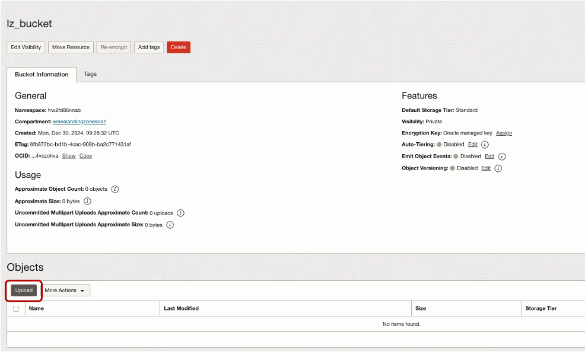
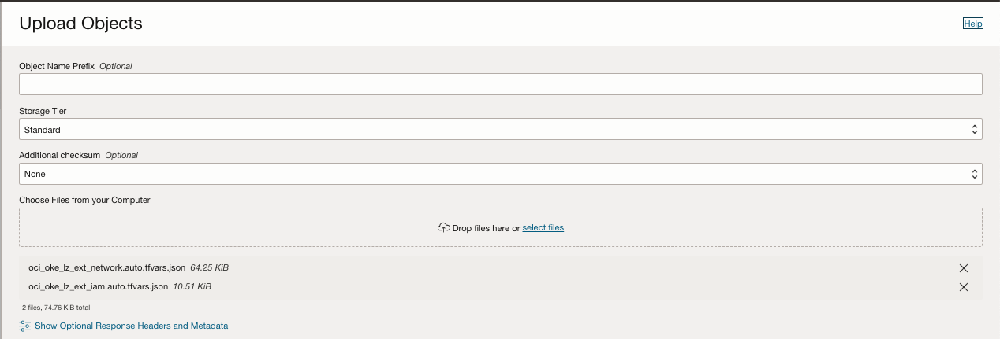
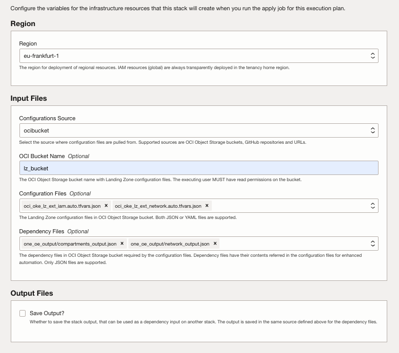

# STEP2. ORM OKE LZ EXT Deployment Steps <!-- omit from toc -->

If you deployed the 'Core LZ' in the initial operation using ORM and following the ONE-OE LZ model with the output feature enabled, deploying and running a LZ extension will be straightforward and require no additional changes.

When you press the provided magic button, a new ORM stack is created. Follow these steps:
1. Accept terms, wait for the configuration to load.
2. Set the working directory to “rms-facade”.
3. Set the stack name you prefer.
4. Set the terraform version to 1.5.x. Click Next.
5. In our example, we include OKE LZ extension required JSON files stored in our open Landing Zone GitHub repository. Click next.
6. Add the dependencies file created in OP1 as an output. We selected the **ocibucket** option, specifying our bucket name along with the compartments and network files
7. Un-check run apply. Click Create.

For standardization purposes and better control over the JSON files, we recommend following the same approach used in OP1 by uploading your own files to your OCI bucket.

# Upload your customized OKE LZ EXT JSON files

Click on each file to download it, and make any necessary changes if required.

* IAM: 
oci_oke_lz_ext_iam.auto.tfvars.json
* Network: 
oci_oke_lz_ext_network.auto.tfvars.json

Upload the files to your new bucket or drag and drop them directly.

You can now view the uploaded files in your bucket, giving you full control over them.

&nbsp; 
# Update the ORM with your own JSON links

In the configuration variables page:

1. Review the region selected for the deployment.
2.  Set the configuration source to OCI bucket.
3.  Enter the name of the bucket created in the previous step.
4.  Remove the default files in the Configuration Files section and upload the four new updated files to the bucket.
5.  Add the dependencies file created in OP1 as an output. We selected the **ocibucket** option, specifying our bucket name along with the compartments and network files, Click next.
6.  Un-check run apply. Click Create.

First, execute a plan job (1) to review all the resources that Terraform will create. Once verified, proceed to run the apply job (2) to initiate the deployment.

# License <!-- omit from toc -->

Copyright (c) 2025 Oracle and/or its affiliates.

Licensed under the Universal Permissive License (UPL), Version 1.0.

See [LICENSE](/LICENSE) for more details.
