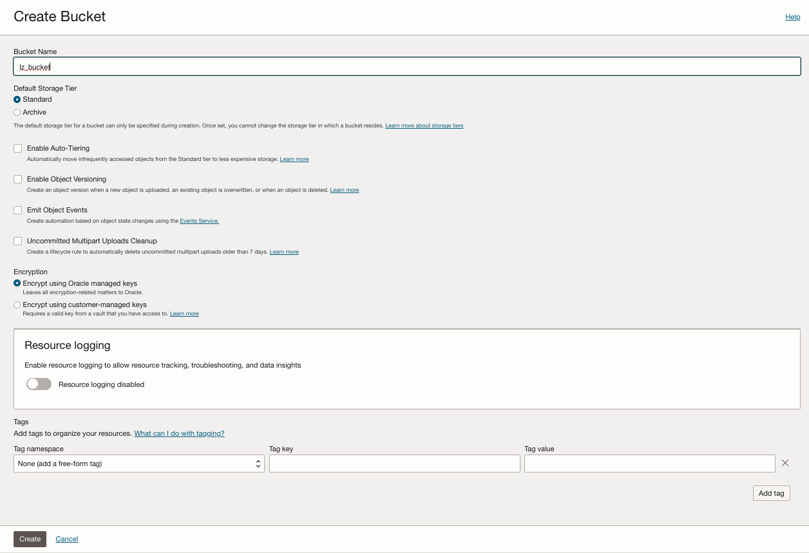

# STEP1. ORM ONE-OE Deployment Steps <!-- omit from toc -->


## **Using Output and Dependencies features with ORM**

Our Landing Zone extensions are designed to integrate seamlessly with our core Landing Zone models, such as ONE-OE or Multi-OE. We onboard a LZ extension as an additional operation performed after the initial deployment of the core Landing Zone.

When you press the provided magic button, a new ORM stack is created. Follow these steps:
1. Accept terms, wait for the configuration to load.
2. Set the working directory to “rms-facade”.
3. Set the stack name you prefer.
4. Set the terraform version to 1.5.x. Click Next.
5. In our example, we include the required JSON files stored in our open Landing Zone GitHub repository. Running it as-is will deploy the ONE-OE Landing Zone in your tenancy. However, if you want to use the **Dependencies** and **Output** features, some minor modifications will be necessary. Click next.
6. Un-check run apply. Click Create.


To minimize customizations and leverage the provided extension templates, we highly recommend using the output feature. This feature automatically generates a file containing key-resource pairs, simplifying subsequent operational deployments.

To store the Json files in a OCI bucket follow the next steps:

# Create your own OCI Bucket <!-- omit from toc -->

1. **Main Menu-> Storage -> Buckets**
2. **Create a new Bucket**.



&nbsp; 
# Upload your customized JSON files

Click on each file to download it, and make any necessary changes if required.

* IAM: 
[oci_open_lz_one-oe_iam.auto.tfvars.json](https://github.com/oci-landing-zones/oci-landing-zone-operating-entities/blob/v2.2.0-oneoe_v2/blueprints/one-oe/runtime/one-stack/oci_open_lz_one-oe_iam.auto.tfvars.json)
* Security:
[oci_open_lz_one-oe_security_cisl1.auto.tfvars.json](https://github.com/oci-landing-zones/oci-landing-zone-operating-entities/blob/v2.2.0-oneoe_v2/blueprints/one-oe/runtime/one-stack/oci_open_lz_one-oe_security_cisl1.auto.tfvars.json)
* Network: 
[oci_open_lz_hub_a_network_light.auto.tfvars.json](https://github.com/oci-landing-zones/oci-landing-zone-operating-entities/blob/v2.2.0-oneoe_v2/blueprints/one-oe/runtime/one-stack/oci_open_lz_hub_a_network_light.auto.tfvars.json)
* Observability:
[oci_open_lz_one-oe_observability_cisl1.auto.tfvars.json](https://github.com/oci-landing-zones/oci-landing-zone-operating-entities/blob/v2.2.0-oneoe_v2/blueprints/one-oe/runtime/one-stack/oci_open_lz_one-oe_observability_cisl1.auto.tfvars.json)


Upload the files to your new bucket or drag and drop them directly.


You can now view the uploaded files in your bucket, giving you full control over them.


&nbsp; 
# Update the ORM with your own JSON links

In the configuration variables page:

1. Review the region selected for the deployment.
2. Set the configuration source to OCI bucket.
3. Enter the name of the bucket created in the previous step.
4. Remove the default files in the Configuration Files section and upload the four new updated files to the bucket.
5. In the Output Files section, click 'Save Output' and specify a folder where the output files will be saved.
6. Click next.
7. Un-check run apply. Click Create.


First, execute a plan job (1) to review all the resources that Terraform will create. Once verified, proceed to run the apply job (2) to initiate the deployment.


After deployment, you can visit your bucket to check the new files created using the output option.


Example of compartment_output.json

```
{"compartments":
{
"CMP-LANDINGZONE-P-KEY":{"id":"ocid1.compartment.oc1..xxx"},"CMP-LZP-NETWORK-KEY":{"id":"ocid1.compartment.oc1..xxx"},"CMP-LZP-P-NETWORK-KEY":{"id":"ocid1.compartment.oc1..xxx"},"CMP-LZP-P-PLATFORM-KEY":{"id":"ocid1.compartment.oc1..xxx"},"CMP-LZP-P-PROJ1-APP-KEY":{"id":"ocid1.compartment.oc1..xxx"},"CMP-LZP-P-PROJ1-DB-KEY":{"id":"ocid1.compartment.oc1..xxx"},"CMP-LZP-P-PROJ1-INFRA-KEY":{"id":"ocid1.compartment.oc1..xxx"},"CMP-LZP-P-PROJ1-KEY":{"id":"ocid1.compartment.oc1..xxx"},"CMP-LZP-P-PROJECTS-KEY":{"id":"ocid1.compartment.oc1..xxx"},"CMP-LZP-P-SECURITY-KEY":{"id":"ocid1.compartment.oc1..xxx"},"CMP-LZP-PLATFORM-KEY":{"id":"ocid1.compartment.oc1..xxx"},"CMP-LZP-PP-NETWORK-KEY":{"id":"ocid1.compartment.oc1..xxx"},"CMP-LZP-PP-PLATFORM-KEY":{"id":"ocid1.compartment.oc1..xxx"},"CMP-LZP-PP-PROJ1-APP-KEY":{"id":"ocid1.compartment.oc1..xxx"},"CMP-LZP-PP-PROJ1-DB-KEY":{"id":"ocid1.compartment.oc1..xxx"},"CMP-LZP-PP-PROJ1-INFRA-KEY":{"id":"ocid1.compartment.oc1..xxx"},"CMP-LZP-PP-PROJ1-KEY":{"id":"ocid1.compartment.oc1..xxx"},"CMP-LZP-PP-PROJECTS-KEY":{"id":"ocid1.compartment.oc1..xxx"},"CMP-LZP-PP-SECURITY-KEY":{"id":"ocid1.compartment.oc1..xxx"},"CMP-LZP-PREPROD-KEY":{"id":"ocid1.compartment.oc1..xxx"},
"CMP-LZP-PROD-KEY":{"id":"ocid1.compartment.oc1..xxx"},"CMP-LZP-SECURITY-KEY":{"id":"ocid1.compartment.oc1..xxx"}
}
}
```

# License <!-- omit from toc -->

Copyright (c) 2025 Oracle and/or its affiliates.

Licensed under the Universal Permissive License (UPL), Version 1.0.

See [LICENSE](/LICENSE) for more details.
