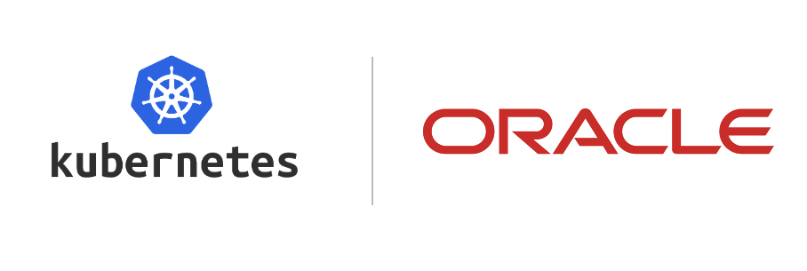

# **[OKE Landing Zone Extension](#)**   <!-- omit from toc -->
## **An OCI Open LZ [Workload Extensions](#) to Reduce Your Time-to-Production** <!-- omit from toc -->

 
&nbsp; 

Welcome to the **OKE Landing Zone Extension**.

The OKE Landing Zone Extension is a secure cloud environment, designed with the best practices to simplify the on-boarding of OKE workloads and enable the continuous operations of their cloud resources. This reference architecture provides an automated landing zone configuration.

Currently two options are available

- [**Simple OKE deployment**](./simple) - 1 OKE Cluster in production environment using a simple configuration.
- [**Advanced OKE deployment**](./advanced) - 3 OKE Clusters in prod, pre-prod and management environments using an advanced configuration. 

&nbsp;

## License <!-- omit from toc -->

Copyright (c) 2026 Oracle and/or its affiliates.

Licensed under the Universal Permissive License (UPL), Version 1.0.

See [LICENSE](/LICENSE.txt) for more details.
