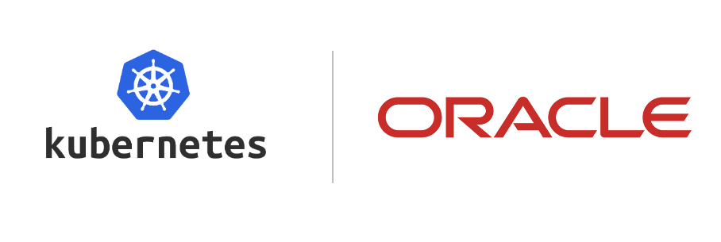

# OKE Workload Extension <!-- omit from toc -->

- [1. Summary](#1-summary)
- [2. Deployment Options](#2-deployment-options)
- [3. Additional Resources](#3-additional-resources)

## 1. Summary

The OKE workload extension prepares the OCI landing-zone resources for Kubernetes clusters and managed worker nodes. It uses the [One-OE blueprint](/blueprints/one-oe/readme.md) as its foundation.

## 2. Deployment Options

Use the [published OKE quickstarts](simple/readme.md) for one OKE platform on Hub E. Hub E has no firewall, so these references are intended for PoC, lab, or explicitly non-production designs that accept that tradeoff. The resource keys use an environment named `prod`; that name does not make the reference a production firewall design.

Use [Blueprint Factory](simple/oke-blueprint-factory.md) for production with a firewall-based hub, or when the design needs different environments, platforms, networking modes, or address ranges.

## 3. Additional Resources

- [OKE quickstart overview](simple/readme.md)
- [Single-stack deployment](simple/single-stack/readme.md)
- [Multi-stack deployment](simple/multi-stack/readme.md)
- [Blueprint Factory customization](simple/oke-blueprint-factory.md)

## License <!-- omit from toc -->

Copyright (c) 2026 Oracle and/or its affiliates.

Licensed under the Universal Permissive License (UPL), Version 1.0.

See [LICENSE](/LICENSE.txt) for more details.
