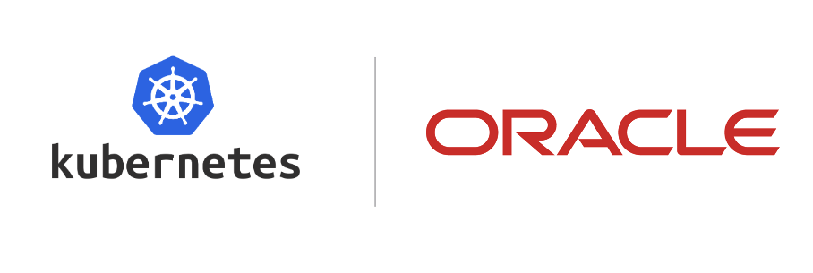

# **[OKE Landing Zone Extension](#)**   <!-- omit from toc -->
## **An OCI Open LZ [Workload Extensions](#) to Reduce Your Time-to-Production** <!-- omit from toc -->

 
&nbsp; 

## **1. Introduction**
Welcome to the **OKE Landing Zone Extension**.

The OKE Landing Zone Extension is a secure cloud environment, designed with the best practices to simplify the on-boarding of OKE workloads and enable the continuous operations of their cloud resources. This reference architecture provides an automated landing zone configuration.
&nbsp;

## **2. Design Overview**
This workload extension uses the [One-OE](https://github.com/oracle-quickstart/terraform-oci-open-lz/tree/master/blueprints/one-oe) Blueprint as the reference Landing Zone and guides the deployment of OKE on top of it. Extension consists of base infrastructure layer provisioning required OCI resources for deployment of OKE and OKE deployment itself.
&nbsp;

## **3. Deployment Options**

This OKE Landing Zone Extension provides **two published quickstart approaches**, [single-stack](single-stack/) and  [multi-stack](multi-stack/), to accommodate different use cases and architectural preferences. Both published simple approaches are based on **Hub E**. For other hub models, use config-driven generation with `oke_simple`.

For customized OKE landing zones generated from a configuration file, see [OKE Config-Driven Generation](config-driven.md).

The published simple quickstarts create one production OKE platform by default. Use config-driven generation to add pre-production or additional OKE platforms.

### **Choosing the Right Approach**

| Consideration | [Single-stack](single-stack/) | [Multi-stack](multi-stack/) |
|---------------|-------------|--------------|
| **Use Case** | PoC, Exploration | Existing Hub E quickstart with separate lifecycle |
| **Hub Model** |  [Hub E (free)](../../../addons/oci-hub-models/hub_e/) |  Existing [Hub E](../../../addons/oci-hub-models/hub_e/) landing zone |
| **Routing Configuration** |  Automatic Hub route updates | OKE spoke attachment and Hub E route coordination |
| **Landing Zone** | Created together  | Already exists |
| **Deployment Steps** | Single deployment operation | Deploy LZ first, then OKE extension |
| **Terraform State** |  Combined (1 state) | Separate (2 states) |
| **Resource Lifecycle** | Coupled | Independent |
| **Complexity** | Self-contained | Requires key coordination across stacks |

The simple path is intentionally an example quickstart. Use [OKE Config-Driven Generation](config-driven.md) when the landing zone must use Hub A, Hub B, Hub C, multiple OKE platforms, multiple environments, overlay networking, or custom CIDR/subnet layouts beyond the published examples.

### Common Features (Both Approaches)

Both deployment options provide:
- **Automated Dependency Resolution**: Configuration keys instead of manual OCID lookups
- **CIS-Compliant OKE**: Using [CIS OKE module](https://github.com/oci-landing-zones/terraform-oci-modules-workloads/tree/main/cis-oke)
- **OKE CNI Network Modes**: VCN-native pod networking by default, with config-driven overlay networking for Flannel-compatible clusters
- **Comprehensive NSG Configuration**: Control plane, workers, load balancers, and, for native networking, pods
- **Hub-and-Spoke Topology**: OKE VCN as spoke connected to Hub via DRG
- **No Hub L7 Load Balancer**: The OKE quickstart keeps the Hub LB subnet available but does not provision a hub-level OCI L7 Load Balancer; OKE creates OCI load balancers from Kubernetes `Service` resources
- **Service Gateway**: Direct connectivity to OCI services

### OKE Network Modes

The published simple OKE JSON files use the native network mode by default. In config-driven generation, `oke_simple` can also emit an overlay network shape for Flannel-compatible clusters.

| Config parameter | Purpose | Supported values | Default |
| --- | --- | --- | --- |
| `cni_type` | Network shape emitted by the workload extension | `native`, `overlay` | `native` |
| `cni` | OKE cluster CNI requested from the downstream OKE module | `vcn_native`, `flannel` | `vcn_native` for native, `flannel` for overlay |

Native mode emits control plane, internal load balancer, worker, and pod subnets, and wires the worker node pool with pod subnet and pod NSG IDs. Overlay mode emits only control plane, internal load balancer, and worker subnets; it omits the OCI pod subnet, pod route table, pod security list, pod NSG, and worker pod networking fields. Overlay mode defaults `pods_cidr` to `10.244.0.0/16` for the Kubernetes overlay network.

For config-driven generation, auto-subnet profiles are the default subnetting path. If `cluster_size` is omitted and no manual OKE subnet map is provided, the generator uses `small`. The supported sizes are `small`, `medium`, and `large`; they require OKE VCN prefixes `/20`, `/18`, and `/16` respectively. When auto-subnetting is used, OKE platform subnets are generated by the extension. Manual OKE subnet CIDRs are still supported by omitting `cluster_size` and defining `network.subnets` with the required native or overlay subnet keys.

### Deployment Components

Both approaches deploy these resources:
- **IAM Configuration**: Compartments, groups, and policies for OKE
- **Network Infrastructure**: VCN, subnets, NSGs, route tables, service gateway, and DRG attachment
- **OKE Cluster**: Kubernetes cluster with native or overlay networking (v1.35.2)
- **Worker Nodes**: Compute instances for running workloads (VM.Standard.E5.Flex, Oracle Linux 8.10)

&nbsp;

## License <!-- omit from toc -->

Copyright (c) 2026 Oracle and/or its affiliates.

Licensed under the Universal Permissive License (UPL), Version 1.0.

See [LICENSE](/LICENSE.txt) for more details.
