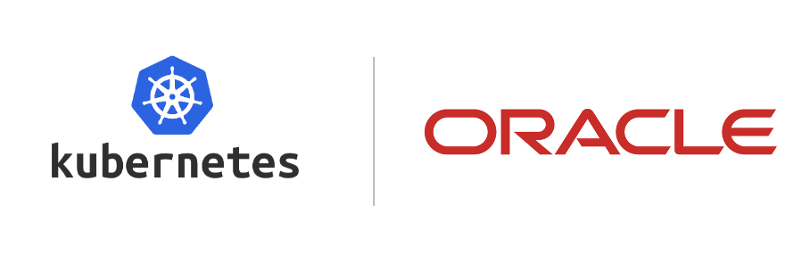

# **[OKE Landing Zone Extension](#)**   <!-- omit from toc -->
## **An OCI Open LZ [Workload Extensions](#) to Reduce Your Time-to-Production** <!-- omit from toc -->

 
&nbsp; 

## **1. Introduction**
Welcome to the **OKE Landing Zone Extension**.

The OKE Landing Zone Extension is a secure cloud environment, designed with the best practices to simplify the on-boarding of OKE workloads and enable the continuous operations of their cloud resources. This reference architecture provides an automated landing zone configuration.
&nbsp;

## **2. Design Overview**
This workload extension uses the [One-OE](https://github.com/oracle-quickstart/terraform-oci-open-lz/tree/master/blueprints/one-oe) Blueprint as the reference Landing Zone and guides the deployment of OKE on top of it. Extension consists of base infrastructure layer provisioning required OCI resources for deployment of OKE and OKE deployment itself.
&nbsp;

## **3. Deployment Options**

This OKE Landing Zone Extension provides **two quickstart approaches**, [single-stack](single-stack/) and [multi-stack](multi-stack/), to accommodate different use cases and architectural preferences. Both use the committed JSON configurations as-is and are based on **Hub E**.

For requirements outside the quickstart configurations, such as other hub models or additional OKE platforms, see [OKE generation options](oke-blueprint-factory.md).

The quickstarts create one production OKE platform by default.


### **Choosing the Right Approach**

| Consideration | [Single-stack](single-stack/) | [Multi-stack](multi-stack/) |
|---------------|-------------|--------------|
| **Use Case** | PoC, Exploration | Existing Hub E quickstart with separate lifecycle |
| **Hub Model** |  [Hub E (free)](../../../addons/oci-hub-models/hub_e/) |  Existing [Hub E](../../../addons/oci-hub-models/hub_e/) landing zone |
| **Routing Configuration** |  Automatic Hub route updates | OKE spoke attachment and Hub E route coordination |
| **Landing Zone** | Created together  | Already exists |
| **Deployment Steps** | Single deployment operation | Deploy LZ first, then OKE extension |
| **Terraform State** |  Combined (1 state) | Separate (2 states) |
| **Resource Lifecycle** | Coupled | Independent |
| **Complexity** | Self-contained | Requires key coordination across stacks |

The committed quickstart configurations are designed to be deployed as-is.


### Common Features (Both Approaches)

Both deployment options provide:
- **Automated Dependency Resolution**: Configuration keys instead of manual OCID lookups
- **CIS-Compliant OKE**: Using [CIS OKE module](https://github.com/oci-landing-zones/terraform-oci-modules-workloads/tree/main/cis-oke)
- **OKE CNI Network Mode**: VCN-native pod networking
- **Comprehensive NSG Configuration**: Control plane, workers, load balancers, and, for native networking, pods
- **Hub-and-Spoke Topology**: OKE VCN as spoke connected to Hub via DRG
- **Public workload ingress**: Kubernetes `Service` resources can create public OCI Load Balancers in the prepared Hub subnet.
- **Service Gateway**: Direct connectivity to OCI services
- **Optional File Storage prerequisites**: Config-driven generation can add a dedicated FSS subnet, NSG rules, and scoped IAM permission.

### Deployment Components

Both approaches deploy the same main components:

| Component | What is deployed |
| --- | --- |
| IAM | OKE administrator and resource-principal policies, compartments, and groups. |
| Network | An OKE VCN with cluster, worker, pod, and private load-balancer subnets and NSGs; Hub routing and public-ingress prerequisites are included. |
| OKE | A Kubernetes cluster with VCN-native pod networking. |
| Workers | A managed node pool using `VM.Standard.E5.Flex` and an Oracle Linux 9 OKE image. |
| Workload load balancing | Private OCI Load Balancers and Network Load Balancers use the OKE VCN. Public OCI Load Balancers use the Hub LB subnet and a network-team-controlled frontend NSG. |

This repository deploys OCI infrastructure only. Deploy Kubernetes workloads and `Service` resources through an approved Kubernetes delivery process.

### Deploying workload load balancers

Use the deployed network-stack outputs to resolve compartment, subnet, and NSG OCIDs. The generated `int-lb-default-backend` NSG provides the preconfigured LB-to-backend connectivity and must be attached to the load balancer. In private deployments, OKE can create and manage a separate frontend NSG in the environment network compartment. Public Hub frontend NSGs remain network-team-managed.

The private and public OCI Load Balancer examples set `oci.oraclecloud.com/ingress-ip-mode: "proxy"` so traffic originating inside the cluster and sent to the Service's load-balancer address traverses the OCI Load Balancer. Without it, the default `VIP` mode sends in-cluster traffic directly to application pods, bypassing listener TLS, rule sets, WAF/WAA attachments, frontend NSGs, and other load-balancer controls. The annotation requires Kubernetes 1.30 or later.

#### Private OCI Load Balancer

A private load balancer stays in the OKE VCN and uses the cluster's configured private services subnet. The following example terminates TLS at the load balancer, restricts frontend access, limits simultaneous connections to each backend, and rejects HTTP headers larger than 16 KiB. OKE creates and manages a frontend NSG, while the generated `int-lb-default-backend` NSG is attached to the load balancer without allowing OKE to modify its rules:

```yaml
apiVersion: v1
kind: Service
metadata:
  name: my-private-service
  annotations:
    # Load balancer type, ownership, placement, and stable addressing.
    oci.oraclecloud.com/load-balancer-type: "lb"
    oci.oraclecloud.com/compartment-id: "<environment-network-compartment-ocid>"
    service.beta.kubernetes.io/oci-load-balancer-internal: "true"
    service.beta.kubernetes.io/oci-load-balancer-subnet1: "<internal-lb-subnet-ocid>"
    oci.oraclecloud.com/reserved-private-ips: "<reserved-private-ip-address>"

    # Route in-cluster clients through the LB and use NSGs instead of security lists.
    oci.oraclecloud.com/ingress-ip-mode: "proxy"
    oci.oraclecloud.com/security-rule-management-mode: "NSG"
    oci.oraclecloud.com/oci-network-security-groups: "<int-lb-default-backend-nsg-ocid>"

    # Terminate TLS 1.2/1.3 at the LB and forward HTTP to the application.
    service.beta.kubernetes.io/oci-load-balancer-ssl-ports: "443"
    service.beta.kubernetes.io/oci-load-balancer-backend-protocol: "HTTP"
    oci-load-balancer.oraclecloud.com/tls-certificate-map: "private-lb-tls"
    oci.oraclecloud.com/oci-load-balancer-listener-ssl-config: '{"CipherSuiteName":"oci-tls-12-13-ssl-cipher-suite-v3","Protocols":["TLSv1.2","TLSv1.3"]}'

    # Bound backend connections and accepted HTTP header size.
    oci-load-balancer.oraclecloud.com/backendset-backend-max-connections: "1024"
    oci.oraclecloud.com/oci-load-balancer-rule-sets: |
      {
        "header-size": {
          "items": [
            {
              "action": "HTTP_HEADER",
              "httpLargeHeaderSizeInKB": 16
            }
          ]
        }
      }
spec:
  type: LoadBalancer
  selector:
    app: my-app
  loadBalancerSourceRanges:
    - "<approved-private-client-cidr>"
  ports:
    - name: https
      protocol: TCP
      port: 443
      targetPort: 8080
---
apiVersion: v1
kind: ConfigMap
metadata:
  name: private-lb-tls
data:
  "443": '["<oci-leaf-certificate-ocid>"]'
```

The compartment annotation is required because OKE otherwise creates the load balancer in the cluster compartment, while this extension authorizes private load-balancer lifecycle in the environment network compartment. The certificate must be active, in the same region as the load balancer, and stored in the owning OKE platform compartment. The `ConfigMap` must be in the same Kubernetes namespace as the Service.

The example uses the OCI version 3 cipher suite for TLS 1.2 and TLS 1.3. The maximum-connection value is applied to each backend, not to the backend set as a whole, and must be adjusted to the tested capacity of the application. The header-size annotation makes OKE authoritative for all load-balancer rule sets; include any additional required rule sets in the same JSON object.

Reserved private IPv4 addresses require Kubernetes 1.32 or later. The address must already be reserved, available, and belong to the selected load-balancer subnet. It must be declared during initial Service creation; changing from an automatically assigned address requires recreating the Service. Remove the `oci.oraclecloud.com/reserved-private-ips` annotation when a stable private address is not required.

#### Private OCI Network Load Balancer

A private Network Load Balancer uses NLB-specific subnet and internal annotations. OKE creates and manages a frontend NSG, while the generated `int-lb-default-backend` NSG is attached to the NLB without allowing OKE to modify its rules. Network Load Balancers do not terminate TLS; this example passes TCP 443 through to an application that owns the certificate and TLS configuration:

```yaml
apiVersion: v1
kind: Service
metadata:
  name: my-private-nlb-service
  annotations:
    # Network Load Balancer type, ownership, placement, and stable addressing.
    oci.oraclecloud.com/load-balancer-type: "nlb"
    oci.oraclecloud.com/compartment-id: "<environment-network-compartment-ocid>"
    oci-network-load-balancer.oraclecloud.com/internal: "true"
    oci-network-load-balancer.oraclecloud.com/subnet: "<internal-lb-subnet-ocid>"
    oci.oraclecloud.com/reserved-private-ips: "<reserved-private-ip-address>"

    # Let OKE manage a frontend NSG and attach the preconfigured connectivity NSG.
    oci.oraclecloud.com/security-rule-management-mode: "NSG"
    oci-network-load-balancer.oraclecloud.com/oci-network-security-groups: "<int-lb-default-backend-nsg-ocid>"

    # Redirect established flows when a backend becomes unhealthy.
    oci-network-load-balancer.oraclecloud.com/is-instant-failover-enabled: "true"
spec:
  type: LoadBalancer
  externalTrafficPolicy: Local
  selector:
    app: my-app
  loadBalancerSourceRanges:
    - "<approved-private-client-cidr>"
  ports:
    - name: tls
      protocol: TCP
      port: 443
      targetPort: 8443
```

`externalTrafficPolicy: Local` sends traffic only to nodes with a local ready endpoint. Review the application's pod distribution and availability requirements before using it. This setting alone does not guarantee source preservation. When preserving the original client IP is required, also add `oci-network-load-balancer.oraclecloud.com/is-preserve-source: "true"` and ensure the backend NSGs permit the original client CIDRs.

The reserved private IPv4 address has the same Kubernetes version, subnet, availability, and initial-creation requirements described for the private Load Balancer. Remove the annotation when a stable private address is not required.

#### Public OCI Load Balancer

A public load balancer is created in the Hub network compartment and Hub LB subnet. The following example terminates TLS at the load balancer, limits simultaneous connections to each backend, and rejects HTTP headers larger than 16 KiB. The network team owns all Hub security rules, so OKE must not manage security lists or NSG rules. Attach the approved Hub frontend NSG only after the load balancer is active:

1. Create the Service without `oci.oraclecloud.com/oci-network-security-groups`. Set security-rule management mode to `None` so OKE does not modify security lists or NSG rules.

   ```yaml
   apiVersion: v1
   kind: Service
   metadata:
     name: my-public-service
     annotations:
       # Load balancer type, Hub ownership, public placement, and stable addressing.
       oci.oraclecloud.com/load-balancer-type: "lb"
       oci.oraclecloud.com/compartment-id: "<hub-network-compartment-ocid>"
       service.beta.kubernetes.io/oci-load-balancer-subnet1: "<hub-public-lb-subnet-ocid>"
       oci.oraclecloud.com/reserved-ips: "<reserved-public-ip-address>"

       # Route in-cluster clients through the LB; the network team owns Hub rules.
       oci.oraclecloud.com/ingress-ip-mode: "proxy"
       oci.oraclecloud.com/security-rule-management-mode: "None"

       # Terminate TLS 1.2/1.3 at the LB and forward HTTP to the application.
       service.beta.kubernetes.io/oci-load-balancer-ssl-ports: "443"
       service.beta.kubernetes.io/oci-load-balancer-backend-protocol: "HTTP"
       oci-load-balancer.oraclecloud.com/tls-certificate-map: "public-lb-tls"
       oci.oraclecloud.com/oci-load-balancer-listener-ssl-config: '{"CipherSuiteName":"oci-tls-12-13-ssl-cipher-suite-v3","Protocols":["TLSv1.2","TLSv1.3"]}'

       # Bound backend connections and accepted HTTP header size.
       oci-load-balancer.oraclecloud.com/backendset-backend-max-connections: "1024"
       oci.oraclecloud.com/oci-load-balancer-rule-sets: |
         {
           "header-size": {
             "items": [
               {
                 "action": "HTTP_HEADER",
                 "httpLargeHeaderSizeInKB": 16
               }
             ]
           }
         }
   spec:
     type: LoadBalancer
     selector:
       app: my-app
     ports:
       - name: https
         protocol: TCP
         port: 443
         targetPort: 8080
   ---
   apiVersion: v1
   kind: ConfigMap
   metadata:
     name: public-lb-tls
   data:
     "443": '["<oci-leaf-certificate-ocid>"]'
   ```

2. Wait until the OCI Load Balancer is active and the Service reports its public address.
3. Add the approved NSG and reapply the Service:

   ```yaml
   metadata:
     annotations:
       # Attach only the network-team-approved, matching-platform Hub NSG.
       oci.oraclecloud.com/oci-network-security-groups: "<approved-hub-frontend-nsg-ocid>"
       oci.oraclecloud.com/security-rule-management-mode: "None"
   ```

OKE then attaches the NSG and continues listener and backend reconciliation. Do not include the NSG during initial creation: the matching-tag IAM restriction is enforceable only during post-create attachment.

The network team exclusively manages the Hub frontend NSG's placement, platform tag, rules, movement, and lifecycle. OKE can attach it only when its `tagns-lz-oke.platform` tag matches the cluster platform tag. Approval is cluster-to-NSG, not Service-to-NSG, so the cluster can reuse that approved NSG on its other public load balancers. IAM remains the enforcement boundary even if Kubernetes admission or RBAC is bypassed. Do not specify `loadBalancerSourceRanges`; OKE does not manage the Hub frontend rules. The approved Hub NSG controls public ingress, while its egress rules and the OKE worker or pod ingress rules provide cross-VCN backend connectivity.

The certificate must be active, in the same region as the load balancer, and stored in the owning OKE platform compartment. The `ConfigMap` must be in the same Kubernetes namespace as the Service. The maximum-connection value applies to each backend and must be adjusted to the tested capacity of the application. The header-size annotation makes OKE authoritative for all load-balancer rule sets; include any additional required rule sets in the same JSON object.

To reuse a reserved public IPv4 address, create it in the Hub network compartment and declare it during initial Service creation. The annotation takes the IP address value, not the public-IP OCID. Remove the `oci.oraclecloud.com/reserved-ips` annotation when a stable public address is not required.

OCI Web Application Firewall (WAF) and Web Application Acceleration (WAA) can also be attached to the provisioned Layer 7 Load Balancer. OKE provides no Service annotations for these integrations. After the load balancer is active, create a WAF firewall that binds an approved WAF policy to the load balancer, or create a WAA acceleration that binds an approved WAA policy to it. These resources, their IAM permissions, and their lifecycle must be managed outside the Kubernetes Service manifest.

See the [summary of OKE load-balancer annotations](https://docs.oracle.com/en-us/iaas/Content/ContEng/Tasks/contengcreatingloadbalancer_topic-Summaryofannotations.htm) for the complete LB and NLB annotation reference.

### Using OCI File Storage

Config-driven OKE generation can prepare OCI File Storage networking and IAM by setting `create_fss: true` in the `oke_simple` parameters. The option defaults to `false`, so the committed quickstarts and existing configurations do not gain extra subnets or permissions.

When enabled, the generated OKE VCN includes a private FSS subnet, service-gateway-only route table, FSS security list and NSG, and paired stateless NFS rules between the FSS and worker NSGs. The OKE cluster principal also receives `manage file-family` in its own platform compartment.

The extension does not create a file system, mount target, or Kubernetes storage objects. After infrastructure deployment, create a mount target in the generated FSS subnet and associate the generated FSS NSG with it. Then configure the `fss.csi.oraclecloud.com` StorageClass with that existing `mountTargetOcid` and the OKE platform compartment. This keeps the mount target and its NSG association under infrastructure management while CSI manages file systems and persistent volumes. See [Provisioning PVCs on the File Storage Service](https://docs.oracle.com/en-us/iaas/Content/ContEng/Tasks/contengcreatingpersistentvolumeclaim_Provisioning_PVCs_on_FSS.htm).

CIS2 worker initialization installs `oci-fss-utils` from the developer repository matching the runtime Oracle Linux major version. This prepares CIS2 workers for FSS in-transit encryption. CIS1 workers do not install the package.

Worker boot volumes default to `60` GB. Set `worker_boot_volume_size` to an integer from `50` through `32768` in the `oke_simple` parameters to choose another size. Worker initialization runs `oci-growfs` at both CIS levels so the root partition and filesystem use the configured capacity, then executes the OKE-provided bootstrap script so the node can join the cluster.

### Additional operational notes

- OCI Load Balancer can terminate TLS with an approved certificate in the owning OKE platform compartment. OKE can read and associate the certificate but cannot renew it. TCP pass-through to an in-cluster TLS endpoint is also supported.
- The initial public-LB state remains closed only while the Hub LB subnet security list does not permit public ingress. Changing or removing the approved NSG's platform tag causes later attachment requests to fail.
- When public workload ingress is enabled, the shared Hub policy grants public-IP and floating-IP management plus private-IP use to every OKE cluster principal without platform-tag filtering. The platform-tag restrictions still apply to public Load Balancer lifecycle, Hub subnet/VCN access, and approved NSG attachment.
- OKE administrators, the OKE service, and managed node pools can use an existing Compute capacity reservation in the owning OKE platform compartment. The extension does not create, select, update, or delete reservations.

&nbsp;

## License <!-- omit from toc -->

Copyright (c) 2026 Oracle and/or its affiliates.

Licensed under the Universal Permissive License (UPL), Version 1.0.

See [LICENSE](/LICENSE.txt) for more details.
