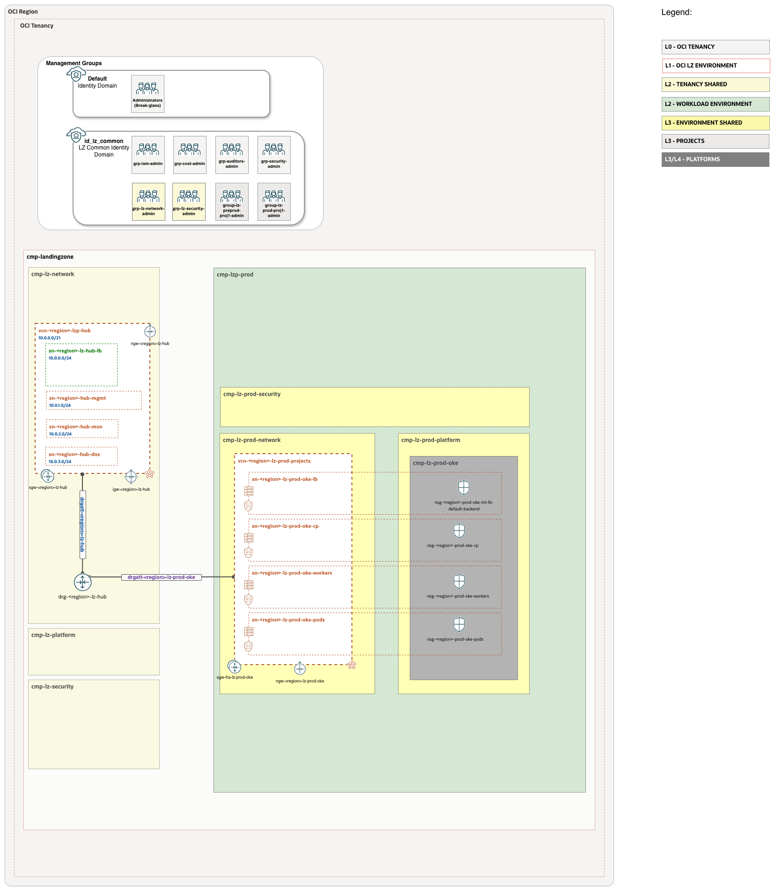

# OKE Workload Extension - Single-Stack Deployment <!-- omit from toc -->

- [**1. Summary**](#1-summary)
- [**2. Architecture Overview**](#2-architecture-overview)
- [**3. Architecture Components**](#3-architecture-components)
- [**4. Configuration Files**](#4-configuration-files)
- [**5. Deployment Steps**](#5-deployment-steps)
  - [Option A: Deploy via OCI Resource Manager (ORM)](#option-a-deploy-via-oci-resource-manager-orm)
  - [Option B: Deploy via Terraform CLI](#option-b-deploy-via-terraform-cli)
- [**6. Post-Deployment Configuration**](#6-post-deployment-configuration)
  - [6.1 Access the OKE Cluster](#61-access-the-oke-cluster)
  - [6.2 Install Kubernetes Add-ons](#62-install-kubernetes-add-ons)
- [**7. Customization Guide**](#7-customization-guide)
  - [7.1 Modify Network CIDRs](#71-modify-network-cidrs)
  - [7.2 Scale Worker Nodes](#72-scale-worker-nodes)
  - [7.3 Change Instance Shape](#73-change-instance-shape)
  - [7.4 Upgrade Kubernetes Version](#74-upgrade-kubernetes-version)
  - [7.5 Add Custom NSG Rules](#75-add-custom-nsg-rules)
- [**8. Network Routing Details**](#8-network-routing-details)
- [**9. Troubleshooting**](#9-troubleshooting)
- [**10. Cleanup / Destroy**](#10-cleanup--destroy)
- [**12. Additional Resources**](#12-additional-resources)
- [**13. Next Steps**](#13-next-steps)


## **1. Summary**

| | |
| -------------------- | ----------------------------------------------------- |
| **NAME**         | Complete Landing Zone with OKE (Single-Stack)                                    |
| **OBJECTIVE**        | Deploy OneOE Landing Zone + Hub Model E + OKE cluster in a single unified Terraform deployment. |
| **TARGET RESOURCES** | Complete LZ Foundation, IAM, Hub Network, DRG, OKE VCN, OKE Cluster with all components integrated |
| **DEPLOYMENT**          | Use the JSON files in this folder with Terraform CLI, or stage them in a customer-controlled private source for OCI Resource Manager as described in [Deployment Steps](#5-deployment-steps). [Terraform CLI](/commons/content/terraform.md) can also be used. |

For customized OKE landing zones generated from a configuration file, see [OKE Config-Driven Generation](../config-driven.md).


&nbsp;

## **2. Architecture Overview**

This deployment combines **OneOE Blueprint**, **Hub Model E networking**, and **OKE cluster** into a **single comprehensive Terraform deployment**. Unlike the multi-stack approach where OKE is added to an existing Landing Zone, this single-stack deployment creates everything together from scratch.



**What Makes This Different:**
- **All-in-One**: OneOE + Hub E + OKE deployed in a single `terraform apply`
- **Automatic Integration**: Hub routes, DRG distributions, and network connectivity configured automatically
- **No External Dependencies**: Doesn't require a pre-existing Landing Zone
- **Single Terraform State**: All resources managed together

**Key Features:**
- **Complete Landing Zone Foundation**: OneOE compartment structure, IAM groups, policies
- **Hub-and-Spoke Networking**: Hub VCN (Model E) with firewall capabilities + OKE Spoke VCN
- **Automated Routing**: Hub route tables pre-configured  with OKE CIDR (10.0.80.0/20)
- **DRG Integration**: Dynamic Routing Gateway with route distributions configured for Hub-Spoke communication
- **CIS-Compliant OKE**: Uses the CIS-compliant OKE module from [terraform-oci-modules-workloads](https://github.com/oci-landing-zones/terraform-oci-modules-workloads/tree/main/cis-oke)
- **OKE Network Modes**: Published JSON is VCN-native by default; config-driven generation can also emit an overlay network shape for Flannel-compatible clusters

&nbsp;

## **3. Architecture Components**

### **3.1 Landing Zone Foundation (OneOE)** <!-- omit from toc -->

The deployment includes the complete OneOE blueprint with:
- Tenancy-level compartment structure
- IAM groups and policies for Landing Zone administration
- Core security configuration
- Tagging framework

### **3.2 Hub Network (Model E)** <!-- omit from toc -->

**Hub VCN (`10.0.0.0/21`)** with centralized internet gateway architecture:
- Load Balancer subnet with Internet Gateway (for inbound public traffic)
- Management subnet with NAT Gateway (for Hub management)
- DRG for inter-VCN routing
- **Routing **: Routes to OKE CIDR (`10.0.80.0/20 → DRG`) added to both Hub subnets and DRG throguh route distribution
- **Hub Model E Characteristic**: Internet Gateway resides in Hub; spoke VCNs use their own NAT Gateways for outbound internet

### **3.3 OKE Spoke Network** <!-- omit from toc -->

**OKE VCN (`10.0.80.0/20`)** with dedicated subnets. The published single-stack JSON uses native networking and includes four subnets:

| Subnet | CIDR | Purpose | Size |
|--------|------|---------|------|
| Control Plane | 10.0.90.64/29 | Kubernetes control plane | /29 (6 IPs) |
| Internal LB | 10.0.90.0/26 | Internal load balancers | /26 (62 IPs) |
| Worker Nodes | 10.0.88.0/23 | OKE worker instances | /23 (510 IPs) |
| Pods | 10.0.80.0/21 | VCN-native pod networking | /21 (2046 IPs) |

**Network Security Groups (NSGs):**
- NSG for Control Plane (API server access, health checks)
- NSG for Worker Nodes (full egress, selective ingress)
- NSG for Pods (pod-to-pod, pod-to-services)
- NSG for Internal Load Balancers (NodePort range)

For config-driven overlay generation, the OKE VCN uses only the Control Plane, Internal LB, and Worker Nodes subnets. The pod subnet, pod route table, pod security list, pod NSG, and worker pod networking fields are omitted because pod addressing comes from the Kubernetes overlay pod CIDR instead of an OCI pod subnet.

**Gateways:**
- NAT Gateway for outbound internet access (all subnets)
- Service Gateway for OCI services connectivity
- DRG Attachment for inter-spoke and on-premises connectivity

### **3.4 DRG Routing** <!-- omit from toc -->

**Automatic DRG Configuration:**
- **DRG Attachment**: OKE VCN attached to DRG with spoke route table (`DRGRT-FRA-LZ-SPOKES-KEY`)
- **Route Distributions**:
  - Hub route distribution updated to accept routes from OKE VCN
  - Spoke route distribution updated to advertise OKE VCN routes
- **Priority Management**: OKE routes configured with appropriate priorities

### **3.5 OKE Cluster** <!-- omit from toc -->

- **Kubernetes Version**: v1.35.2
- **Cluster Type**: Enhanced cluster
- **Control Plane**: Private endpoint in dedicated subnet
- **Worker Pool**: 1x VM.Standard.E5.Flex (1 OCPU, 8GB RAM, Oracle Linux 8.10) - easily scalable
- **CNI**: VCN-native pod networking in the published JSON; config-driven overlay generation requests Flannel

&nbsp;

### **3.6 Native and Overlay Network Modes** <!-- omit from toc -->

`oke_simple` separates the network shape emitted by the workload extension from the cluster CNI requested from the downstream OKE module.

| Config parameter | Purpose | Supported values | Default |
| --- | --- | --- | --- |
| `cni_type` | Network shape emitted by this workload extension | `native`, `overlay` | `native` |
| `cni` | OKE cluster CNI requested from the downstream OKE module | `vcn_native`, `flannel` | `vcn_native` for native, `flannel` for overlay |

Native mode uses workload-extension `cni_type: native` and `cni: vcn_native`. It creates a pod subnet in the OKE VCN, creates the pod security list and pod NSG, and wires the worker node pool with `pods_subnet_id` and `pods_nsg_ids`.

Overlay mode uses workload-extension `cni_type: overlay` and `cni: flannel`. It creates no OCI pod subnet and wires the worker node pool only with the worker subnet and worker NSG. Overlay mode defaults `pods_cidr` to `10.244.0.0/16`. Keep `services_cidr` and overlay `pods_cidr` non-overlapping with each other, the OKE VCN, and any routed on-premises, cloud, or peered ranges. Do not set workload-extension `cni_type` to `flannel`; `flannel` is the OKE CNI value, while `overlay` is the workload-extension network shape.

For config-driven subnetting, prefer auto-subnet profiles. If `cluster_size` is omitted and no manual OKE subnet map is provided, the generator uses `small`. `small` requires an OKE VCN `/20`, `medium` requires `/18`, and `large` requires `/16`. Manual OKE subnet CIDRs are still supported by omitting `cluster_size` and defining `network.subnets` with the required native or overlay subnet keys.

## **4. Configuration Files**

The deployment uses five JSON configuration files:

| File | Purpose  |
| --- | --- |
| `oke_identity.json` | OneOE IAM + OKE-specific groups/policies |
| `oke_network.json` | OneOE + Hub E + OKE network |
| `oke_governance.json` | Tag namespaces and governance definitions |
| `oke_clusters.json` | OKE cluster configuration |
| `oke_workers.json` | OKE Node pool configuration |

### Additional Published Security & Observability Outputs <!-- omit from toc -->

The published package also includes companion JSONs that capture CIS-aligned security and observability settings for reference or downstream consumption. The one-click ORM link above wires only the core deployment inputs; it does **not** consume these companion files. If you want to apply them, fetch and handle them separately in your own workflow.

| File | Purpose |
| --- | --- |
| `oke_security_cis1.json` | Baseline security controls (CIS profile 1) |
| `oke_security_cis1_pre.json` | Pre-requisites for `oke_security_cis1.json` |
| `oke_security_cis2.json` | Baseline security controls (CIS profile 2) |
| `oke_security_cis2_pre.json` | Pre-requisites for `oke_security_cis2.json` |
| `oke_observability_cis1.json` | Observability settings (CIS profile 1) |
| `oke_observability_cis1_pre.json` | Pre-requisites for `oke_observability_cis1.json` |
| `oke_observability_cis2.json` | Observability settings (CIS profile 2) |
| `oke_observability_cis2_pre.json` | Pre-requisites for `oke_observability_cis2.json` |

&nbsp;

## **5. Deployment Steps**

### Prerequisites <!-- omit from toc -->

**Required:**
- OCI tenancy with administrative access
- OCI CLI configured (for Terraform CLI deployment) or access to OCI Console (for ORM deployment)
- Terraform 1.0+ installed (for CLI deployment)

**Not Required:**
- No existing Landing Zone needed
- No pre-configured DRG or compartments
- Everything is created from scratch

### Option A: Deploy via OCI Resource Manager (ORM)

1. **Create ORM Stack**

   Create the stack from the pinned orchestrator release and set the working directory to `rms-facade`.

2. **Stage Configuration Files in a Private Source**
   - Upload `oke_governance.json`, `oke_identity.json`, `oke_network.json`, `oke_clusters.json`, and `oke_workers.json` to a customer-controlled private OCI Object Storage bucket, or make them available from an approved private GitHub source.
   - The previous public repo-hosted one-click example is not the recommended customer deployment path.

3. **Review Configuration** (Optional Customization)

   Before deployment, you may want to review the JSON configuration files and customize them as needed:

   **Key Configuration Values:**
   - **Regions**: Default region code is `FRA` (Frankfurt) - update all keys and display names if deploying to a different region
   - **CIDR Blocks**:
     - Hub VCN: `10.0.0.0/21`
     - OKE VCN: `10.0.80.0/20`
     - Adjust these in the JSON files if they conflict with existing networks
   - **Configuration Keys**: Ensure keys like `DRG-FRA-LZ-HUB-KEY` match your naming convention

4. **Run Terraform Plan**
   - Click **Next** → **Create**
   - Click **Plan** to preview resources


5. **Apply Configuration**
   - Click **Apply**
   - Deployment takes approximately **20-30 minutes**
   - Monitor progress in the logs

#### Step 3: Verify Deployment <!-- omit from toc -->

After successful apply:

1. **Check Compartments**
   - Navigate to **Identity → Compartments**
   - Verify OneOE structure + OKE compartment created

2. **Check Networks**
   - Navigate to **Networking → Virtual Cloud Networks**
   - Verify Hub VCN and OKE VCN exist

3. **Check DRG**
   - Navigate to **Networking → Dynamic Routing Gateways**
   - Verify DRG with two VCN attachments (Hub + OKE)

4. **Check OKE Cluster**
   - Navigate to **Developer Services → Kubernetes Clusters (OKE)**
   - Verify cluster is Active
   - Verify node pool has running nodes

### Option B: Deploy via Terraform CLI

#### Step 1: Clone Orchestrator Module <!-- omit from toc -->

```bash
git clone https://github.com/oci-landing-zones/terraform-oci-modules-orchestrator.git
cd terraform-oci-modules-orchestrator
```

#### Step 2: Copy Configuration Files <!-- omit from toc -->

```bash
# Copy configuration files to orchestrator directory
cp /path/to/workload-extensions/oke/simple/single-stack/*.json \
   /path/to/terraform-oci-modules-orchestrator/
```

#### Step 3: Configure Provider <!-- omit from toc -->

Create `terraform.tfvars`:

```hcl
tenancy_ocid = "ocid1.tenancy.oc1..aaaa..."
region       = "eu-frankfurt-1"
```

#### Step 4: Initialize and Deploy <!-- omit from toc -->

```bash
terraform init
terraform plan -out=tfplan
terraform apply tfplan
```

&nbsp;

## **6. Post-Deployment Configuration**

### 6.1 Access the OKE Cluster
OKE Cluster is deploying with private IP for the control plane, for accessing control plane you need to be on the same / routable network as OKE.

#### Generate kubeconfig <!-- omit from toc -->

```bash
# Get cluster OCID from Terraform outputs or OCI Console
CLUSTER_OCID="ocid1.cluster.oc1.eu-frankfurt-1.aaaa..."

# Generate kubeconfig
oci ce cluster create-kubeconfig \
  --cluster-id $CLUSTER_OCID \
  --file ~/.kube/config \
  --region eu-frankfurt-1 \
  --token-version 2.0.0 \
  --kube-endpoint PRIVATE_ENDPOINT
```

**Note**: Since the control plane is private, you must access it from:
- A bastion host in the Hub VCN
- A VPN/FastConnect connection to your Hub VCN
- OCI Cloud Shell (if configured with VCN access)

#### Verify Cluster Access <!-- omit from toc -->

```bash
kubectl get nodes
kubectl get pods -A
kubectl cluster-info
```

### 6.2 Install Kubernetes Add-ons

The orchestrator module doesn't deploy add-ons automatically. Install required add-ons:

#### CertManager (for TLS certificate management) <!-- omit from toc -->

```bash
kubectl apply -f https://github.com/cert-manager/cert-manager/releases/download/v1.13.0/cert-manager.yaml
```

#### Metrics Server (for resource monitoring) <!-- omit from toc -->

```bash
kubectl apply -f https://github.com/kubernetes-sigs/metrics-server/releases/latest/download/components.yaml
```

&nbsp;

## **7. Customization Guide**

### 7.1 Modify Network CIDRs

**File**: `workload-extensions/oke/simple/single-stack/oke_network.json`

Edit the JSON file to modify CIDR blocks:

```json
{
  "network_configuration": {
    "network_configuration_categories": {
      "hub": {
        "vcns": {
          "VCN-FRA-LZ-HUB-KEY": {
            "cidr_blocks": ["10.1.0.0/21"]
          }
        }
      },
      "prod": {
        "vcns": {
          "VCN-FRA-LZ-PROD-PLATFORM-OKE-KEY": {
            "cidr_blocks": ["10.1.80.0/21"]
          }
        }
      }
    }
  }
}
```

**Note**: Carefully locate and modify only the specific CIDR blocks you need to change as it's easy to make mistakes

### 7.2 Scale Worker Nodes

**File**: `workload-extensions/oke/simple/single-stack/oke_workers.json`

```json
{
  "oke_workers_configuration": {
    "node_pools": {
      "NDP-FRA-LZ-PROD-OKE-KEY": {
        "size": 3,  // Changed from 1 to 3 nodes
        ...
      }
    }
  }
}
```

### 7.3 Change Instance Shape

**File**: `workload-extensions/oke/simple/single-stack/oke_workers.json`

```json
{
  "oke_workers_configuration": {
    "node_pools": {
      "NDP-FRA-LZ-PROD-OKE-KEY": {
        "node_config_details": {
          "image": "8.10",
          "node_shape": "VM.Standard.E5.Flex",
          "flex_shape_settings": {
            "ocpus": 2,        // Changed from 1 to 2
            "memory": 16       // Changed from 8 to 16 GB
          }
        },
        ...
      }
    }
  }
}
```

### 7.4 Upgrade Kubernetes Version

**File**: `workload-extensions/oke/simple/single-stack/oke_clusters.json`

```json
{
  "oke_clusters_configuration": {
    "clusters": {
      "CLR-FRA-LZ-PROD-OKE-KEY": {
        "kubernetes_version": "v1.35.2",  // Updated version
        "options": {
          "kubernetes_network_config": {
            "services_cidr": "10.96.0.0/16"
          }
        }
      }
    }
  }
}
```

**Note**: Keep `options.kubernetes_network_config.services_cidr` aligned with your Kubernetes service network plan. It remains required for the published native OKE payload even though `pods_cidr` is no longer part of the standard single-stack example.

For config-driven overlay clusters, `options.kubernetes_network_config` includes both `services_cidr` and `pods_cidr`. If `pods_cidr` is not provided, the generator defaults it to `10.244.0.0/16`.

**Important**: [Check Supported Images, Shapes for Worker Nodes](https://docs.oracle.com/en-us/iaas/Content/ContEng/Reference/contengimagesshapes.htm) and [OKE supported versions](https://docs.oracle.com/en-us/iaas/Content/ContEng/Concepts/contengaboutk8sversions.htm) before upgrading.

### 7.5 Add Custom NSG Rules

**File**: `workload-extensions/oke/simple/single-stack/oke_network.json`

To add custom NSG rules, locate the NSG configuration in the JSON file and add new rules. Example for allowing SSH to workers:

```json
{
  "network_configuration": {
    "network_configuration_categories": {
      "prod": {
        "network_security_groups": {
          "NSG-PROD-WORKERS": {
            "ingress_rules": {
              "ssh_from_bastion": {
                "description": "Allow SSH from bastion",
                "protocol": "6",
                "src": "10.0.0.0/25",
                "src_type": "CIDR_BLOCK",
                "dst_port_min": 22,
                "dst_port_max": 22
              }
            }
          }
        }
      }
    }
  }
}
```

&nbsp;

## **8. Network Routing Details**

Understanding the routing is critical for troubleshooting connectivity. This deployment follows **Hub Model E** architecture where spokes have their own NAT Gateways for outbound internet access.

### 8.1 OKE Subnet Route Tables <!-- omit from toc -->

The published native OKE subnets (Control Plane, Internal LB, Workers, Pods) use the same routing pattern. Config-driven overlay clusters use the same pattern for the remaining Control Plane, Internal LB, and Workers subnets, with no pod subnet route table.

```
Default Route:
  Destination: 0.0.0.0/0
  Target: NAT Gateway (NGW-PROD-OKE-KEY)
  Purpose: Outbound internet access from spoke

Hub and Other Networks Route:
  Destination: 10.0.0.0/16
  Target: DRG (DRG-FRA-LZ-HUB-KEY)
  Purpose: Access to Hub VCN and other attached networks

Service Gateway Route:
  Destination: all-services
  Target: Service Gateway (SGW-PROD-OKE-KEY)
  Purpose: Direct access to OCI services (bypasses NAT)
```

**Traffic Flow** (Longest Prefix Match):
1. **OCI Services** (`all-services`): Direct via Service Gateway - highest priority
2. **Hub & Connected Networks** (`10.0.0.0/16`): Via DRG - more specific than default
3. **Internet/External** (`0.0.0.0/0`): Via NAT Gateway - least specific, catches everything else

**Route Priority Example:**
- Traffic to `10.0.0.5` (Hub VCN): Matches `10.0.0.0/16` → Routes via DRG
- Traffic to `8.8.8.8` (Internet): Only matches `0.0.0.0/0` → Routes via NAT Gateway
- Traffic to Oracle Object Storage: Matches `all-services` → Routes via Service Gateway

**Note**: This follows **Hub Model E** architecture where spokes have their own NAT Gateways for internet access. The `10.0.0.0/16` route ensures that traffic destined for the Hub VCN or other connected networks takes the DRG path instead of going through NAT.

### 8.2 Hub Subnet Route Tables <!-- omit from toc -->

The Hub subnets are provisioned with OKE routes:

**Hub Load Balancer Subnet:**
```
Default Route:
  Destination: 0.0.0.0/0
  Target: Internet Gateway

OKE VCN Route:
  Destination: 10.0.80.0/20
  Target: DRG
  Purpose: Return traffic to OKE VCN
```

**Hub Management Subnet:**
```
Default Route:
  Destination: 0.0.0.0/0
  Target: NAT Gateway

OKE VCN Route:
  Destination: 10.0.80.0/20
  Target: DRG
  Purpose: Management access to OKE VCN
```

### 8.3 DRG Route Tables <!-- omit from toc -->

**Spoke Route Table** (for OKE VCN attachment):
- Inherits routes from route distributions
- Receives routes to Hub VCN

**Hub Route Table** (for Hub VCN attachment):
- Configured via route distributions
- Receives routes to OKE VCN (10.0.80.0/20)

### 8.4 DRG Route Distributions <!-- omit from toc -->

**Hub Route Distribution** (`IRTD-FRA-LZ-HUB-KEY`):
- Priority 30: Accept routes from OKE VCN attachment
- Imports OKE VCN routes to Hub route table

**Spoke Route Distribution** (`IRTD-FRA-LZ-SPOKE-KEY`):
- Priority 40: Accept routes from OKE VCN attachment
- Advertises OKE routes to other spokes (if any)

&nbsp;

## **9. Troubleshooting**

### Issue: Terraform Plan Shows Hundreds of Changes <!-- omit from toc -->

**Cause**: Configuration keys may have changed or been regenerated.

**Solution**:
- If this is a fresh deployment, this is expected (~200+ resources)
- If this is an update, review the plan carefully before applying
- Use `terraform plan -out=tfplan` and review the file

### Issue: OKE Cluster Creation Fails <!-- omit from toc -->

**Cause**: IAM policies may not be sufficient or VCN configuration incorrect.

**Solution**:
1. Verify IAM policies in `oke_identity.json`
2. Check that VCN-native CNI policy exists:
   ```
   PCY-LZ-PROD-PLATFORM-OKE-VCN-CNI-KEY
   ```
3. If using overlay, verify the source config uses workload-extension `cni_type: overlay` and `cni: flannel`, and that the generated worker node pool does not include `pods_subnet_id` or `pods_nsg_ids`
4. Verify subnet CIDRs don't overlap
5. Check NSG rules allow required traffic

### Issue: Worker Nodes Not Joining Cluster <!-- omit from toc -->

**Cause**: Network connectivity issues between workers and control plane.

**Solution**:
1. Verify NSG rules:
   - Control plane NSG allows traffic from worker subnet
   - Worker NSG allows egress to control plane
2. Check route tables have service gateway route
3. Verify worker subnet has Internet access via DRG→Hub→NAT/IGW

### Issue: Cannot Access Cluster with kubectl <!-- omit from toc -->

**Cause**: Control plane is private and not accessible from your location.

**Solution**:
1. Use a bastion host in Hub VCN
2. Configure VPN/FastConnect to Hub VCN
3. Use OCI Cloud Shell with VCN access configured
4. Or change cluster to public endpoint (not recommended for production):
   ```json
   "is_api_endpoint_public": true
   ```

### Issue: Pods Cannot Pull Images <!-- omit from toc -->

**Cause**: Pods don't have internet connectivity.

**Solution**:
1. For native clusters, verify service gateway route exists in the pod subnet route table
2. For overlay clusters, verify the worker subnet route table has service gateway and NAT/default routes because pod traffic exits through worker nodes
3. Check NSG rules allow egress from pods or workers, depending on the selected network mode:
   ```
   Protocol: TCP
   Destination: 0.0.0.0/0
   Ports: 443
   ```
4. For non-OCI registries, verify NAT Gateway egress is working

### Issue: Configuration Key Not Found <!-- omit from toc -->

**Cause**: Typo in configuration key or resource not created yet.

**Solution**:
1. Verify configuration keys match exactly (case-sensitive)
2. Check for typos: `DRG-FRA-LZ-HUB-KEY` vs `DRG-FRA-LZ-HUB`
3. In single-stack, all resources are created together, so this shouldn't happen unless there's a typo

### Issue: CIDR Block Conflicts <!-- omit from toc -->

**Cause**: Default CIDRs overlap with existing networks in tenancy.

**Solution**:
1. Edit the CIDR blocks in the JSON configuration files
2. Redeploy with new configuration using `terraform apply`

&nbsp;

## **10. Cleanup / Destroy**

To destroy all resources:

### Via ORM: <!-- omit from toc -->

1. Navigate to your stack in **Resource Manager**
2. Click **Terraform Actions** → **Destroy**
3. Confirm the action
4. Wait for completion (~15-20 minutes)

### Via Terraform CLI: <!-- omit from toc -->

```bash
cd /path/to/terraform-oci-modules-orchestrator
terraform destroy
```

> **⚠️ WARNING**: This will destroy **EVERYTHING**:
> - Complete OneOE Landing Zone
> - Hub VCN and all networking
> - DRG and all attachments
> - OKE cluster, node pools, and VCN
> - All compartments and IAM resources
>
> This is an irreversible operation. Ensure you have backups of any critical data.

**Cannot Selectively Delete**: Unlike multi-stack where you can destroy just the OKE resources, single-stack is all-or-nothing.

&nbsp;

## **12. Additional Resources**

- [OCI Landing Zone Orchestrator](https://github.com/oci-landing-zones/terraform-oci-modules-orchestrator)
- [CIS OKE Module Documentation](https://github.com/oci-landing-zones/terraform-oci-modules-workloads/tree/main/cis-oke)
- [OneOE Blueprint](https://github.com/oracle-quickstart/terraform-oci-open-lz/tree/master/blueprints/one-oe)
- [OKE Documentation](https://docs.oracle.com/en-us/iaas/Content/ContEng/home.htm)
- [VCN-Native Pod Networking](https://docs.oracle.com/en-us/iaas/Content/ContEng/Concepts/contengpodnetworking_topic-OCI_CNI_plugin.htm)
- [Flannel Pod Networking](https://docs.oracle.com/en-us/iaas/Content/ContEng/Concepts/contengpodnetworking_topic-flannel_CNI_plugin.htm)
- [Hub-and-Spoke Network Topology](https://docs.oracle.com/en/solutions/hub-spoke-network/index.html)

&nbsp;

## **13. Next Steps**

After successful deployment:

1. **Configure kubectl Access** - Set up kubeconfig to access your cluster
2. **Install Add-ons** - Deploy CertManager, Metrics Server, etc.
3. **Deploy Applications** - Start deploying your workloads
4. **Configure Monitoring** - Set up OCI Monitoring and Logging for OKE
5. **Implement GitOps** - Consider ArgoCD or Flux for continuous deployment
6. **Security Hardening** - Review and tighten NSG rules based on actual traffic patterns
7. **Backup Strategy** - Configure backup policies for persistent volumes
8. **Scaling Strategy** - Configure cluster autoscaler for dynamic scaling

&nbsp;

# License <!-- omit from toc -->

Copyright (c) 2025 Oracle and/or its affiliates.

Licensed under the Universal Permissive License (UPL), Version 1.0.

See [LICENSE](/LICENSE.txt) for more details.
