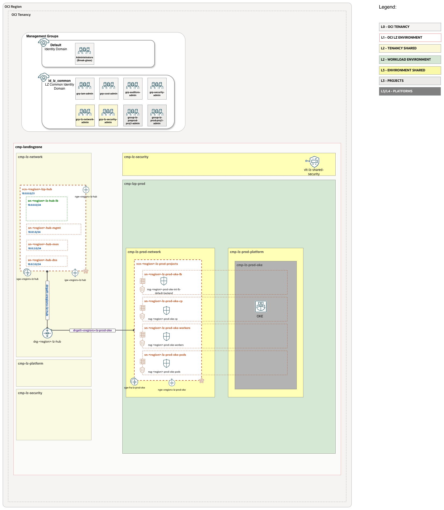

# OKE Workload Extension — Single-stack Deployment <!-- omit from toc -->

- [1. Summary](#1-summary)
- [2. Architecture Overview](#2-architecture-overview)
- [3. Configuration Files](#3-configuration-files)
- [4. Deployment Steps](#4-deployment-steps)
- [5. Post-Deployment Configuration](#5-post-deployment-configuration)
- [6. Customization](#6-customization)
- [7. Troubleshooting](#7-troubleshooting)
- [8. Cleanup](#8-cleanup)
- [9. Additional Resources](#9-additional-resources)

## 1. Summary

| Item | Description |
| --- | --- |
| Scope | One-OE Hub E landing zone and one OKE platform |
| Resources | Foundation, IAM, governance, networking, security, observability, OKE cluster, and managed workers |
| State | One Resource Manager stack or one Terraform state |
| Publication | Reviewed JSON snapshots in this folder |

OCI Resource Manager (ORM) with configuration files in a customer-controlled private OCI Object Storage bucket is the recommended delivery path. Use the pinned OCI Landing Zone Orchestrator source with working directory `rms-facade`. Terraform CLI, customer-controlled CI/CD, and an approved private Git source are supported alternatives.

## 2. Architecture Overview

The single-stack package creates the One-OE foundation, Hub E network, and OKE platform together. Their resources share one state and lifecycle. The Hub VCN uses `10.0.0.0/21`; Hub routes and DRG distributions include the OKE VCN.

Hub E has no firewall. Use this published reference for a PoC, lab, or explicitly non-production deployment that accepts that tradeoff. Production requires a firewall-based design; use [Blueprint Factory](../oke-blueprint-factory.md) to generate the matching landing zone and OKE package.



The published package creates one enhanced OKE cluster with Kubernetes `v1.35.2`, a private API endpoint, and VCN-native pod networking. The environment is named `prod` in the resource keys. The managed node pool contains one `VM.Standard.E5.Flex` worker with 1 OCPU, 8 GB RAM, and a matching Oracle Linux 9 OKE image.

The cluster and worker snapshots use CIS1 with OCI-managed encryption; worker boot-volume encryption in transit is disabled. `oke_identity.json` is rendered from CIS2 and includes compartment-scoped KMS authority. That authority is dormant for these CIS1 cluster and worker files; keep unrelated keys out of the OKE platform compartment. Blueprint Factory applies the selected top-level CIS level consistently and generates the OKE CMEK references for CIS2.

The OKE VCN uses its own NAT gateway and service gateway and attaches to the Hub DRG. Kubernetes `Service` resources can create public OCI Load Balancers in the prepared Hub subnet. The quickstart prepares networking and IAM for those Services; it does not create a Terraform-managed Hub L7 Load Balancer.

| OKE subnet | CIDR | Purpose |
| --- | --- | --- |
| Pods | `10.0.80.0/21` | VCN-native pod addresses |
| Workers | `10.0.88.0/23` | Managed worker nodes |
| Internal load balancers | `10.0.90.0/26` | Private workload endpoints |
| Control plane | `10.0.90.64/29` | Private Kubernetes API endpoint |

These subnets belong to the `10.0.80.0/20` OKE VCN. Kubernetes services use the separately planned service CIDR in `oke_clusters.json`. Review the shared [load-balancer examples](../readme.md#deploying-workload-load-balancers) and [operational and security notes](../readme.md#operational-and-security-notes) before deploying workload ingress.

## 3. Configuration Files

| File | Purpose |
| --- | --- |
| `oke_identity.json` | One-OE and OKE compartments, groups, and policies |
| `oke_network.json` | One-OE Hub E and OKE networking |
| `oke_governance.json` | Tag namespaces and governance definitions |
| `oke_clusters.json` | OKE cluster |
| `oke_workers.json` | Managed node pool |
| `oke_security_cis1_pre.json` or `oke_security_cis2_pre.json` | Initial security prerequisites |
| `oke_observability_cis1_pre.json` or `oke_observability_cis2_pre.json` | Initial observability prerequisites |

Choose one CIS level for the foundation security and observability pair. After the first apply, replace both `_pre` files with their corresponding final files: `oke_security_cis1.json` and `oke_observability_cis1.json`, or `oke_security_cis2.json` and `oke_observability_cis2.json`. The published cluster and worker files remain CIS1; use Blueprint Factory for a complete CIS2 OKE workload.

On the final re-apply, retain identity, network, governance, cluster, and worker configurations in the same stack. Supply one document per top-level configuration family; do not supply both pre and final variants together.

## 4. Deployment Steps

### Prerequisites

- OCI tenancy access and permissions to create the listed resources.
- Reviewed region, CIDRs, service limits, workload versions, and compute capacity.
- A customer-controlled configuration location and persistent output location.
- OCI Console access for ORM, or Terraform and OCI authentication for CLI/CI/CD.

The published OKE workflow uses Orchestrator [`v2.1.1`](https://github.com/oci-landing-zones/terraform-oci-modules-orchestrator/tree/v2.1.1). Keep that pin when following this quickstart.

### OCI Resource Manager

1. Stage the five core JSON files and the selected pre security and observability files in a private Object Storage bucket.
2. Create one stack from the pinned Orchestrator source with working directory `rms-facade`. Select the staged files and configure a persistent output prefix.
3. Run Plan, review the resources and network exposure, then apply the saved plan.
4. Once the foundation and network exist, replace only the pre security and observability inputs with their final counterparts. Retain all five core files.
5. Run and review a new plan, then apply the final configuration in the same stack.

### Terraform CLI

Use the pinned Orchestrator checkout and initialize its `rms-facade` directory. Set `configuration_source = "file"` and explicitly list the five core JSON files and the selected pre security and observability files in `local_config_file_paths`. Configure OCI authentication and a persistent state/output location using the [Terraform CLI guidance](/commons/content/terraform.md).

Use one tfvars file and one state. Review a saved plan before applying it. For the final re-apply, replace only the pre input references and retain the five core files and the same state.

## 5. Post-Deployment Configuration

1. Confirm the OKE VCN, DRG attachment, cluster, and managed node pool are available in OCI.
2. Verify that the client has routed access to the private API endpoint. A bastion, an existing private network connection, or Cloud Shell with VCN access can provide that path.
3. Generate kubeconfig using the cluster OCID from the stack output or OCI Console:

   ```bash
   oci ce cluster create-kubeconfig \
     --cluster-id <cluster-ocid> \
     --file ~/.kube/config \
     --region eu-frankfurt-1 \
     --token-version 2.0.0 \
     --kube-endpoint PRIVATE_ENDPOINT
   kubectl get nodes
   kubectl get pods -A
   ```

4. Deploy Kubernetes applications, load-balancer Services, and required add-ons through the approved Kubernetes delivery process. **Manual post-deployment configuration required:** the extension does not install Kubernetes add-ons. For TLS placement and certificate ownership, use the shared [operational and security notes](../readme.md#operational-and-security-notes).
5. Run a fresh plan against the same state and investigate unexpected drift. Keep the applied configuration and dependency outputs available for subsequent updates.

## 6. Customization

Use [Blueprint Factory](../oke-blueprint-factory.md) when the published shape does not fit the required hub, environments, platforms, network ranges, networking mode, or CIS level. Keep the source configuration and generated output directory explicit and separate. Deploy the generated working set together; do not mix it with published snapshots.

Review worker count, compute shape, boot-volume size, supported worker image, Kubernetes version, and NSG rules in the customer-controlled package. Preserve the generated `oci-growfs` command and OKE bootstrap when changing worker cloud-init. Confirm the OCI VCN/subnet ranges and Kubernetes service range before changing addresses. For native networking, pod addresses come from the OKE pod subnet; overlay networking requires a separately planned pod range.

Check [supported worker images and shapes](https://docs.oracle.com/en-us/iaas/Content/ContEng/Reference/contengimagesshapes.htm) and [supported Kubernetes versions](https://docs.oracle.com/en-us/iaas/Content/ContEng/Concepts/contengaboutk8sversions.htm) before changing the workload version.

## 7. Troubleshooting

The OKE subnets use their own NAT gateway for internet egress, their own service gateway for OCI services, and the Hub DRG for routed landing-zone networks. The Hub route tables and DRG distributions provide the return path to `10.0.80.0/20`.

| Symptom | Check |
| --- | --- |
| A configuration key cannot be resolved | Check spelling and case, the selected configuration set, and any required foundation dependency outputs. |
| The cluster cannot be created | Review IAM, VCN-native CNI permissions, non-overlapping CIDRs, and control-plane NSG rules. For an overlay design, verify `cni_type: 'overlay'`, `cni: 'flannel'`, and the absence of worker pod-subnet references. |
| Workers do not join the cluster | Check worker-to-control-plane rules, the service gateway route, the OKE VCN's NAT egress, and the worker bootstrap. |
| `kubectl` cannot reach the API | Verify the client's route to the private API endpoint and its access rules. |
| Pods cannot pull images | Check the service gateway and NAT routes in the pod subnet for native networking, or the worker subnet for overlay networking. Review the relevant egress rules. |
| An update plans unexpected replacement or deletion | Compare configuration keys, the selected file set, and the state used for the previous apply before continuing. |

## 8. Cleanup

A destroy operation on this state includes the foundation and OKE platform. Review backups, retained data, application shutdown, and the complete destroy plan before applying it. Use the original configuration and the same Resource Manager stack or Terraform state. Keep configuration and output files available until cleanup is complete.

## 9. Additional Resources

- [OKE workload extension overview](../readme.md)
- [Blueprint Factory customization](../oke-blueprint-factory.md)
- [OCI Landing Zone Orchestrator](https://github.com/oci-landing-zones/terraform-oci-modules-orchestrator)
- [CIS OKE module](https://github.com/oci-landing-zones/terraform-oci-modules-workloads/tree/main/cis-oke)
- [OKE documentation](https://docs.oracle.com/en-us/iaas/Content/ContEng/home.htm)
- [ORM deployment guidance](/commons/content/orm_bp.md)

## License <!-- omit from toc -->

Copyright (c) 2025 Oracle and/or its affiliates.

Licensed under the Universal Permissive License (UPL), Version 1.0.

See [LICENSE](/LICENSE.txt) for more details.
