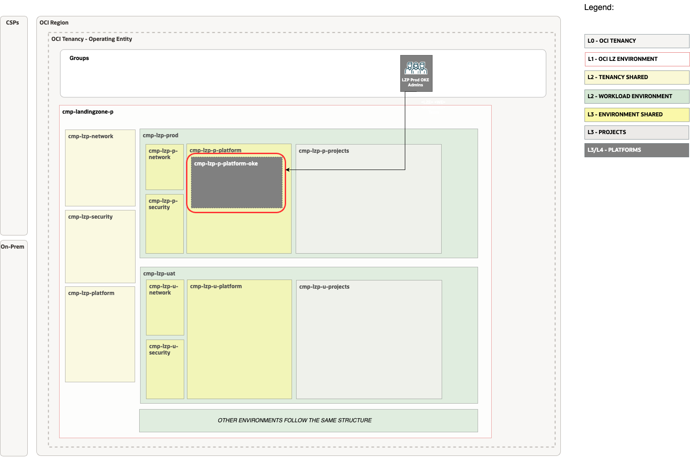

# OKE Extension set-up <!-- omit from toc -->

## **Table of Contents** <!-- omit from toc -->

- [**1. Summary**](#1-summary)
- [**2. IAM**](#2-iam)
  - [**2.1. Compartments**](#21-compartments)
  - [**2.2 Groups**](#22-groups)
  - [**2.3 Policies**](#23-policies)
- [**3. Setup Network Configuration**](#3-setup-network-configuration)
  - [**3.1 VCNs**](#31-vcns)
  - [**3.2 Subnets**](#32-subnets)
  - [**3.3 Route Tables (RTs)**](#33-route-tables-rts)
  - [**3.4 Security Lists (SLs)**](#34-security-lists-sls)
  - [**3.5 Gateways**](#35-gateways)
    - [**3.5.1 Dynamic Routing Gateway (DRGs) Attachments**](#351-dynamic-routing-gateway-drgs-attachments)
    - [**3.5.2 Service Gateway**](#352-service-gateway)
- [**4. Deploy**](#4-deploy)


## **1. Summary**

| | |
| ----------------------- | -------------------------------------------------------------------------------------------------------------------------- |
| **NAME**                | OKE Landing Zone Extension set-up                                                                                                    |
| **OBJECTIVE**           | Provision Identity and Network                                                                               |
| **TARGET RESOURCES**    | - **Identity**: Compartments, Groups, Policies </br>- **Network**: Spoke VCNs, Route tables, Security Lists, NSGs                 |
| **PREREQUISITES**       | The [One-OE](/blueprints/one-oe/) Blueprint deployed as a foundation. </br> For this example we used:</br></br>  **Network layer Hub A light** </br> [oci_open_lz_hub_a_network_light_post.auto.tfvars.json](/addons/oci-hub-models/hub_a/oci_open_lz_hub_a_network_light_post.auto.tfvars.json)</br></br> **IAM, Security, Observability**</br>[oci_open_lz_one-oe_iam.auto.tfvars.jso](/blueprints/one-oe/runtime/one-stack/oci_open_lz_one-oe_iam.auto.tfvars.json)</br>[oci_open_lz_one-oe_security_cisl1.auto.tfvars.json](/blueprints/one-oe/runtime/one-stack/oci_open_lz_one-oe_security_cisl1.auto.tfvars.json)</br>[oci_open_lz_one-oe_observability_cisl1.auto.tfvars.json](/blueprints/one-oe/runtime/one-stack/oci_open_lz_one-oe_observability_cisl1.auto.tfvars.json)</br> </br> <a href='https://cloud.oracle.com/resourcemanager/stacks/create?zipUrl=https://github.com/oci-landing-zones/terraform-oci-modules-orchestrator/archive/refs/tags/v2.0.8.zip'></a> |
| **CONFIGURATION FILES** | [oke_identity.auto.tfvars.json](./oke_identity.auto.tfvars.json)  </br> [oke_network.auto.tfvars.json](./oke_network.auto.tfvars.json)|
| **DEPLOYMENT**          | Use [Oracle Resource Manager (ORM)](/commons/content/orm.md) or [Terraform CLI](/commons/content/terraform.md).            |

&nbsp; 

## **2. IAM**
For configuring and running the One-OE Landing Zone OKE Extension Identity Layer use the following JSON file: [oke_identity.auto.tfvars.json](./oke_identity.auto.tfvars.json). The identity file needs to be integrated with your current LZ configuration file or deployed as a new stack. 

> [!WARNING]
>**Manual Changes required for Multi-OE and Multi-Tenancy Landing Zone**
>
> The configuration assumes you're using One-OE Single Stack as your LZ, in which case configuration is ready to be deployed. If you're installing extension on top of one of the other LZs you need to update KEY values as documented below. When using multi-stack deployment model you need to use OCID instead of keys. Some properties require name change from key to id when using OCID.
>
>| JSON PATH         | Value         |Description                        |
>| ------------------------- | ------| --------------------------------- |
>| compartments_configuration.compartments["CMP-LZP-P-PLATFORM-OKE-KEY"].parent_id | OCID, KEY | Platform in Prod workload Environment |
>| policies_configuration.supplied_policies.\*.statements | CMP PATH | Policies contain CMP path and based on location it needs to be updated. |

###  **2.1. Compartments**
The OKE LZ extension creates OKE Compartment in the production workload environment as a platform.

There are multiple options where OKE platform can be deployed. Either as inside workload environments or as a shared cluster between all workload environments the example is shown in the diagram below:



The following diagram covers the same example deployment with 2 Landing zone environments instead of a single one.
For simplicity, we will use single landing zone environment, with only production workload environment option in this template.

> [!NOTE]
> For documentation of Compartments definition format refer to the [Identity & Access Management CIS Terraform module compartment example](https://github.com/oracle-quickstart/terraform-oci-cis-landing-zone-iam/blob/main/compartments/examples/vision/input.auto.tfvars.template).

### **2.2 Groups**

The OKE extension will deploy IAM groups to manage resources in OKE compartments and provide fine-grained access to specific OKE resources. As part of the deployment the following groups are created in the [Default Identity Domain](https://docs.oracle.com/en-us/iaas/Content/Identity/domains/overview.htm):

| ID     |     NAME                       | TYPE | OBJECTIVES                                  |
| ------ |  -------------------------- | ------------------------------------------- |---|
| GRP.01 | grp-lzp-p-platform-oke-admins | IAM| Group managing OKE-related resources |
| GRP.02 |  grp-lzp-p-platform-oke-viewer-role | IAM + OKE RBAC |Group for accessing OKE, used in OKE RBAC for viewing OKE API |
| GRP.03 |  grp-lzp-p-platform-oke-admin-role | IAM + OKE RBAC |Group for accessing OKE, used in OKE RBAC for managing OKE API |

In our pattern we define two different types of groups:

1. **IAM groups** to manage OCI resources in OKE compartments.
2. **IAM groups with OKE RBAC** to grant access to OKE and map IAM Groups to Kubernetes Group. Kubernetes Groups can be used with combination of Kubernetes roles and role binding to grant users permissions within Kubernetes. For example, a role might include read permission on pods and list permission for pods. A Kubernetes RBAC RoleBinding attaches a role to a user or group, granting that role's permissions to the user or group for resources in a namespace. The IAM and Kubernetes RBAC Authorizer work together to enable users who have been successfully authorized by both to complete the requested Kubernetes operation.

For RBAC Groups in addition to setting-up IAM we also need to set-up Kubernetes by creating a mapping between OCI Group and Kubernetes Group.

```
cat > pod-reader-group.yaml << EOF
# Example of Kubernetes Role
  kind: Role
apiVersion: rbac.authorization.k8s.io/v1
metadata:
  name: pod-reader-ks
  namespace: kube-system
rules:
- apiGroups: [""]
  resources: ["pods"]
  verbs: ["get", "watch", "list"]
---
kind: RoleBinding
apiVersion: rbac.authorization.k8s.io/v1
metadata:
  name: pod-reader-ks-role-binding
  namespace: kube-system
subjects:
- kind: group
# UPDATE with OCID of IAM GROUP
  name: <group-ocid>
  apiGroup: rbac.authorization.k8s.io
roleRef:
  kind: Role
  name: pod-reader-ks
  apiGroup: rbac.authorization.k8s.io

EOF
```

To check all the steps for managing Kubernetes RBAC visit [documentation](https://docs.oracle.com/en-us/iaas/Content/ContEng/Concepts/contengaboutaccesscontrol.htm#About_Access_Control_and_Container_Engine_for_Kubernetes).

> [!NOTE]
> For documentation of IAM Groups definition format refer to the  [Identity & Access Management CIS Terraform module groups example](https://github.com/oracle-quickstart/terraform-oci-cis-landing-zone-iam/blob/main/groups/examples/vision/input.auto.tfvars.template)


### **2.3 Policies**

As part of the deployment the following policies are created:
| Policy                     | Group                                             | Manage resources             | Use resources                   | Inspect resources |
| -------------------------- | ------------------------------------------------------- | ---------------------------- | ------------------------------- | ----------------- |
| pcy-p-platform-oke-admins | Grants group **grp-lzp-p-platform-oke-admins** permissions. | OKE, Computes, VCN | NSG, Subnets, VNICs, IPs | compartments    |
| pcy-p-platform-oke-rbac-roles | Grants group **pcy-p-platform-oke-rbac-roles** permissions. Shared by all OKE RBAC groups. Only used to allow access to OKE | - | OKE |  -  |
| pcy-p-platform-oke-vcn-cni | Policy is required when a cluster and its resources reside in separate compartments. This [policy](https://docs.oracle.com/en-us/iaas/Content/ContEng/Concepts/contengpodnetworking_topic-OCI_CNI_plugin.htm) is only needed for OKE native VCN CNI networking (recommended). If you are using  flannel CNI the policy is not needed.| instances  | private-ips, network-security-groups | -    |


It's possible to grant permissions for Kubernetes Service Account directly using OCI IAM when using Advanced OKE Service for enhanced security posture and isolation of concerns. Refer to [Workload Access documentation](https://docs.oracle.com/en-us/iaas/Content/ContEng/Tasks/contenggrantingworkloadaccesstoresources.htm)

Additional policies may be required for using [Capacity Reservations](https://docs.oracle.com/en-us/iaas/Content/ContEng/Tasks/contengmakingcapacityreservations.htm) or if you choose to [manage the master encryption key yourself](https://docs.oracle.com/en-us/iaas/Content/ContEng/Tasks/contengencryptingdata.htm). 
Refer to [OKE policies](https://docs.oracle.com/en-us/iaas/Content/ContEng/Concepts/contengpolicyconfig.htm#Policy_Configuration_for_Cluster_Creation_and_Deployment) documentation for more details.


> [!NOTE]
> For documentation of IAM Poilicy definition format refer to the [Identity & Access Management CIS Terraform module policies examples](https://github.com/oracle-quickstart/terraform-oci-cis-landing-zone-iam/tree/main/policies/examples) and [policy resource documentation](https://github.com/oracle-quickstart/terraform-oci-cis-landing-zone-iam/tree/main/policies)

&nbsp;

## **3. Setup Network Configuration**

For configuring and running the OKE LZ extension Network layer use the following JSON file: [oke_network.auto.tfvars.json](./oke_network.auto.tfvars.json). This file needs to be integrated with your current LZ network configuration file.

> [!WARNING]
>**Manual Changes required for Multi-OE and Multi-Tenancy Landing Zone**
>
> The configuration assumes you're using One-OE Single Stack as your LZ, in which case configuration is ready to be deployed. If you're installing extension on top of one of the other LZs you need to update KEY values as documented below. When using multi-stack deployment model you need to use OCID instead of keys. Some properties require name change from key to id when using OCID.
>
>| JSON PATH         | Value         |Description                        |
>| ------------------------- | ------| --------------------------------- |
>| network_configuration.network_configuration_categories.oke.category_compartment_id| OCID, KEY | Network compartment in Prod workload environment |
>| network_configuration.network_configuration_categories.oke.non_vcn_specific_gateways. inject_into_existing_drgs["DRG-KEY"].drg_attachments["DRG-VCN-OKE-PROD-KEY"].drg_route_table_key | OCID, KEY | The DRG route table for spokes |
>| network_configuration.network_configuration_categories.oke.non_vcn_specific_gateways. inject_into_existing_drgs["DRG-KEY"].drg_key | OCID |  The Hub DRG | 


The OKE Cluster requires specific subnets. You can review all these requirements in the [OKE documentation](https://docs.oracle.com/en-us/iaas/Content/ContEng/Concepts/contengnetworkconfig.htm)


Our OKE LZ extension will deploy the necessary core resources for  the Production workload environment included in the ONE-OE blueprint. This example is based on the OCI VCN-Native Pod Networking CNI scenario.


> [!NOTE]
> For documentation of Network  definition format refer to the [Networking documentation](https://github.com/oracle-quickstart/terraform-oci-cis-landing-zone-networking)


### **3.1 VCNs**

Dedicated spoke VCN is created for OKE Platform inside the workload environment.

The following table describes the deployed VCNs.

| ID       | NAME           | OBJECTIVES                         |
| ------  | -------------- | ---------------------------------- |
| VCN.00  | vcn-fra-lzp-p-platform-oke | Spoke VCN dedicated to Prod OKE set-up |


### **3.2 Subnets**
OKE has requirements for subnets and their sizes needed for deploying OKE. 
The following table describes the deployed Subnets added for each OKE platform:

| ID    |  NAME             | OBJECTIVES                |
| ----- | ---------------- | ------------------------- |
| SN.00 |  sn-fra-lzp-p-platform-oke-lb | OKE private Prod lb subnet |
| SN.01 |  sn-fra-lzp-p-platform-oke-cp | OKE Prod control plane subnet |
| SN.02 |  sn-fra-lzp-p-platform-oke-workers | OKE Prod workers subnet |
| SN.03 |  sn-fra-lzp-p-platform-oke-pods| OKE Prod pods subnet |


### **3.3 Route Tables (RTs)**

The following table describes the deployed Route Tables:

| ID    |  NAME               | OBJECTIVES                            |
| ----- |  ------------------ | ------------------------------------- |
| RT.00 | rt-fra-lzp-p-lb | OKE Load Balancer Prod subnet route table |
| RT.01 | rt-fra-lzp-p-cp | OKE Control Plane Prod subnet route table |
| RT.02 | rt-fra-lzp-p-pods | OKE Pods Prod subnet route table |
| RT.03 | rt-fra-lzp-p-workers | OKE Workers Prod subnet route table |


### **3.4 Security Lists (SLs)**
The following table describes the deployed Security Lists (SLs):

| ID    |  NAME                | OBJECTIVES                              |
| ----- |  ------------------- | --------------------------------------- |
| SL.00 | sl-lzp-p-platform-pods | OKE Prod pods subnet security list |
| SL.01 | sl-lzp-p-platform-workers| OKE Prod Workers subnet security list |
| SL.02 | sl-lzp-p-platform-lb | OKE Prod Load Balancer subnet security list |
| SL.03 | sl-lzp-p-platform-cp | OKE Prod Control Plane subnet security list |

### **3.5 Gateways**
As part of OKE extenstion deployment we also provision DRG attachments to connect to Hub network and Service gateway to allow OKE use OCI services directly from Spoke VCN.


#### **3.5.1 Dynamic Routing Gateway (DRGs) Attachments**

The following tables describe the deployed DRG Attachments.

| ID      |  NAME                      | OBJECTIVES                                   |
| ------- |  ------------------------- | -------------------------------------------- |
| DRGA.00 |  drgatt-vcn-fra-lzp-p-platform-oke | DRG Attachment for the OKE Prod spoke to the hub |


#### **3.5.2 Service Gateway**


The following table describes the proposed Service Gateways added for each environment OKE platform:

| ID    |  NAME          | OBJECTIVES           |
| ----- |  ------------- | -------------------- |
| SGW.00 |  sgw-fra-lzp-p-oke | SGW OKE Prod VCN. |

&nbsp;

## **4. Deploy**
<a href='https://cloud.oracle.com/resourcemanager/stacks/create?zipUrl=https://github.com/oracle-quickstart/terraform-oci-landing-zones-orchestrator/archive/refs/tags/v2.0.2.zip'></a>

Use the link above to deploy using [Oracle Resource Manager (ORM)](/commons/content/orm.md) or use [Terraform CLI](/commons/content/terraform.md)

After successful deploymenyou need to update the routing in the hub as defined in [POST operation 1.1](../1_oke_extension/1.1_Network_post_updates/readme.md). Once completed, everything will be ready for deploying OKE cluster.

You can now proceed with [Step 2 - OKE cluster creation](../2_oke/).

&nbsp;

# License <!-- omit from toc -->

Copyright (c) 2025 Oracle and/or its affiliates.

Licensed under the Universal Permissive License (UPL), Version 1.0.

See [LICENSE](/LICENSE.txt) for more details.
