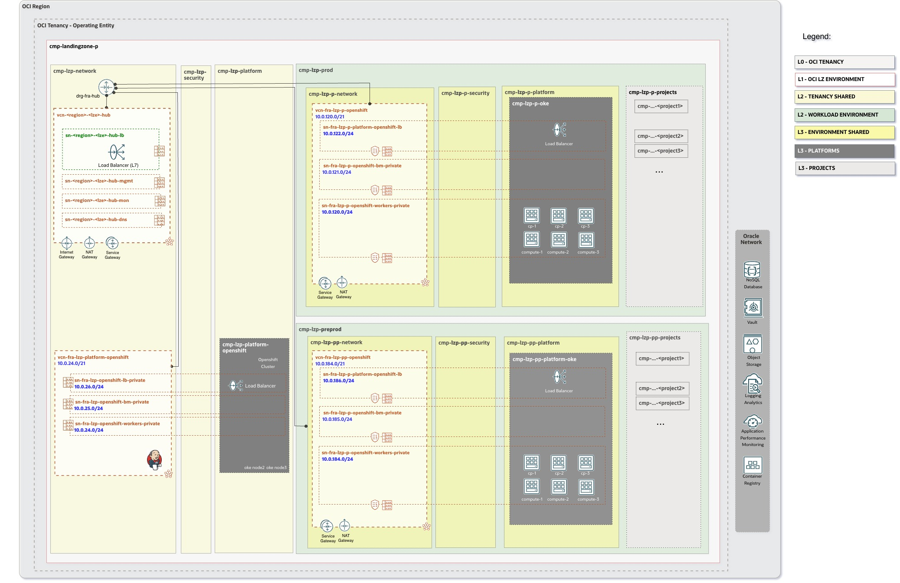

# Openshift Landing Zone Extension Set-up <!-- omit from toc -->

## **Table of Contents** <!-- omit from toc -->

- [**1. Summary**](#1-summary)
- [**2. Setup IAM Configuration**](#2-setup-iam-configuration)
  - [**2.1. Compartments**](#21-compartments)
  - [**2.2 Groups**](#22-groups)
  - [**2.3 Policies**](#23-policies)
- [**3. Setup Network Configuration**](#3-setup-network-configuration)
  - [**3.1 VCNs**](#31-vcns)
  - [**3.2 Subnets**](#32-subnets)
  - [**3.3 Route Tables (RTs)**](#33-route-tables-rts)
  - [**3.4 Security Lists (SLs)**](#34-security-lists-sls)
  - [**3.5 Gateways**](#35-gateways)
    - [**3.5.1 Dynamic Routing Gateway (DRGs) Attachments**](#351-dynamic-routing-gateway-drgs-attachments)
    - [**3.5.2 Service Gateway**](#352-service-gateway)
- [**4. JSON files Required Changes**](#4-json-files-required-changes)
- [**4. Deploy**](#4-deploy)

## **1. Summary**

|                         |                                                                                                                            |
| ----------------------- | -------------------------------------------------------------------------------------------------------------------------- |
| **NAME**                | Openshift Landing Zone Extension set-up                                                                                                    |
| **OBJECTIVE**           | Provision Identity and Network                                                                               |
| **TARGET RESOURCES**    | - **Identity**: Compartments, Groups, Dynamic groups and Policies  - **Network**: Spoke VCNs, Route tables, Security Lists, NSGs                 |
| **PREREQUISITES**       | The [One-OE](../../../../blueprints/one-oe/) Blueprint deployed as a foundation.   For this example we have used:   [](https://cloud.oracle.com/resourcemanager/stacks/create?zipUrl=https://github.com/oci-landing-zones/terraform-oci-modules-orchestrator/archive/refs/tags/v2.0.5.zip&zipUrlVariables={"input_config_files_urls":"https://raw.githubusercontent.com/oci-landing-zones/oci-landing-zone-operating-entities/master/blueprints/one-oe/runtime/one-stack/oci_open_lz_one-oe_iam.auto.tfvars.json,https://raw.githubusercontent.com/oci-landing-zones/oci-landing-zone-operating-entities/refs/heads/master/addons/oci-hub-models/hub_b/oci_open_lz_hub_b_network_light.auto.tfvars.json,https://raw.githubusercontent.com/oci-landing-zones/oci-landing-zone-operating-entities/master/blueprints/one-oe/runtime/one-stack/oci_open_lz_one-oe_observability_cisl1.auto.tfvars.json,https://raw.githubusercontent.com/oci-landing-zones/oci-landing-zone-operating-entities/master/blueprints/one-oe/runtime/one-stack/oci_open_lz_one-oe_security_cisl1.auto.tfvars.json"})  **Note**: To understand how to perform this operation with ORM, follow these [steps](ORM_ONE-OE_deployment_steps.md).|
| **CONFIGURATION FILES** | - [oci_openshift_lz_ext_iam.auto.tfvars.json](./oci_openshift_lz_ext_iam.auto.tfvars.json)    - [oci_openshift_lz_ext_network.auto.tfvars.json](./oci_openshift_lz_ext_network.auto.tfvars.json)|
| **DEPLOYMENT**          | [](https://cloud.oracle.com/resourcemanager/stacks/create?zipUrl=https://github.com/oci-landing-zones/terraform-oci-modules-orchestrator/archive/refs/tags/v2.0.5.zip&zipUrlVariables={"input_config_files_urls":"https://raw.githubusercontent.com/oci-landing-zones/oci-landing-zone-operating-entities/refs/heads/master/workload-extensions/openshift/1_openshift_extension/oci_openshift_lz_ext_iam.auto.tfvars.json,https://raw.githubusercontent.com/oci-landing-zones/oci-landing-zone-operating-entities/refs/heads/master/workload-extensions/openshift/1_openshift_extension/oci_openshift_lz_ext_network.auto.tfvars.json"})   **Note**: To understand how to perform this operation with ORM, follow these [steps](ORM_OPENSHIFT-LZ-EXT_deployment_steps.md). [Terraform CLI](/commons/content/terraform.md)  can be also used.           |

&nbsp; 

## **2. Setup IAM Configuration**

For configuring and running the One-OE Landing Zone Openshift extension IAM Layer use the following JSON file: [oci_openshift_lz_ext_iam.auto.tfvars.json](./oci_openshift_lz_ext_iam.auto.tfvars.json). You can customize this configuration to fit your exact OCI IAM topology.

This configuration file covers three categories of resources described in the next sections.

###  **2.1. Compartments**

The Openshift LZ extension provisions three **compartments**: two dedicated to managing environments, such as PROD and PRE-PROD, and a third compartment for management/shared openshift cluster.

New openshift compartments will be added as platform in each One-OE LZ environment, following the example shown in the next diagram:

> [!NOTE]
> For extended documentation regarding compartment definition please refer to the [Identity & Access Management CIS Terraform module compartment example](https://github.com/oracle-quickstart/terraform-oci-cis-landing-zone-iam/blob/main/compartments/examples/vision/input.auto.tfvars.template).

### **2.2 Groups**

The Openshift extension will deploy IAM groups to manage resources in openshift compartments and provide fine-grained access to specific openshift resources.

As part of the deployment the following groups are created in the [Default Identity Domain](https://docs.oracle.com/en-us/iaas/Content/Identity/domains/overview.htm):

| ID     |     NAME                       | TYPE | OBJECTIVES                                  |
| ------ |  -------------------------- | ------------------------------------------- |---|
| GRP.00 |  grp-lzp-platform-openshift-admin | IAM |Group for managing shared Openshift-related resources |
| GRP.01 |  grp-lzp-p-platform-openshift-admin | IAM| Group for managing Prod Openshift-related resources |
| GRP.02 |  grp-lzp-pp-platform-openshift-admin | IAM | Group for managing Pre-prod openshift-related resources |

> [!NOTE]
> For extended documentation regarding group definition please refer to the [Identity & Access Management CIS Terraform module groups example](https://github.com/oracle-quickstart/terraform-oci-cis-landing-zone-iam/blob/main/groups/examples/vision/input.auto.tfvars.template).

### **2.3 Policies**

As part of the deployment the following policies are created:
| Policy                     | Description                                             | Manage resources             | Use resources                   | Inspect resources |
| -------------------------- | ------------------------------------------------------- | ---------------------------- | ------------------------------- | ----------------- |
| pcy-p-platform-openshift-admins | Grants group **grp-lzp-p-platform-openshift-admins** permissions. |  Computes, VCN, Storage | NSG, Subnets, VNICs, IPs | compartments    |
| pcy-pp-platform-openshift-admins | Grants group **grp-lzp-pp-platform-openshift-admins** permissions. |  Computes, VCN, Storage | NSG, Subnets, VNICs, IPs | compartments    |
| pcy-platform-openshift-admins | Grants group **grp-lzp-platform-openshift-admins** permissions. |  Computes, VCN, Storage | NSG, Subnets, VNICs, IPs | compartments    |
| pcy-p-platform-openshift-secrets| The **pcy-p-platform-openshift-secrets** is an example of a recommended policy to allow applications running on the cluster to be authenticated with OCI through InstancePrincipal, for example to grant access to secrets. To read more about his check this [article](https://vaibhav-sonavane.medium.com/use-instance-principal-to-access-secrets-6c4aee1bfea4) or the [official documentation](https://docs.oracle.com/en-us/iaas/Content/Identity/Tasks/callingservicesfrominstances.htm?source=post_page-----6c4aee1bfea4--------------------------------)| -  | - | -    |

Additional policies may be required for using [Capacity Reservations](https://docs.oracle.com/en-us/iaas/Content/ContEng/Tasks/contengmakingcapacityreservations.htm) or if you choose to [manage the master encryption key yourself](https://docs.oracle.com/en-us/iaas/Content/ContEng/Tasks/contengencryptingdata.htm). These policies are not included in this example, make sure to add them if they apply to your use case.
For a detailed review of openshift policies, please refer to the official openshift documentation [here](https://docs.oracle.com/en-us/iaas/Content/ContEng/Concepts/contengpolicyconfig.htm#Policy_Configuration_for_Cluster_Creation_and_Deployment) and this [link](https://docs.oracle.com/en-us/iaas/Content/openshift-on-oci/overview.htm).

> [!NOTE]
>For extended documentation regarding policies refer to the [Identity & Access Management CIS Terraform module policies examples](https://github.com/oracle-quickstart/terraform-oci-cis-landing-zone-iam/tree/main/policies/examples) and [policy resource documentation](https://github.com/oracle-quickstart/terraform-oci-cis-landing-zone-iam/tree/main/policies)

## **3. Setup Network Configuration**

The Openshift Cluster requires specific subnets. You can review all these requirements in the [Openshift documentation](https://docs.oracle.com/en-us/iaas/Content/openshift-on-oci/overview.htm).

Our Openshift LZ extension will deploy the necessary core resources for both the Production and Pre-production environments included in the ONE-OE blueprint.

The network layer covers the following resources:
1. Hub VCN for traffic inspection purposes, centralized DNS service, Internet Gateway, and NAT Gateway.
2. Spoke VCN for Openshift shared cluster.
3. Spokes VNCs for each environment - one Spoke Pre-prod Openshift VCN and one Spoke Prod Openshift VCN
4. Subnets - Openshift required subnets; like load balancer, bare metal & workers subnet.
5. Service & NAT Gateway - Service Gateway for access OCI services in all VCNs as well as NAT for Internet outbound (optional)
6. Security List - allowing all ingress/egress
7. NSGs.
8. Route Tables.
9. DRG Attachments - Connect spokes with the central Hub

In this asset, we use reserved CIDR blocks for the different VCNs, but this can be customized. To learn more about managing your OCI subnetting, we recommend checking this [asset](/addons/oci-lz-subnetting).

For customization of the pre-defined setup please refer to the [Networking documentation](https://github.com/oracle-quickstart/terraform-oci-cis-landing-zone-networking) for documentation and examples.

> [!NOTE]
> The example configuration is based on the Hub E model for simplicity and demonstration purposes.
For production deployments, it is recommended to use other Hub Firewall models such as Hub A or Hub B to ensure optimal design, security, and compliance alignment.

For more details and configuration references, see: [OCI Hub Models](https://github.com/oci-landing-zones/oci-landing-zone-operating-entities/tree/master/addons/oci-hub-models).

### **3.1 VCNs**

The following table describes the deployed VCNs.

| ID       | NAME           | OBJECTIVES                         |
| ------  | -------------- | ---------------------------------- |
| VCN.01  | vcn-fra-lzp-platform-openshift | Spoke VCN dedicated to shared openshift set-up |
| VCN.02  | vcn-fra-lzp-p-openshift | Spoke VCN dedicated to Prod openshift set-up |
| VCN.03  | vcn-fra-lzp-pp-openshift | Spoke VCN dedicated to Preprod openshift set-up |

### **3.2 Subnets**

The following table describes the deployed Subnets added for each environment Openshift platform:

| ID    |  NAME             | OBJECTIVES                |
| ----- | ---------------- | ------------------------- |
| SN.00 |  sn-fra-lzp-p-openshift-lb-private | Openshift Prod lb subnet |
| SN.01 |  sn-fra-lzp-p-openshift-bm-private | Openshift Prod bare metal subnet |
| SN.02 |  sn-fra-lzp-p-openshift-workers-private | Openshift Prod workers subnet |
| SN.03 |  sn-fra-lzp-pp-openshift-lb-private | Openshift Pre Prod lb subnet |
| SN.04 |  sn-fra-lzp-pp-openshift-bm-private | Openshift Pre Prod bare metal subnet |
| SN.05 |  sn-fra-lzp-pp-openshift-workers-private | Openshift Pre Prod workers subnet |
| SN.06 |  sn-fra-lzp-openshift-lb-private | Openshift Shared lb subnet |
| SN.07 |  sn-fra-lzp-openshift-bm-private | Openshift Shared bare metal subnet |
| SN.08 |  sn-fra-lzp-openshift-workers-private | Openshift Shared workers subnet |

### **3.3 Route Tables (RTs)**

The following table describes the deployed Route Tables:

| ID    |  NAME               | OBJECTIVES                            |
| ----- |  ------------------ | ------------------------------------- |
| RT.00 | rt-fra-lzp-p-public | Openhsift Load Balancer Prod subnet route table |
| RT.01 | rt-fra-lzp-p-private | Openshift compute private Prod subnet route table |
| RT.02 | rt-fra-lzp-pp-public | Openhsift Load Balancer Pre Prod subnet route table |
| RT.03 | rt-fra-lzp-pp-private | Openshift compute private Pre Prod subnet route table |
| RT.04 | rt-fra-lzp-public | Openhsift Load Balancer shared subnet route table |
| RT.05 | rt-fra-lzp-private | Openshift compute private shared subnet route table |

### **3.4 Security Lists (SLs)**
The following table describes the deployed Security Lists (SLs):

| ID    |  NAME                | OBJECTIVES                              |
| ----- |  ------------------- | --------------------------------------- |
| SL.00 | sl-lzp-p-openshift-public | Openshift Prod public subnet security list |
| SL.01 | sl-lzp-p-openshift-private| Openshift Prod private subnet security list |
| SL.02 | sl-lzp-pp-openshift-public | Openshift Pre Prod public subnet security list |
| SL.03 | sl-lzp-pp-openshift-private| Openshift Prod private subnet security list |
| SL.04 | sl-lzp-openshift-public | Openshift shared public subnet security list |
| SL.05 | sl-lzp-openshift-private| Openshift shared private subnet security list |

### **3.5 Gateways**

#### **3.5.1 Dynamic Routing Gateway (DRGs) Attachments**

The following tables describe the deployed DRG Attachments.

| ID      |  NAME                      | OBJECTIVES                                   |
| ------- |  ------------------------- | -------------------------------------------- |
| DRGA.00 |  drgatt-vcn-fra-lzp-p-openshift | DRG Attachment for the Openshift Prod spoke to the hub |
| DRGA.00 |  drgatt-vcn-fra-lzp-pp-openshift | DRG Attachment for the Openshift Preprod spoke to the hub 
| DRGA.00 |  drgatt-vcn-fra-lzp-openshift | DRG Attachment for the Openshift shared spoke to the hub 

#### **3.5.2 Service Gateway**

The following table describes the proposed NAT Gateways added for each environment Openshift platform:

| ID    |  NAME          | OBJECTIVES           |
| ----- |  ------------- | -------------------- |
| SGW.00 |  sgw-fra-lzp-p-openshift | SGW Openshift Prod VCN. |
| SGW.00 |  sgw-fra-lzp-pp-openshift | SGW Openshift Pre-prod VCN. |
| SGW.00 |  sgw-fra-lzp-m-openshift | SGW Openshift shared VCN. |

#### **3.5.23 NAT Gateway**

The following table describes the proposed Service Gateways added for each environment Openshift platform:

| ID    |  NAME          | OBJECTIVES           |
| ----- |  ------------- | -------------------- |
| NGW.00 |  ngw-fra-lzp-p-openshift | NGW Openshift Prod VCN. |
| NGW.00 |  ngw-fra-lzp-pp-openshift | NGW Openshift Pre-prod VCN. |
| NGW.00 |  ngw-fra-lzp-m-openshift | NGW Openshift shared VCN. |

## **4. JSON files Required Changes**

If ONE-OE is used as the foundation Landing Zone with output saving enabled, running this Openshift extension with the added dependencies will automatically match the keys with the correct OCIDs. No changes to the JSON file are needed. Therefore, you can skip this section and move to point 5.

If you are using the CIS Landing Zone or another OCI Landing Zone option, this configuration file requires modification to reference the OCIDs of the existing deployed resources. Locate the values indicated below and replace them with the correct OCIDs.

| Resource         | Section          | Replace with OCIDs              | Description                        |
| ------------------------- | ------| --------------------------------- | ---------------------------------- |
| cmp-lzp-p-platform |  compartments| CMP-LZP-P-PLATFORM-KEY | The Prod platforms compartment OCID in Prod Env |
| cmp-lzp-d-platform | compartments| CMP-LZP-PP-PLATFORM-KEY| The Pre-prod platforms compartment OCID  in Preprod Env |
| cmp-lzp-platform |compartments | CMP-LZP-PLATFORM-KEY| The Shared platforms compartment OCID |
| Prod Network Compartment | Network| CMP-LZP-P-NETWORK-KEY | The OCID of the Prod Network Compartment |
| Pre-prod Network Compartment | Network| CMP-LZP-PP-NETWORK-KEY |  The OCID of the Pre-prod Network Compartment  |
| Shared Network Compartment |  Network| CMP-LZP-NETWORK-KEY |  The OCID of the Network Compartment |
| Hub DRG                  | Network| DRG-FRA-LZP-HUB-KEY                 | The OCID of the DRG in Hub deployed by One-OE LZ             |
| Hub DRG Route Table      | Network| OCID-DRG-HUB-ROUTE-TABLE      | The OCID of Route table in DRG  |

**NOTE:**
Policies contain compartment paths. 
The paths can change based on the modification in the previous [Compartments](#21-compartments) section. The paths need to be updated following the OCI [Policies and Compartment hierarchy](https://docs.oracle.com/en-us/iaas/Content/Identity/Concepts/policies.htm#hierarchy).

## **4. Deploy**

Use the magic button provided in the summary section to deploy the Openshift LZ extension using [Oracle Resource Manager (ORM)](/commons/content/orm.md) or use [Terraform CLI](/commons/content/terraform.md).

This operation creates a default routing configuration. To complete the network layer setup, deploy the firewalls and update the routing in the hub to prepare for deploying the Openshift cluster.

You can now proceed with Openshift Cluster installation [Openshift Installation](../2_openshift/).

&nbsp;

# License <!-- omit from toc -->

Copyright (c) 2025 Oracle and/or its affiliates.

Licensed under the Universal Permissive License (UPL), Version 1.0.

See [LICENSE](/LICENSE.txt) for more details.
