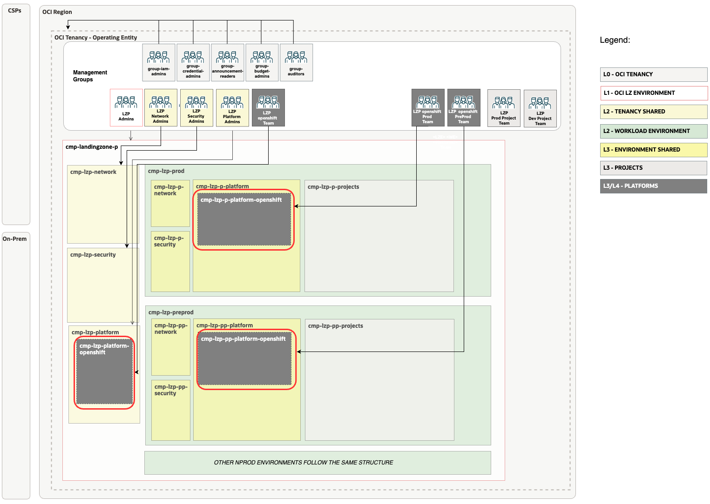

# Openshift Landing Zone Extension Set-up <!-- omit from toc -->

## **Table of Contents** <!-- omit from toc -->

- [**1. Summary**](#1-summary)
- [**2. Setup IAM Configuration**](#2-setup-iam-configuration)
  - [**2.1. Compartments**](#21-compartments)
  - [**2.2 Groups**](#22-groups)
  - [**3.4 Dynamic groups**](#34-dynamic-groups)
  - [**2.3 Policies**](#23-policies)
- [**3. Setup Network Configuration**](#3-setup-network-configuration)
  - [**3.1 VCNs**](#31-vcns)
  - [**3.2 Subnets**](#32-subnets)
  - [**3.3 Route Tables (RTs)**](#33-route-tables-rts)
  - [**3.4 Security Lists (SLs)**](#34-security-lists-sls)
  - [**3.5 Gateways**](#35-gateways)
    - [**3.5.1 Dynamic Routing Gateway (DRGs) Attachments**](#351-dynamic-routing-gateway-drgs-attachments)
    - [**3.5.2 Service Gateway**](#352-service-gateway)
- [**4. JSON files Required Changes**](#4-json-files-required-changes)
- [**4. Deploy**](#4-deploy)

## **1. Summary**

|                         |                                                                                                                            |
| ----------------------- | -------------------------------------------------------------------------------------------------------------------------- |
| **NAME**                | Openshift Landing Zone Extension set-up                                                                                                    |
| **OBJECTIVE**           | Provision Identity and Network                                                                               |
| **TARGET RESOURCES**    | - **Identity**: Compartments, Groups, Dynamic groups and Policies  - **Network**: Spoke VCNs, Route tables, Security Lists, NSGs                 |
| **PREREQUISITES**       | The [One-OE](../../../../blueprints/one-oe/) Blueprint deployed as a foundation.   For this example we have used:   [](https://cloud.oracle.com/resourcemanager/stacks/create?zipUrl=https://github.com/oci-landing-zones/terraform-oci-modules-orchestrator/archive/refs/tags/v2.0.5.zip&zipUrlVariables={"input_config_files_urls":"https://raw.githubusercontent.com/oci-landing-zones/oci-landing-zone-operating-entities/master/blueprints/one-oe/runtime/one-stack/oci_open_lz_one-oe_iam.auto.tfvars.json,https://raw.githubusercontent.com/oci-landing-zones/oci-landing-zone-operating-entities/refs/heads/master/addons/oci-hub-models/hub_b/oci_open_lz_hub_b_network_light.auto.tfvars.json,https://raw.githubusercontent.com/oci-landing-zones/oci-landing-zone-operating-entities/master/blueprints/one-oe/runtime/one-stack/oci_open_lz_one-oe_observability_cisl1.auto.tfvars.json,https://raw.githubusercontent.com/oci-landing-zones/oci-landing-zone-operating-entities/master/blueprints/one-oe/runtime/one-stack/oci_open_lz_one-oe_security_cisl1.auto.tfvars.json"})  **Note**: To understand how to perform this operation with ORM, follow these [steps](ORM_ONE-OE_deployment_steps.md).|
| **CONFIGURATION FILES** | - [oci_openshift_lz_ext_iam.auto.tfvars.json](./oci_openshift_lz_ext_iam.auto.tfvars.json)    - [oci_openshift_lz_ext_network.auto.tfvars.json](./oci_openshift_lz_ext_network.auto.tfvars.json)|
| **DEPLOYMENT**          | [](https://cloud.oracle.com/resourcemanager/stacks/create?zipUrl=https://github.com/oci-landing-zones/terraform-oci-modules-orchestrator/archive/refs/tags/v2.0.5.zip&zipUrlVariables={"input_config_files_urls":"https://raw.githubusercontent.com/oci-landing-zones/oci-landing-zone-operating-entities/refs/heads/master/workload-extensions/oke/multi-stack/1_oke_extension/oci_openshift_lz_ext_iam.auto.tfvars.json,https://raw.githubusercontent.com/oci-landing-zones/oci-landing-zone-operating-entities/refs/heads/master/workload-extensions/oke/multi-stack/1_oke_extension/oci_openshift_lz_ext_network.auto.tfvars.json"})   **Note**: To understand how to perform this operation with ORM, follow these [steps](ORM_OKE-LZ-EXT_deployment_steps.md). [Terraform CLI](/commons/content/terraform.md)  can be also used.           |

&nbsp; 

## **2. Setup IAM Configuration**

For configuring and running the One-OE Landing Zone OKE extension IAM Layer use the following JSON file: [oci_openshift_lz_ext_iam.auto.tfvars.json](./oci_openshift_lz_ext_iam.auto.tfvars.json). You can customize this configuration to fit your exact OCI IAM topology.

This configuration file covers three categories of resources described in the next sections.

###  **2.1. Compartments**

The OKE LZ extension provisions three **compartments**: two dedicated to managing environments, such as PROD and PRE-PROD, and a third compartment for management purposes.

New OKE compartments will be added as platform in each One-OE LZ environment, following the example shown in the next diagram:

> [!NOTE]
> For extended documentation regarding compartment definition please refer to the [Identity & Access Management CIS Terraform module compartment example](https://github.com/oracle-quickstart/terraform-oci-cis-landing-zone-iam/blob/main/compartments/examples/vision/input.auto.tfvars.template).

### **2.2 Groups**

The Openshift extension will deploy IAM groups to manage resources in OKE compartments and provide fine-grained access to specific OKE resources.

As part of the deployment the following groups are created in the [Default Identity Domain](https://docs.oracle.com/en-us/iaas/Content/Identity/domains/overview.htm):

| ID     |     NAME                       | TYPE | OBJECTIVES                                  |
| ------ |  -------------------------- | ------------------------------------------- |---|
| GRP.00 |  grp-lzp-platform-openshift-admin | IAM |Group for managing shared Openshift-related resources |
| GRP.01 |  grp-lzp-p-platform-openshift-admin | IAM| Group for managing Prod Openshift-related resources |
| GRP.02 |  grp-lzp-pp-platform-openshift-admin | IAM | Group for managing Pre-prod OKE-related resources |

> [!NOTE]
> For extended documentation regarding group definition please refer to the [Identity & Access Management CIS Terraform module groups example](https://github.com/oracle-quickstart/terraform-oci-cis-landing-zone-iam/blob/main/groups/examples/vision/input.auto.tfvars.template).

### **2.3 Policies**

As part of the deployment the following policies are created:
| Policy                     | Description                                             | Manage resources             | Use resources                   | Inspect resources |
| -------------------------- | ------------------------------------------------------- | ---------------------------- | ------------------------------- | ----------------- |
| pcy-p-platform-openshift-admins | Grants group **grp-lzp-p-platform-oke-admins** permissions. |  Computes, VCN, Storage | NSG, Subnets, VNICs, IPs | compartments    |
| pcy-pp-platform-openshift-admins | Grants group **grp-lzp-pp-platform-oke-admins** permissions. |  Computes, VCN, Storage | NSG, Subnets, VNICs, IPs | compartments    |
| pcy-platform-openshift-admins | Grants group **grp-lzp-m-platform-oke-admins** permissions. |  Computes, VCN, Storage | NSG, Subnets, VNICs, IPs | compartments    |
| pcy-p-platform-openshift-secrets| The **pcy-p-platform-openshift-secrets** is an example of a recommended policy to allow applications running on the cluster to be authenticated with OCI through InstancePrincipal, for example to grant access to secrets. To read more about his check this [article](https://vaibhav-sonavane.medium.com/use-instance-principal-to-access-secrets-6c4aee1bfea4) or the [official documentation](https://docs.oracle.com/en-us/iaas/Content/Identity/Tasks/callingservicesfrominstances.htm?source=post_page-----6c4aee1bfea4--------------------------------)| -  | - | -    |

Additional policies may be required for using [Capacity Reservations](https://docs.oracle.com/en-us/iaas/Content/ContEng/Tasks/contengmakingcapacityreservations.htm) or if you choose to [manage the master encryption key yourself](https://docs.oracle.com/en-us/iaas/Content/ContEng/Tasks/contengencryptingdata.htm). These policies are not included in this example, make sure to add them if they apply to your use case.
For a detailed review of OKE policies, please refer to the official OKE documentation [here](https://docs.oracle.com/en-us/iaas/Content/ContEng/Concepts/contengpolicyconfig.htm#Policy_Configuration_for_Cluster_Creation_and_Deployment) and this [link](https://github.com/oracle-devrel/technology-engineering/blob/main/app-dev/devops-and-containers/oke/oke-policies/policies.md).

> [!NOTE]
>For extended documentation regarding policies refer to the [Identity & Access Management CIS Terraform module policies examples](https://github.com/oracle-quickstart/terraform-oci-cis-landing-zone-iam/tree/main/policies/examples) and [policy resource documentation](https://github.com/oracle-quickstart/terraform-oci-cis-landing-zone-iam/tree/main/policies)

## **3. Setup Network Configuration**

The Openshift Cluster requires specific subnets. You can review all these requirements in the [Openshift documentation](https://docs.oracle.com/en-us/iaas/Content/openshift-on-oci/overview.htm).

Our OKE LZ extension will deploy the necessary core resources for both the Production and Pre-production environments included in the ONE-OE blueprint. This example is based on the OCI VCN-Native Pod Networking CNI scenario. You should make a few adjustments and select the appropriate files for a Flannel setup.

The network layer covers the following resources:
1. Hub VCN for traffic inspection purposes, centralized DNS service, Internet Gateway, and NAT Gateway.
2. Spoke VCN for Openshift shared cluster.
3. Spokes VNCs for each environment - one Spoke Pre-prod Openshift VCN and one Spoke Prod Openshift VCN
4. Subnets - Openshift required subnets; like load balancer, bare metal & workers subnet.
5. Service & NAT Gateway - Service Gateway for access OCI services in all VCNs as well as NAT for Internet outbound (optional)
6. Security List - allowing all ingress/egress
7. NSGs.
8. Route Tables.
9. DRG Attachments - Connect spokes with the central Hub

In this asset, we use reserved CIDR blocks for the different VCNs, but this can be customized. To learn more about managing your OCI subnetting, we recommend checking this [asset](/addons/oci-lz-subnetting).

For customization of the pre-defined setup please refer to the [Networking documentation](https://github.com/oracle-quickstart/terraform-oci-cis-landing-zone-networking) for documentation and examples.

### **3.1 VCNs**

The following table describes the deployed VCNs.

| ID       | NAME           | OBJECTIVES                         |
| ------  | -------------- | ---------------------------------- |
| VCN.01  | vcn-fra-lzp-platform-openshift | Spoke VCN dedicated to shared openshift set-up |
| VCN.02  | vcn-fra-lzp-p-openshift | Spoke VCN dedicated to Prod openshift set-up |
| VCN.03  | vcn-fra-lzp-pp-openshift | Spoke VCN dedicated to Preprod openshift set-up |

### **3.2 Subnets**

The following table describes the deployed Subnets added for each environment OKE platform:

| ID    |  NAME             | OBJECTIVES                |
| ----- | ---------------- | ------------------------- |
| SN.00 |  sn-fra-lzp-p-platform-oke-lb | OKE private Prod lb subnet |
| SN.01 |  sn-fra-lzp-p-platform-oke-cp | OKE Prod control plane subnet |
| SN.02 |  sn-fra-lzp-p-platform-oke-workers | OKE Prod workers subnet |
| SN.03 |  sn-fra-lzp-p-platform-oke-pods| OKE Prod pods subnet |
| SN.04 |  sn-fra-lzp-p-platform-oke-db| db Prod subnet |
| SN.05 |  sn-fra-lzp-p-platform-oke-bastion| Prod bastion subnet |
| SN.06 |  sn-fra-lzp-p-platform-oke-fss| Prod fss subnet |
| SN.07 |  sn-fra-lzp-pp-platform-oke-lb | OKE PreProd private lb subnet |
| SN.08 |  sn-fra-lzp-pp-platform-oke-cp | OKE PreProd control plane subnet |
| SN.09 |  sn-fra-lzp-pp-platform-oke-workers | OKE PreProd workers subnet |
| SN.10 |  sn-fra-lzp-pp-platform-oke-pods| OKE PreProd pods subnet |
| SN.11 |  sn-fra-lzp-pp-platform-oke-db| db PreProd subnet |
| SN.12 |  sn-fra-lzp-pp-platform-oke-bastion| PreProd bastion subnet |
| SN.13 |  sn-fra-lzp-pp-platform-oke-fss| fss PreProd subnet |

### **3.3 Route Tables (RTs)**

The following table describes the deployed Route Tables:

| ID    |  NAME               | OBJECTIVES                            |
| ----- |  ------------------ | ------------------------------------- |
| RT.00 | rt-fra-lzp-p-lb | OKE Load Balancer Prod subnet route table |
| RT.01 | rt-fra-lzp-p-cp | OKE Control Plane Prod subnet route table |
| RT.02 | rt-fra-lzp-p-pods | OKE Pods Prod subnet route table |
| RT.03 | rt-fra-lzp-p-workers | OKE Workers Prod subnet route table |
| RT.04 | rt-fra-lzp-p-generic | OKE Generic Prod subnet route table |
| RT.00 | rt-fra-lzp-pp-lb | OKE Load Balancer PreProd subnet route table |
| RT.01 | rt-fra-lzp-pp-cp | OKE Control Plane PreProd subnet route table |
| RT.02 | rt-fra-lzp-pp-pods | OKE Pods PreProd subnet route table |
| RT.03 | rt-fra-lzp-pp-workers | OKE Workers PreProd subnet route table |
| RT.04 | rt-fra-lzp-pp-generic | OKE Generic PreProd subnet route table |

### **3.4 Security Lists (SLs)**
The following table describes the deployed Security Lists (SLs):

| ID    |  NAME                | OBJECTIVES                              |
| ----- |  ------------------- | --------------------------------------- |
| SL.00 | sl-lzp-p-platform-pods | OKE Prod pods subnet security list |
| SL.01 | sl-lzp-p-platform-workers| OKE Prod Workers subnet security list |
| SL.02 | sl-lzp-d-platform-lb | OKE Prod Load Balancer subnet security list |
| SL.03 | sl-lzp-p-platform-cp | OKE Prod Control Plane subnet security list |
| SL.04 | sl-lzp-pp-platform-pods | OKE Pre-prod pods subnet security list |
| SL.05 | sl-lzp-pp-platform-workers| OKE Pre-prod Workers subnet security list |
| SL.06 | sl-lzp-pp-platform-lb | OKE Pre-prod Load Balancer  subnet security list |
| SL.07 | sl-lzp-pp-platform-cp | OKE Pre-prod Control Plane subnet security list |

### **3.5 Gateways**

#### **3.5.1 Dynamic Routing Gateway (DRGs) Attachments**

The following tables describe the deployed DRG Attachments.

| ID      |  NAME                      | OBJECTIVES                                   |
| ------- |  ------------------------- | -------------------------------------------- |
| DRGA.00 |  drgatt-vcn-fra-lzp-p-platform-oke | DRG Attachment for the OKE Prod spoke to the hub |
| DRGA.00 |  drgatt-vcn-fra-lzp-pp-platform-oke | DRG Attachment for the OKE Preprod spoke to the hub 
| DRGA.00 |  drgatt-vcn-fra-lzp-m-platform-oke | DRG Attachment for the OKE Mgt spoke to the hub 

#### **3.5.2 Service Gateway**

The following table describes the proposed Service Gateways added for each environment OKE platform:

| ID    |  NAME          | OBJECTIVES           |
| ----- |  ------------- | -------------------- |
| SGW.00 |  sgw-fra-lzp-p-oke | SGW OKE Prod VCN. |
| SGW.00 |  sgw-fra-lzp-pp-oke | SGW OKE Pre-prod VCN. |
| SGW.00 |  sgw-fra-lzp-m-oke | SGW OKE Mgt VCN. |

## **4. JSON files Required Changes**

If ONE-OE is used as the foundation Landing Zone with output saving enabled, running this OKE extension with the added dependencies will automatically match the keys with the correct OCIDs. No changes to the JSON file are needed. Therefore, you can skip this section and move to point 5.

If you are using the CIS Landing Zone or another OCI Landing Zone option, this configuration file requires modification to reference the OCIDs of the existing deployed resources. Locate the values indicated below and replace them with the correct OCIDs.

| Resource         | Section          | Replace with OCIDs              | Description                        |
| ------------------------- | ------| --------------------------------- | ---------------------------------- |
| cmp-lzp-p-platform |  compartments| CMP-LZP-P-PLATFORM-KEY | The Prod platforms compartment OCID in Prod Env |
| cmp-lzp-d-platform | compartments| CMP-LZP-PP-PLATFORM-KEY| The Pre-prod platforms compartment OCID  in Preprod Env |
| cmp-lzp-platform |compartments | CMP-LZP-PLATFORM-KEY| The Shared platforms compartment OCID |
| Prod Network Compartment | Network| CMP-LZP-P-NETWORK-KEY | The OCID of the Prod Network Compartment |
| Pre-prod Network Compartment | Network| CMP-LZP-PP-NETWORK-KEY |  The OCID of the Pre-prod Network Compartment  |
| Mgt Network Compartment |  Network| CMP-LZP-NETWORK-KEY |  The OCID of the Network Compartment |
| Hub DRG                  | Network| DRG-FRA-LZP-HUB-KEY                 | The OCID of the DRG in Hub deployed by One-OE LZ             |
| Hub DRG Route Table      | Network| OCID-DRG-HUB-ROUTE-TABLE      | The OCID of Route table in DRG  |

**NOTE:**
Policies contain compartment paths. 
The paths can change based on the modification in the previous [Compartments](#21-compartments) section. The paths need to be updated following the OCI [Policies and Compartment hierarchy](https://docs.oracle.com/en-us/iaas/Content/Identity/Concepts/policies.htm#hierarchy).

## **4. Deploy**

Use the magic button provided in the summary section to deploy the OKE LZ extension using [Oracle Resource Manager (ORM)](/commons/content/orm.md) or use [Terraform CLI](/commons/content/terraform.md).

This operation creates a default routing configuration. To complete the network layer setup, deploy the firewalls and update the routing in the hub to prepare for deploying the OKE cluster. All these steps are defined in this [POST operation](../1_oke_extension/1.1_Network_post_updates/readme.md). Once completed, everything will be ready for onboarding an OKE cluster.

**NOTE:**
**Dynamic groups matching rules** have associated OCIDs that cannot be referenced using the dependencies feature. After the first apply job, you need to update the CMP-PLATFORM-PROD-KEY and CMP-SECURITY-KEY attributes with the correct OCIDs, and then run a second apply job.

You can now proceed and create the [OKE Cluster](../2_oke/).

&nbsp;

# License <!-- omit from toc -->

Copyright (c) 2025 Oracle and/or its affiliates.

Licensed under the Universal Permissive License (UPL), Version 1.0.

See [LICENSE](/LICENSE.txt) for more details.