# **[OCI Secure Desktop Guide](#)**
## **An OCI Open LZ Extension to onboard Secure Desktops in your LZ**
&nbsp; 


## Overview

Welcome to the **OCI Secure Desktops Guide**. 

This guide provides instructions for onboarding the Secure Desktops service to Operating Entity Landing Zones blueprints.

Oracle Cloud Infrastructure (OCI) Secure Desktops is ideal for organizations seeking controlled access to preconfigured desktop environments for their employees.OCI Secure Desktops is a cloud-native, managed service designed to ensure the security, reliability, and scalability of desktop environments. It enables organizations to provide their global workforce with secure, centrally controlled, customizable, and consistent desktop experiences, regardless of the device used.

With OCI Secure Desktops, administrators can create pools of virtual desktops in their tenancy using existing compute shapes and custom images. These desktops are identical in configuration, and users can securely access them to work with enterprise data.

The service allows administrators to manage both the virtual desktops and OCI configurations, ensuring non-technical users can easily and securely access their virtual desktops for daily tasks.

The Secure Desktops service provides:

* A way to create and maintain a large number of identical desktops.
* Controlled access to a virtual desktop for potentially non-technical users.
* Data security by storing data on Oracle Cloud Infrastructure resources and not on an individual client device.

A virtual desktop provides:

* Access to applications on a different operating system than your client device. For instance, you may have a Linux device, but need to access software that only runs on Windows.
* Access to more powerful resources, such as more CPUs and memory, storage, and so on.
* Increased data security in the event your client device is lost or crashes.
* Desktop mobility as the desktop is available wherever you can connect to the internet.

To know more about Secure Desktop Service you can check the Oracle Official documentation [here](https://docs.oracle.com/en-us/iaas/secure-desktops/overview-secure-desktops.htm).
&nbsp; 

## Benefits of this asset

Following the guidelines explained here reduces the overall management complexity and will help you with:

* Reducing configuration complexity.
* Facilitating organic growth of your Landing Zone, with the addition of the Secure Desktops service.
* Reducing the time for setting up Proof of Concepts (PoCs).

&nbsp; 

## LZ Extension Design.

If want to learn more about configuring Secure Desktops, we recommend checking out this [solution](https://docs.oracle.com/en/solutions/oci-tenancy-secure-desktop-pool/index.html#GUID-4FDC6E79-517F-49C4-80F6-AED75B85F293) published in the Architecture Center.
&nbsp; 


This LZ Ext. goes beyond by configuring secure desktops in a dedicated VCN connected to the HUB-and-Spoke architecture provided by the ONE-OE Landing Zone blueprint. We cover two different scenarios:

**Scenario 1**. Connection thought Internet.

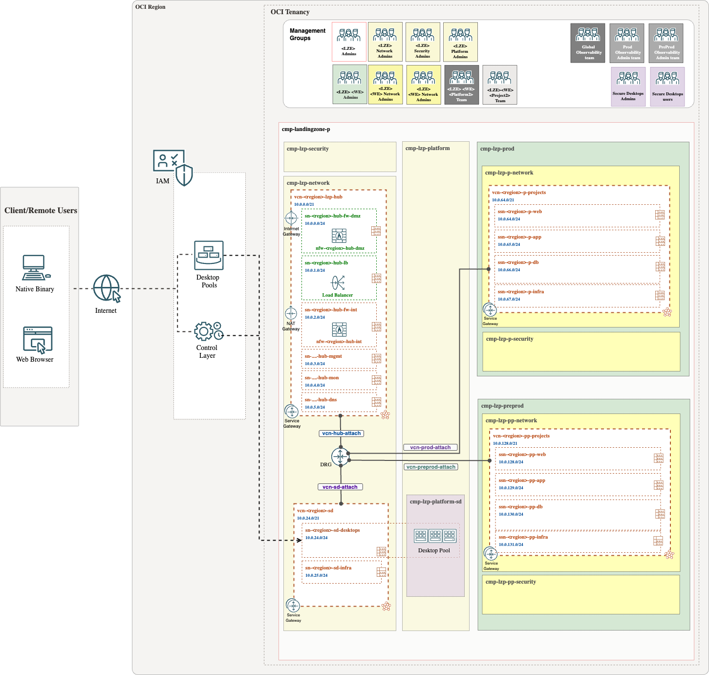

It includes the following resources:

Prereqs: ONE-OE 
* Dedicated secure desktop groups.
* Required policies.
* Dedicated spoke VCN.
  
**Scenario 2**. Connection thought Private Access.

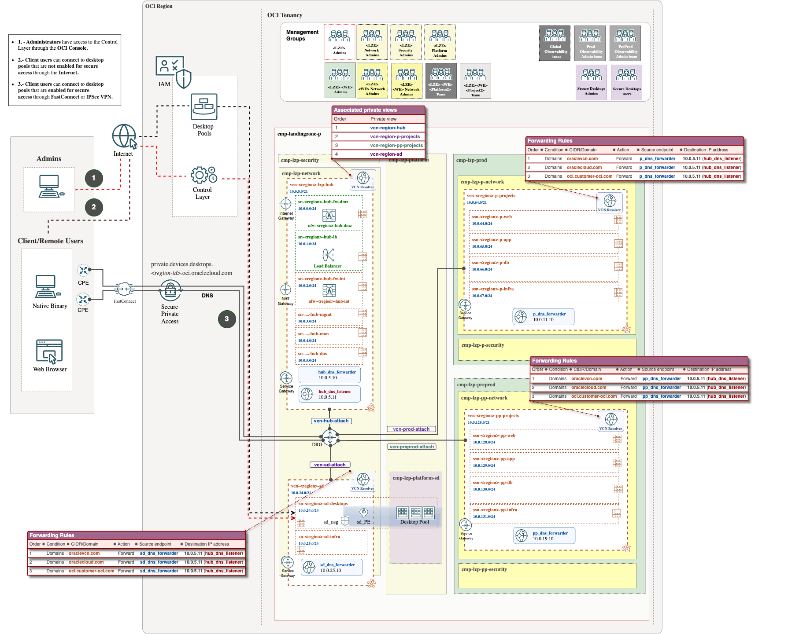

It includes the following resources:

Prereqs: ONE-OE + DNS add-on
* Dedicated secure desktop groups.
* Required policies.
* Dedicated spoke VCN.
* DNS configuration. Forwarder endpoint.
* NSG 
  

## LZ Extension Implementation.

As a prerequisite you need to deploy a fundation landing zone, in that case we have choosen the [One-OE](../../../../blueprints/one-oe/). To understand how to perform this operation with ORM, follow these [steps].

[](https://cloud.oracle.com/resourcemanager/stacks/create?zipUrl=https://github.com/oci-landing-zones/terraform-oci-modules-orchestrator/archive/refs/tags/v2.0.5.zip&zipUrlVariables={"input_config_files_urls":"https://raw.githubusercontent.com/oci-landing-zones/oci-landing-zone-operating-entities/master/blueprints/one-oe/runtime/one-stack/oci_open_lz_one-oe_iam.auto.tfvars.json,https://raw.githubusercontent.com/oci-landing-zones/oci-landing-zone-operating-entities/refs/heads/master/addons/oci-hub-models/hub_b/oci_open_lz_hub_b_network_light.auto.tfvars.json,https://raw.githubusercontent.com/oci-landing-zones/oci-landing-zone-operating-entities/master/blueprints/one-oe/runtime/one-stack/oci_open_lz_one-oe_observability_cisl1.auto.tfvars.json,https://raw.githubusercontent.com/oci-landing-zones/oci-landing-zone-operating-entities/master/blueprints/one-oe/runtime/one-stack/oci_open_lz_one-oe_security_cisl1.auto.tfvars.json"}) 


To run this landing zone extension, follow this [steps](./Implementation_steps.md).

## Secure Desktop configuration.

Now you have a Landing Zone ready to enable **Secure Desktops service**.

Follow these steps:

### 1. Import a Custom Image.

To use OCI Secure Desktops, you must import a custom image. For more information, see [Importing an Image](https://docs.oracle.com/en-us/iaas/Content/Compute/Tasks/imageimportexport.htm#Importing). To get the list of [supported images](https://docs.oracle.com/en-us/iaas/secure-desktops/supported-images.htm), see Supported Images.

Import the desired image into the compartment (cmp-landingzone-p:cmp-lzp-platform:cmp-lzp-platform-sd) and add the following tags for each custom image. These tags allow the service to determine which images to display as an option when you create a desktop pool.

```
oci:desktops:is_desktop_image true
oci:desktops:image_version <version>, where <version> is a meaningful reference for your use.
oci:desktops:image_os_type [Oracle Linux | Windows]
```
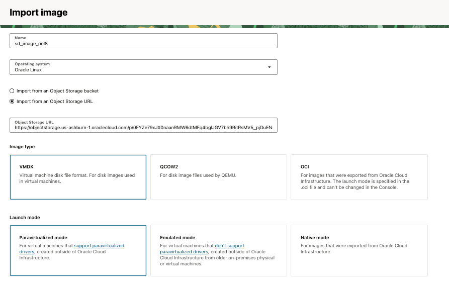


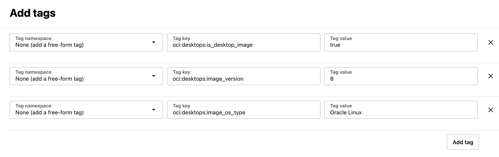


### 2. Create a Desktop Pool.

Create a user that belong to the **grp-lzp-p-secure-desktop-admin** group to run this operation.

- Open the OCI Console and click Compute. Under Secure Desktops, click Desktop Pools.

- Under List scope, select the compartment in which you want to create the pool and click Create Desktop Pool (cmp-landingzone-p:cmp-lzp-platform:cmp-lzp-platform-sd).

- Enter a name for the desktop pool, you can edit this value later.

- Enter the following Optional information:

    **Description**: Enter a description of the desktop pool.

    **Pool Start Time**: Select the date and time in UTC, when the pool becomes accessible. You can edit this value later.

    **Pool Stop Time**: Select the date and time in UTC when the pool stops and becomes inaccessible.

    **Add Administrator contact details**.

    Select Enable administrator privileges for users on their desktop to allow the desktop users to have administration privileges on their virtual desktops.

- In the **Pool Size section**, enter the following information:

    **Maximum size**: The maximum number of desktops in the pool.

    **Standby size**: The number of available, unassigned desktops. Standby desktops consume resources because they are running and available for immediate allocation to desktop users. You can edit these values later.

- Under **Placement**, select the availability domain in which to locate the desktop resources.

- Under **Image and Shape**, select the OS image and shape you want to use for the desktop. For Windows desktop pools, which require dedicated virtual machine hosts, use one of the following preferred shapes. They are mapped to DVH shapes for allocation of OCPUs and memory.

    * Flex Low (2 OCPUs, 4GB RAM)
    * Flex Medium (4 OCPUs, 8GB RAM)
    * Flex High (8 OCPUs, 16GB RAM)

    Optional To enter persistent storage to desktop users by creating a block volume associated with a user, select Enable desktop storage and then select volume size (in GB).

- In the **Desktop pool network**, enter the following information:

    In **Scenario 1**, the connection will be established through the internet:

    **Virtual cloud network**: Select the virtual cloud network (VCN) for the desktops in this pool.(vcn-fra-lzp-sd)

    **Subnet**: Select a the desktops subnet in the VCN. (sn-fra-lzp-sd).

    Skip section **Private access network**.

    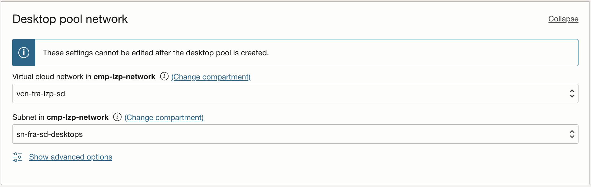

    In **Scenario 2**, the Desktop subnet will be accesible thougt the fast connect or IPSec VPN, to check the private access documentation go [here]( https://docs.oracle.com/en-us/iaas/secure-desktops/private-access.htm#:~:text=A%20private%20endpoint%20is%20represented,endpoint%20configured%20in%20the%20VCN.&text=This%20feature%20can%20only%20be%20enabled%20when%20creating%20new%20desktop%20pools.).

    **Virtual cloud network**: Select the virtual cloud network (VCN) for the desktops in this pool.(vcn-fra-lzp-sd)

    **Subnet**: Select the desktops subnet in the VCN (sn-fra-lzp-sd). Use Network Security Groups to control traffic and assign sg-fra-lzp-hub-pe-sd to the Desktop Pool that will be created.


    Select also **Private access Network**. Create a private endpoint in the same Desktop subnet and select the pre-created network security group nsg-fra-lzp-hub-pe-sd.

    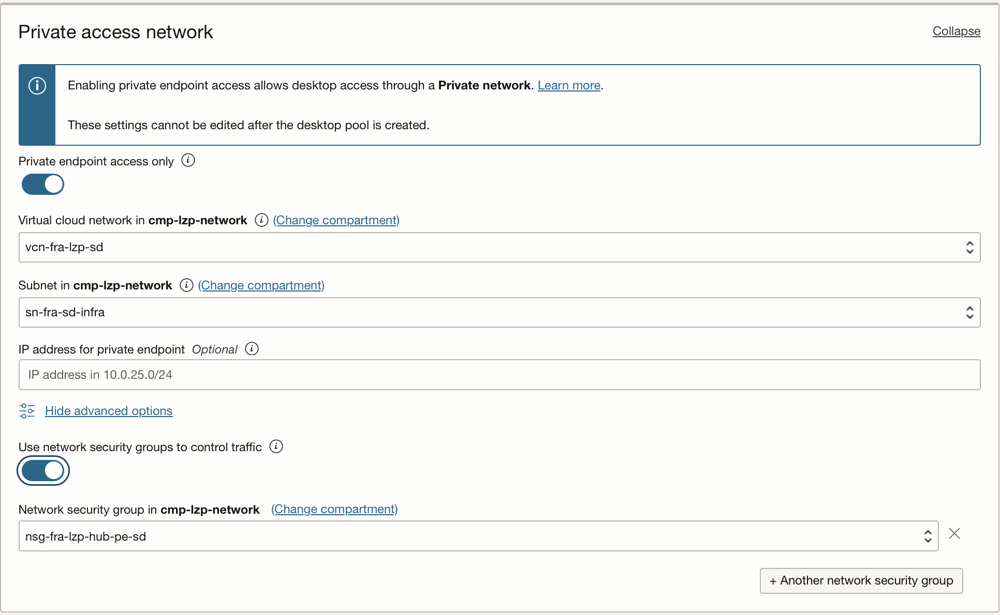

- In **Device Access Policy**, specify how the virtual desktop and the client device interact.

    **Clipboard access**: Specify whether and how the virtual desktop can access the clipboard on the client device.

    **Audio access**: Specify whether and how the virtual desktop can access the speakers and microphone on the client device. This option is supported only when using the installed client, and the Audio In or microphone value is supported only on Windows desktops.

    **Drive mapping access**: Specify whether and how the virtual desktop can access drives on the client device. If you select Read or Write, users can move content between their local system and the virtual desktop. You can edit these values later.
    Note: When planning networking requirements, be sure to include necessary ingress and egress rules. For example, to the open internet. After a pool is created, its NSG configuration cannot be changed.

- Under **Regular schedule**, enter recurring times to start and stop the desktops in the pool. You can edit these values later.

- Click Create.
  
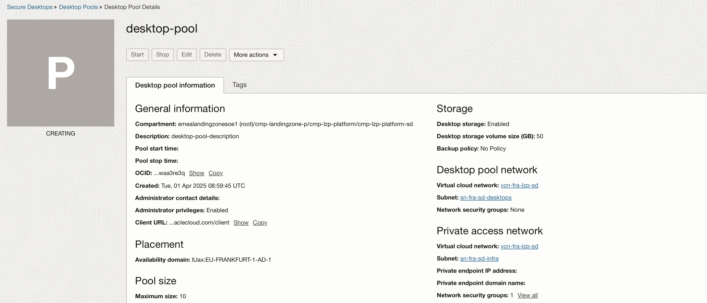


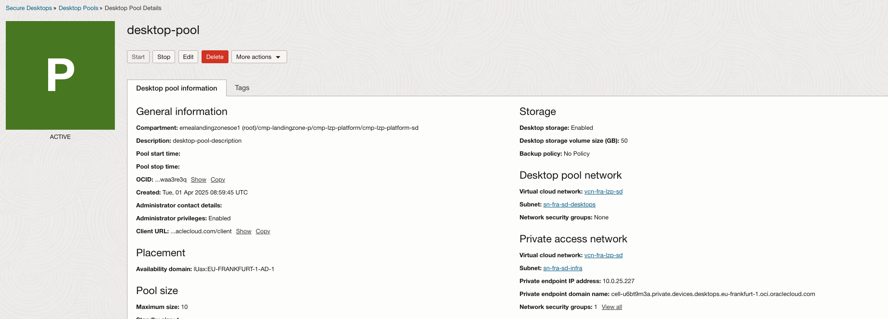

### 3. Access the Desktop Pool.

Create a user that belong to the grp-lzp-p-secure-desktop-users group to run this operation.


* For **Scenario 1** edit the following URL with the appropriate region identifier. For more information about identifier values for your region, see [Regions and Availability Domains](https://docs.oracle.com/en-us/iaas/Content/General/Concepts/regions.htm#About).

    https://published.desktops.RegionIdentifier.oci.oraclecloud.com/client

    example: https://published.desktops.eu-frankfurt-1.oci.oraclecloud.com/client


    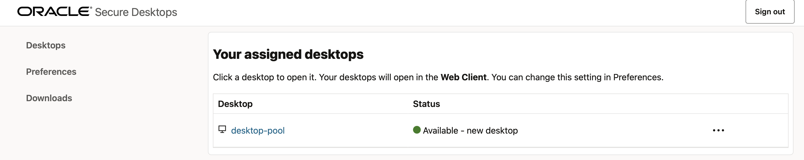


    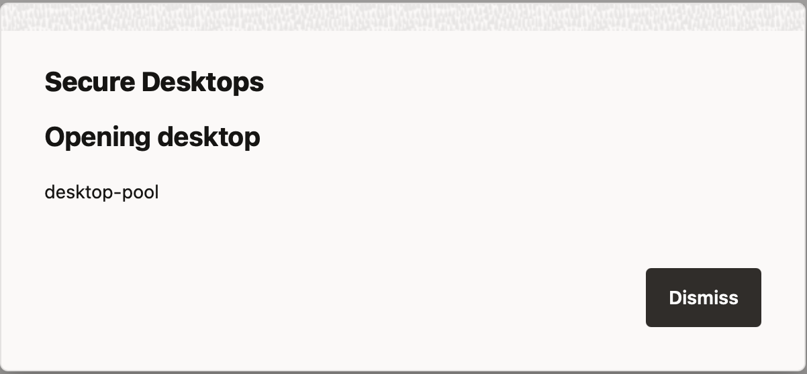


    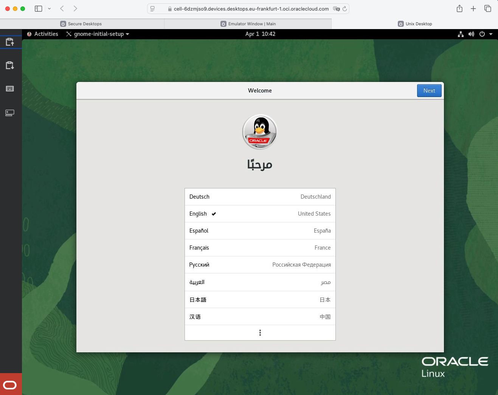

&nbsp; 

* For **Scenario 2**, you will need to configure your on-premises DNS to access **private.devices.desktops.region-id.oci.oraclecloud.com**.

    The DNS name for each private pool endpoint will be unique and in the form: **pool-specific-id.private.devices.desktops.region-id.oci.oraclecloud.com**

    For more information about private access review the [official documentation](https://docs.oracle.com/en-us/iaas/secure-desktops/private-access.htm).


Some interesting links about Secure Desktops:

* [OCI Secure Desktops](https://docs.oracle.com/en-us/iaas/secure-desktops/home.htm)
* [OCI Secure Desktops YouTube series](https://www.youtube.com/playlist?list=PLKCk3OyNwIzv0axRP4vP7zpubJE555Wbb)
* [OCI Secure Desktops Latest Blog](https://blogs.oracle.com/cloud-infrastructure/post/next-gen-oci-secure-desktops-security-flexibility)
&nbsp; 

# License

Copyright (c) 2025 Oracle and/or its affiliates.

Licensed under the Universal Permissive License (UPL), Version 1.0.

See [LICENSE](/LICENSE.txt) for more details.
